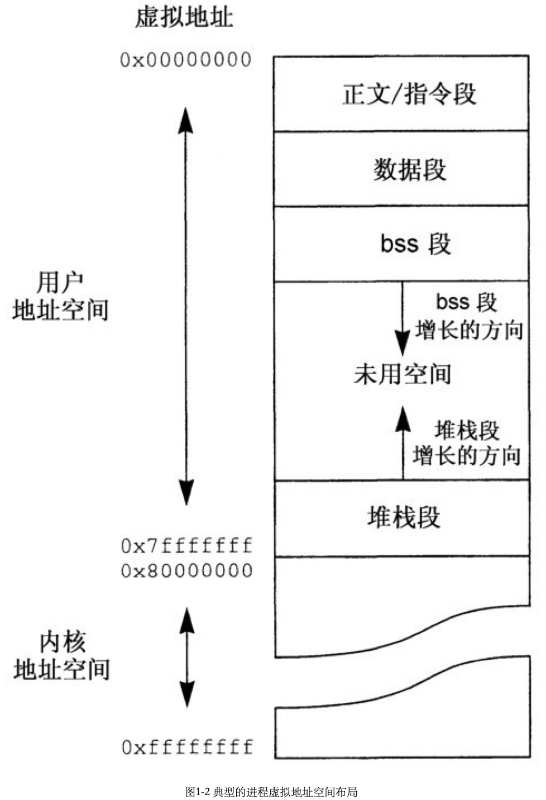

# 第一章 回顾UNIX内核原理

## 引言

UNIX系统在逻辑上具有分层的结构，可以分成两个主要部分：内核（kernel）和用户程序（user program）。其图形如下：

内核的用途是硬件接口并且控制硬件。内核还向用户程序提供一组抽象的系统服务，称为系统调用（system call），使用可移植的接口就能够访问系统调用。

## 进程，程序和线程

程序（program）被定义为执行某项任务所需的指令的数据集。进程（process）则是程序加上其执行状态的组合，进程最少要包括所有变量的值，硬件状态（如程序计数器（PC），寄存器，条件码等），以及地址空间的内容说明。简而言之，一个进程就是一个执行中的程序。

线程掌握了一个进程内一条执行流的状态，一个线程的状态最少要由硬件状态，往往还有一个栈构成，线程的优点之一就是创建线程的开销要比创建进程的开销小。

## 进程地址空间

一个进程的地址空间由4个主要部分构成：

- 程序指令（正文段）
- 初始化数据（数据段）
- 未初始化数据（Block Started by Symbol, bss）
- 栈（栈段）

典型的内存布局如图：

- 内核地址空间（kernel address space）不准用户级代码读写

### 地址空间映射

内存管理单元（Memory Management Unit, MMU）：执行从虚拟地址空间到物理地址空间的映射，MMU负责进程所使用的全部地址。

## 上下文切换

上下文切换（context switch）：内核从执行一个进程转为执行另一个进程。

线程切换（thread switch）：在同一个进程内从一个线程切换到另一个线程。

## 内存管理和进程管理的系统调用

### fork

父进程（parent）：调用fork的进程

子进程（child）：新创建的进程

写时复制（copy-on-write）：数据，bss和栈都不进行物理复制，而是临时在父进程和子进程之间只读共享。

只读，写时复制共享（copy-on-write sharing）。

### exec

exec往往在fork之后执行；原来程序的正文，数据，bss和栈以及诸如共享内存的其他存储对象都会被丢弃，为新程序创建新的虚拟地址空间。

### exit

exit会让调用它的进程（以及它的所有线程）终止执行。

### sbrk和brk

sbrk和brk都可以背一个进程用来分配或者回收它的bss段空间。

### 共享内存

共享内存段（shared memory）：通过将同一个（或多个）物理页面映射到两个或者更多进程的虚拟地址空间中来实现两个或两个以上的进程共享一个物理内存区域。

### I/O操作

I/O操作分为两种：

- 有缓冲的（buffered）
- 无缓冲的（unbuffered）

在采用原始I/O的情况下，I/O设备使用DMA（direct memory access，直接内存访问）操作直接把数据传送到用户缓冲区。

