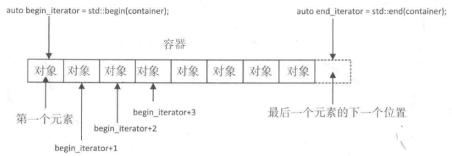
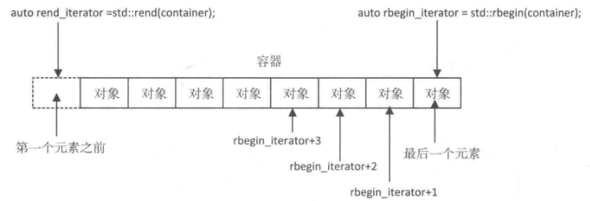
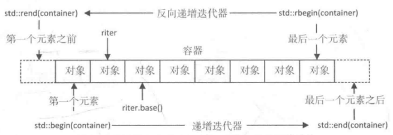
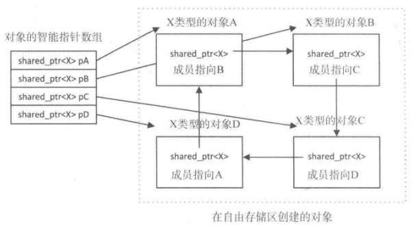

# 第一章 STL介绍

[TOC]


## 1.1基本思想

* `容器库（Containers Library）` 定义管理和存储数据的容器；
* `迭代器库（Itrators Library）` 定义迭代器，迭代器类似于指针的对象，通常被用于引用容器类的对象序列；
* `算法库（Algorithms Library）` 定义一些使用比较广泛的通用算法，可以运用到容器中的一组元素；
* `数值库（Numerics Library）` 定义一些通用的数学函数和一些对容器元素进行数值处理操作；


## 1.2模板

`size_t`定义在cstddef头文件中，表示无符号整形。

`size()`在类模板中默认以内联的方式实现，所以不再需要外部定义。


## 1.3容器

* `序列容器（Sequence Containers）` 以线性组织的方式存储对象，和数组类似，但是不需要拦蓄的存储空间；
* `关联容器（Associative Containers）` 存储了一些和键关联的对象；
* `容器适配器（Container Adapters）` 提供了替换机制的适配类模板，可以用来访问基础的序列容器或关联容器。

容器在堆上存放对象，并且自动管理它们所占用的内存。


## 1.4迭代器

### 1.4.1获取迭代器



*迭代器的操作*

### 1.4.2迭代器的类别

* `输入迭代器（input iterators）` 提供对对象的只读访问，没有减量运算；
* `输出迭代器（output iterators）` 提供对对象的只写访问，没有减量运算；
* `正向迭代器（forward iterators）` 结合输入输出迭代器功能，可以随意多次用它进行读或写操作；
* `双向迭代器（bidirectional iterators）` 具有和正向迭代器同样的功能，但允许进行前向和后向遍历；
* `随机访问迭代器（random access iterators）` 提供了和双向迭代器同样的功能，但是支持对元素的随机访问。

例，迭代器对一个数组进行操作：

```c++
#include <numeric>
#include <iostream>
#include <iterator>

int main()
{
	double data[]{2.5, 4.5, 6.5, 5.5, 8.5};
  std::cout << "The array contains:\n";
  for (auto iter = std::begin(data); iter != std::end(data); ++iter)
    std::cout << *iter << " ";
  auto total = std::accumulate(std::begin(data), std::end(data), 0.0);
  std::cout << "\nThe sum of the array elements is " << total << std::endl;
}
```

### 1.4.3流迭代器

例，使用输入流迭代器：

```c++
#include <numeric>
#include <iostream>
#include <iterator>

int main()
{
	std::cout << "Enter numeric values separated by spaces and enter Ctrl+Z to end:" << std::endl;
  std::cout << "\nThe sum of the values you entered is "
            << std::accumulate(std::istream_iterator<double>(std::cin), 
                               std::istream_iterator<double>(), 0.0)
            << std::endl;
}
```

### 1.4.4迭代器适配器

1. `反向迭代器（reverse iterators）`

   

   *反向迭代器的操作*

   

   *标准迭代器和方向迭代器是如何和容器关联的*

2. `插入迭代器（insert iterators）`
   - `后向插入迭代器（back_insert_iterator）` vector, list, deque都有push_back(),将一个新的元素添加到容器尾部;
   - `向前插入迭代器(front_insert_iterator）` list, forward_list, deque都有push_front(),将一个新的元素添加到容器的头部;
   - `插入迭代器（insert_iterator）` 用insert()插入新的元素；
   
3. `移动迭代器（move iterators）` 指向一定范围内的元素，将某个范围内的类对象移动到目标范围，而不需要通过拷贝去移动。


## 1.5 迭代器上的运算

迭代器的头文件定义了4个实现了迭代器运算的函数模版：

* `advance()` 将迭代器移动n个位置；

  例：

  ```c++
  std::advance(iter, 3); // 移动3个位置
  ```

* `distance()` 返回迭代器之间的距离；

  例：

  ```c++
  std::distance(iter1, iter2); // 返回两个迭代器之间距离
  ```

* `next()` 获得距离迭代器n个位置的迭代器

  例：

  ```c++
  std::next(iter, 3); // 返回离当前迭代器距离为3的迭代器
  ```

* `prev()` 获得迭代器反向偏移n个位置之后所指向的迭代器

  例：

  ```c++
  std::prev(iter, 3);
  ```


## 1.6智能指针

原生指针与智能指针的区别：

- 智能指针只能用来保存堆上分配的内存的地址 ；
- 不能像对原生指针那样，对智能指针进行一些自增或自减这样的操作  。

std命名空间中定义了三种不同类型的智能指针模版：

1. `unique_ptr<T>` 唯一指针
   - 不可能有其他的`unique_ptr<T>`指向同一地址; 
   - 不能以传值的方式将一个`unique_ptr<T>`对象传入函数中，因为他们不支持拷贝，必须使用引用的方式；
   - 可以通过交换2个`unique_ptr<T>`指针的方式来交换2个对象。
2. `shared_ptr<T>` 共享指针
   - 允许共享一个对象的所有权；
   - 只能通过拷贝构造函数或赋值运算符去赋值一个shared_ptr<T>对象。
3. `weak_ptr<T>` 弱引用指针
   - 只能从`shared_ptr<T>`对象创建；
   - 不会增加`shared_ptr<T>`对象的引用机制，当最后一个`shared_ptr<T>`引用被释放或指向一个不同的地址时，他们所指向的对象的内存被释放，即使相关的`weak_ptr<T>`可能仍然存在。

### 1.6.1使用`unique_ptr<T>`指针

不能以传值的方式将一个`unique_ptr<T>`对象传入函数中，因为它们不支持拷贝，必须使用引用的方式。`unique_ptr<T>`可以作为一个函数的返回值，因为它们不会被拷贝，但是它们必须以隐式移动运算的方式返回。

1. 重置`unique_ptr<T>`对象

   当智能指针析构时，`unique_ptr<T>`对象所指向的对象也会被析构。调用一个无参`unique_ptr<T>`对象的reset()函数可以析构它所指向的对象，`unique_ptr<T>`对象中的原生指针将会被替换为空指针，这使你能够在任何时候析构智能指针所指向的对象。

   例：

   ```c++
   auto pname = std::make_unique<std::string>("Algernon");
   pname.reset(); // 释放内存
   pname.reset(new std::string{"Fred"}); // 生成新的对象，替换旧对象
   ```

   例，在不释放对象内存的情况下，将指向它的unique_ptr<T>内部的原生指针设为空指针：

   ```c++
   auto up_name = std::make_unique<std::string>("Algernon");
   std::unique_ptr<std::string> up_new_name{up_name.release()};
   ```

   例，通过交换两个`unique_ptr<T>`指针的方式来交换两个对象：

   ```c++
   auto pn1 = std::make_unique<std::string>("Jack");
   auto pn2 = std::make_unique<std::string>("Jill");
   pn1.swap(pn2);
   ```

2. 比较和检查`unique_ptr<T>`对象

   `unique_ptr<T>`可以隐式地转换为布尔值。如果一个对象包含一个空指针，将会被转换为false；否则转换为true。这就意味着可以使用if语句来检查一个非空的`unique_ptr<T>`对象。

   例：
   
   ```c++
   auto up_name = std::make_unique<std::string>("Algernon");
   std::unique_ptr<std::string> up_new{up_name.release()};
   if (up_new)
     std::cout << "The name is " << *up_new << std::endl;
   if (!up_new)
     std::cout << "The unique pointer is nullptr" << std::endl;
   ```

**警告：不要将其它`unique_ptr<T>`所指向的一个对象的地址值传给reset()，或者去生成一个新的`unique_ptr<T>`对象，这种代码也许能通过编译，但是肯定会让程序崩溃。第一个`unique_ptr<T>`的析构会释放它所指向的对象的内存；第二个智能指针析构时，将会试图再次释放已经释放的内存。**

### 1.6.2使用`shared_ptr<T>`指针

1. 重置`shared_ptr<T>`对象

   将一个空指针赋给一个`shared_ptr<T>`对象，那么它的地址值将会变为空，同样也会使指针所指向对象的引用计数-1。

   例：

   ```c++
   auto pname = std::make_shared<std::string>("Charles Dickens");
   pname = nullptr;
   ```

   通过调用`shared_ptr<T>`对象的无参reset()函数，可以得到同样的效果。

   例：

   ```c++
   pname.reset();
   ```

   也可以通过为reset()函数传入一个原生指针来改变共享指针指向的对象。

   例：

   ```c++
   pname.reset(name std::string{"Jane Austen"});
   ```

2. 比较和检查`shared_ptr<T>`对象

   例，检查`shared_ptr<T>`对象是否有副本：

   ```c++
   auto pname = std::make_shared<std::string>("Charles Dickens");
   if (pname.unique())
     std::cout << "there is only one..." << std::endl;
   else
     std::cout << "there is more than one..." << std::endl;
   ```

**警告：只能通过拷贝构造函数或赋值运算符去复制一个`shared_ptr<T>`对象。通过一个由其它指针的get()函数返回的原生指针，来生成一个`shared_ptr<T>`指针。这可能会导致一些意想不到的问题，大多数情况也就意味着程序的崩溃。**

### 1.6.3weak_ptr<T>指针

`weak_ptr<T>`对象只能从`shared_ptr<T>`对象创建。



*循环引用是如何阻止对象被删除的*

例，创建一个`weak_ptr<T>`对象：

```c++
auto pData = std::make_shared<X>();
std::weak_ptr<X> pwData{pData};
std::weak_ptr<X> pwData2{pwData};
```

例，使用`weak_ptr<T>`指针判断它所指向的对象是否存在：

```c++
if (pwData.expired())
  std::cout << "Object no longer exists.\n";
```

例，从一个`weak_ptr<T>`对象得到一个`shared_ptr<T>`对象：

```c++
std::shared_ptr<X> pNew{pwData.lock()};
```

可以使用`weak_ptr<T>`对象去做下面的事：

- 可以判断它所指向的对戏那个是否仍然存在，这也就意味着仍然有`shared_ptr<T>`对象指向它；
- 可以从一个`weak_ptr<T>`对象创建一个`shared_ptr<T>`对象。


## 1.7算法

* 非变化序列运算（不改变值）

  `find()`, `count()`,` mismatch()`, `search()`, `equal()`。

* 可变序列运算（改变值）

  `swap()`, `copy()`, `transform()`, `replace()`, `remove()`, `reverse()`, `rotate()`, `fill()`, `shuffle()`。

* 改变顺序运算（改变顺序）

  `sort()`, `stable_sort()`, `binry_search()`, `merge()`, `min()`, `max()`。


## 1.8将函数作为实参传入

可以通过三种方式把一个函数作为实参传给另一个函数：

- 使用一个函数指针；
- 传入一个函数对象作为实参；
- 使用一个lambda表达式作为实参。

### 1.8.1函数对象

函数对象也被称为仿函数，这是一种重载了函数调用运算符`operator()()`的类对象。它们提供了一种比使用原生指针更加高效的，将函数作为实参传入另一个函数的方式。

例：

```c++
class Volume
{
public:
    double operator()(double x, double y, double z) { rturn x * y * z; }
    double operator()(const Box& box)
    { return box.getLength() * box.getWidth() * box.getHeight(); }
};

Box box{1.0, 2.0, 3.0};
std::cout << "The volume of the box is " << volume(box) << std::endl;
```

### 1.8.2lambda表达式

`[捕获列表](参数列表)mutable -> 返回类型{主体}`

- `捕获列表` 列出了在闭合区域不活的变量，变量可以通过值引用或引用的方式捕获；
- `参数列表` 确定在lambda被调用时，传给它的值得类型和个数。可以指定默认参数值，参数列表可以为空；
- `mutable` 可选，设置捕获的变量的副本是否可以修改；
- `返回类型` 可选，当省略时，默认是返回值得类型。如果没有任何返回值，返回类型是void；
- `主体` 函数实现。

如果想用引用的方式捕获，需要在每一个名字的前面加上一个 & 前缀。

**注意：以值引用的方式捕获封闭范围内的所有变量会增加很多开销。因为不管是否使用了它们，都为它们中的每一个创建了副本，只捕获那些需要使用的变量才是明智的。**

例：

```c++
// 和transform()算法，lambda表达式，std::function一起使用
#include <iostream>
#include <algorithm>
#include <iterator>
#include <functional>

class Root
{
public:
  double operator()(double x) { return std::sqrt(x); };
};

int main()
{
	double data[]{1.5, 2.5, 3.5, 4.5, 5.5};
  
  Root root;
  std::cout << "Square roots are:" << std::endl;
  std::transform(std::begin(data), std::end(data), 
                 std::ostream_iterator<double>(std::cout, " "), root);
  
  std::cout << "\n\nCubes are:" << std::endl;
  std::transform(std::begin(data), std::end(data),
                 std::ostream_iterator<double>(std::cout, " "),
                 [](double x){ return x*x*x; });
  
  std::function<double(double)> op{[](double x){ return x*x; }};
  std::cout << "\n\nSquares are:" << std::endl;
  std::transform(std::begin(data), std::end(data),
                 std::ostream_iterator<double>(std::cout, " "), op);
  
  std::cout << "\n\n4th powers are:" << std::endl;
  std::transform(std::begin(data), std::end(data),
                 std::ostream_iterator<double>(std::cout, " "),
                 [&op](double x){ return op(x)*op(x); });
  std::cout << std::endl;
}
```


## 1.9小结

* stl定义类模板，作为其他对象的容器；
* stl定义迭代器，一种行为像指针的对象；
* 反向其实迭代器指向序列的最后一个元素，方向结束迭代器指向第一个元素的前一个位置；
* iterator头文件定义了一些全局函数，可以从容器，数组，任何支持迭代器的独享得到一些迭代器；
* 可以使用流迭代器转换流对象中给定类型的数据；
* stl定义了一些实现了算法的函数模板，可以运用到由迭代器指定的一段元素上；
* 智能指针是一种表现有些像指针的对象；
* lambda表达式定义了一个匿名函数；
* 能够用定义在functional头文件中的`std::function<>`模板类型，去指定任意种类的，有给定函数签名的可调用实体。