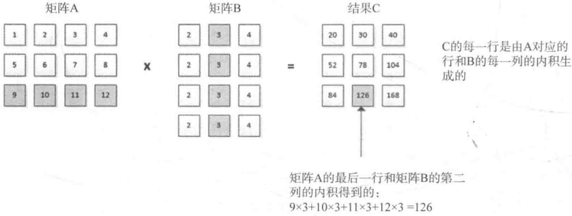
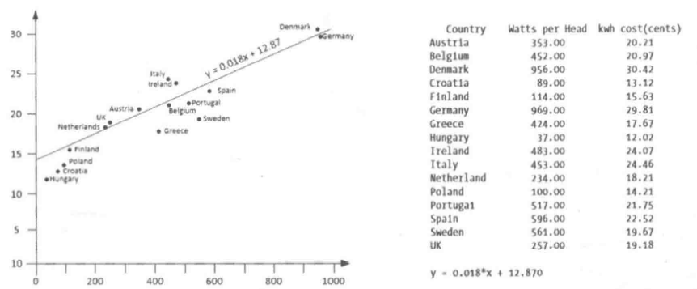

# 第十章 使用数值，时间和复数

[TOC]


## 10.1 数值计算


## 10.2 数值算法

### 10.2.1 保存序列中的增量值

```c++
// 使用iota生成一个有连续的浮点值元素的vector容器
std::vector<double> data(9);
double initial{-4};
std::iota(std::begin(data), std::end(data), inital); // -4.0 -3.0 -2.0 -1.0 0.0 1.0 2.0 3.0 4.0
std::copy(std::begin(data), std::end(data),
          std::osream_iterator<double>{
              std::cout << std::fixed << std::setprecision(1), " "
          });
std::cout << std::endl; 
```

```c++
// 使用非整数作为iota的初始值
std::iota(std::begin(data), std::end(data), -2.5); // -2.5 -1.5 -0.5 0.5 1.5 2.5 3.5 4.5 5.5
```

```c++
// 将iota应用到任意类型的序列上（只要它有自增运算符）
string text{"This is text"};
std::iota(std::begin(text), std::end(text), 'K'); // KLMNOPQRSTUV
```

### 10.2.2 求序列的和

```c++
// 使用accumulate和自定义方法求和
std::vector<int> values{2, 0, 12, 3, 5, 0, 2, 7, 0, 8};
int min{3};
auto sum = std::accumulate(std::begin(values), std::end(values), 0,
                           [min](int sum, int v){
                               if (v < min)
                                   return sum;
                               return sum + v;
                           });
std::cout << "The sum of the elements greater than " << min - 1
          << " is " << sum << std::endl;
```

```c++
// 生成元素的乘积
std::vector<int> values{2, 3, 5, 7, 11, 13};
auto product = std::accumulate(std::begin(values), std::end(values), 1
                               std::multiplies<int>()); // 30030
```

```c++
// 将accumulate应用到string对象的序列上
std::vector<string> numbers{"one", "two", "three", "five", 
                            "six", "seven", "eight", "nine", "ten"};
auto s = std::accumulate(std::begin(numbers), std::end(numbers), string{}, 
                         [](string& str, string& element){
                             if (element[0] == 't')
                                 return str + ' ' + element;
                             return str;
                         }); // " two three ten"
```

```c++
// 将accumulate应用到int对象的序列上
std::vector<int> numbers{1, 2, 3, 10, 11, 12};
auto s = std::accumulate(std::begin(numbers), std::end(numbers), string{"The numbers are"}, 
                         [](string& str, int n){
                             return str + ":" + std::to_string(n);
                         });
std::cout << s << std::endl;
```

### 10.2.3 内积

两个vector的内积是对应元素的乘积之和；两个矩阵的乘积是一个矩阵。



*矩阵乘法和内积运算*

```c++
// 使用inner_product计算vector的内积
std::vector<int> v1(10);
std::vector<int> v2(10);
std::iota(std::begin(v1), std::end(v1), 2); // [2, 3, 4, 5, 6, 7, 8, 9,  10, 11]
std::iota(std::begin(v2), std::end(v2), 3); // [3, 4, 5, 6, 7, 8, 9, 10, 11, 12]
std::cout << std::inner_product(std::begin(v1), std::end(v1), std::begin(v2), 0)
          << std::endl;
```

```c++
// 不同类型对inner_product精度的影响
std::vector<double> data{0.5, 0.75, 0.85}
auto result1 = std::inner_product(std::begin(data), std::end(data), std::begin(data), 0);   // 0
double result2 = std::inner_product(std::begin(data), std::end(data), std::begin(data), 0); // 0
auto result3 = std::inner_product(std::begin(data), std::end(data), std::begin(data), 0.0); // 1.535
std::cout << result << " " << result2 << " " << result3 << std::endl;
```

1. 应用内积

   给定$n$个点$(x_i, y_i)$，求解下面的等式：

   $nb + a\sum x_i = \sum y_i$

   $b\sum x_i + a \sum x_i^2 = \sum x_i y_i$

   解出等式的系数$a$和$b$：

   $a = \frac{\sum{x_i y_i} - \sum{x_i} \sum{y_i}}{n\sum{x_i^2} - (\sum{x_i})^2}$

   $b = \mu_y - a\mu_x$

   变量$x$的$n$个值的平均值$\mu$的等式为：

   $\mu_x = \frac{\sum x_i}{n}$

   ```c++
   // Ex10_01.cpp
   #include <numeric>
   #include <vector>
   #include <iostream>
   #include <iomanip>
   #include <fstream>
   #include <iterator>
   #include <string>
   using std::string;
   
   int main()
   {
       // File contains country_name renewables_per_person kwh_cost
       string file_in{"007.txt"};
       std::ifstream in{file_in};
       
       if (!in)
       {
           std::cerr << file_in << " not open." << std::endl;
           exit(1);
       }
       
       std::vector<double> x;
       std::vector<double> y;
       
       std::count << " Country " << " Watts per Head " << " kwh cost(cents) "
                  << std::endl;
       while(true)
       {
           string country;
           double renewables{};
           double kwh_cost{};
           
           if ((in >> country).eof()) break;
           in >> renewables >> kwh_cost;
           x.push_back(renewables);
           y.push_back(kwh_cost);
           std::cout << std::left << std::setw(12) << country << std::right 
                     << std::fixed << std::setprecision(2) << std::setw(12)
                     << renewables << std::setw(16) << kwh_cost << std::endl;
       }
       auto n = x.size();
       auto sx = std::accumulate(std::begin(x), std::end(x), 0.0);
       auto sy = std::accumulate(std::begin(y), std::end(y), 0.0);
       auto mean_x = sx/n;
       auto mean_y = sy/n;
       
       // Sum of x*y values and sum of x-squared
       auto sxy = std::inner_product(std::begin(x), std::end(x), std::begin(y), 0.0);
       auto sx_2 = std::inner_product(std::begin(x), std::end(x), std::begin(x), 0.0);
       
       double a{}, b{};
       auto num = n * sxy - sx * sy;
       auto denom = n * sx_2 - sx * sx;
       a = num / denom;
       b = men_y - a * mean_x;
       std::cout << std::fixed << std::setprecision(3) << "\ny = "
                 << a << "*x + " << b << std::endl;
   }
   ```

   
   
   *最小二乘线性回归的结果*
   
2. 定义内积运算

   ```c++
   // 生成和的积而不是积的和
   std::vector<int> v1(5);
   std::vector<int> v2(5);
   std::iota(std::begin(v1), std::end(v1), 2); // 2, 3, 4, 5, 6
   std::iota(std::begin(v2), std::end(v2), 3); // 3, 4, 5, 6, 7
   std::cout << std::inner_product(std::begin(v1), std::end(v1), std::begin(v2), 1, 
                                   std::multiplies<>(), std::plus<>())
             << std::endl;
   ```

### 10.2.4 相邻差

```c++
// 使用adjacent_difference计算输入序列中相邻元素对的差
std::vector<int> data{2, 3, 5, 7, 11, 13, 17, 19};
std::cout << "Differences: ";
std::adjacent_difference(std::begin(data), std::end(data), 
                         std::ostream_iterator<int>{ std::cout, " " });
std::cout << std::endl; // 2 1 2 2 4 2 4 2
```

```c++
// 使用adjacent_difference和自定义减法运算，计算输入序列中相邻元素对的差
std::vector<int> data{2, 3, 5, 7, 11, 13, 17, 19};
std::cout << "Differences: ";
std::adjacent_difference(std::begin(data), std::end(data), 
                         std::ostream_iterator<int>{ std::cout, " " },
                         std::multiplies<>());
std::cout << std::endl; // 2 6 15 35 77 143 221 323
```

```c++
// 使用adjacent_difference和plus来计算Fibonacci数列
std::vector<size_t> fib(15, 1);
std::adjacent_difference(std::begin(fib), std::end(fib) - 1, std::begin(fib) + 1, 
                         std::plus<size_t>());
std::copy(std::begin(fib), std::end(fib), 
          std::ostream_iterator<size_t>{ std::cout, " " });
std::cout << std::endl; // 1 1 2 3 5 8 13 21 34 55 89 144 233 377 610
```

### 10.2.5 部分和

TODO