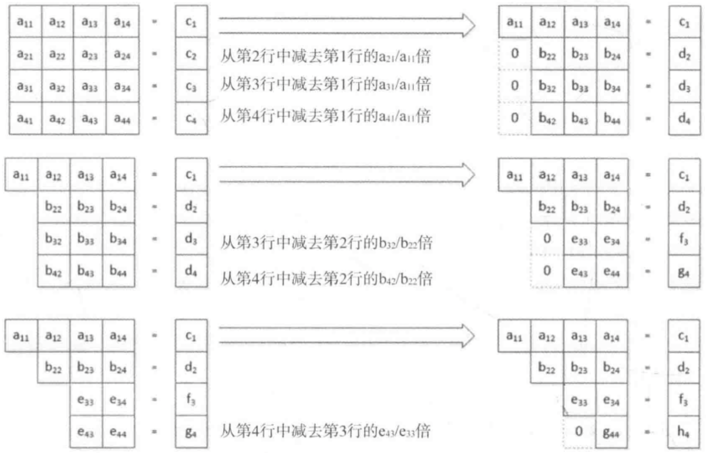

# 第十章 使用数值，时间和复数

[TOC]


## 10.1 数值计算


## 10.2 数值算法

### 10.2.1 保存序列中的增量值

```c++
// 使用iota生成一个有连续的浮点值元素的vector容器
std::vector<double> data(9);
double initial{-4};
std::iota(std::begin(data), std::end(data), inital); // -4.0 -3.0 -2.0 -1.0 0.0 1.0 2.0 3.0 4.0
std::copy(std::begin(data), std::end(data),
          std::osream_iterator<double>{
              std::cout << std::fixed << std::setprecision(1), " "
          });
std::cout << std::endl; 
```

```c++
// 使用非整数作为iota的初始值
std::iota(std::begin(data), std::end(data), -2.5); // -2.5 -1.5 -0.5 0.5 1.5 2.5 3.5 4.5 5.5
```

```c++
// 将iota应用到任意类型的序列上（只要它有自增运算符）
string text{"This is text"};
std::iota(std::begin(text), std::end(text), 'K'); // KLMNOPQRSTUV
```

### 10.2.2 求序列的和

```c++
// 使用accumulate和自定义方法求和
std::vector<int> values{2, 0, 12, 3, 5, 0, 2, 7, 0, 8};
int min{3};
auto sum = std::accumulate(std::begin(values), std::end(values), 0,
                           [min](int sum, int v){
                               if (v < min)
                                   return sum;
                               return sum + v;
                           });
std::cout << "The sum of the elements greater than " << min - 1
          << " is " << sum << std::endl;
```

```c++
// 生成元素的乘积
std::vector<int> values{2, 3, 5, 7, 11, 13};
auto product = std::accumulate(std::begin(values), std::end(values), 1
                               std::multiplies<int>()); // 30030
```

```c++
// 将accumulate应用到string对象的序列上
std::vector<string> numbers{"one", "two", "three", "five", 
                            "six", "seven", "eight", "nine", "ten"};
auto s = std::accumulate(std::begin(numbers), std::end(numbers), string{}, 
                         [](string& str, string& element){
                             if (element[0] == 't')
                                 return str + ' ' + element;
                             return str;
                         }); // " two three ten"
```

```c++
// 将accumulate应用到int对象的序列上
std::vector<int> numbers{1, 2, 3, 10, 11, 12};
auto s = std::accumulate(std::begin(numbers), std::end(numbers), string{"The numbers are"}, 
                         [](string& str, int n){
                             return str + ":" + std::to_string(n);
                         });
std::cout << s << std::endl;
```

### 10.2.3 内积

两个vector的内积是对应元素的乘积之和；两个矩阵的乘积是一个矩阵。


*矩阵乘法和内积运算*

```c++
// 使用inner_product计算vector的内积
std::vector<int> v1(10);
std::vector<int> v2(10);
std::iota(std::begin(v1), std::end(v1), 2); // [2, 3, 4, 5, 6, 7, 8, 9,  10, 11]
std::iota(std::begin(v2), std::end(v2), 3); // [3, 4, 5, 6, 7, 8, 9, 10, 11, 12]
std::cout << std::inner_product(std::begin(v1), std::end(v1), std::begin(v2), 0)
          << std::endl;
```

```c++
// 不同类型对inner_product精度的影响
std::vector<double> data{0.5, 0.75, 0.85}
auto result1 = std::inner_product(std::begin(data), std::end(data), std::begin(data), 0);   // 0
double result2 = std::inner_product(std::begin(data), std::end(data), std::begin(data), 0); // 0
auto result3 = std::inner_product(std::begin(data), std::end(data), std::begin(data), 0.0); // 1.535
std::cout << result << " " << result2 << " " << result3 << std::endl;
```

1. 应用内积

   给定$n$个点$(x_i, y_i)$，求解下面的等式：

   $nb + a\sum x_i = \sum y_i$

   $b\sum x_i + a \sum x_i^2 = \sum x_i y_i$

   解出等式的系数$a$和$b$：

   $a = \frac{\sum{x_i y_i} - \sum{x_i} \sum{y_i}}{n\sum{x_i^2} - (\sum{x_i})^2}$

   $b = \mu_y - a\mu_x$

   变量$x$的$n$个值的平均值$\mu$的等式为：

   $\mu_x = \frac{\sum x_i}{n}$

   ```c++
   // Ex10_01.cpp
   #include <numeric>
   #include <vector>
   #include <iostream>
   #include <iomanip>
   #include <fstream>
   #include <iterator>
   #include <string>
   using std::string;
   
   int main()
   {
       // File contains country_name renewables_per_person kwh_cost
       string file_in{"007.txt"};
       std::ifstream in{file_in};
       
       if (!in)
       {
           std::cerr << file_in << " not open." << std::endl;
           exit(1);
       }
       
       std::vector<double> x;
       std::vector<double> y;
       
       std::count << " Country " << " Watts per Head " << " kwh cost(cents) "
                  << std::endl;
       while(true)
       {
           string country;
           double renewables{};
           double kwh_cost{};
           
           if ((in >> country).eof()) break;
           in >> renewables >> kwh_cost;
           x.push_back(renewables);
           y.push_back(kwh_cost);
           std::cout << std::left << std::setw(12) << country << std::right 
                     << std::fixed << std::setprecision(2) << std::setw(12)
                     << renewables << std::setw(16) << kwh_cost << std::endl;
       }
       auto n = x.size();
       auto sx = std::accumulate(std::begin(x), std::end(x), 0.0);
       auto sy = std::accumulate(std::begin(y), std::end(y), 0.0);
       auto mean_x = sx/n;
       auto mean_y = sy/n;
       
       // Sum of x*y values and sum of x-squared
       auto sxy = std::inner_product(std::begin(x), std::end(x), std::begin(y), 0.0);
       auto sx_2 = std::inner_product(std::begin(x), std::end(x), std::begin(x), 0.0);
       
       double a{}, b{};
       auto num = n * sxy - sx * sy;
       auto denom = n * sx_2 - sx * sx;
       a = num / denom;
       b = men_y - a * mean_x;
       std::cout << std::fixed << std::setprecision(3) << "\ny = "
                 << a << "*x + " << b << std::endl;
   }
   ```

   
   
   *最小二乘线性回归的结果*
   
2. 定义内积运算

   ```c++
   // 生成和的积而不是积的和
   std::vector<int> v1(5);
   std::vector<int> v2(5);
   std::iota(std::begin(v1), std::end(v1), 2); // 2, 3, 4, 5, 6
   std::iota(std::begin(v2), std::end(v2), 3); // 3, 4, 5, 6, 7
   std::cout << std::inner_product(std::begin(v1), std::end(v1), std::begin(v2), 1, 
                                   std::multiplies<>(), std::plus<>())
             << std::endl;
   ```

### 10.2.4 相邻差

```c++
// 使用adjacent_difference计算输入序列中相邻元素对的差
std::vector<int> data{2, 3, 5, 7, 11, 13, 17, 19};
std::cout << "Differences: ";
std::adjacent_difference(std::begin(data), std::end(data), 
                         std::ostream_iterator<int>{ std::cout, " " });
std::cout << std::endl; // 2 1 2 2 4 2 4 2
```

```c++
// 使用adjacent_difference和自定义减法运算，计算输入序列中相邻元素对的差
std::vector<int> data{2, 3, 5, 7, 11, 13, 17, 19};
std::cout << "Differences: ";
std::adjacent_difference(std::begin(data), std::end(data), 
                         std::ostream_iterator<int>{ std::cout, " " },
                         std::multiplies<>());
std::cout << std::endl; // 2 6 15 35 77 143 221 323
```

```c++
// 使用adjacent_difference和plus来计算Fibonacci数列
std::vector<size_t> fib(15, 1);
std::adjacent_difference(std::begin(fib), std::end(fib) - 1, std::begin(fib) + 1, 
                         std::plus<size_t>());
std::copy(std::begin(fib), std::end(fib), 
          std::ostream_iterator<size_t>{ std::cout, " " });
std::cout << std::endl; // 1 1 2 3 5 8 13 21 34 55 89 144 233 377 610
```

### 10.2.5 部分和

```c++
// 使用partial_sum计算输入序列中元素的部分和
std::vector<int> data{2, 3, 5, 7, 11, 13, 17, 19};
std::cout << "Partial sums: ";
std::partial_sum(std::begin(data), std::end(data), 
                 std::ostream_iterator<int>{std::cout, " "});
std::cout << std::endl;
```

```c++
// 使用partial_sum和minus计算部分减法和
std::vector<int> data{2, 3, 5, 7, 11, 13, 17, 19};
std::cout << "Partial sums: ";
std::partial_sum(std::begin(data), std::end(data),
                 std::ostream_iterator<int>{std::cout, " "}, std::minus<int>());
std::cout << std::endl; // 2 -1 -6 -13 -24 -37 -54 -73
```

### 10.2.6 极大值和极小值

```c++
// 使用min_element返回最小元素的迭代器
// 使用max_element返回最大元素的迭代器
// 使用minmax_element返回最小，最大元素的迭代器
std::vector<int> data{2, 12, 3, 5, 17, -11, 113, 117, 19};
std::cout << "From values ";
std::copy(std::begin(data), std::end(data), std::ostream_iterator<int>{std::cout, " "});
std::cout << "\n Min = " << *std::min_element(std::begin(data), std::end(data))
          << " Max = " << *std::max_element(std::begin(data), std::end(data))
          << std::endl;

auto start_iter = std::begin(data) + 2;
auto end_iter = std::end(data) - 2;
auto pr = std::minmax_element(start_iter, end_iter);

std::cout << "From values ";
std::copy(start_iter, end_iter, std::ostream_iterator<int>{std::cout, " "});
std::cout << "\n Min = " << *pr.first << " Max = " << *pr.second << std::endl;
```

```c++
// 将min, max, minmax用于初始化列表
auto words = {string{"one"}, string{"two"}, string{"three"}, string{"four"}, string{"five"},
              string{"six"}, string{"seven"}, string{"eight"}};
std::cout << "Min = " << std::min(words) << std::endl;
auto pr = std::minmax(words, [](const string& s1, const string& s2){
    return s1.back() < s2.back(); });
std::cout << "Min = " << pr.first << " Max = " << pr.second << std::endl;
```


## 10.3 保存和处理数值

valarray类模板定义了保存和操作数值序列的对象的类型，用来处理整数和浮点数，保存类类型的对象，需要满足以下条件：

- 类不能是抽象的。
- public构造函数必须包含默认的构造函数和拷贝构造函数。
- 析构函数必须是public。
- 类必须定义赋值运算符，而且必须是public。
- 类不能重载operator&()。
- 成员函数不能抛出异常。

不能保存引用或valarray中用const, volatile修饰的对象。

```c++
// 生成一个valarray对象
std::valarray<int> numbers(15);
std::valarray<size_t> sizes{1, 2, 3};
std::valarray<size_t> copy_sizes{sizes};
std::valarray<double> values;
std::valarray<double> data(3.14, 10);
```

```c++
// 从普通数组得到的一定个数的值来初始化valarray对象
int vals[]{2, 4, 6, 8, 10, 12, 14};
std::valarray<int> vals1{vals, 5};     // 2 4 6 8 10
std::valarray<int> vals2{vals + 1, 4}; // 4 6 8 10
```

### 10.3.1 valarray对象的基本操作

```c++
// 改变valarray容器中元素个数
data.resize(50, 1.5);
```

```c++
// 交换两个valarray对象的元素
std::valarray<size_t> sizes_3{1, 2, 3};
std::valarray<size_t> sizes_4{2, 3, 4, 5};
sizes_3.swap(sizes_4);

std::swap(sizes_3, sizes_4); // 另一种方式
```

```c++
// 调用min和max来查找元素的的最小值和最大值
std::cout << "The elements are from " << sizes_4.min() << " to " << sizes_4.max() << '\n';
```

```c++
// 移位操作
std::valarray<int> d1{1, 2, 3, 4, 5, 6, 7, 8, 9};
auto d2 = d1.shift(2);
for (int n : d2) std::cout << n << ' ';
std::cout << '\n';      // 3 4 5 6 7 8 9 0 0
auto d3 = d1.shift(-3);
std::copy(std::begin(d3), std::end(d3), 
          std::ostream_iterator<int>{ std::cout, " " });
std::cout << std::endl; // 0 0 0 1 2 3 4 5 6
```

```c++
// 使用 = 为valarray对象赋值
d1 =d1.shift(2);
```

```c++
// 将元素序列循环移动
std::valarray<int> d1{1, 2, 3, 4, 5, 6, 7, 8, 9};
auto d2 = d1.cshift(2);  // 3 4 5 6 7 8 9 1 2
auto d3 = d1.cshift(-3); // 7 8 9 1 2 3 4 5 6 
```

apply()函数可以将一个函数应用到每个元素上，并返回一个新的valarray对象。valarray类模板中定义了两个函数模板：

```c++
valarray<T> apply(T func(T)) const;
valarray<T> apply(T func(const T&)) const;
```

**使用apply注意事项:**

1. 所有版本都是const，所以函数不能修改原始元素。
2. 参数是一个有特定形式的函数，这个函数以T类型或T的const引用为参数，并返回T类型的值；如果apply()使用的参数不符合这些条件，将无法通过编译。
3. 返回值是`valarray<T>`类型，因此返回值总是一个和原序列相同类型和大小的数组。

```c++
// apply示例
std::valarray<double> time{0.0, 1.0, 2.0, 3.0, 4.0, 5.0, 6.0, 7.0, 8.0, 9.0};
auto distances = time.apply([](double t){
  const static double g{32.0};
  return 0.5 * g * t * t;
}); // 0 16 64 144 256 400 576 784 1024 1296
```

```c++
// Ex10_02.cpp
#include <numeric>
#include <iostream>
#include <iomanip>
#include <algorithm>
#include <valarray>
const static double g{32.0};

int main()
{
	double height{};
  std::cout << "Enter the approximate height of the building in feet: ";
  std::cin >> height;
  // Calculate brick flight time in seconds
  double end_time{std::sqrt(2 * height / g)};
  size_t max_time{1 + static_cast<size_t>(end_time + 0.5)};
  
  std::valarray<double> times(max_time + 1);
  std::iota(std::begin(times), std::end(times), 0);
  *(std::end(times) - 1) = end_time;
  
  // Calculate distances each second
  auto distances = times.apply([](double t){ return 0.5 * g * t * t; });
  
  // Calculate speed each second
  auto v_fps = sqrt(distances.apply([](double d){ return 2 * g * d; }));
  
  // Lambda expression to output results
  auto print = [](double v){ std::cout << std::setw(6) << static_cast<int>(std::round(v)); };
  
  // Output the times - the last is a special case...
  std::cout << "Time (seconds): ";
  std::for_each(std::begin(times), std::end(times) - 1, print);
  std::cout << std::setw(6) << std::fixed << std::setprecision(2) << *(std::end(times) - 1);
  std::cout << "\nDistances(feet):";
  std::for_each(std::begin(distances), std::end(distances), print);
  
  std::cout << "\nVelocity(fps): ";
  std::for_each(std::begin(v_fps), std::end(v_fps), print);
  
  // Get velocities in mph and output them
  auto v_mph = v_fps.apply([](double v){ return v * 60 / 88; });
  std::cout << "\nVelocity(mph): ";
  std::for_each(std::begin(v_mph), std::end(v_mph), print);
  std::cout << std::endl;
}
```

### 10.3.2 一元运算符

```c++
// !运算符
std::valarray<int> data{2, 0, -2, 4, -4};
auto result = !data;
std::copy(std::begin(result), std::end(result), 
          std::ostream_iterator<bool>{ std::cout << std::boolalpha, " "});
std::cout << std::endl; // false true false false false
```

```c++
// ~运算符
std::valarray<int> data{2, 0, -2, 4, -4};
auto result = ~data;
std::copy(std::begin(result), std::end(result), std::ostream_iterator<int>{std::cout, " "});
std::cout << std::endl; // -3 -1 1 -5 3
```

```c++
// +运算符
std::valarray<int> data{2, 0, -2, 4, -4};
auto result = -data;
std::copy(std::begin(result), std::end(result), std::ostream_iterator<int>{std::cout, " "});
std::cout << std::endl; // -2 0 2 -4 4
```

### 10.3.3 用于valarray对象的复合赋值运算符

- 复合算术赋值运算符`+=`, `-=`, `*=`, `/=`, `%=`

  ```c++
  valarray<int> v1{1, 2, 3, 4};
  valarray<int> v2{3, 4, 3, 4};
  v1 += 3;  // v1: 4 5 6 7
  v1 -= v2; // v1: 1 1 3 3
  ```

- 符合位操作赋值运算符`&=`, `|=`, `^=`

  ```c++
  valarray<int> v1{1, 2, 4, 8};
  valarray<int> v2{4, 8, 16, 32};
  v1 |= 4;  // v1: 5 6 4 12
  v1 &= v2; // v1: 4 0 0 0
  v1 ^= v2; // v1: 0 8 16 32
  ```

- 符合移位赋值运算符`>>=`, `<<=`

  ```c++
  valarray<int> v1{1, 2, 3, 4};
  valarray<int> v2{4, 8, 16, 32};
  v2 <<= v1; // v2: 8 32 128 512
  v2 >>= 2;  // v2: 2 8  32  128
  ```

### 10.3.4 valarray对象的二元运算

在valarray头文件中定义了下面这些二元运算符的非成员操作符函数：

- 算术运算符`+`, `-`, `*`, `/`, `%`
- 位操作运算符 `&`, `|`, `^`
- 位移运算符 `>>`, `<<`
- 逻辑运算符 `&&`, `||`

```c++
// 将二元算术运算符
valarray<int> even{2, 4, 6, 8};
valarray<int> odd{3, 5, 7, 9};
auto r1 = even + 2;
print(r1, 4, 3); // r1: 4   6   8   10
auto r2 = 2 * r1 + odd;
print(r2, 4, 3); // r2: 11  17  23  29
r1 += 2 * odd - 4 * (r2 - even);
print(r1, 4, 3); // r1: -26 -36 -46 -56
```

```c++
// 使用非成员函数比较valarray对象
valarray<int> even{2, 4, 6, 8};
valarray<int> odd{3, 5, 7, 9};
std::cout << std::boolalpha;
print(even + 1 == odd, 4, 6); // true true  true  true
auto result = (odd < 5) && (even + 3 != odd);
print(result);                // true false false false
```

### 10.3.5 访问valarray对象中的元素

valarray对象以序列的方式保存其中的元素。通过使用下标运算符来使用索引可以得到任何元素的引用，并能够获取或设置值。

```c++
std::valarray<int> data{1, 2, 3, 4, 5, 6, 7, 8, 9};
data[1] = data[2] + data[3];   // data[1]: 7
data[3] *= 2;                  // data[3]: 8
data[4] = ++data[5] - data[2]; // data[4]: 4, data[5]: 7
```

**1.创建切片**

`std::slice`类定义在valarray头文件中。由传给valarray对象的下标运算符的slice对象定义的slice就像索引。可以用slice对象作为valarray对象的下标来选择两个或更多个元素。被选择的元素不需要时数组中的连续元素。slice选择的数组元素可以作为引用，因此可以访问或改变这些元素的值。

slice对象为从valarray选择的元素封装了一系列索引：

- `valarray` 对象中的start index（起始索引）指定了子集的第一个元素。
- `size` 是子集中元素个数。
- `stride` 是为从子集中得到下一个元素的valarray索引的增量。


*slice对象选择的valarray中的元素子集*

- 选择行

  

  *选择二维数组的单行*

- 选择列

  

  *从二维数组中选择单列*

- 使用切片

  ```c++
  valarray<int> data(15);
  std::iota(std::begin(data), std::end(data), 1);
  size_t start{2}, size{3}, stride{5};
  auto d_slice = data[slice{start, size, stride}]; // data[2], data[7], data[12]
  slice_array<int> copy_slice{d_slice}; // 重复d_slice
  ```

  ```c++
  valarray<int> data{1, 2, 3, 4, 5, 6, 7, 8, 9, 10, 11, 12, 13, 14, 15};
  valarray<int> more{2, 2, 3, 3, 3, 4, 4, 4, 4, 5, 5, 5, 5, 5, 6};
  data[slice{0, 5, 1}] = 99;
  data[slice{10, 5, 1}] = more;
  std::cout << "data:\n";
  print(data, 5, 4);
  ```

  ```c++
  valarray<int> data{1, 2, 3, 4, 5, 6, 7, 8, 9, 10, 11, 12, 13, 14, 15};
  auto d_slice = data[slice{2, 3, 5}];
  d_slice += valarray<int>{10, 20, 30};
  std::cout << "data:\n";
  print(data, 5, 4);
  ```

  ```c++
  // 在分片中和元素相乘
  valarray<int> factors{22, 17, 10};
  data[slice{0, 3, 5}] *= factors; // 22 102 110
  ```

  ```c++
  valarray<int> data{1, 2, 3, 4, 5, 6, 7, 8, 9, 10, 11, 12, 13, 14, 15};
  slice row3{10, 5, 1};
  data[row3] *= valarray<int>(3, row3.size());
  ```

  ```c++
  // 将data中的第5列元素加到第2，4列上
  valarray<int> data{1, 2, 3, 4, 5, 6, 7, 8, 9, 10, 11, 12, 13, 14, 15};
  valarray<int> col5{data[slice{4, 3, 5}]};
  data[slice{1, 3, 5}] += col5; // 加到第2列
  data[slice{3, 3, 5}] += col5; // 加到第4列
  print(data, 5, 4);
  ```

**2.应用切片来解等式**

可以使用一个slice对象和valarray对象解一组线性等式的程序。

例：
$$
\left \{ 
\begin{array}{c}
2x_1 - 2x_2 - 3x_3 + x_4 = 23 \\ 
5x_1 - 3x_2 - x_3 + 2x_4 = 77 \\ 
x_1 - x_2 - 2x_3 + x_4 = 14 \\ 
3x_1 - 4x_2 - 5x_3 + 6x_4 =23
\end{array}
\right.
$$
使用valarray来保存上面的等式：

```c++
valarray<double> equations{2, -2, -3,  1, 23,
                           5,  3,  1,  2, 77, 
                           1,  1, -2, -1, 14,
                           3,  4,  5,  6, 23 };
```

- 高斯消元法

  

  *高斯消元法的作用*

  

  *将线性等式变换为行阶梯矩阵*

  

  *选择最佳pivot*

  

  *确定要寻找pivot的列的slice对象*

  

  *回代*

  ```c++
  // Gaussion.cpp
  #include <valarray>
  #include <vector>
  #include <iterator>
  #include <algorithm>
  #include <utility>
  #include <iostream>
  #include <iomanip>
  using std::valarray;
  using std::slice;
  
  valarray<double> get_data(size_t n)
  {
  	valarray<double> equations(n * (n + 1));
    std::cout << "Enter " << n + 1 
      << " values for each of " << n << " equations.\n"
      << "(i.e.including coefficients that are zero and the rhs):\n";
    for (auto& coeff: equations) std::cin >> coeff;
    return equations;
  }
  
  // 为任意行设置最佳pivot的函数
  void set_pivot(const valarray<double>& equations, std::vector<slice>& row_slices, size_t n)
  {
  	size_t n_rows{ row_slices.size() };
    size_t row_len{ n_rows + 1 };
    
    // Create an object containing the elements in column n, starting row n
    valarray<double> column{equations[slice{n * row_len + n, n_rows - n, row_len}]};
    column = std::abs(column); // Absolute values
    
    size_t max_index{}; // Index to best pivot in column
    for (size_t i{1}; i < column.size(); ++i) // Find index for max value
    {
    	if (column[max_index] < column[i]) max_index = i;
    }
    if (max_index > 0)
      std::swap(row_slices[n], row_slices[n + max_index]);
    else if(!column[0]) // Check for zero pivot
    {
    	std::cerr << "No solution. Ending program." << std::endl;
      std::exit(1);
    }
  }
  
  // 形成行阶梯形式
  void reduce_matrix(valarray<double>& equations, std::vector<slice>& row_slices)
  {
  	size_t n_rows{ row_slices.size() };
    size_t row_len{ n_rows + 1 };
    for (size_t row{}; row < n_rows - 1; ++row)
    {
    	set_pivot(equations, row_slices, row);
      
      valarray<double> pivot_row{equations[row_slices[row]]};
      auto pivot = pivot_row[row];
      pivot_row /= pivot;
      
      for (size_t next_row{row + 1}; next_row < n_rows; ++next_row)
        equations[row_slices[next_row]] -= 
        	equations[row_slices[next_row].start() + row] * pivot_row;
    }
  }
  
  valarray<double> back_substitution(valarray<double>& equations,
                                     const std::vector<slice>& row_slices)
  {
    size_t n_rows{ row_slices.size() };
    size_t row_len{ n_rows + 1 };
    
    valarray<double> results(n_rows);
    for (int row{static_cast<int>(n_rows - 1)}; row >= 0; --row)
    {
    	equations[row_slices[row]] /= 
        valarray<double>(equations[row_slices[row].start() + row], row_len);
      valarray<double> last_row{equations[row_slices[row]]};
      results[row] = last_row[n_rows];
      for (int i{}; i < row; ++i)
      	equations[row_slices[i]] -= equations[row_slices[i].start() + row] * last_row;
    }
    return results;
  }
  ```

  ```c++
  // Ex10_03.cpp
  #include <valarray>
  #include <vector>
  #include <iterator>
  #include <algorithm>
  #include <utility>
  #include <iostream>
  #include <iomanip>
  #include <string>
  using std::string;
  using std::valarray;
  using std::slice;
  
  // Function prototypes
  valarray<double> get_data(size_t n);
  void reduce_matrix(valarray<double>& equations, std::vector<slice>& row_slices);
  valarray<double> back_substitution(valarray<double>& equation, 
                                    const std::vector<slice>& row_slices);
  int main()
  {
  	size_t n_rows{};
    std::cout << "Enter the number of variables: ";
    std::cin >> n_rows;
    auto equations = get_data(n_rows);
    // Generate slice objects for rows in row order
    std::vector<slice> row_slices;
    size_t row_len{n_rows + 1};
    std::generate_n(std::back_inserter(row_slices), n_rows, 
                   [row_len](){
                     static size_t index{};
                     return slice{row_len * index++, row_len, 1};
                   });
    reduce_matrix(equations, row_slices);
    auto solution = back_substitution(equations, row_slices);
    // Output the solution
    size_t count{}, perline{8};
    std::cout << "\nSolution:\n";
    string x{"x"};
    for (const auto& v : solution)
    {
    	std::cout << std::setw(3) << x + std::to_string(count + 1)
                << " = " << std::fixed << std::setprecision(2) 
                << std::setw(10) << v;
      if (++count % perline) std::cout << '\n';
    }
    std::cout << std::endl;
  }
  ```

### 10.3.6 多个切片

valarray头文件中定义了gslice类，gslice对象从起始索引生成索引值。


*gslice对象如何从valarray中选择元素*

### 10.3.7 选择多行或多列


*从二维数组中选择多列*

### 10.3.8 使用gslice对象

```c++
valarray<int> data{2,  4,  6,  8,
                   10, 12, 14, 16,
                   18, 20, 22, 24,
                   26, 28, 30, 32};
valarray<size_t> r23_sizes{2, 4};
valarray<size_t> r23_strides{4, 1};
gslice row23{4, r23_sizes, r23_strides};
print(valarray<int>(data[row23]), 4); // 10 12 14 16/18 20 22 24
```

```c++
std::valarray<size_t> sizes2{2, 4};

std::valarray<size_t> strides2{1, 4};
gslice col23{1, sizes2, strides2};
print(valarray<int>(data[col23]), 4); // 4 12 20 28/6 14 22 30
```

### 10.3.9 选择元素的任意子集

```c++
// 从valarray中选择任意组元素
valarray<double> data{2, 4, 6, 8, 10, 12, 14, 16, 18, 20, 22, 24, 26, 28, 30, 32};
std::valarray<size_t> choices{3, 5, 7, 11};
print(valarray<double>(data[choices])); // Values selected: 8 12 16 24
data[choices] *= data[choices];
print(valarray<double>(data[choices])); // Result: 64 144 256 576
```

### 10.3.10 有条件地选择元素

```c++
std::uniform_int_distribution<int> dist{0, 25};
std::random_device rd;
std::default_random_engine rng{rd()};
std::valarray<char> letters(52);

for (auto& ch : letters)
  ch = 'a' + dist(rng);
print(letters, 26, 2);

auto vowels = letters == 'a' || letters == 'e' || letters == 'i' ||
              letters == 'o' || letters == 'u';
valarray<char> chosen{letters[vowels]};

size_t count{chosen.size()};
std::cout << count << " vowels were generated:\n";
print(chosen, 26, 2);

letters[vowels] -= valarray<char>('a'-'A', count);
print(letters, 26, 2);
```

### 10.3.11 有理数算法

表示有理数之间算术运算的其他模板类型：

- `ratio_subtract<T1, T2>` 类型的实例是ratio类型，表示的是T2类型所表示的值减去T1类型所表示的值的结果。
- `ratio_multiply<T1, T2>` 类型的实例是ratio类型，表示的是T2类型和T1类型所表示的值的乘积。
- `ratio_divide<T1, T2>` 类型的实例是ratio类型，表示的是T1类型所表示的的值除以T2类型所表示的值的结果。

```c++
using result = std::ratio_multiply<std::ratio_add<ratio<2, 3>, ratio<3, 7>>, ratio<15>>;
std::cout << result::num << "/" << result::den << std::endl; // 115/7
```

