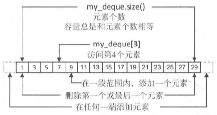

# 第二章 使用序列容器

[TOC]


## 2.1序列容器

* `array<T, N>(数组容器)` 一个长度固定的序列；

  

* `vector<T>(向量容器)` 一个长度可变的序列；

  

* `deque<T>(双向队列容器)` 一个长度可变的，可以自动增长的序列；

  

* `list<T>(链表容器)` 一个长度可变的，由T类型对象组成的序列；

  

* `forward_list<T>(正向链表容器)` 一个长度可变的，由T类型对象组成的序列。

  

  

array, vector, deque容器的函数成员：

| 函数成员        | 说明                                               | array<T, N> | vector<T> | deque<T> |
| :-------------- | :------------------------------------------------- | :---------- | :-------- | :------- |
| begin()         | 返回开始迭代器                                     | Y           | Y         | Y        |
| end()           | 返回结束迭代器                                     | Y           | Y         | Y        |
| rbegin()        | 返回反向开始迭代器                                 | Y           | Y         | Y        |
| rend()          | 返回方向结束迭代器                                 | Y           | Y         | Y        |
| cbegin()        | 返回const类型开始迭代器                            | Y           | Y         | Y        |
| cend()          | 返回const类型结束迭代器                            | Y           | Y         | Y        |
| crbegin()       | 返回const类型反向开始迭代器                        | Y           | Y         | Y        |
| crend()         | 返回const类型反向结束迭代器                        | Y           | Y         | Y        |
| assign()        | 用新元素替换原有内容                               | -           | Y         | Y        |
| operator=()     | 复制同类型容器的元素，或者用初始化列表替换现有内容 | Y           | Y         | Y        |
| size()          | 返回实际元素个数                                   | Y           | Y         | Y        |
| max_size()      | 返回元素个数的最大值                               | Y           | Y         | Y        |
| capacity()      | 返回当前容量                                       | -           | Y         | -        |
| empty()         | 返回true，如果容器中没有元素的话                   | Y           | Y         | Y        |
| resize()        | 改变实际元素个数的最大值                           | -           | Y         | Y        |
| shrink_to_fit() | 将内存减少到等于当前元素实际所使用的大小           | -           | Y         | Y        |
| front()         | 返回打一个元素的引用                               | Y           | Y         | Y        |
| back()          | 返回最后一个元素的引用                             | Y           | Y         | Y        |
| operator[]()    | 使用索引访问元素                                   | Y           | Y         | Y        |
| at()            | 使用进过边界检查的索引访问元素                     | Y           | Y         | Y        |
| push_back()     | 在序列的尾部添加一个元素                           | -           | Y         | Y        |
| insert()        | 在指定的位置插入一个或多个元素                     | -           | Y         | Y        |
| emplace()       | 在指定的位置直接生成一个元素                       | -           | Y         | Y        |
| emplace_back()  | 在序列尾部生成一个元素                             | -           | Y         | Y        |
| pop_back()      | 移出序列尾部的元素                                 | -           | Y         | Y        |
| erase()         | 移出一个元素或一段元素                             | -           | Y         | Y        |
| clear()         | 移出所有的元素，容器大小变为0                      | -           | Y         | Y        |
| swap()          | 交换两个容器的所有元素                             | Y           | Y         | Y        |
| data()          | 返回包含元素的内部数组的指针                       | Y           | Y         | -        |

list, forward_list容器的函数成员：

| 函数成员        | 说明                                               | list<T> | forward_list<T> |
| :-------------- | :------------------------------------------------- | :------ | :-------------- |
| begin()         | 返回开始迭代器                                     | Y       | Y               |
| end()           | 返回结束迭代器                                     | Y       | Y               |
| rbegin()        | 返回反向开始迭代器                                 | Y       | -               |
| rend()          | 返回反向结束迭代器                                 | Y       | -               |
| cbegin()        | 返回const开始结束迭代器                            | Y       | Y               |
| before_begin()  | 返回一个指向第一个元素前一个位置的迭代器           | -       | Y               |
| cbefore_begin() | 返回一个指向第一个元素前一个位置的const迭代器      | -       | Y               |
| cend()          | 返回const结束迭代器                                | Y       | Y               |
| crbegin()       | 返回const反向开始迭代器                            | Y       | -               |
| crend()         | 返回const反向结束迭代器                            | Y       | -               |
| assign()        | 用新元素替换原有内容                               | Y       | Y               |
| operator=()     | 复制同类型容器的内容，或者用初始化列表替换现有内容 | Y       | Y               |
| size()          | 返回实际元素个数                                   | Y       | -               |
| max_size()      | 返回元素个数的最大数                               | Y       | Y               |
| resize()        | 改变实际元素的个数                                 | Y       | Y               |
| empty()         | 返回true，如果容器中没有元素的话                   | Y       | Y               |
| front()         | 返回第一个元素的引用                               | Y       | Y               |
| back()          | 返回最后一个元素的引用                             | Y       | -               |
| push_back()     | 在序列的尾部添加一个元素                           | Y       | -               |
| push_front()    | 在序列的起始位置添加一个元素                       | Y       | Y               |
| emplace()       | 在指定位置直接生成一个元素                         | Y       | -               |
| emplace_after() | 在指定位置的后面直接生成一个元素                   | -       | Y               |
| emplace_back()  | 在序列尾部生成一个元素                             | Y       | -               |
| emplace_front() | 在序列的起始位置生成一个元素                       | Y       | Y               |
| insert()        | 在指定的位置插入一个或多个元素                     | Y       | -               |
| insert_after()  | 在指定位置的后面插入一条或多个元素                 | -       | Y               |
| pop_back()      | 移出序列尾部的元素                                 | Y       | -               |
| pop_front()     | 移出序列头部的元素                                 | Y       | Y               |
| reverse()       | 反向元素的顺序                                     | Y       | Y               |
| erase()         | 移除指定位置的一个元素或一段元素                   | Y       | -               |
| erase_after()   | 移除指定位置后面的一个元素或一段元素               | -       | Y               |
| remove()        | 移除所有和参数匹配的元素                           | Y       | Y               |
| remove_if()     | 移除满足一元函数条件的所有元素                     | Y       | Y               |
| unique()        | 移除所有连续重复的元素                             | Y       | Y               |
| clear()         | 移除所有的元素，容器大小变为0                      | Y       | Y               |
| swap()          | 交换两个容器的元素                                 | Y       | Y               |
| sort()          | 对元素进行排序                                     | Y       | Y               |
| merge()         | 合并两个有序容器                                   | Y       | Y               |
| splice()        | 移动指定位置前面的所有元素到另一同类型的list中     | Y       | -               |
| splice_after()  | 移动指定位置后面的所有元素到另一同类型的list中     | -       | Y               |


## 2.2使用array<T,N>容器

如果使用`at()`，当用一个非法的索引访问数组元素时，能够被检测到。

例，创建具有100个double型元素的`array<>`：

```c++
std::array<double, 100> data;
```

例，定义一个array，并将所有元素初始化为默认值：

```c++
std::array<double, 100> data{};
```

例，创建array并对用指定值进行初始化：

```c++
std::array<double, 10> values{0.5, 1.0, 1.5, 2.0};
```


*生成一个`array<T, N>`容器*

### 2.2.1访问元素

完整示例：

```c++
#include <iostream>
#include <iomanip>
#include <array>

int main()
{
    const unsigned int min_wt {100U};
    const unsigned int max_wt {250U};
    const unsigned int wt_step {10U};
    const size_t wt_count {1 + (max_wt - min_wt) / wt_step};

    const unsigned int min_ht {48U};
    const unsigned int max_ht {84U};
    const unsigned int ht_step {2U};
    const size_t ht_count {1 + (max_ht - min_ht) / ht_step};

    const double lbs_per_kg {2.20462};
    const double ins_per_m {39.3701};

    std::array<unsigned int, wt_count> weight_lbs;
    std::array<unsigned int, ht_count> height_ins;

    for (size_t i{}, w{min_wt}; i < wt_count; w += wt_step, ++i)
    {
        weight_lbs.at(i) = w;
    }

    unsigned int h{ min_ht };
    for(auto& height : height_ins)
    {
        height = h;
        h += ht_step;
    }

    std::cout << std::setw(7) << " |";
    for (const auto& w : weight_lbs)
        std::cout << std::setw(5) << w << " |";
    std::cout << std::endl;

    double bmi {};
    unsigned int feet {};
    unsigned int inches {};
    const unsigned int inches_per_foot {12U};
    for (const auto& h : height_ins)
    {
        feet = h / inches_per_foot;
        inches = h % inches_per_foot;
        std::cout << std::setw(2) << feet << "'" << std::setw(2) << inches << "\"" << "|";
        std::cout << std::fixed << std::setprecision(1);
        for (const auto& w : weight_lbs)
        {
            bmi = h / ins_per_m;
            bmi = (w / lbs_per_kg) / (bmi*bmi);
            std::cout << std::setw(2) << " " << bmi << " |";
        }
        std::cout << std::endl;
    }
    for (size_t i {1}; i < wt_count; ++i)
        std::cout << "----------";
    std::cout << "\nBMI from 18.5 to 24.9 is normal" << std::endl;
}
```

### 2.2.2使用数组容器的迭代器

数组模板定义了成员函数`begin()`和`end()`，分别返回指向第一个元素和最后一个元素的下一个位置的随机访问迭代器。

例，自增设置所有元素：

```c++
std::array<double, 10> values;
std::iota(std::begin(values), std::end(values), 10.0); // 10.0 ~ 19.0
```

**注意：不要忘记算法是独立于容器类型的，对于任何具有指定类型迭代器的容器来说，算法都可以应用到它们的元素上。generate()和iota()函数模版只需要正向迭代器，所以用来指定任何容器的元素范围的迭代器都能发挥作用。**

容器定义了成员函数`cbegin()`和`cend()`，它们可以返回const迭代器；函数`crbegin()`和`crend()`可以返回const反向迭代器。

例，用反向迭代器以逆序方式处理元素：

```c++
std::array<double, 5> these{1.0, 2.0, 3.0, 4.0, 5.0};
double sum{};
auto start = std::rbegin(these);
auto finish = std::rend(these);

// 使用while遍历
while (start != finish)
    sum += *(start++);

// 使用for遍历
for (auto iter = std::rbegin(these); iter != std::rend(these); ++iter)
    sum += *iter;

std::cout << "The sum of elements in reverse order is " << sum << std::endl;
```

### 2.2.3比较数组容器

例：

```c++
std::array<double, 4> these{1.0, 2.0, 3.0, 4.0};
std::array<double, 4> those{1.0, 2.0, 3.0, 4.0};
std::array<double, 4> them{1.0, 3.0, 3.0, 2.0};

if (these == those) std::cout << "xx" << std::endl;
if (those != them) std::cout << "xx" << std::endl;
if (those < them) std::cout << "xx" << std::endl;
if (them > those) std::cout << "xx" << std::endl;
```


## 2.3使用vector<T>容器

### 2.3.1创建vector<T>容器

例：

```c++
std::vector<double> values(20);    // 初始化20个元素，其值为默认值
std::vector<double> values{20};    // 初始化1个元素，其值为20
std::vector<long> values(20, 99L); // 初始化20个元素，其值为99

// 用一个容器来初始化另一个容器
std::array<std::string, 5> words{"one", "two", "three", "four", "five"};
std::vector<std::string> words_copy{std::begin(words), std::end(words)};

// 将一个容器的元素移动到另一个容器
std::vector<std::string> words_copy{std::make_move_iterator(std::begin(words)),
                                    std::make_move_iterator(std::end(words))};
```

### 2.3.2vector的容量和大小


*vector的容量和大小*

通过调用reserve()来增加容器的容量，而不改变当前元素的个数。

例：

```c++
std::vector<double> values;
values.reserve(20);
```

通过调用resize()来改变容器大小，有可能会导致容量的增加。

例：

```c++
std::vector<int> values{1, 2, 3};
values.resize(5);     // 1, 2, 3, 0, 0
values.resize(7, 99); // 1, 2, 3, 0, 0, 99, 99
values.resize(6);     // 1, 2, 3, 0, 0, 99
```

### 2.3.3访问元素

例，通过方括号使用索引：

```c++
std::vector<double> values(20);
values[0] = 3.14159;
values[1] = 5.0;
values[2] = 2.0 * values[0] * values[1];
```

例，使用`front()`和`back()`：

```c++
std::cout << values.front() << std::endl;
values.front() = 2.71828;   // front()和back()返回的是引用，可以直接赋值
auto pData = values.data(); // data()返回的的是指针
```

### 2.3.4使用vector容器的迭代器

完整示例：

```c++
#include <iostream>
#include <string>
#include <algorithm>
#include <vector>
#include <iterator>
using std::string;
using std::vector;

int main() {
    vector<string> words;
    words.reserve(10);
    std::cout << "Enter words separated by space. Enter Ctrl+Z on a separate line to end:"
                << std::endl;
    std::copy(std::istream_iterator<string> {std::cin}, std::istream_iterator<string> {},
            std::back_inserter{words});
    std::cout << "Starting sort." << std::endl;
    bool out_of_order {false};
    auto last = std::end(words);
    while(true)
    {
        for (auto first = std::begin(words) + 1; first != last; ++first)
        {
            if(*(first - 1) > *first)
            {
                std::swap(*first, *(first - 1));
                out_of_order = true;
            }
        }
        if(!out_of_order)
            break;
        out_of_order = false;
    }

    std::cout << "your words in ascending sequence:" << std::endl;
    std::copy(std::begin(words), std::end(words), std::ostream_iterator<string> {std::cout, " "});
    std::cout << std::endl;

    vector<string> words_copy {std::make_move_iterator(std::begin(words)),
                                std::make_move_iterator(std::end(words))};
    std::cout << "\nAfter moving elements from words, words_copy contains:" << std::endl;
    std::copy(std::begin(words_copy), std::end(words_copy),
                std::ostream_iterator<string> {std::cout, " "});
    std::cout << std::endl;

    std::cout << "\nwords vector has " << words.size() << " elements\n";
    if(words.front().empty())
        std::cout << "First element is empty string object." << std::endl;
    std::cout << "First element is \"" << words.front() << "\"" << std::endl;
}
```

例，自定义函数模板，对能够排序的任意类型进行排序：

```c++
template<typename RandomIter>
void bubble_sort(RandomIter start, RandomIter last)
{
    std::cout << "Starting sort." << std::endl;
    bool out_of_order{false};
    while (true)
    {
        for (auto first = start + 1; frist != last; ++first)
        {
            if (*(first - 1) > *first)
            {
                std::swap(*first, *(first - 1));
                out_of_order = true;
            }
        }
        if (!out_of_order)
            break;
        out_of_order = false;
    }
}

bubble_sort(std::begin(words), std::end(words));
```

### 2.3.5向vector容器中添加元素

1. 增加元素

   ```c++
   std::vector<std::string> words;
   words.push_back(string("adiabatic"));
   words.push_back("adiabatic");
   ```
   
   `emplace_back`比`push_back`更有效率。
   
   例：
   
   ```c++
   std::vector<std::string> words;
   words.push_back(std::string("facetious"));
   words.emplace_back("abstemious");
   ```
   
2. 插入元素

   ```c++
   // 插入第二个参数指定的单个元素
   auto iter = words.insert(++std::begin(words), "two");
   
   // 插入一个由第2个和第3个参数指定的元素序列
   std::string more[]{"five", "fix", "seven"};
   iter = words.insert(--std::end(words), std::begin(more), std::end(more));
   
   // 在vector的末尾插入一个元素
   iter = words.insert(std::end(words), "ten");
   
   // 在插入点插入多个单个元素，第2个参数表示插入次数
   iter = words.insert(std::cend(words) - 1, 2, "nine");
   
   // 在插入点，插入初始化列表指定的元素，第2个参数就是被插入元素的初始化列表
   iter = words.insert(std::end(words), 
                       {std::string{"twelve"}, std::string{"thirteen"}});
   ```

3. 删除元素

   例，通过`clear`来清空元素，保持容量不变：
   
   ```c++
   std::vector<int> data(100, 99);
   data.clear(); // 清空元素，容量保持100
   ```
   
   例，通过`pop_back`来删除最后一个元素，保持容量不变：
   
   ```c++
   std::vector<int> data(100, 99);
   data.pop_back(); // 删除最后一个元素，容量保持100
   ```
   
   例，通过`shrink_to_fit`去掉容器中多余的容量：
   
   ```c++
   data.shrink_to_fit(); // 去掉多余的容量，使迭代器失效
   ```
   
   例，通过`erase`移除元素：
   
   ```c++
   auto iter = data.erase(std::begin(data)+1, std::begin(data)+3); // 移除data[1], data[3]
   ```
   
   例，通过`remove`删除特定值（非真正删除）：
   
   ```c++
   std::vector<std::string> words{"one", "none", "some", "all", "none", "most", "many"};
   auto iter = std::remove(std::begin(words), std::end(words), "none"); // 删除值为none的元素（并没有真正删除，只是把它们挪到尾部去了）
   ```
   
   
   
   *remove()算法的工作原理*
   
   例，通过erase-remove真正删除元素：
   
   ```c++
   words.erase(std::remove(std::begin(words), std::end(words), "none"), std::end(words));
   ```
   
   完整示例：
   
   ```c++
   #include <iostream>
   #include <vector>
   int main()
   {
       std::vector <size_t> sizes;
       std::vector <size_t> capacities;
       size_t el_incr {10};
       size_t incr_count {4 * el_incr};
   
       for (size_t n_elements {}; n_elements < incr_count; n_elements += el_incr)
       {
           std::vector<int> values(n_elements);
           std::cout << "\nAppending to a vector with " << n_elements << " initial elements:\n";
           sizes.push_back(values.size());
           size_t space {values.capacity()};
           capacities.push_back(space);
   
           size_t count {};
           size_t n_increases {10};
           while(count < n_increases)
           {
               values.push_back(22);
               if(space < values.capacity())
               {
                   space = values.capacity();
                   capacities.push_back(space);
                   sizes.push_back(values.size());
                   ++count;
               }
           }
           std::cout << "Size/Capacity: ";
           for (size_t i {}; i < sizes.size(); ++i)
               std::cout << sizes.at(i) << "/" << capacities.at(i) << " ";
           std::cout << std::endl;
           sizes.clear();
           capacities.clear();
       }
   }
   ```

### 2.3.7vector<bool>容器

`vector<bool>`是`vector<T>`模版的特例化，为bool类型的元素提供了更有效的内存使用方式，以类似**位域**而非vector的方式存放`vector<bool>`；

**建议不要使用`vector<bool>`。**


## 2.4使用deque<T>容器

### 2.4.1生成deque容器



*一个deque容器示例*

例：

```c++
// 生成不带元素的deque容器
std::deque<int> a_deque;

// 生成带10个元素的deque容器
std::deque<int> my_deque(10);

// 使用初始化列表生成deque容器
std::deque<std::string> words{"one", "none", "some", "all", "none", "most", "many"};

// 生成deque容器的副本
std::deque<std::string> words_copy{words};

// 使用两个迭代器来初始化deque容器
std::deque<std::string> words_part{std::begin(words), std::begin(words)+5};
```

### 2.4.2访问元素

deque容器中组织元素的方式导致容器的大小总是和容量相等。

可以用下标运算符来访问元素，但是索引并没有进行边界检查，函数`at()`提供了边界检查。

例：

```c++
std::cout << words.at(2) << std::endl; // 使用边界检查，安全！
```

### 2.4.3添加和移除元素

例：

```c++
std::deque<int> numbers{2, 3, 4};
numbers.push_front(11); // 11, 2, 3, 4
numbers.push_bak(12);   // 11, 2, 3, 4, 12
numbers.pop_front();    //  2, 3, 4, 12
```

### 2.4.4替换deque容器中的内容

deque的成员函数assign()可以替换现有的所有元素。

例，使用初始化列表来替换deque容器中的内容：

```c++
std::deque<std::string> words{"one", "two", "three", "four"};
auto init_list = {std::string{"seven"}, std::string{"eight"}, std::string{"nine"}}; // 不能直接这样写：auto init_list = {...}; 这样的话，init_list会被推导为initializer_list<const char*>

words.assign(init_list);
words.assign({"seven", "eight", "nine"}); // 效果同上

words.assign(8, "eight"); // 用8个"eight"来初始化words
```

完整示例：

```c++
#include <iostream>
#include <algorithm>
#include <deque>
#include <string>
#include <iterator>

using std::string;

int main()
{
    std::deque<string> names;
    std::cout << "Enter first names separated by spaces. Enter Ctrl+Z on a new line to end:\n";
    std::copy(std::istream_iterator<string> {std::cin}, std::istream_iterator<string> {}, std::front_inserter(names));
    std::cout << "\nIn reverse order, the names you entered are:\n";
    std::copy(std::begin(names), std::end(names), std::ostream_iterator<string>{std::cout, " "});
    std::cout << std::endl;
}
```


## 2.5使用list<T>容器


*list<T>容器中元素的组织*

### 2.5.1生成list容器

例：

```c++
// 生成一个空的list容器
std::list<std::string> words;

// 创建一个带有给定数量的默认元素的列表
std::list<std::string> sayings{20};

// 生成一个包含给定数量的相同元素的列表
std::list<double> values(50, 3.14149265);

// 生成一个现有list容器的副本
std::list<double> save_values{values};

// 使用2个迭代器来构造并初始化list容器
std::list<double> samples{++cbegin(values), --cend(values)};
```

### 2.5.2添加元素

例：

```c++
// 以放置的方式添加元素
std::list<std::string> names{"Jane", "Jim", "Jules", "Janet"};
names.push_front("Ian");
names.push_back("Kitty");
names.emplace_front("Ian");
names.emplace_back("Kitty");

// 以插入的方式添加元素
std::list<int> data(10, 55);
data.insert(++begin(data), 66); // 55 66 55 55 55 55 55 55 55 55 55

// 以插入的方式添加一段元素
std::vector<int> numbers(10, 5);
data.insert(--(--end(data)), cbegin(numbers), cend(numbers));
```

### 2.5.3移除元素

例：

```c++
std::list<int> numbers{2, 5, 2, 3, 6, 7, 8, 2, 9};
numbers.remove(2);                              // 5, 3, 6, 7, 8, 9
numbers.remove_if([](int n){return n%2 == 0;}); // 5, 3, 7, 9

std::list<std::string> words{"one", "two", "two", "two", "three", "four", "four"};
words.unique(); // "one", "two", "three", "four"
```

### 2.5.4排序和合并元素

例：

```c++
// 排序
names.sort(std::greater<std::string>());
names.sort(std::greater<>());

// 自定义比较类
class my_greater
{
public:
  bool operator()(const std::string& s1, const std::string& s2)
  {
  	if (s1[0] == s2[0])
      return s1.length() > s2.length();
    else
      return s1 > s2;
  }
};
names.sort(my_greater());

// 使用lambda进行比较
names.sort([](const std::string& s1, const std::string& s2){
	if (s1[0] == s2[0])
    return s1.length() > s2.length();
  else
    return s1 > s2;
});

// 合并list容器
std::list<int> my_values{2, 4, 6, 14};
std::list<int> your_values{-2, 1, 7, 10};
my_values.merge(your_values); // my_values:-2, 1, 2, 4, 6, 7, 10, 14
your_values.empty(); // 返回true

// 排序，合并list
std::list<std::string> my_words{"three", "six", "eight"};
std::list<std::string> your_words{"seven", "four", "nine"};
auto comp_ptr = [](const std::string& s1, const std::string& s2){ return s1[0] < s2[0]; };
my_words.sort(comp_str);
your_words.sort(comp_str);
mywords.merge(your_words, comp_str); // "eight", "four", "nine", "six", "seven", "three"

// 拆分
std::list<std::string> my_words{"three", "six", "eight"};
std::list<std::string> your_words{"seven", "four", "nine"};
my_words.splice(++std::begin(my_words), your_words, ++std::begin(your_words));
```

### 2.5.5访问元素

完整示例：

```c++
#include <iostream>
#include <list>
#include <string>
#include <functional>

using std::list;
using std::string;

template<typename Iter>
void list_elements(Iter begin, Iter end)
{
	while (begin != end)
    std::cout << *begin++ << std::endl;
}

int main()
{
	std::list<string> proverbs;
  std::cout << "Enter a few proverbs and enter an empty line to end:"
    << std::endl;
  string proverb;
  while (getline(std::cin, proverb, '\n'), !proverb.empty())
    proverbs.push_front(proverb);
}
```


## 2.6使用forward_list<T>容器

例，使用distance获得元素个数：

```c++
std::forward_list<std::string> my_words{"three", "six", "eight"};
auto count = std::distance(std::begin(my_words), std::end(my_words)); // count == 3
```

例，使用advance移动迭代器：

```c++
std::forward_list<int> data{10, 21, 43, 87, 175, 351};
auto iter = std::begin(data);
size_t n{3};
std::advance(iter, n);
std::cout << "The " << n + 1 << "th element is " << *iter << std::endl; // 87
```

例，使用splice_after在开始位置插入或粘接元素：

```c++
std::forward_list<std::string> my_words{"three", "six", "eight"};
std::forward_lsit<std::string> you_words{"seven", "four", "nine"};
my_words.splice_after(my_words.before_begin(), your_words, ++std::begin(your_words));
```

例，使用splice_after()将一段元素粘接到另一个容器中：

```c++
my_words.splice_after(my_words.before_begin(), your_words, 
                      ++std::begin(your_words), std::end(your_words));
```

例，使用splice_after()将全部元素粘接到另一个容器中：

```c++
my_words.splice_after(my_words.before_begin(), your_words);
```

完整示例：

```c++
#include <algorithm>
#include <iostream>
#include <forward_list>
#include <iterator>
#include <utility>

using namespace std::rel_ops;

class Box
{
private:
    size_t length {};
    size_t width {};
    size_t height {};
public:
    explicit Box(size_t l = 1, size_t w = 1, size_t h = 1) : length {1}, width {w}, height {h} {}
    double volume() const { return length * width * height; }
    bool operator<(const Box& box) { return volume() < box.volume(); }
    bool operator==(const Box& box) { return length == box.length && width == box.width && height == box.height; }

    friend std::istream& operator>>(std::istream& in, Box& box);
    friend std::ostream& operator<<(std::ostream& out, const Box& box);
};

inline std::istream& operator>>(std::istream& in, Box& box)
{
    std::cout << "Enter box length, width, & height separated by spaces - Ctrl+Z to end: ";
    size_t value;
    in >> value;
    if (in.eof()) return in;

    box.length = value;
    in >> value;
    box.width = value;
    in >> value;
    box.height = value;
    return in;
}

inline std::ostream& operator<<(std::ostream& out, const Box& box)
{
    out << "Box(" << box.length << "," << box.width << "," << box.height << ") ";
    return out;
}

template<typename Iter>
void list_elements(Iter begin, Iter end)
{
    size_t perline {6};
    size_t count {};
    while(begin != end)
    {
        std::cout << *begin++;
        if(++count % perline == 0)
        {
            std::cout << "\n";
        }
    }
    std::cout << std::endl;
}

int main()
{
    std::forward_list<Box> boxes;
    std::copy(std::istream_iterator<Box>(std::cin), std::istream_iterator<Box>(), std::front_inserter(boxes));

    boxes.sort();
    std::cout << "\nAfter sorting the sequence is:\n";
    std::copy(std::begin(boxes), std::end(boxes), std::ostream_iterator<Box>(std::cout, " "));
    std::cout << std::endl;

    std::forward_list<Box> more_boxes {Box {3, 3, 3}, Box {5, 5, 5}, Box {4, 4, 4}, Box {2, 2, 2}};
    boxes.insert_after(boxes.before_begin(), std::begin(more_boxes), std::end(more_boxes));
    std::cout << "After inserting more boxes the sequence is:\n";
    list_elements(std::begin(boxes), std::end(boxes));
    boxes.sort();
    std::cout << std::endl;
    std::cout << "The sorted sequence is now:\n";
    list_elements(std::begin(boxes), std::end(boxes));

    more_boxes.sort();
    boxes.merge(more_boxes);
    std::cout << "After merging more_boxes the sequence is:\n";
    list_elements(std::begin(boxes), std::end(boxes));

    boxes.unique();
    std::cout << "After removing successive duplicates the sequence is:\n";
    list_elements(std::begin(boxes), std::end(boxes));

    const double max_v {30.0};
    boxes.remove_if([max_v](const Box& box){return box.volume() < max_v;});
    std::cout << "After removing those with volume less than 30 the sorted sequence is:\n";
    list_elements(std::begin(boxes), std::end(boxes));
}
```


## 2.7自定义迭代器

### 2.7.1STL迭代器的要求

用迭代器作为参数的交换函数，使用模板类型参数指定迭代器类型：

```c++
template <typename Iter>
void my_swap(Iter a, Iter b)
{
    typename Iter::value_type tmp = *a; // 通过value_type的别名来指定tmp类型
    *a = *b;
    *b = tmp;
}
```

### 2.7.2走进STL

一个满足STL要求的迭代器必须全部定义以下别名：

- `difference_type` 两个同类型的迭代器之间差别值的类型；
- `value_type` 迭代器所指向值的类型；
- `pointer` 迭代器所表示的指针类型；
- `reference` 来自于迭代器的引用类型；
- `iterator_category` 迭代器类别的标签类类型
  - `input_iterator_tag`
  - `output_iterator_tag`
  - `forward_iterator_tag`
  - `bidirectional_iterator_tag`
  - `random_access_iterator_tag`

自定义迭代器完整示例：

```c++
#include <algorithm>
#include <numeric>
#include <iostream>
#include <vector>

#include <exception>
#include <iterator>
#include <type_traits>
#include <utility>
using namespace std::rel_ops;

template <typename T> 
class Numeric_Iterator; // 自定义迭代器

template<typename T>
class Numeric_Range
{
    static_assert(std::is_integral<T>::value || std::is_floating_point<T>::value,
                  "Numeric_Range type argument must be numeric.");
    friend class Numeric_Iterator <T>;

private:
    T start;
    T step;
    size_t count;

public:
    explicit Numeric_Range(T first = 0, T incr = 1, size_t n = 2) : start{first}, step{incr}, count{n} {}
    Numeric_Iterator<T> begin() { return Numeric_Iterator<T>(*this); }
    Numeric_Iterator<T> end()
    {
        Numeric_Iterator<T> end_iter(*this);
        end_iter.value = start + count * step;
        return end_iter;
    }
};

template<typename T>
class Numeric_Iterator : public std::iterator<std::forward_iterator_tag, T>
{
    friend class Numeric_Range <T>;
private:
    Numeric_Range<T>& range;
    T value;

public:
    explicit Numeric_Iterator(Numeric_Range<T>& a_range) : range{a_range}, value{a_range.start} {}

    Numeric_Iterator& operator=(const Numeric_Iterator& src)
    {
        range = src.range;
        value = src.value;
    }

    T& operator* ()
    {
        if (value == static_cast<T>(range.start + range.count * range.step))
            throw std::logic_error("Cannot dereference an end iterator.");
        return value;
    }

    Numeric_Iterator& operator++()
    {
        if (value == static_cast<T>(range.start + range.count * range.step))
        {
            throw std::logic_error("Cannot increment an end iterator.");
        }
        value += range.step;
        return *this;
    }

    Numeric_Iterator operator++(int)
    {
        if (value == static_cast<T>(range.start + range.count * range.step))
        {
            throw std::logic_error("Cannot increment an end iterator.");
        }
        auto temp = *this;
        value += range.step;
        return temp;
    }

    bool operator<(const Numeric_Iterator& iter) const { return value < iter.value; }
    bool operator==(const Numeric_Iterator& iter) const { return value == iter.value; }
    bool operator!=(const Numeric_Iterator& iter) const { return value != iter.value; }
    bool operator>(const Numeric_Iterator& iter) const { return value > iter.value; }
    bool operator<=(const Numeric_Iterator& iter) const { *this < iter || *this == iter; }
    bool operator>=(const Numeric_Iterator& iter) const { *this > iter || *this == iter; }
};

int main()
{
    Numeric_Range<double> range{1.5, 0.5, 5};
    auto first = range.begin();
    auto last = range.end();
    std::copy(first, last, std::ostream_iterator<double>(std::cout, " "));
    std::cout << "\nSum = " << std::accumulate(std::begin(range), std::end(range), 0.0) << std::endl;

    // 初始化
    Numeric_Range<long> numbers{15L, 4L, 10};
    std::vector<long> data{std::begin(numbers), std::end(numbers)};
    std::cout << "\nValues in vector are:\n";
    std::copy(std::begin(data), std::end(data), std::ostream_iterator<long>(std::cout, " "));
    std::cout << std::endl;

    // 列出range中的元素
    std::cout << "\nThe values in the numbers range are:\n";
    for (auto n : numbers)
        std::cout << n << " ";
    std::cout << std::endl;
}
```


## 2.8小结

* `array<T, N>`容器可以存放N个类型为T的元素；
* `vector<T>`容器可以存储任意个数的T类型元素；
* 可以在vector的末尾高效地添加或删除元素；但在序列内部添加或删除元素会变慢，因为需要移动元素；
* 可以使用索引来访问vector中的元素，或者调用会检查索引的成员函数`at()`；
* `deque<T>`是一个双端队列，可以存储任意个数的T类型元素；
* 可以在deque容器的头部和尾部高效地添加或删除元素；
* array, vector, deque容器提供了const和non-const随机访问迭代器和反向迭代器；
* `list<T>`是一个存储T类型元素的双向链表；
* 只能以从序列头部或尾部遍历元素的方式访问list容器中的元素；
* list容器提供双向迭代器；
* `forward_list<T>`容器以单链表的形式存储T类型的元素，但是比list容器更快，更简单；
* forward_list容器提供正向迭代器；
* 头文件alogrithm中定义的`copy()`算法可以将一段元素复制到另一个爹嗲气指定的位置；
* 可以将`copy()`算法和流迭代器一起使用，用来从输入流读取数据，然后把它们复制到容器中，或者在从容器读取数据后将它们输出到流中；
* 函数模板`sort()`定义在头文件algorithm中，可以对随机访问迭代器指定的元素进行排序。元素默认会被排为升序，也可以用自定义的二元断言作为sort()参数去决定元素的排列顺序；
* list和forward_list容器都有成员函数`sort()`，可以对元素进行排序。