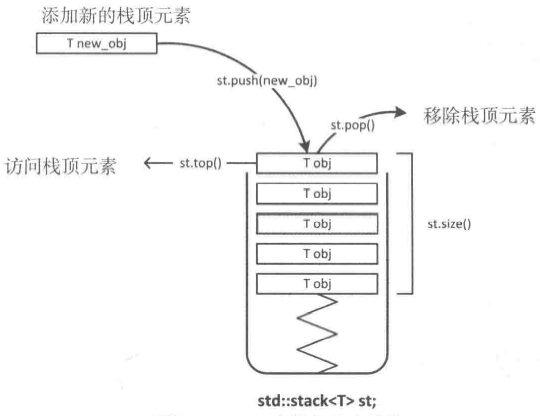
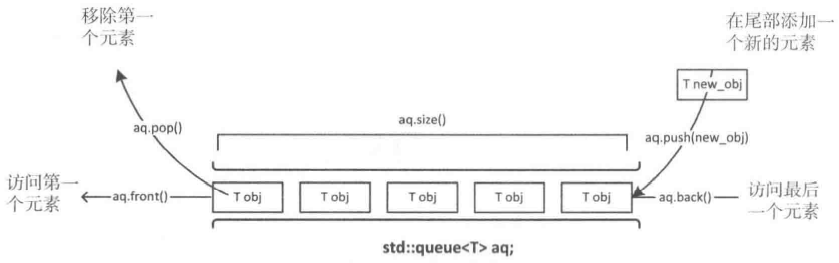
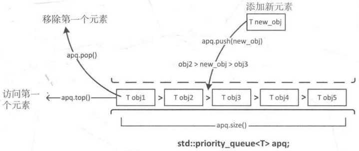
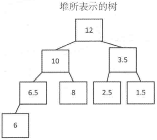
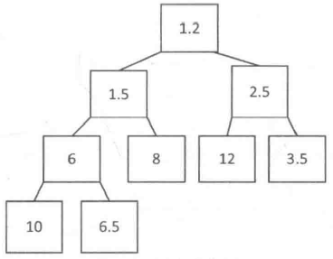
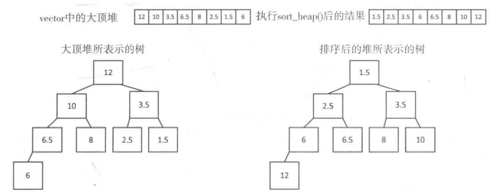

# 第三章 容器适配器

[TOC]


## 3.1什么是容器适配器

容器适配器类别：

* `stack<T>`是一个封装了`deque<T>`容器的适配器类模板，默认实现的是一个后入先出(LIFO)的压入栈；
* `queue<T>`是一个封装了`deque<T>`容器的适配器类模板，默认实现的是一个先入先出(FIFO)的队列；
* `priority_queue<T>`是一个封装了`vector<T>`容器的适配器类模板，默认实现的是一个会对元素排序，从而保证最大元素总在队列最前面的队列。


## 3.2创建和使用stack<T>容器适配器



*stack容器的基本操作*

例，定义一个使用list<T>的堆栈：

```c++
std::stack<std::string, std::list<std::string> > fruit;
```

不能在初始化列表中用对象来初始化堆栈。

例，使用list初始化stack：

```c++
std::list<double> values{1.414, 3.14, 2.71};
std::stack<double, std::list<double> > mystack(values); // 这里不能使用初始化列表
std::stack<double, std::list<double> > copy_stack{my_stack}; // 在拷贝构造函数时，可以用初始化列表
```

堆栈操作：

* `top()` 返回一个栈顶元素的引用，类型为T&。如果栈为空，返回值未定义；
* `push(const T& obj)` 将对象副本压入栈顶；
* `push(T&& obj)` 以移动对象的方式将对象压入栈顶；
* `pop()` 弹出栈顶元素；
* `empty()` 在栈中没有元素的情况下返回true；
* `emplace()` 用传入的参数调用构造函数，在栈顶生成对象；
* `swap(stack<T>& other_stack)` 将当前栈中的元素和参数中的元素交换。

完整示例：

```c++
#include <cmath>
#include <iostream>
#include <stack>
#include <algorithm>
#include <stdexcept>
#include <string>
using std::string;

inline size_t precedence(const char op)
{
    if (op == '+' || op == '-')
        return 1;
    if (op == '*' || op == '/')
        return 2;
    if (op == '^')
        return 3;
    throw std::runtime_error {string{"invalid operator: "} + op};
}

double execute(std::stack<char>& ops, std::stack<double>& operands)
{
    double result {};
    double rhs {operands.top()};
    operands.pop();
    double lhs {operands.top()};
    operands.pop();

    switch (ops.top())
    {
    case '+':
        result = lhs + rhs;
        break;
    case '-':
        result = lhs - rhs;
        break;
    case '*':
        result = lhs * rhs;
        break;
    case '/':
        result = lhs / rhs;
        break;
    case '^':
        result = std::pow(lhs, rhs);
        break;
    default:
        throw std::runtime_error {string{"invalid operator: "} + ops.top()};
    }
    ops.pop();
    operands.push(result);
    return result;
}

int main()
{
    std::stack<double> operands;
    std::stack<char> operators;
    string exp;
    std::cout << " An arithmetic expression can include the operators +, -, *, /,"
                << " and ^ for exponentiation. " << std::endl;
    try
    {
        while(true)
        {
            std::cout << "Enter an arithmetic expression and press Enter"
                        << "- enter an empty line to end:" << std::endl;
            std::getline(std::cin, exp, '\n');
            if(exp.empty()) break;

            exp.erase(std::remove(std::begin(exp), std::end(exp), ' '), std::end(exp));
            size_t index {};
            operands.push(std::stod(exp, &index));

            while(true)
            {
                operators.push(exp[index++]);
                size_t i {};
                operands.push(std::stod(exp.substr(index), &i));
                index += i;

                if(index == exp.length())
                {
                    while(!operators.empty())
                        execute(operators, operands);
                    break;
                }
                while(!operators.empty() && precedence(exp[index]) <= precedence(operators.top()))
                    execute(operators, operands);
            }
            std::cout << "result = " << operands.top() << std::endl;
        }
    }
    catch(const std::exception& e)
    {
        std::cerr << e.what() << '\n';
    }
    std::cout << "Calculator ending..." << std::endl;
}
```


## 3.3创建和使用queue<T>容器适配器



*queue容器*

例，创建queue的方法：

```c++
std::queue<std::string> words;
std::queue<std::string> copy_words{words}; // 使用拷贝构造函数创建
std::queue<std::string, std::list<std::string> > words; // 指定底层实现使用其他适配器
```

### 3.3.1queue操作

* `front()` 返回queue中第一个元素的引用；
* `back()` 返回queue中最后一个元素的引用；
* `push(const T& obj)` 在queue的尾部添加一个元素的副本；
* `push(T&& obj)` 以移动的方式在queue的尾部添加元素；
* `pop()` 删除queue中的第一个元素；
* `size()` 返回queue中元素的个数；
* `empty()` 返回true，如果queue中没有元素的话；
* `emplace()` 用传给emplace()的参数调用T的构造函数，在queue的尾部生成对象；
* `swap(queue<T>&other_q)` 将当前queue中的元素和参数queue中的元素交换。

### 3.3.2queue容器的实际使用

```c++
// Customer.h
#ifndef CUSTOMER_H
#define CUSTOMER_H

class Customer
{
private:
    size_t service_t{};
public:
    explicit Customer(size_t st = 10) : service_t{st} {}

    Customer& time_decrement()
    {
        if (service_t > 0)
            --service_t;
        return *this;
    }
    bool done() const { return service_t == 0; }
};

#endif
```

```c++
// Checkout.h
#ifndef CHECKOUT_H
#define CHECKOUT_H
#include <queue>
#include "Customer.h"

class Checkout
{
private:
    std::queue<Customer> customers;

public:
    void add(const Customer& customer) { customers.push(customer); }
    size_t qlength() const { return customers.size(); }

    void time_increment()
    {
        if (!customers.empty())
        {
            if (customers.front().time_decrement().done())
                customers.pop();
        }
    };

    bool operator<(const Checkout& other) const { return qlength() < other.qlength(); }
    bool operator>(const Checkout& other) const { return qlength() > other.qlength(); }
};

#endif
```

```c++
// Ex3_02.cpp
#include <iostream>
#include <iomanip>
#include <vector>
#include <string>
#include <numeric>
#include <algorithm>
#include <random>

#include "Customer.h"
#include "Checkout.h"

void histogram(const std::vector<int>& v, int min)
{
    string bar (60, '*');
    for(size_t i {}; i < v.size(); ++i)
    {
        std::cout << std::setw(3) << i+min << " " << std::setw(4) << v[i] << " "
                  << bar.substr(0, v[i]) << (v[i] > static_cast<int>(bar.size()) ? "..." : "")
                  << std::endl;
    }
}

int main()
{
    std::random_device random_n;

    int service_t_min {2}, service_t_max {15};
    std::uniform_int_distribution<> service_t_d {service_t_min, service_t_max};

    int min_customers {15}, max_customers {20};
    distribution n_1st_customers_d {min_customers, max_customers};

    int min_arr_interval {1}, max_arr_interval {5};
    distribution arrival_interval_d {min_arr_interval, max_arr_interval};
    size_t n_checkouts {};
    std::cout << "Enter the number of checkouts in the supermarket: ";
    std::cin >> n_checkouts;
    if(!n_checkouts)
    {
        std::cout << "Number of checkouts must be greater than 0. Setting to 1. " << std::endl;
        n_checkouts = 1;
    }

    std::vector<PCheckout> checkouts;
    checkouts.reserve(n_checkouts);

    for(size_t i {}; i < n_checkouts; ++i)
        checkouts.push_back(std::make_unique<Checkout>());
    std::vector<int> service_times(service_t_max-service_t_min+1);

    int count {n_1st_customers_d(random_n)};
    std::cout << "Customers waiting at store opening: " << count << std::endl;
    int added {};
    int service_t {};

    auto comp = [](const PCheckout& pc1, const PCheckout& pc2){ return *pc1 < *pc2; };
    while(added++ < count)
    {
        service_t = service_t_d(random_n);
        auto iter = std::min_element(std::begin(checkouts), std::end(checkouts), comp);
        (*iter)->add(std::make_unique<Customer>(service_t));
        ++service_times[service_t - service_t_min];
    }

    size_t time {};
    const size_t total_time {600};
    size_t longest_q {};

    int new_cust_interval { arrival_interval_d(random_n) };

    while(time < total_time)
    {
        ++time;

        if(--new_cust_interval == 0)
        {
            service_t = service_t_d(random_n);
            (*std::min_element(std::begin(checkouts),
                std::end(checkouts), comp))->add(std::make_unique<Customer>(service_t));
            ++service_times[service_t - service_t_min];
            for(auto& pcheckout : checkouts)
                longest_q = std::max(longest_q, pcheckout->qlength());
            new_cust_interval = arrival_interval_d(random_n);
        }
        for(auto& pcheckout : checkouts)
            pcheckout->time_increment();
    }

    std::cout << "Maximum queue length = " << longest_q << std::endl;
    std::cout << "\nHistogram of service times:\n";
    histogram(service_times, service_t_min);

    std::cout << "\nTotal number of customers today: "
              << std::accumulate(std::begin(service_times), std::end(service_times), 0) << std::endl;
}
```


## 3.4使用priority_queue<T>容器适配器



*priority_queue容器*

### 3.4.1创建priority_queue

1. 创建priority_queue的方法：

   ```c++
   // 创建并初始化一个优先级队列
   std::string words[]{"one", "two", "three", "four"};
   std::priority_queue<std::string> words{std::begin(words), std::end(words)}; // two three one four
   
   // 拷贝构造函数生成一个priority_queue对象的副本
   std::priority_queue<std::string> copy_words{words}; // 拷贝构造
   
   // 带右值引用参数的拷贝构造函数，移动一个实参对象
   std::string words[]{"one", "two", "three", "four"};
   std::priority_queue<std::string, std::vector<std::string>, 
                       std::greater<std::string> > 
       words1{std::begin(words), std::end(words)}; // "four" "one" "three" "two"
   ```

2. 优先级队列可以使用任何容器来保存元素，只要容器有成员函数`front()`，`push_back()`，`pop_back()`，`size()`，`empty()`。

   例，使用deque来保存元素：

   ```c++
   std::string words[]{"one", "two", "three", "four"};
   std::priority_queue<std::string, std::deque<std::string> > words{
       std::begin(words), std::end(words)};
   ```
   
3. 可以生成vector或deque1容器，然后用它们来初始化priority_queue。

   例，使用vector的元素作为初始值来生成priority_queue对象：

   ```c++
   std::vector<int> values{21, 22, 12, 3, 24, 54, 56};
   std::priority_queue<int> numbers{std::less<int>(), values};
   ```

### 3.4.2priority_queue操作

对priority_queue操作的一些限制：

* `push(const T& obj)` 将obj的副本放到容器的适当位置，这通常会包含一个排序操作；
* `push(T&& obj)` 将obj放到容器的适当位置，这通常会包含一个排序操作；
* `emplace(T constructor args..)` 通过调用传入参数的构造函数，在序列的适当位置构造一个T对象；
* `top()` 返回优先级队列中第一个元素的引用；
* `pop()` 移除第一个元素；
* `size()` 返回队列中元素的个数；
* `empty()` 返回true，如果队列为空的话；
* `swap(priority_queue<T>& other)` 和参数的元素进行交换，所包含对象的类型必须相同。

例，将键盘输入的数据记录到`priority_queue`中：

```c++
std::priority_queue<std::string> words;
std::string word;
std::cout << "Enter words separated by spaces, enter Ctrl+Z on a separate line to end:\n";
while (true)
{
    if ((std::cin >> word).eof())
        break;
    words.push(word);
}
```

完整示例：

```c++
#include <iostream>
#include <queue>
#include <string>
using std::string;

template<typename T>
void list_pq(std::priority_queue<T> pq, size_t count = 5)
{
    size_t n {count};
    while(!pq.empty())
    {
        std::cout << pq.top() << " ";
        pq.pop();
        if(--n) continue;
        std::cout << std::endl;
        n = count;
    }
    std::cout << std::endl;
}

int main()
{
    std::priority_queue<std::string> words;
    std::string word;
    std::cout << "Enter words separated by spaces, enter Ctrl+Z on a separate line to end:\n";
    while(true)
    {
        if((std::cin >> word).eof())
            break;
        words.push(word);
    }
    std::cout << "You entered " << words.size() << " words. " << std::endl;
    list_pq(words);
}
```


## 3.5堆

堆不是容器，而是组织容器元素的一种特别方式。

### 3.5.1创建堆

例，创建堆：

```c++
std::vector<double> numbers{2.5, 10.0, 3.5, 6.5, 8.0, 12.0, 1.5, 6.0};
std::make_heap(std::begin(numbers), std::end(numbers)); // 12.0, 10.0, 3.5, 6.5, 8.0, 2.5, 1.5, 6.0
```



*堆所表示的树*

使用`make_heap()`创建的堆可以提供一些priority_queue没有的优势：

- 可以访问堆中的任意元素，而不限于最大的元素，因为元素被存储在一个容器中，就像是我们自己的vector。
- 可以在任何提供随机访问迭代器的序列容器中创建堆。

### 3.5.2堆操作

例，向堆中添加元素：

```c++
std::vector<double> numbers{2.5, 10.0, 3.5, 6.5, 8.0, 12.0, 1.5, 6.0};

// 12.0, 10.0, 3.5, 6.5, 8.0, 2.5, 1.5, 6.0
std::make_heap(std::begin(numbers), std::end(numbers)); 

// 12.0, 10.0, 3.5, 6.5, 8.0, 2.5, 1.5, 6.0, 11.0
numbers.push_back(11);

// 12.0, 11.0, 3.5, 10.0, 8.0, 2.5, 1.5, 6.0, 6.5
std::push_heap(std::begin(numbers), std::end(numbers));
```

例，使用自定义比较函数创建堆，并添加元素：

```c++
std::vector<double> numbers{2.5, 10.0, 3.5, 6.5, 8.0, 12.0, 1.5, 6.0};

// 1.5, 6.0, 2.5, 6.5, 5.0， 8.0, 12.0, 3.5, 10.0
std::make_heap(std::begin(numbers), std::end(numbers), std::greater<>());

// 1.5, 6.0, 2.5, 6.5, 5.0， 8.0, 12.0, 3.5, 10.0, 1.2
numbers.push_back(1.2);

// 1.2, 1.5, 2.5, 6.0, 8.0, 12.0, 3.5, 10.0, 6.5
std::push_heap(std::begin(numbers), std::end(numbers), std::greater<>());
```



*浮点值数堆*

例，删除堆中最大元素：

```c++
std::vector<double> numbers{2.5, 10.0, 3.5, 6.5, 8.0, 12.0, 1.5, 6.0};

// 12.0, 10.0, 3.5, 6.5, 8.0, 2.5, 1.5, 6.0
std::make_heap(std::begin(numbers), std::end(numbers));

// 10.0, 8.0, 3.5, 6.5, 6.0, 2.5, 1.5, 12.0
std::pop_heap(std::begin(numbers), std::end(numbers));

// 10.0, 8.0, 3.5, 6.5, 6.0, 2.5, 1.5
numbers.pop_back();
```

例，使用自定义比较函数，删除堆中最大元素：

```c++
std::vector<double> numbers{2.5, 10.0, 3.5, 6.5, 8.0, 12.0, 1.5, 6.0};

// 1.5, 6.0, 2.5, 6.5, 8.0, 12.0, 3.5, 10.0
std::make_heap(std::begin(numbers), std::end(numbers), std::greater<>());

// 2.5, 6.0, 3.5, 6.5, 8.0, 12.0, 10.0, 1.5
std::pop_heap(std::begin(numbers), std::end(numbers), std::greater<>());

// 2.5, 6.0, 3.5, 6.5, 8.0, 12.0, 10.0
numbers.pop_back();
```

例，检查序列是否仍然是堆：

```c++
if (std::is_heap(std::begin(numbers), std::end(numbers))) // 检查numbers是否是堆
    std::cout << "Great! We still have a heap. \n";
else
    std::cout << "Oh bother! We messed up the heap. \n";
```

例，检查部分元素是否是堆：

```c++
std::vector<double> numbers{2.5, 10.0, 3.5, 6.5, 8.0, 12.0, 1.5, 6.0};

// 1.5, 6.0, 2.5, 6.5, 8.0, 12.0, 3.5, 10.0
std::make_heap(std::begin(numbers), std::end(numbers), std::greater<>());

// 2.5, 6.0, 3.5, 6.5, 8.0, 12.0, 10.0, 1.5
std::pop_heap(std::begin(numbers), std::end(numbers), std::greater<>());

// 返回一个迭代器，指向第一个不在堆内的元素
auto iter = std::is_heap_until(std::begin(numbers), std::end(numbers), std::greater<>()); 
if (iter != std::end(numbers))
    std::cout << "number is a heap up to " << *iter << std::endl; // 1.5
```

例，将元素段作为堆来排序：

```c++
std::vector<double> numbers{2.5, 10.0, 3.5, 6.5, 8.0, 12.0, 1.5, 6.0};

// 12, 10.0, 3.5, 6.5, 8.0, 2.5, 1.5, 6.0
std::make_heap(std::begin(numbers), std::end(numbers));

// 1.5, 2.5, 3.5, 6.0, 6.5, 8.0, 10.0, 12.0
std::sort_heap(std::begin(numbers), std::end(numbers));
```



完整示例：

```c++
#include <iostream>
#include <iomanip>
#include <algorithm>
#include <string>
#include <deque>
using std::string;

void show(const std::deque<string>& words, size_t count = 5)
{
    if(words.empty()) return;
    auto max_len = std::max_element(std::begin(words), std::end(words), 
        [](const string& s1, const string& s2){return s1.size() < s2.size();})->size();
    size_t n {count};
    for(const auto& word : words)
    {
        std::cout << std::setw(max_len + 1) << word << " ";
        if(--n) continue;
        std::cout << std::endl;
        n = count;
    }
    std::cout << std::endl;
}

int main()
{
    std::deque<string> words;
    std::string word;
    std::cout << "Enter words separated by spaces, enter Ctrl+Z on a separate line to end:\n";
    while(true)
    {
        if((std::cin >> word).eof())
        {
            std::cin.clear();
            break;
        }
        words.push_back(word);
    }
    std::cout << "The words in the list are:" << std::endl;
    show(words);

    std::make_heap(std::begin(words), std::end(words));
    std::cout << "\nAfter making a heap, the words in the list are:" << std::endl;
    show(words);
    std::cout << "\nYout entered " << words.size() << " words.Enter some more:" << std::endl;
    while(true)
    {
        if((std::cin >> word).eof())
        {
            std::cin.clear();
            break;
        }
        words.push_back(word);
        std::push_heap(std::begin(words), std::end(words));
    }
    std::cout << "\nThe words in the list are now:" << std::endl;
    show(words);
}
```


## 3.6在容器中保存指针

大多数时候，保存只能指针比原生指针好；原因如下：

- 在容器中保存指针需要复制指针而不是它指向的对象； 
- 在容器中保存指针可以得到多态性； 
- 对指针容器的内容进行排序的速度要比对对象排序快； 
- 保存智能指针要比保存原生指针安全，因为在对象不再被引用时，自由存储区的对象会被自动删除。

### 3.6.1在序列容器中保存指针

在使用容器保存普通指针时，需要注意内存泄露的问题。

例：

```c++
// 内存泄漏版
std::vector<std::string*> words;
std::string word;
std::cout < "Enter words separated by spaces, enter Ctrl+Z on a separate line to end:\n";
while (true)
{
    if ((std::cin >> word).eof())
    {
        std::cin.clear();
        break;
    }
    words.push_back(new std::string{word});
}

for (auto iter = std::begin(words); iter != std::end(words); )
{
    if (**iter == "one")
        words.erase(iter); // 内存泄漏！！！删除一个指针，但是指向的内存仍然存在
    else
        ++iter;
}
```

修改为

```c++
// 智能指针版，防泄漏
using PString = std::shared_ptr<std::string>;
std::vector<PString> words;
std::string word;
std::cout < "Enter words separated by spaces, enter Ctrl+Z on a separate line to end:\n";
while (true)
{
    if ((std::cin >> word).eof())
    {
        std::cin.clear();
        break;
    }
    words.push_back(std::make_shared<string>(words));
}
// 离开作用域自动回收指针
```

### 3.6.2在优先级队列中存储指针

```c++
using std::string;
using std::shared_ptr;
using std::unique_ptr;

std::vector<shared_ptr<string> > init{
    std::make_shared<string>("one"),
    std::make_shared<string>("two"),
    std::make_shared<string>("three"),
    std::make_shared<string>("four")
};
std::priority_queue<shared_ptr<string>, std::vector<shared_ptr<string>>, 
    decltype(comp)> words(comp, init);
```

### 3.6.3指针的堆

例，提供用来比较对象的函数指针，创建一个指针堆：

```c++
std::vector<shared_ptr<string> > words{
    std::make_shared<string>("one"),
    std::make_shared<string>("two"),
    std::make_shared<string>("three"),
    std::make_shared<string>("four")
};
std::make_heap(std::begin(words), std::end(words),
              [](const shared_ptr<string>& wp1, const shared_ptr<string>& wp2) {
                  return *wp1 < *wp2;
              });
```

### 3.6.4基类指针的容器

### 3.6.5对指针序列应用算法

例，使用accumulate来连接vector中的`shared_ptr<string>`对象所指向的string对象：

```c++
using word_ptr = std::shared_ptr<std::string>;
std::vector<word_ptr> words{
    std::make_shared<string>("one"),
    std::make_shared<string>("two"),
    std::make_shared<string>("three"),
    std::make_shared<string>("four")
}
auto str = std::accumulate(std::begin(words), std::end(words), string(""),
                           [](const string& s, const word_ptr& pw)->string {
                               return s + *pw + " ";
                           });
```


## 3.7本章小结

* `stack<T>`容器适配器模板实现了一个压入栈；
* `queue<T>`容器适配器模板实现了一个队列；
* `priority_queue<T>`容器适配器模板实现了一个优先级队列；
* 堆是一个二叉树，他的部分节点和全部节点有相同的顺序。对于大顶堆，父节点会大于等于他的子节点；对于小顶堆，父节点会小于定义它的子节点；
* `make_heap()`函数模板可以在随机访问迭代器指定的范围内创建一个元素堆。默认创建大顶堆；
* 可以在容器中保存指针；
* 对于保存指针的容器来说，我们需要为他们提供一些算法需要的函数对象，这些函数通常用来进行比较或进行其他的一些运算。