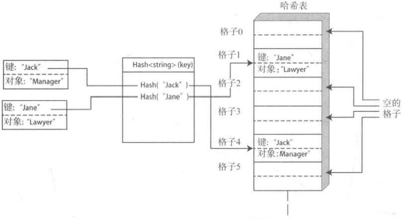

# 第四章 map容器

[TOC]

## 4.1map容器介绍

* `map<K, T>`容器保存的是`pair<const K, T>`类型的元素。
* `multimap<K, T>`容器和`map<K, T>`容器类似，允许使用重复的键。
* `unordered_map<K, T>`中`pair<const K, T>`元素的顺序并不是直接由键值确定的，而是由键值的哈希值决定的。
* `unordered_multimap<K, T>`也可以通过键值生成的哈希值来确定对象的位置，但它允许有重复的键。


## 4.2map容器的用法


*map<K, T>容器的概念展示图*


*map容器的内部组织图*

### 4.2.1创建map容器

```c++
// 使用初始化列表初始化map
std::map<std::string, size_t> people{{"Ann", 25}, {"Bill", 46}, {"Jack", 32}, {"Jill", 32}};

// 创建pair对象来初始化map
std::map<std::string, size_t> people{ 
    std::make_pair("Ann", 25),
    std::make_pair("Bill", 46),
    std::make_pair("Jack", 32),
    std::make_pair("Jill", 32)
};

// 通过复制构造初始化map
std::map<std::string, size_t> personnel{people};

// 使用一段区间初始化map
std::map<std::string, size_t> personnel{++std::begin(people), std::end(people)};
```

### 4.2.2map元素的插入

```c++
// 插入单个元素
std::map<std::string, size_t> people{
    std::make_pair("Ann", 25),
    std::make_pair("Bill", 46),
    std::make_pair("Jack", 32),
    std::make_pair("Jill", 32)
};
auto ret_pr = peopel.insert(std::make_pair("Fred", 22));
std::cout << ret_pr.first->first << " " << ret_pr.first->second
    << " " << std::boolalpha << ret_pr.second << " \n";

// 将一段元素插入map
std::map<std::string, size_t> crowd{{"May", 55}, {"Pat", 66}, {"Al", 22}, {"Ben", 44}};
auto iter = std::begin(people);
std::advance(iter, 4);
crowd.insert(++std::begin(people), iter);

// 创建初始化列表，作为参数传递给insert函数
std::initializer_list<std::pair<const std::string, size_t> > init{
    {"Bert", 44}, {"Ellen", 99}};
crowd.insert(init);
```

完整示例：

```c++
// Name.h
#ifndef NAME_H
#define NAME_H
#include <string>
#include <ostream>
#include <istream>

class Name
{
private:
    std::string first {};
    std::string second {};
public:
    Name(const std::string& name1, const std::string& name2) : first (name1),second (name2) {}
    Name() = default;

    bool operator<(const Name& name) const
    {
        return second < name.second || (second == name.second && first < name.first);
    }
    friend std::istream& operator>>(std::istream& in, Name& name);
    friend std::ostream& operator<<(std::ostream& out, const Name& box);
};

inline std::istream& operator>>(std::istream& in, Name& name)
{
    in >> name.first >> name.second;
    return in;
}

inline std::ostream& operator<<(std::ostream& out, const Name& name)
{
    out << name.first + " " + name.second;
    return out;
}

#endif
```

```c++
// Ex4_01.cpp
#include <iostream>
#include <string>
#include <map>
#include <utility>
#include <cctype>
#include "Name.h"

using std::string;
using Entry = std::pair<const Name, size_t>;
using std::make_pair;
using std::map;

Entry get_entry()
{
    std::cout << "Enter first and second names followed by the age: ";
    Name name {};
    size_t age {};
    std::cin >> name >> age;
    return make_pair(name, age);
}

void list_entries(const map<Name, size_t>& people)
{
    for(auto& entry : people)
    {
        std::cout << std::left << entry.first << std::right << entry.second << std::endl;
    }
}

int main()
{
    map<Name, size_t> people { {{"Ann", "Dante"}, 25}, {{"Bill", "Hook"}, 46},
                               {{"Jim", "Jams"}, 32}, {{"Mark", "Time"}, 32} };
    std::cout << "\nThe initial contents of the map is:\n";
    list_entries(people);

    char answer {'Y'};
    std::cout << "\nEnter a Name and age entry.\n";
    while(std::toupper(answer) == 'Y')
    {
        Entry entry {get_entry()};
        auto pr = people.insert(entry);
        if(!pr.second)
        {
            std::cout << "Key \"" << pr.first->first << "\" already present. Do you want to update the age (Y or N)?";
            std::cin >> answer;
            if(std::toupper(answer) == 'Y')
                pr.first->second = entry.second;
        }
        std::cout << "Do you want to enter another entry(Y or N)? ";
        std::cin >> answer;
    }

    std::cout << "\nThe map now contains the following entries:\n";
    list_entries(people);
}
```

### 4.2.3在map中构造元素

```c++
// 使用emplace构造新元素以避免复制和移动操作
std::map<Name, size_t> people;
auto pr = people.emplace(Name{"Dan", "Druff"}, 77);

// 使用emplace_hint在指定位置构造新元素以避免复制和移动操作
std::map<Name, size_t> people;
auto pr = people.emplace(Name{"Dan", "Druff"}, 77);
auto iter = people.emplace_hint(pr.first, Name{"Cal", "Cutta"}, 62);

// 使用size函数来获取map中元素的数量
auto pr = people.emplace(Name{"Dan", "Druff"}, 77);
auto count = people.size();
auto iter = people.emplace_hint(pr.first, Name{"Cal", "Cutta"}, 62);
if (count < people.size())
    std::cout << "Success!\n";
```

### 4.2.4访问map中的元素

完整示例：

```c++
// Ex4_02.cpp
#include <iostream>
#include <iomanip>
#include <string>
#include <sstream>
#include <algorithm>
#include <map>
#include <cctype>

using std::string;

int main()
{
    std::cout << "Enter some text and enter * to end:\n";
    string text_in {};
    std::getline(std::cin, text_in, '*');

    std::replace_if(std::begin(text_in), std::end(text_in),
                        [](const char& ch){ return !isalpha(ch); }, ' ');
    std::istringstream text(text_in);
    std::istream_iterator<string> begin(text);
    std::istream_iterator<string> end;

    std::map<string, size_t> words;
    size_t max_len {};

    std::for_each(begin, end, [&max_len, &words](const string& word){
        words[word]++;
        max_len = std::max(max_len, word.length());
    });

    size_t per_line {4}, count {};
    for(const auto& w : words)
    {
        std::cout << std::left << std::setw(max_len + 1) << w.first 
            << std::setw(3) << std::right << w.second << " ";
        if(++count % per_line == 0) std::cout << std::endl;
    }
    std::cout << std::endl;
}
```

例，名人名称管理系统：

```c++
// Quotations.h
#ifndef QUOTATIONS_H
#define QUOTATIONS_H
#include <vector>
#include <string>
#include <exception>

class Quotations
{
private:
    std::vector<std::string> quotes;

public:
    Quotations& operator<<(const char* quote)
    {
        quotes.emplace_back(quote);
        return *this;
    }

    Quotations& operator<<(const std::string& quote)
    {
        quotes.push_back(quote);
        return *this;
    }

    Quotations& operator<<(std::string&& quote)
    {
        quotes.push_back(std::move(quote));
        return *this;
    }

    std::string& operator[](size_t index)
    {
        if (index < quotes.size())
            return quotes[index];
        else
            throw std::out_of_range{"Invalid index to quotations."};
    }

    size_t size() const { return quotes.size(); }

    std::vector<std::string>::iterator begin()
    {
        return std::begin(quotes);
    }

    std::vector<std::string>::const_iterator begin() const
    {
        return std::begin(quotes);
    }

    std::vector<std::string>::iterator end()
    {
        return std::end(quotes);
    }

    std::vector<std::string>::const_iterator end() const
    {
        return std::end(quotes);
    }
};

#endif
```

```c++
// Ex4_03.cpp
#include <iostream>
#include <cctype>
#include <map>
#include <string>
#include "Quotations.h"
#include "Name.h"

using std::string;

inline Name get_name()
{
    Name name{};
    std::cout << "Enter first name and second name:";
    std::cin >> std::ws >> name;
    return name;
}

inline string get_quote(const Name& name)
{
    std::cout << "Enter the quotation for " << name << ". Enter * to end:\n";
    string quote;
    std::getline(std::cin >> std::ws, quote, '*');
    return quote;
}

int main()
{
    std::map<Name, Quotations> Quotations;
    std::cout << "Enter 'A' to add a quote."
                 "\nEnter 'L' to list all quotes."
                 "\nEnter 'G' to get quote."
                 "\nEnter 'Q' to end.\n";
    Name name{};
    string quote{};
    char command{};

    while (command != 'Q')
    {
        std::cout << "\nEnter command: ";
        std::cin >> command;
        command = static_cast<char>(std::toupper(command));
        switch(command)
        {
        case 'Q':
            break;

        case 'A':
            name = get_name();
            quote = get_quote(name);
            Quotations[name] << quote;
            break;

        case 'G':
            name = get_name();
            const auto& quotes = quotations[name];
            size_t count = quotes.size();
            if (!count)
            {
                std::cout << "There are no quotes recorded for "
                          << name << std::endl;
                continue;
            }
            size_t index{};
            if (count > 1)
            {
                std::cout << "There are " << count << " quotes for " << name << ".\n"
                          << "Enter an index from 0 to " << count - 1 << ": ";
                std::cin >> index;
            }
            std::cout << quotations[name][index] << std::endl;
            break;

        case 'L':
            if (quotations.empty())
            {
                std::cout << "\nNo quotations recorded for anyone." << std::endl;
            }
            for (const auto& pr : Quotations)
            {
                std::count << '\n' << pr.first << std::endl;
                for (const auto& quote : pr.second)
                    std::cout << " " << quote << std::endl;
            }
            break;

        default:
            std::cout << " Command must be 'A', 'G', 'L', or 'Q'. Try again.\n";
            continue;
            break;
        }
    }
}
```

### 4.2.5删除元素

1. map的成员函数`erase()`可以移除键和参数匹配的元素，然后返回所移除元素的个数：

   ```c++
   std::map<std::string, size_t> people{{"Fred", 45}, {"Joan", 33}, {"Jill", 22}};
   std::string name{"Joan"};
   if (people.erase(name))
       std::cout << name << " was removed." << std::endl;
   else
       std::cout << name << " was not found." << std::endl;
   
   // 如果迭代器参数指向的是容器的最后一个元素，那么会返回结束迭代器
   auto iter = people.erase(std::begin(people));
   if (iter == std::end(people))
       std::cout << "The last element was removed." << std::endl;
   else
       std::cout << "The element preceding " << iter->first << " was removed." << std::endl;
   ```


## 4.3pair<>和tuple<>的用法

### 4.3.1pair的操作

1. 创建pair对象

   ```c++
   // 4种不同的方式创建一个pair对象
   std::string s1{"test"}, s{"that"};
   std::pair<std::string, std::string> my_pair{s1, s2}; // 构造参数
   std::pair<std::string, std::string> your_pair{std::string{"test"},  std::string{"that"}}; // 移动参数
   std::pair<std::string, std::string> his_pair{"test", std::string{"that"}}; // 隐式转换
   std::pair<std::string, std::string> her_pair{"test", "that"}; // 将两个参数隐式转换为string，并移动到pair的first和second
   
   // 使用make_pair函数创建pair对象
   auto my_pair = std::make_pair(s1, s2);
   auto your_pair = std::make_pair(std::string{"test"}, std::string{"that"});
   auto his_pair = std::make_pair<std::string, std::string>("test", std::string{"that"});
   auto her_pair = std::make_pair<std::string, std::string>("test", "that");
   ```

2. 复制和移动

   ```c++
   // 复制或移动构造成员变量
   std::pair<std::string, std::string> new_pair{my_pair};
   std::pair<std::string, std::string> old_pair{
       std::make_pair(std::string{"his"}, std::string{"hers"})};
   
   // 如果成员变量可以被复制和移动，pair对象就支持复制和移动赋值
   std::pair<std::string, std::string> old_pair;
   std::pair<std::string, std::string> new_pair{
       std::string{"his"},
       std::string("hers")};
   old_pair = new_pair;
   new_pair = pair<std::stringk, std::string>{
       std::string{"these"}, std::string{"those"}};
   
   // 只要作为右操作数的pair对象的成员变量可以隐式转换为左操作数的pair对象的成员变量的类型，那么可以将一个pair对象赋值给另一个pair对象
   auto pr1 = std::make_pair("these", "those");
   std::pair<std::string, std::string> pr2;
   pr2 = pr1;
   ```
   
3. 相等判断

   ```c++
   // 在左右操作数的成员相等的条件下，==运算符返回true
   std::pair<std::string, std::string> new_pair;
   new_pair.first = "his";
   new_pair.second = "hers";
   if (new_pair == std::pair<std::string, std::string>{"his", "hers"})
       std::cout << "Equality!\n";
   ```

### 4.3.2tuple的操作

1. 生成tuple操作

   ```c++
   // 使用make_tuple()生成tuple
   auto my_tuple = std::make_tuple(Name{"Peter", "Piper"}, 
                                   42, 
                                   std::string{"914 626 7890"});
   
   // 通过构造函数生成tuple
   std::tuple<std::string, size_t> my_t1;
   std::tuple<Name, std::string> my_t2{
       Name{"Andy", "Capp"},
       std::string{"Programmer"}};
   std::tuple<Name, std::string> copy_my_t2{my_t2};
   std::tuple<std::string, std::string> my_t3{"this", "that"};
   
   // 使用tuple构造tuple对象
   auto the_pair = std::make_pair("three", "those");
   std::tuple<std::string, std::string> my_t4{the_pair};
   std::tuple<std::string, std::string> my_t5{std::pair<std::string, std::string> {"this", "that"}};
   ```

2. 比较和交换参数

   ```c++
   std::cout << std::boolalpha << (my_t4 < my_t5) << std::endl; // tuple按照字典顺序比较
   
   my_t4.swap(my_t5); // 交换元素
   
   // 使用std::tie来进行比较
   bool Name::operator<(const Name& name) const
   {
       return std::tie(second, first) < std::tie(name.second, name.first);
   }
   ```

3. 获取/访问元素

   ```c++
   // 通过std::get<n>()获取元素
   auto my_tuple = std::make_tuple(Name{"Peter", "Piper"}, 
                                   42, 
                                   std::string{"914 626.7890"});
   std::cout << std::get<0>(my_tuple) // 返回第1个元素引用
             << " age = " << std::get<1>(my_tuple)
             << " tel: " << std::get<2>(my_tuple) << std::endl;
   
   // 通过std::tie<>()访问元素
   auto my_tuple = std::make_tuple(Name{"Peter", "Piper"}, 
                                   42, 
                                   std::string{"914 626 7890"});
   Name name{};
   size_t age{};
   std::string phone{};
   std::tie(name, age, phone) = my_tuple;
   ```

### 4.4.3tuples和pairs实战

完整示例：

```c++
// Ex4_04.cpp
#include <iostream>
#include <iomanip>
#include <string>
#include <cctype>
#include <map>
#include <vector>
#include <tuple>
#include <algorithm>

using std::string;
using Name = std::pair<string, string>;
using DOB = std::tuple<size_t, size_t, size_t>;
using Details = std::tuple<DOB, size_t, string>;

using Element_type = std::map<Name, Details>::value_type;
using People = std::map<Name, Details>;

void list_DOB_Job(const People& people)
{
    DOB dob;
    string occupation {};
    std::cout << '\n';
    for(auto iter = std::begin(people); iter != std::end(people); ++iter)
    {
        std::tie(dob, std::ignore, occupation) = iter->second;
        std::cout << std::setw(20) << std::left << (iter->first.first + " " + iter->first.second)
                  << "DOB: " << std::right << std::setw(2) << std::setfill('0') << std::get<1>(dob)
                  << "-" << std::setw(4) << std::get<2>(dob) << std::setfill(' ')
                  << " Occupation: " << occupation << std::endl;
    }
}

template<typename Compare>
void list_sorted_people(const People& people, Compare comp)
{
    std::vector<Element_type*> folks;
    for(const auto& pr : people)
        folks.push_back(&pr)
    
    auto ptr_comp = 
    [&comp](const Element_type* pr1, const Element_type* pr2)->bool{return comp(*pr1, *pr2);};

    std::sort(std::begin(folks), std::end(folks), ptr_comp);
    DOB dob {};
    size_t height {};
    string occupation {};
    std::cout << '\n';

    for(const auto& p : folks)
    {
        std::tie(dob, height, occupation) = p->second;
        std::cout << std::setw(20) << std::left << (p->first.first + " " + p->first.second)
                  << "DOB: " << std::right << std::setw(2) << std::get<0>(dob) << "-"
                  << std::setw(2) << std::setfill('0') << std::get<1>(dob) << "-"
                  << " Height: " << height << " Occupation: " << occupation << std::endl;
    }
}

void get_people(People& people)
{
    string first {}, second {};
    size_t month {}, day {}, year {};
    size_t height {};
    string occupation {};
    char answer ('Y');

    while(std::toupper(answer) == 'Y')
    {
        std::cout << "Enter a first name and a second name: ";
        std::cin >> std::ws >> first >> second;

        std::cout << "Enter date of birth as month day year (integers): ";
        std::cin >> month >> day >> year;
        DOB dob {month, day, year};

        std::cout << "Enter height in inches: ";
        std::cin >> height;

        std::cout << "Enter occupation: ";
        std::getline(std::cin >> std::ws, occupation, '\n');
        people.emplace(
            std::make_pair(Name {first, second}, std::make_tuple(dob, height, occupation))
        );

        std::cout << "Do you want to enter another(Y or N): ";
        std::cin >> answer;
    }
}

int main()
{
    std::map<Name, Details> people;
    get_people(people);

    std::cout << "\nThe DOB & jobs are: \n";
    list_DOB_Job(people);

    auto comp = [](const Element_type& pr1, const Element_type& pr2)
    {
        return std::get<1>(pr1.second) < std::get<1>(pr2.second);
    };

    std::cout << "\nThe people in height order are: \n";
    list_sorted_people(people, comp);
}
```


## 4.4multimap容器的用法

multimap保存的是有序的键值对，但它可以保存重复的元素。

1. 插入/置入元素

   ```c++
   // 使用insert插入
   std::multimap<string, string> pets;
   auto iter = pets.insert(std::pair<string, string>{
       string{"dog"}, string{"Fang"}});
   iter = pets.insert(iter, std::make_pair("dog", "Spot"));
   pets.insert(std::make_pair("dog", "Rover"));
   pets.insert(std::make_pair("cat", "Korky"));
   pets.insert({{"rat", "Rolad"}, {"Pig", "Pinky"}, {"pig", "Perky"}});
   
   // 使用emplace_xx置入元素
   auto iter = pets.emplace("rabbit", "Flopsy");
   iter = pets.emplace_hint(iter, "rabbit", "Mopsy");
   ```

2. 索引

   multimap不支持下标运算，因为键并不能确定一个唯一元素：

   ```c++
   // 使用find返回一个键和参数匹配的元素的迭代器
   std::multimap<std::string, size_t> people{
       {"Ann", 25}, {"Bill", 46}, {"Jack", 77}, {"Jack", 32},
       {"Jill", 32}, {"Ann", 35}};
   std::string name{"Bill"};
   auto iter = people.find(name);
   if (iter != std::end(people)) 
       std::cout << name << " is " << iter->second << std::endl;
   iter = people.fin("Ann");
   if (iter != std::end(people))
       std::cout << iter->first << " is " << iter->second << std::endl;
   ```

3. 等值判断

   ```c++
   // 使用equal_range访问给定键对应的所有元素
   auto pr = people.equal_range("Ann");
   if (pr.first != std::end(people))
   {
       for (auto iter = pr.first; iter != pr.second; ++iter)
           std::cout << iter->first << " is " << iter->second << std::endl;
   }
   
   // 使用lower_bound返回>=指定键的元素
   auto iter1 = people.lower_bound("Ann");
   auto iter2 = people.lower_bound("Ann");
   if (iter1 != std::end(people))
   {
       for (auto iter = iter1; iter != iter2; ++iter)
           std::cout << iter->first << " is " << iter->second << std::endl;
   }
   ```

完整示例：

```c+
// Ex4_05.cpp
#include <iostream>
#include <string>
#include <map>
#include <cctype>

using std::string;
using Pet_type = string;
using Pet_name = string;

int main()
{
    std::multimap<Pet_type, Pet_name> pets;
    Pet_type type {};
    Pet_name name {};
    char more {'Y'};
    while(std::toupper(more) == 'Y')
    {
        std::cout << "Enter the type of your pet and its name: ";
        std::cin >> std::ws >> type >> name;
        auto iter = pets.lower_bound(type);
        if(iter != std::end(pets))
            pets.emplace_hint(iter, type, name);
        else
            pets.emplace(type, name);

        std::cout << "Do you want to enter another(Y or N)? ";
        std::cin >> more;
    }
    
    std::cout << "\nPet list by type:\n";
    auto iter = std::begin(pets);
    while(iter != std::end(pets))
    {
        auto pr = pets.equal_range(iter->first);
        std::cout << "\nPets of type " << iter->first << " are:\n";
        for(auto p = pr.first; p != pr.second; ++p)
        std::cout << " " << p->second;
        std::cout << std::endl;
        iter = pr.second;
    }
}
```


## 4.5改变比较函数

**注意：map容器的比较函数在相等时不能返回true**

### 4.5.1greater<T>对象的用法

```c++
std::map<Name, size_t, std::greater<Name> > people{
    {Name{"Al", "Bedo"}, 53},
    {Name{"Woody", "Leave"}, 33},
    {Name{"Noah", "Lot"}, 43}
};
```

### 4.5.2用自定义的函数对象来比较元素

```c++
class Key_compare
{
public:
    bool operator()(const std::unique_ptr<string>& p1, const std::unique_ptr<string>& p2) const
    {
        return *p1 < *p2;
    }
};

std::map<std::unique_ptr<string>, std::string, Key_compare> phonebook;

// 使用emplace向容器中添加元素
phonebook.emplace(std::make_unique<string>("Fred"), "914 626 7890");

// 使用insert向容器中插入元素
phonebook.emplace(std::make_pair(std::make_unique<string>("Lily"), "212 896 4337"));

// 使用for列出元素
for (const auto& p : phonebook)
    std::cout << *p.first << " " << p.second << std::endl;

// 使用迭代器列出元素
for (auto iter = std::begin(phonebook); iter != std::end(phonebook); ++iter)
    std::cout << *iter->first << " " << iter->second << std::endl;
```


## 4.6哈希

hash<K>模板专用的算法取决于实现，如果它们遵守C++14标准，需要满足以下要求：

- 它们不能抛出异常；
- 它们对于相等的键必须产生相等的哈希值；
- 对于不相等的键产生碰撞的可能性必须最小接近size_t最大值的倒数。

例，使用hash<K>生成整数的哈希值：

```c++
std::hash<int> hash_int;
std::vector<int> n{-5, -2, 2, 5, 10};
std::transform(std::begin(n), std::end(n), 
               std::ostream_iterator<size_t>(std::cout, " "), hash_int);
```


## 4.7unordered_map容器的用法



*unordered_map中的数据*

### 4.7.1生成和管理unordered_map容器

```c++
std::unordered_map<std::string, size_t> people{{"Jan", 44}, {"Jim", 33}, {"Joe", 99}}; // 定义和初始化unordered_map

std::unordered_map<std::string, size_t> people{{{"Jan", 44}, {"Jim", 33}, {"Joe", 99}}, 10}; // 定义和初始化unordered_map，并指定应该分配的格子的个数

// 使用一段区间来生成容器
std::vector<std::pair<string, size_t> > folks{
    {"Jan", 44}, {"Jim", 33}, {"Joe", 99}, {"Dan", 22},
    {"Ann", 55}, {"Don", 77}};
std::unordered_map<string, size_t> neighbors{std::begin(folks), std::end(folks), 500};

// 自定义函数对象作为unordered_map的比较函数
class Hash_Name
{
public:
    size_t operator()(const Name& name) const { return name.hash(); }
};
std::unordered_map<Name, size_t, Hash_Name> people{
    {{"Ann", "Ounce"}, 25}, 
    {{"Bill", "Bao"}, 46}, 
    {{"Jack", "Sprat"}, 77}},
    500,
    Hash_Name()};
```

### 4.7.2调整格子个数

```c++
// 调用rehash改变格子个数
people.rehash(15);
people.rehash((5 * people.bucket_count()) / 4); // bucket_cout返回格子个数

// 增加最大载入因子
people.max_load_factor(1.2 * people.max_load_factor()); // 增加20%

// 返回当前载入因子
float lf = people.load_factor(); // load_factor返回的是浮点数

// 设置格子个数，使他们在容纳给定个数的元素的同时将负载因子维持在最大数之内
size_t max_element_count{100};
people.reserve(max_element_count);
```

### 4.7.3插入元素

```c++
// 插入pair
std::unorder_map<std::string, size_t> people{{"Jim", 33}, {"Joe", 99}};
std::cout << "people container has " << people.bucket_count()
          << " buckets.\n";
auto pr = people.insert(std::pair<string, size_t>{"Jan", 44});
std::cout << "Element " << (pr.second ? "was" : "was not") 
          << " inserted." << std::endl;

// 插入初始化列表
people.insert({{"Bill", 21}, {"Ben", 22}});

// 插入区段
std::unordered_map<std::string, size_t> folks;
folk.insert(std::begin(people), std::end(people));

// 通过emplace_xx置入元素
auto pr = people.emplace("Sue", 64); // 返回pair<iterator, bool>
auto iter = people.emplace_hint(pr.first, "Sid", 67); // 返回迭代器
people.emplace_hint(iter, std::make_pair("Sam", 59));
```

### 4.7.4访问元素

```c++
// 使用下标运算符访问元素
people["Jim"] = 22;
people["May"] = people["Jim"];
++people["Joe"];
people["Kit"] = people["Joe"];
```

### 4.7.5 移除元素

```c++
// 使用erase函数移除元素
auto n = people.erase("Jim");
auto iter = people.find("May");
if (iter != people.end())
    iter = people.erase(iter);

// 移除指定的一个元素序列
auto iter = people.erase(++std::begin(people), --std::end(people));
```

### 4.7.6访问格子

```c++
// 通过将索引值传给容器的成员函数begin()来获取给定位置的格子中第1个元素的迭代器
auto iter = people.begin(1);
```

完整示例：

```c++
// Ex4_06.cpp
#include <iostream>
#include <iomanip>
#include <string>
#include <unordered_map>
#include <vector>
#include <algorithm>

using std::string;
using std::unordered_map;

void list_bucket_counts(const std::vector<size_t>& counts)
{
    for(size_t i {}; i < counts.size(); ++i)
    {
        std::cout << "bucket[" << std::setw(2) << i << "] =" << counts[i] << " ";
        if((i + 1) % 6 == 0) std::cout << '\n';
    }
    std::cout << std::endl;
}

int main()
{
    unordered_map<string, size_t> people;
    float mlf {people.max_load_factor()};
    size_t n_buckets {people.bucket_count()};
    std::vector<size_t> bucket_counts (n_buckets);

    string name {"Name"};
    size_t value {};
    size_t max_count {8192};
    auto lf = people.load_factor();
    bool rehash {false};
    while(mlf < 1.5f)
    {
        std::cout << "\n\n***********************New Container*********************"
                  << "\nNumber of buckets: " << n_buckets
                  << " Maximum load factor: " << mlf << std::endl;
        
        for(size_t n_elements {}; n_elements < max_count; ++n_elements)
        {
            lf = people.load_factor();
            people.emplace("name" + std::to_string(++value), value);
            auto new_count = people.bucket_count();
            if(new_count > n_buckets)
            {
                std::cout << "\nBucket count increased to " << new_count
                          << ". Load factor was " << lf << " and is now "
                          << people.load_factor()
                          << "\nMaximum elements in a bucket was "
                          << *std::max_element(std::begin(bucket_counts), std::end(bucket_counts))
                          << std::endl;
                if(n_buckets <= 64)
                {
                    std::cout << "Bucket counts before increase were: " << std::endl;
                    list_bucket_counts(bucket_counts);
                }

                n_buckets = new_count;
                bucket_counts = std::vector<size_t>(n_buckets);
                rehash = true;
            }

            for(size_t i {}; i < n_buckets; ++i)
                bucket_counts[i] = people.bucket_size(i);

            if(rehash)
            {
                rehash = false;
                std::cout << "\nRehashed container. Bucket count is " << n_buckets
                          << ". Element count is " << people.size()
                          << "\nMaximum element count in a bucket is now "
                          << *std::max_element(std::begin(bucket_counts), std::end(bucket_counts))
                          << std::endl;
                if(n_buckets <= 64)
                {
                    std::cout << "\nBucket counts after rehash are:\n";
                    list_bucket_counts(bucket_counts);
                }
            }
        }

        std::cout << "Final state for this container is:\n"
                  << "Bucket count: " << people.bucket_count()
                  << " Element count: " << people.size()
                  << " Maximum element count in a bucket: "
                  << *std::max_element(std::begin(bucket_counts), std::end(bucket_counts))
                  << std::endl;

        value = 1;
        people = unordered_map<string, size_t>();
        n_buckets = people.bucket_count();
        bucket_counts = std::vector<size_t>(n_buckets);

        mlf += 0.25f;
        people.max_load_factor(mlf);
    }
}
```

 

## 4.8 unordered_multimap容器的用法

unordered_multimap是一个允许有重复键的无序map。

1. 创建/初始化unordered_multimap

   ```c++
   // 初始化列表的方式生成unordered_multimap
   std::unordered_multimap<std::string, size_t> people{{"Jim", 33}, {"Joe", 99}};
   ```

2. 插入元素

   ```c++
   auto iter = people.emplace("Jan", 45);
   people.insert({"Jan", 44});
   people.emplace_hint(iter, "Jan", 46);
   ```

3. 访问元素

   因为潜在的重复键，所以at()与operator[]都无效，只能用find()和equal_range()来访问元素。

   ```c++
   std::string key{"Jan"};
   auto n = people.count(key);
   if (n == 1)
       std::cout << key << " is " << people.find(key)->second << std::endl;
   else if (n > 1)
   {
       
   }
   ```

   

