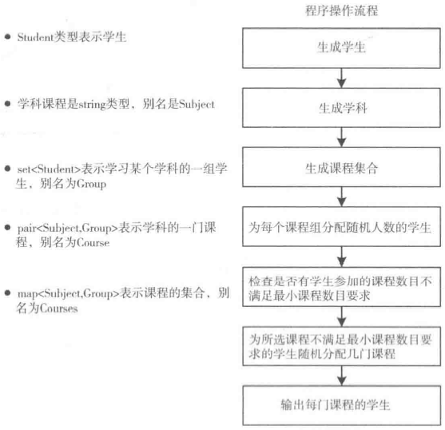

# 第五章 set的使用

[TOC]


## 5.1理解set容器

定义set容器的模板如下：

* set<T>容器保存T类型的对象，而且保存的对象是唯一的。
* multiset<T>容器和set<T>容器保存T类型对象的方式相同，但它可以保存重复的对象。
* unordered_set<T>容器保存T类型的对象，而且对象是唯一的。
* unordered_multiset<T>容器保存T类型对象的方式和unordered_set<T>相同，但它可以保存重复对象。


## 5.2使用set<T>容器

1. 初始化set容器

   ```c++
   // 使用初始化列表初始化set容器
   std::set<int> numbers{8, 7, 6, 5, 4, 3, 2, 1};
   
   // 用元素创建set容器，并指定比较函数
   std::set<string> words2{std::begin(words), std::end(words)};
   std::set<string, std::greater<string> > words3{
       ++std::begin(words2), std::end(words2)}; // 降序排序
   ```
   
2. 使用copy算法将一段元素复制到指定位置

   ```c++
   std::copy(std::begin(numbers), std::end(numbers),
             std::ostream_iterator<int>(std::cout, " "));
   ```

   

   *用`less<int>`排序的整数平衡二叉树*

3. 为元素提供自定义比较函数

   ```c++
   std::set<std::string, std::greater<string> > words{
       "one", "two", "three", "four", "five", "six", "seven", "eight"}; // 降序排序
   ```

   

   *用`greate<string>`排序的字符串的平衡二叉树*

### 5.2.1添加和移除元素

```c++
// 使用insert添加元素
std::set<string, std::greater<string> > words{"one", "two", "three"};
auto pr1 = words.insert("four"); // pr1.first指向新元素，pr1.second = true
auto pr2 = words.insert("two");  // pr2.first指向已经存在的元素，pr2.second = false
auto iter3 = words.insert(pr.first, "seven");
words.insert({"five", "six"});
// 插入一段元素
string words[]{"eight", "nine", "ten"};
words.insert(std::begin(words), std:end(words));

// 使用emplace_xx置入新元素
std::set<std::pair<string, string> > names;
auto pr = names.emplace("Lisa", "Carr"); // 返回pair<iterator, bool>
auto iter = names.emplace_hint(pr.first, "Joe", "King"); // 返回迭代器

// 使用clear删除set的所有元素
std::set<int> numbers{2, 4, 6, 8, 10, 12, 14};
numbers.clear();

// 使用erase删除一个元素
std::set<int> numbers{2, 4, 6, 8, 10, 12, 14};
auto iter = numbers.erase(++std::begin(numbers));
auto n = numbers.erase(12); // 删除12，返回1
n = numbers.erase(13); // 13不存在，返回0

// 使用erase删除一段元素
std::set<int> numbers{2, 4, 6, 8, 10, 12, 14};
auto iter1 = std::begin(numbers);
advance(iter1, 5);
auto iter = numbers.erase(++std::begin(numbers), iter1); // 删除 4, 6, 8, 10
```

### 5.2.2访问元素

```c++
std::set<string> words{"one", "two", "three", "four", "five"};
auto iter = words.find("one");
iter = words.find(string("two"));
iter = words.find("six"); // six不存在，指针指向std::end(words)
```

### 5.2.3使用set



*用set容器表示课程表*

```c++
// Ex5_01.cpp
#include <string>
#include <ostream>
#include <iostream>
#include <string>
#include <set>
#include <algorithm>
#include <iterator>
#include <map>
#include <vector>
#include <random>

using std::string;
using Distribution = std::uniform_int_distribution<size_t>;
using Subject = string;
using Subjects = std::vector<Subject>;
using Group = std::set<Student>;
using Students = std::vector<Student>;
using Course = std::pair<Subject, Group>;
using Courses = std::map<Subject, Group>;

static std::default_random_engine gen_value;

class Student
{
private:
    std::string first {};
    std::string second {};

public:
    Student(const std::string& name1, const std::string& name2) : first(name1), second(name2) {}
    Student(Student&& student) : first(std::move(student.first)),
                                 second(std::move(student.second)) {}
    Student(const Student& student) : 
            first(student.first), second(student.second) {}
    Student() {}

    bool operator<(const Student& student) const 
    {
        return second < student.second || (second == student.second && first < student.first);
    }

    friend std::ostream& operator<<(std::ostream& out, const Student& student);
};

Students create_students()
{
    Students students;
    string first_names[] {"Ann", "Jim", "Eve", "Dan", "Ted"};
    string second_names[] {"Smith", "Jones", "Howe", "Watt", "Beck"};

    for(const auto& first : first_names)
    {
        for(const auto& second : second_names)
        {
            students.emplace_back(first, second);
        }
    }
    return students;
}

inline std::ostream& operator<<(std::ostream& out, const Student& student)
{
    out << student.first + " " + student.second;
    return out;
}

class List_Course
{
public:
    void operator()(const Course& course)
    {
        std::cout << "\n\n" << course.first << " " << course.second.size()
                  << " student:\n";
        std::copy( std::begin(course.second), std::end(course.second),
                   std::ostream_iterator<Student>(std::cout, " ") );
    }
};

int main()
{
    Students students = create_students();
    Subjects subjects {"Biology", "Physics", "Chemistry", "Mathematics", 
                    "Astronomy", "Drama", "Politics", "Philosophy", "Economics"};
    Courses courses;
    size_t min_subjects {4};
    size_t min_group {min_subjects};

    size_t max_group {(students.size()*min_subjects)/subjects.size()};

    Distribution group_size {min_group, max_group};
    Distribution choose_student {0, students.size() - 1};
    for(const auto& student : students)
    {
        size_t course_count = std::count_if(std::begin(courses),
            std::end(courses), [&student](const Course& course){return course.second.count(student);});
        if(course_count >= min_subjects) 
            continue;
        size_t additional {min_subjects - course_count};
        if(!course_count)
            std::cout << student << " is work-shy, having signed up for NO Subjects!\n";
        else
            std::cout << student << " is only signed up for " << course_count << " Subjects!\n";

        std::cout << "Registering " << student << " for " << additional << " more course" << (additional > 1 ? "s" : "") << ".\n\n";

        while(course_count < min_subjects)
            if((courses.find(subjects[choose_course(gen_value)])->second.insert(student)).second)
                ++course_count;
    }
    std::for_each(std::begin(courses), std::end(course), List_Course());
    std::cout << std::endl;
}
```

### 5.2.4set迭代器

set<T>容器的成员返回的迭代器都是双向迭代器。

### 5.2.5在set容器中保存指针


*两个shared指针指向同一个对象的不同对象*


## 5.3 使用multiset<T>容器

multiset与set容器中成员函数不同点：

- `insert()`总是可以成功执行；当插入单个元素时，返回的迭代器指向插入的元素；当插入一段元素时，返回的迭代器指向插入的最后一个元素。
- `emplate()`和`emplace_hint()`总是成功，它们都指向创建的新元素。
- `find()`会返回和参数匹配的第一个元素的迭代器，如果都不匹配，则返回容器的结束迭代器。
- `equal_range()`返回一个包含迭代器的pair对象，它定义了一个和参数匹配的元素段；
- `lower_bound()`返回和参数匹配的第一个元素的迭代器，如果没有匹配的元素，会返回容器的结束迭代器；
- `upper_bound()`返回的迭代器和`equal_range()`返回的pair的第二个成员相同；
- `count()`返回和参数匹配的元素的个数。

完整示例：

```c++
// Ex5_04.cpp
#include <iostream>
#include <iomanip>
#include <string>
#include <sstream>
#include <algorithm>
#include <set>
#include <iterator>
#include <cctype>

using std::string;

int main()
{
    std::cout << "Enter some text and enter * to end:\n";
    string text_in {};
    std::getline(std::cin, text_in, '*');

    std::replace_if(std::begin(text_in), std::end(text_in), [](const char& ch){return !isalpha(ch);}, ' ');
    std::istringstream text(text_in);
    std::istream_iterator<string> begin(text);
    std::istream_iterator<string> end;

    std::multiset<string> words;
    size_t max_len {};

    std::for_each(begin, end, [&max_len, &words](const string& word){
        words.emplace(word);
        max_len = std::max(max_len, word.length());
    });
    size_t per_line {4}, count {};

    for(auto iter = std::begin(words); iter != std::end(words); iter = words.upper_bound(*iter))
    {
        std::cout << std::left << std::setw(max_len + 1) << *iter << std::setw(3) << std::right << words.count(*iter) << " ";
        if(++count % per_line == 0) std::cout << std::endl;
    }
    std::cout << std::endl;
}
```

### 5.3.1保存派生类对象的指针

```c++
using std::string;

class Pet
{
protected:
    string name{};
   
public:
    virtual ~Pet(){}
    const string& get_name() const {return name;}
    {
        auto result = std::strcmp(typeid(*this).name(), typeid(pet).name());
        return (result < 0) || ((result == 0) && (name < pet.name));
    }
    friend std::ostream& operator<<(std::ostream& out, const Pet& pet);
};

inline std::ostream& operator<<(std::ostream& out, const Pet& pet)
{
    return out << "A " << string{typeid(pet).name()}.erase(0, 6) 
               << " called " << pet.name;
}

class Dog : public Pet
{
public:
    Dog() = default;
    Dog(const string& dog_name)
    {
        name = dog_name;
    }
};
```

### 5.3.2定义容器

```c++
using Pet_ptr = std::shared_ptr<Pet>;
using Pets = std::multiset<Pet_ptr>;

inline bool operator<(const Pet_ptr& p1, const Pet_ptr& p2)
{
    return *p1 < *p2;
}
```

### 5.3.3定义示例的main()函数

```c++
// Ex5_05.cpp
#include <iostream>
#include <string>
#include <alogrithm>
#include <iterator>
#include <map>
#include <set>
#include <memory>
#include <cctype>
#include "Pet_Classes.h"

using std::string;
using Name = string;
using Pet_ptr = std::shread_ptr<Pet>;
using Pets = std::multiset<Pet_ptr>;

int main()
{
    std::map<Name, Pets> peoples_pets;
    char answer{'Y'};
    string name{};
    std::cout << "You'll enter a person's name followed by their pets. \n"
              << "Pets can be identified by C for cat, D for dog, or M for mouse.\n"
              << "Enter the character to identify each pet type followed by the pet's name.\n"
              << "Enter Q to end pet input for a person.\n";
    while (std::toupper(answer) == 'Y')
    {
        std::cout << "Enter a name: ";
        std::cin >> name;
        peoples_pets.emplace(name, get_pets(names));
        std::cout << "Another person(Y or N)?";
        std::cin >> answer;
    }
    
    std::cout << "\nThe people and their pets are:\n";
    for (const auto & pr : peoples_pets)
        
}
```


   