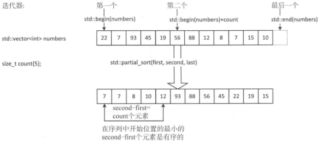
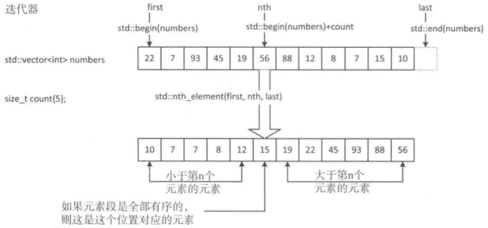
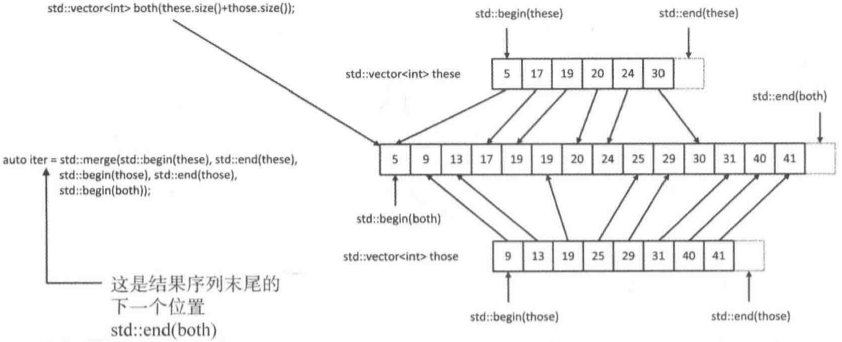
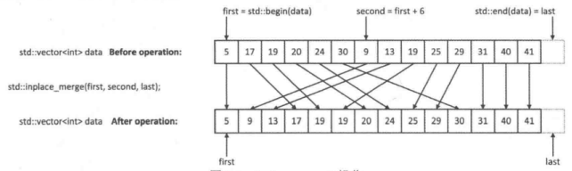
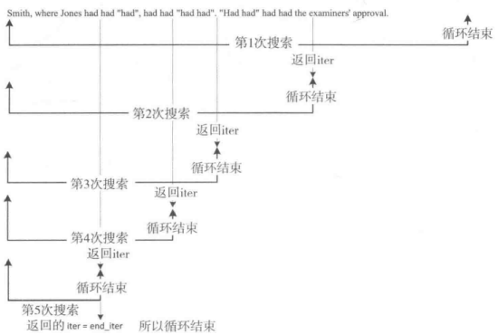

# 第六章 排序，合并，搜索和分区

[TOC]


## 6.1序列排序

```c++
// 使用sort对容器内所有元素排序（默认升序）
std::vector<int> numbers{99, 77, 33, 66, 22, 11, 44, 88};
std::sort(std::begin(numbers), std::end(numbers));
std::copy(std::begin(numbers), std::end(numbers), 
          std::ostream_iterator<int>{std::cout, " "}); // 输出 11 22 33 44 66 77 88 99

// 使用sort对容器内指定区间的元素排序（默认升序）
std::vector<int> numbers{99, 77, 33, 66, 22, 11, 44, 88};
std::sort(++std::begin(numbers), --std::end(numbers)); 
std::copy(std::begin(numbers), std::end(numbers), 
          std::ostream_iterator<int>{std::cout, " "}); // 输出 99 11 22 33 44 66 77 88

// 使用sort对容器内所有元素进行降序排序
std::vector<int> numbers{99, 77, 33, 66, 22, 11, 44, 88};
std::sort(std::begin(numbers), std::end(numbers), std::greater<>());
std::copy(std::begin(numbers), std::end(numbers), 
          std::ostream_iterator<int>{std::cout, " "}); // 输出 99 88 77 66 44 33 22 11

// 使用lambda对容器内所有元素按自定义规则排序
std::deque<string> words{"one", "two", "nine", "nine", "one", "three", "four", "five", "six"};
std::sort(std::begin(words), std::end(words),
          [](const string& s1, const string& s2){ return s1.back() > s2.back(); });
std::copy(std::begin(words), std::end(words), 
          std::ostream_iterator<string>{std::cout, " "}); // 输出 six four two one nine nine one three five
```

```c++
// Name.h
#ifndef NAME_H
#define NAME_H
#include <string>
class Name
{
private:
    std::string first{};
    std::string second{};
    
public:
    Name(const std::string& name1, const std::string& name2) : first(name1), second(name2) {}
    Name() = default;
    std::string get_first() const { return first; }
    std::string get_second() const { return second; }
    
    friend std::istream& operator>>(std::istream& in, Name& name);
    friend std::ostream& operator<<(std::ostream& out, const Name& name);
};

inline std::istream& operator>>(std::istream& in, Name& name)
{
    return in >> name.first >> name.second;
}

inline std::ostream& operator<<(std::ostream& out, const Name& name)
{
    return out << name.first << " " << name.second;
}
#endif
```

```c++
// Ex6_01.cpp
#include <iostream>
#include <string>
#include <vector>
#include <iterator>
#include <algorithm>
#include "Name.h"

int main()
{
    std::vector<Name> names;
    std::cout << "Enter names as first name followed by second name.Enter Ctrl+Z to end:";
    std::copy(std::istream_iterator<Name>(std::cin), std::istream_iterator<Name>(), 
              std::back_insert_iterator<std::vector<Name>>(names));
    
    std::cout << names.size() << " names read. Sorting in ascending sequence... \n";
    std::sort(std::begin(names), std::end(names), 
              [](const Name& name1, const Name& name2){
                  return name1.get_second() < name2.get_second();
              });
    
    std::cout << "\nThe names in ascending sequence are:\n";
    std::copy(std::begin(names), std::end(names),
              std::ostream_iterator<Name>(std::cout, "\n"));
}
```

### 6.1.1排序以及相等元素的顺序

```c++
// 使用stable_sort对一段元素进行排序并保证维持相等元素的原始顺序
std::stable_sort(std::begin(names), std::end(names),
    [](const Name& name1, const Name& name2) { return name1.get_second() < name2.get_second(); });
```

### 6.1.2部分排序

```c++
// 使用partial_sort进行部分排序
size_t count{5};
std::vector<int> numbers{22, 7, 93, 45, 19, 56, 88, 12, 8, 7, 15, 10};
std::partial_sort(std::begin(numbers), std::begin(numbers) + count, std::end(numbers));
```



*partial_sort()算法的操作*

```c++
// 使用partial_sort_copy进行部分排序，并复制到另一个容器中
std::vector<int> numbers{22, 7, 93, 45, 19, 56, 88, 12, 8, 7, 15, 10};
std::vector<int> result(5);
std::partial_sort_copy(std::begin(numbers), std::end(numbers),
                       std::begin(result), std::end(result));
std::copy(std::begin(result), std::end(result), 
          std::ostream_iterator<int>{std::cout, " "}); // 输出 7 7 8 10 12
```

```c++
// 使用nth_element进行排序
std::vector<int> numbers{22, 7, 93, 45, 19, 56, 88, 12, 8, 7, 15, 10};
std::nth_element(std::begin(numbers), std::begin(numbers) + 5, std::end(numbers));
std::copy(std::begin(numbers), std::end(numbers), 
          std::ostream_iterator<int>{std::cout, " "}); // 输出 7 7 8 10 12 15 19 22 45 56 88 93
```



*nth_element()算法的操作*

### 6.1.3测试排序序列

```c++
// 使用is_sorted判断容器是否排好了顺序
std::vector<int> numbers{22, 7, 93, 45, 19};
std::cout << "numbers is " << (std::is_sorted(std::begin(numbers), std::end(numbers)) ? "" : "not ")
          << "in ascending sequence.\n"; // 输出 numbers is not in ascending sequence.

// 使用is_sorted判断容器是否排好了顺序
std::vector<double> data{1.5, 2.5, 3.5, 4.5};
std::cout << "data is " << (std::is_sorted(std::begin(data), std::end(data)) ? "" : "not ")
          << "in ascending sequence.\n"; // 输出 data is in ascending sequence.

// 使用is_sorted和自定义的函数对象判断容器
std::vector<double> data{1.5, 2.5, 3.5, 4.5};
std::cout << "data is " 
          << (std::is_sorted(std::begin(data), std::end(data), std::greater<>()) ? "" : "not ")
          << "in ascending sequence.\n"; // 输出 data is not in ascending sequence.

// 使用is_sorted_until来判断一段元素是否有序，并返回一个指向这段元素中升序序列上边界元素的迭代器
std::vector<string> pets{"cat", "chicken", "dog", "pig", "llama", "coati", "goat"};
std::copy(std::begin(pets), std::is_sorted_until(std::begin(pets), std::end(pets)), 
          std::ostream_iterator<string>{std::cout, " "}); // 输出 cat chicken dog pig

// 使用is_sorted_until和自定义函数对象来判断一段元素是否有序，并返回一个指向这段元素中升序序列上边界元素的迭代器
std::vector<string> pets{"cat", "chicken", "dog", "pig", "llama", "coati", "goat"};
std::copy(std::begin(pets), 
          std::is_sorted_until(std::begin(pets), std::end(pets), std::greater<>()), 
          std::ostream_iterator<string>{std::cout, " "}); // 输出 cat
```


## 6.2合并序列



*合并两个vector容器中的元素*

```c++
// 使用merge合并两个已排序的容器
std::vector<int> these{2, 15, 4, 11, 6, 7};
std::vector<int> those{5, 2, 3, 2, 14, 11, 6};
std::vector<int> result(these.size() + those.size() + 10);
std::stable_sort(std::begin(these), std::end(these), std::greater<>()); // 排序these
std::stable_sort(std::begin(those), std::end(those), std::greater<>()); // 排序those
auto end_iter = std::merge(std::begin(these), std::end(these),
                           std::begin(those), std::end(those),
                           std::begin(result), std::greater<>());
std::copy(std::begin(result), end_iter, std::ostream_iterator<int>{std::cout, " "}); // 输出 15 14 11 11 7 6 6 5 4 3 2 2 2
```

`implace_merge()`算法可以合并同一个序列中两个连续有序的元素序列。



*inplace_merge()操作*

完整示例：

```c++
// Transaction.h
#ifndef TRANSACTION_H
#define TRANSACTION_H

#include <iostream>
#include <iomanip>
#include "Account.h"

class Transaction
{
private:
    size_t account_number{};
    double amount{};
    bool credit{true};

public:
    Transaction() = default;
    Transaction(size_t number, double amnt, bool cr) : 
        account_number{number}, amount{amnt}, credit{cr} {};
    size_t get_acc_number() const { return account_number; }

    bool operator<(const Transaction& transaction) const {
        return account_number < transaction.account_number;
    }
    bool operator>(const Transaction& transaction) const {
        return account_number > transaction.account_number;
    }
    friend std::ostream& operator<<(std::ostream& out, const Transaction& transaction);
    friend std::istream& operator>>(std::istream& in, Transaction& transaction);

    friend class Account;
};

std::ostream& operator<<(std::ostream& out, const Transaction& transaction)
{
    return out << std::right << std::setfill('0') << std::setw(5)
               << transaction.account_number
               << std::setfill('') << std::setw(8) << std::fixed << std::setprecision(2)
               << transaction.amount
               << (transaction.credit ? " CR" : " DR");
}

std::istream& operator>>(std::istream& in, Transaction& tr)
{
    if ((in >> std::skipws >> tr.account_number).eof())
        return in;
    return in >> tr.amount >> std::bcolalpha >> tr.credit;
}

#endif
```

```c++
// Account.h
#ifndef ACCOUNT_H
#define ACCOUNT_H
#include <iostream>
#include <iomanip>
#include <string>
#include <utility>
#include "Transaction.h"

using first_name = std::string;
using second_name = std::string;
using Name = std::pair<first_name, second_name>;

class Account
{
private:
    size_t account_number{};
    Name name{"", ""};
    double balance{};

public:
    Account() = default; // 获得默认构造函数
    Account(size_t number, const Name& nm) : account_number{number}, name{nm} {}

    double get_balance() const { return balance; }
    void set_balance(double bal) { balance = bal; }

    size_t get_acc_number() const { return account_number; }
    const Name& get_name() const { return name; }

    bool apply_transaction(const Transaction& transaction)
    {
        if (transaction.credit)
            balance += transaction.amount;
        else
            balance -= transaction.amount;
        return balance < 0.0;
    }

    bool operator<(const Account& acc) const { return account_number < acc.account_number; }
    friend std::ostream& operator<<(std::ostream& out, const Account& Account);
};

std::ostream& operator<<(std::ostream& out, const Account& acc)
{
    return out << std::left << std::setw(20) << acc.name.first + " " + acc.name.second
               << std::right << std::setfill('0') << std::setw(5) << acc.account_number
               << std::setfill(' ') << std::setw(8) << std::fixed << std::setprecision(2)
               << acc.balance;
}
#endif
```

```c++
// Compare_Names.h
#ifndef COMPARE_NAMES_H
#define COMPARE_NAMES_H

#include "Account.h"

class Compare_Names
{
public:
    bool operator()(const Account& acc1, const Account& acc2)
    {
        const auto& name1 = acc1.get_name();
        const auto& name2 = acc2.get_name();
        return (name1.second < name2.second) || 
            ((name1.second == name2.second) && (name1.first < name2.first));
    }
};

#endif
```

```c++
// Ex6_02.cpp
#include <iostream>
#include <string>
#include <algorithm>
#include <functional>
#include <vector>
#include <utility>
#include <map>
#include <iterator>
#include "Account.h"
#include "Transaction.h"
#include "Compare_Names.h"

using std::string;
using first_name = string;
using second_name = string;
using Name = std::pair<first_name, second_name>;
using Account_Number = size_t;

Name get_holder_name(Account_Number number)
{
    std::cout << "Enter the holder's first and second names for account number " << number << ": ";
    string first{};
    string second{};
    std::cin >> first >> second;
    return std::make_pair(first, second);
}

int main()
{
    std::vector<Transaction> transactions;
    std::cout << "Enter each transaction as:\n"
              << " 5 digit account number amount credit(true or false).\n"
              << "Enter Ctrl+Z to end.\n";

    std::copy(std::istream_iterator<Transaction>{std::cin}, 
              std::istream_iterator<Transaction>{},
              std::back_inserter(transactions));
    std::cin.clear();

    std::stable_sort(std::begin(transactions), std::end(transactions), std::greater<>());

    std::cout << "First set of transactions after sorting...\n";
    std::copy(std::begin(transactions), std::end(transactions), 
              std::ostream_iterator<Transaction>{std::cout, "\n"});

    std::cout << "\nEnter more transactions:\n";
    std::copy(std::istream_iterator<Transaction>{std::cin}, std::istream_iterator<Transaction>{},
              std::back_insert_iterator(transactions));
    std::cin.clear();

    std::cout << "\nSorted first set of transactions with second set appended...\n";
    std::copy(std::begin(transactions), std::end(transactions),
              std::ostream_iterator<Transaction>{std::cout, "\n"});

    auto iter = std::is_sorted_until(std::begin(transactions), std::end(transactions), std::greater<>());
    std::stable_sort(iter, std::end(transactions), std::greater<>());

    std::cout << "\nSorted first set of transactions with sorted second set appended...\n";
    std::copy(std::begin(transactions), std::end(transactions), 
              std::ostream_iterator<Transaction>{std::cout, "\n"});

    std::map<Account_Number, Account> accounts;
    for (const auto& tr : transactions)
    {
        Account_Number number = tr.get_acc_number();
        auto iter = accounts.find(number);
        if (iter == std::end(accounts))
            iter = accounts.emplace(number, Account{number, get_holder_name(number)}).first;
        
        if (iter->second.apply_transaction(tr))
        {
            auto name = iter->second.get_name();
            std::cout << "\nAccount number " << number
                      << " for " << name.first << " " << name.second << " is overdrawn!\n"
                      << "The concept is that you bank with us - not the other way round, so fix it!\n"
                      << std::endl;
        }
    }

    std::vector<Account> accs;
    for (const auto& pr : accounts)
        accs.push_back(pr.second);
    
    std::stable_sort(std::begin(accs), std::end(accs), Compare_Names());
    std::copy(std::begin(accs), std::end(accs), 
              std::ostream_iterator<Account>{std::cout, "\n"});
}
```


## 6.3搜索序列

### 6.3.1在序列中查找元素

有三种可以在输入迭代器所定义的范围内查找单个对象的算法：

- `find()`算法会在前两个参数指定的范围内查找和第三个参数相等的第一个对象；

  ```c++
  std::vector<int> numbers{5, 46, -5, -6, 23, 17, 5, 9, 6, 5};
  int value{23};
  auto iter = std::find(std::begin(numbers), std::end(numbers), value);
  if (iter != std::end(numbers))
      std::cout << value << " was found.\n";
  ```

- `find_if()`算法会在前两个参数指定的范围内查找可以使第三个参数指定的谓词返回true的第一个对象。谓词不能修改传给它的对象。

  ```c++
  std::vector<int> numbers{5, 46, -5, -6, 23, 17, 5, 9, 6, 5};
  int value{5};
  auto iter1 = std::find_if(std::begin(numbers), std::end(numbers),
                            [value](int n){ return n > values; });
  if (iter1 != std::end(numbers))
      std::cout << *iter1 << " was found greater than " << value << ".\n";
  ```

- `find_if_not()`算法会在前两个参数指定的范围内查找可以使第三个参数指定的谓词返回false的第一个对象。谓词不能修改传给它的对象。

  ```c++
  std::vector<int> numbers{5, 46, -5, -6, 23, 17, 5, 9, 6, 5};
  size_t count{};
  int five{5};
  auto start_iter = std::begin(numbers);
  auto end_iter = std::end(numbers);
  while ( (start_iter = std::find_if_not(start_iter, end_iter, [five](int n){return n > five; })) 
           != end_iter )
  {
      ++count;
      ++start_iter;
  }
  std::cout << count << " elements were found that are not greater than " << five << std::endl;
  ```

### 6.3.2在序列中查找任意范围的元素

```c++
// 在一个序列中搜索另一个序列的第一次出现的元素
string text{"The world of searching"};
string vowels{"aeiou"};
auto iter = std::find_first_of(std::begin(text), std::end(text), 
                               std::begin(vowels), std::end(vowels));
if (iter != std::end(text))
    std::cout << "We found '" << *iter << "'." << std::endl; // 输出 We found 'e'.
```

```c++
// 在一个序列中搜索另一个序列符合条件的第一次出现的元素
std::vector<long> numbers{64L, 46L, -65L, -128L, 121L, 17L, 35L, 9L, 91L, 5L};
int factors[]{7, 11, 13};
auto iter = std::find_first_of(std::begin(numbers), std::end(numbers), 
                               std::begin(factors), std::end(factors),
                               [](long v, long d){ rturn v % d == 0; });
if (iter != std::end(numbers))
    std::cout << *iter << " was found." << std::endl; // 输出 -65 was found.
```

### 6.3.3在序列中查找多个元素

1. `adjacent_find()`算法

   ```c++
   // 用adjacent_find搜索序列中两个连续相等的元素
   string saying {"Children should be seen and not heard."};
   auto iter = std::adjacent_find(std::begin(saying), std::end(saying));
   if (iter != std::end(saying))
       std::cout << "In the following text:\n\"" << saying << "\"\n'"
                 << *iter << "' is repeated starting at index position "
                 << std::distance(std::begin(saying), iter) << std::endl;
   ```

   输出结果如下：

   ```sh
   In the following text:
   "Children should be seen and not heard."
   'e' is repeated starting at index position 20
   ```

   ```c++
   // 用adjacent_find搜索序列中连续两个符合判断条件的元素
   std::vector<long> numbers{64L, 46L, -65L, -128L, 121L, 17L, 35L, 9L, 91L, 5L};
   auto iter = std::adjacent_find(std::begin(numbers), std::end(numbers), 
                                  [](long n1, long n2){ return n1 % 2 && n2 % 2; }); // 查找2个连续的奇数
   if (iter != std::end(numbers))
       std::cout << "The first pair of odd numbers is "
                 << *iter << " and " << *(iter + 1) << std::endl; // 输出 The first pair of odd numbers is 121 and 17
   ```

2. `find_end()`算法

   ```c++
   // 使用find_end搜索序列中最后一个和另一个序列匹配的项
   string text{"Smith, where Jones had had \"had\", had had \"had had\"."
               " \"Had had\" had had the examiners\' approval."};
   std::cout << text << std::endl;
   string phrase{"had had"};
   auto iter = std::find_end(std::begin(text), std::end(text),
                             std::begin(phrase), std::end(phrase));
   if (iter != std::end(text))
       std::cout << "The last \"" << phrase
                 << "\" was found at index " << std::distance(std::begin(text), iter) << std::endl;  
   ```

   输出结果如下：

   ```sh
   Smith, where Jones had had "had", had had "had had". "Had had" had had the examiners' approval.
   The last "had had" was found at index 63
   ```

   ```c++
   // 使用find_end反复搜索序列中的所有匹配项
   string text{"Smith, where Jones had had \"had\", had had \"had had\"."
               " \"Had had\" had had the examiners\' approval."};
   string phrase{"had had"};
   size_t count{};
   auto iter = std::end(text);
   auto end_iter = iter;
   while ((iter = std::find_end(std::begin(text), end_iter, std::begin(phrase), std::end(phrase))) != end_iter)
   {
       ++count;
       end_iter = iter;
   }
   std::cout << "\n\"" << phrase << "\" was found " << count << " times." << std::endl;
   ```

   

   *用find_end()反复搜索*

   ```c++
   // 使用自定义函数对象来搜索序列中所有的匹配项
   string text{"Smith, where Jones had had \"had\", had had \"had had\"."
               " \"Had had\" had had the examiners\' approval."};
   string phrase{"had had"};
   size_t count{};
   auto iter = std::end(text);
   auto end_iter = iter;
   while((iter = std::find_end(std::begin(text), end_iter, std::begin(phrase), std::end(phrase),
           [](char ch1, char ch2){ return std::toupper(ch1) == std::toupper(ch2); })) != end_iter)
   {
       ++count;
       end_iter = iter;
   }
   std::cout << "\n\"" << phrase << "\" was found " << count << " times." << std::endl; // 输出 "had had" was found 5 times.
   ```

3. `search()`算法

   ```c++
   // 使用search搜索字符串
   string text{"Smith, where Jones had had \"had\", had had \"had had\"."
               " \"Had had\" had had the examiners\' approval."};
   std::cout << text << std::endl;
   string phrase{"had had"};
   size_t count{};
   auto iter = std::end(text);
   auto end_iter = end(text);
   while ((iter = std::search(iter, end_iter, std::begin(phrase), std::end(phrase),
                              [](char ch1, char ch2){ return std::toupper(ch1) == std::toupper(ch2); })) 
          != end_iter)
   {
       ++count;
       std::advance(iter, phrase.size()); // 移动迭代器
   }
   std::cout << "\n\"" << phrase << "\" was found " << count << " times." << std::endl;
   ```

4. `search_n()`算法

   ```c++
   std::vector<double> values{2.7, 2.7, 2.7, 3.14, 3.14, 3.14, 2.7, 2.7};
   double value{3.14};
   int times{3};
   auto iter = std::search_n(std::begin(values), std::end(values), times, value); // 找3.14找3次
   if (iter != std::end(values))
       std::cout << times << " successive instances of " << value
                 << " found starting index " << std::distance(std::begin(values), iter)
                 << std::endl;
   ```


## 6.4分区序列

在序列中分区元素会重新对元素进行排列，所有使给定谓词返回true的元素会被放在所有使谓词返回false的元素的前面。这就是`partition()`算法做的事。

`paritition()`算法并不保证原始元素序列的相对顺序。

```c++
// 使用partition()来重新排列序列中的值，所有大于平均值的元素会被放在所有小于平均值的元素的后面
std::vector<double> temperatures{65, 75, 56, 48, 31, 28, 32, 29, 40, 41, 44, 50};
std::copy(std::begin(temperatures), std::end(temperatures), 
          std::ostream_iterator<double>{std::cout, " "});
std::cout << std::endl;
auto average = std::accumulate(std::begin(temperatures), std::end(temperatures), 0.0) / temperatures.size();
std::cout << "Average temperature: " << average << std::endl;
std::partition(std::begin(temperatures), std::end(temperatures), 
               [average](double t){ return t < average; });
std::copy(std::begin(temperatures), std::end(temperatures), 
          std::ostream_iterator<double>{std::cout, " "});
std::cout << std::endl;
```

输出：

```sh
65 75 56 48 31 28 32 29 40 41 44 50
Average temperature: 44.9167
44 41 40 29 31 28 32 48 56 75 65 50
```

```c++
// 使用partition()对tuple对象序列进行分区
using gender = char;
using fist = string;
using second = string;
using Name= std::tuple<first, second, gender>;
std::vector<Name> names{std::make_tuple("Dan", "Old", 'm'),
                        std::make_tuple("Ann", "Old", 'f'),
                        std::make_tuple("Ed", "Old", 'm'),
                        std::make_tuple("Jan", "Old", 'f'),
                        std::make_tuple("Edna", "Old", 'f')};
std::partition(std::begin(names), std::end(names), 
               [](const Name& name) { return std::get<2>(name) == 'f'; });
for (const auto& name : names)
    std::cout << std::get<0>(name) 
```

### 6.4.1 paritiion_copy()算法

`partition_copy()`算法以和`stable_partition()`相同的方式对序列进行分区，但那些使谓词返回true的元素会被复制到一个单独的序列中，使谓词返回false的那些元素会被复制到第三个序列中。

完整示例：

```c++
// Ex6_04.cpp
#include <iostream>
#include <vector>
#include <algorithm>
#include <numeric>
#include <iterator>

int main()
{
 std::vector<double> temperatures{65, 75, 56, 48, 31, 28, 32, 29, 40, 41, 44, 50};
  std::vector<double> low_t;
  std::vector<double> high_t;
  auto average = std::accumulate(std::begin(temperatures), std::end(temperatures), 0.0) /
    temperatures.size();
  std::partition_copy(std::begin(temperatures), std::end(temperatures), 
                      std::back_inserter(low_t), std::back_inserter(high_t),
                      [average](double t){ return t < average; });
  
  std::copy(std::begin(low_t), std::end(low_t), std::ostream_iterator<double>{std::cout, " "});
  std::cout << std::endl;
  
  std::copy(std::begin(high_t), std::end(high_t), std::ostream_iterator<double>{std::cout, " "});
  std::cout << std::endl;
}
```

### 6.4.2 partition_point()算法

`partition_point()`算法来获取分区序列中第一个分区的结束迭代器。

```c++
// 使用protition_point
std::vector<double> temperatures{65, 75, 56, 48, 31, 28, 32, 29, 40, 41, 44, 50};
auto average = std::accumulate(std::begin(temperatures), std::end(temperatures), 0.0) /
  temperatures.size();
auto predicate = [average](double t){ return t < average; };
std::stable_partition(std::begin(temperatures), std::end(temperatures), predicate);
auto iter = std::partition_point(std::begin(temperatures), std::end(temperatures), predicate);

std::cout << "Elements in the first partition: ";
std::copy(std::begin(temperatures), iter, std::ostream_iterator<double>{std::cout, " "});
std::cout << "\nElements in the second partition: ";
std::copy(iter, std::end(temperatures), std::ostream_iterator<double>{std::cout, " "});
std::cout << std::endl;
```


## 6.5二分查找算法


*二分查找*

### 6.5.1 binary_search()算法

`binary_search()`实现了一个二分查找算法。

```c++
// 使用binary_search二分查找22
std::list<int> values{17, 11, 40, 36, 22, 54, 48, 70, 61, 82, 78, 89, 99, 92, 43};
values.sort();
int wanted{22};
if (std::binary_search(std::begin(values), std::end(values), wanted))
  std::cout << wanted << " is definitely in there-somewhere..." << std::endl;
else
  std::cout << wanted << " cannot be found - maybe you got it wrong..." << std::endl;
```

```c++
// 使用binary_search和自定义函数对象二分查找22
std::list<int> values{17, 11, 40, 36, 22, 54, 48, 70, 61, 82, 78, 89, 99, 92, 43};
auto predicate = [](int a, int b){ return a > b; };
values.sort(predicate);
int wanted{22};
if (std::binary_search(std::begin(values), std::end(values), wanted, predicate))
  std::cout << wanted << " is difinitely in there - somewhere..." << std::endl;
else
  std::cout << wanted << " cannot be found - maybe you got it wrong..." << std::endl;
```

### 6.5.2 lower_bound()算法

`lower_bound()`算法可以在前两个参数指定的范围内查找不小于第三个参数的第一个元素--也就是说，大于等于第三个参数的第一个元素。

```c++
std::list<int> values{17, 11, 40, 36, 22, 54, 48, 70, 61, 82, 78, 89, 99, 92, 43};
values.sort();
int wanted{22};
std::cout << "The lower bound for " << wanted << " is " 
          << *std::lower_bound(std::begin(values), std::end(values), wanted) << std::endl;
std::cout << "The upper bound for " << wanted << " is " 
          << *std::upper_bound(std::begin(values), std::end(values), wanted) << std::endl;
```

### 6.5.3 equal_range()算法

`equal_range()`可以找出有序序列中所有和给定元素相等的元素。

```c++
std::list<int> values{17, 11, 40, 36, 22, 54, 48, 70, 61, 82, 78, 89, 99, 92, 43};
int wanted{22};
auto pr = std::equal_range(std::begin(values), std::end(values), wanted);
std::cout << "the lower bound for " << wanted << " is " << *pr.first << std::endl;
std::cout << "the upper bound for " << wanted << " is " << *pr.second << std::endl;
```

完整示例：

```c++
// Ex 6_05.cpp
#include <iostream>
#include <list>
#include <algorithm>
#include <iterator>

int main()
{
	std::list<int> values{17, 11, 40, 36, 22, 54, 48, 70, 61, 82, 78, 89, 99, 92, 43};
  std::cout << "The elements in the original sequence are:\n";
  std::copy(std::begin(value), std::end(values), std::ostream_iterator<int>{std::cout, " "});
  std::cout << std::endl;
  int wanted{22};
  std::partition(std::begin(values), std::end(values),
                 [wanted](double value){ return value < wanted; });
  std::partition(std::begin(values), std::end(values),
                 [wanted](double value){ return !(wanted < value); });
  
  std::cout << "The elements after partitioning are:\n";
  std::copy(std::begin(values), std::end(values), std::ostream_iterator<int>{std::cout, " "});
  std::cout << std::endl;
  
  auto pr = std::enqual_range(std::begin(values), std::end(values), wanted);
  std::cout << "The lower bound for " << wanted << " is " << *pr.first << std::endl;
  std::cout << "The upper bound for " << wanted << " is " << *pr.second << std::endl;
  
  std::cout << "\nThe elements found by equal_range() are:\n";
  std::copy(pr.first, pr.second, std::ostream_iterator<int>{std::cout, " "});
  std::cout << std::endl;
}
```


