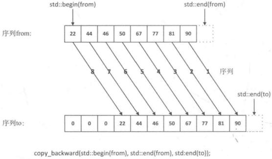
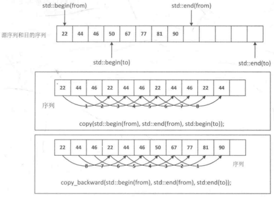
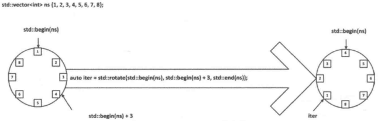
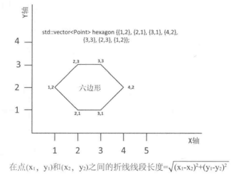

# 第七章 更多的算法

[TOC]


## 7.1 检查元素的属性

检查元素属性的算法：

- `all_of()` 算法会返回true，前提是序列中的所有元素都可以使谓词返回true。

  ```c++
  std::vector<int> ages{22, 19, 46, 75, 54, 19, 27, 66, 61, 33, 22, 19};
  int good_age{100};
  std::cout << (std::all_of(std::begin(ages), std::end(ages), 
                            [good_age](int age){ return age < good_age; }) ? "None" : "Some") 
            << " of the people are centenarians." << std::endl; // 输出 None of the people are centenarians.
  ```

- `any_of()` 算法会返回true，前提是序列中的任意一个元素都可以使谓词返回true。

  ```c++
  std::vector<int> ages{22, 19, 46, 75, 54, 19, 27, 66, 61, 33, 22, 19};
  int min_age{18};
  std::cout << "There are " << (std::any_of(std::begin(ages), std::end(ages), 
                                           [min_age](int age){ return age < min_age; }) ? "some" : "no")
            << " people unser " << min_age << std::endl; // 输出 There are no people unser 18
  ```

- `none_of()` 算法会返回true，前提是序列中没有元素可以使谓词返回true。

  ```c++
  std::vector<int> ages{22, 19, 46, 75, 54, 19, 27, 66, 61, 33, 22, 19};
  int min_age{18};
  std::cout << "There are " << (std::none_of(std::begin(ages), std::end(ages), 
                                             [min_age](int age){ return age < min_age; }) ? "no" : "some")
            << " people unser " << min_age << std::endl; // 输出 There are no people unser 18
  ```

- `count()` 在前两个参数指定的范围内，统计满足要求的元素个数

  ```c++
  std::vector<int> ages{22, 19, 46, 75, 54, 19, 27, 66, 61, 33, 22, 19};
  int the_age{19};
  std::cout << "There are "
            << std::count(std::begin(ages), std::end(ages), the_age)
            << " people aged " << the_age << std::endl; // 输出 There are 3 people aged 19
  ```

- `count_if()` 在前两个参数指定的范围内，统计满足自定义函数对象的元素个数

  ```c++
  std::vector<int> ages{22, 19, 46, 75, 54, 19, 27, 66, 61, 33, 22, 19};
  int max_age{60};
  std::cout << "There are "
            << std::count_if(std::begin(ages), std::end(ages), 
                             [max_age](int age){ return age > max_age; })
            << " people aged over " << max_age << std::endl; // 输出 There are 3 people aged over 60
  ```


## 7.2序列的比较

* `equal(Input_Iter1 beg1, Input_Iter1 end1, Input_Iter2 beg2)` 

  返回true, 如果序列`[beg1,end1)`同beg2开始处对应的元素相等。

* `equal(Input_Iter1 beg1, Input_Iter1 end1, Input_Iter2 beg2, Input_Iter2 end2)` 

  返回true, 如果序列`[beg1, end1)`中的元素和序列`[beg2, end2)`中对应的元素相等。

* `equal(Input_Iter1 beg2, Input_Iter1 end1, Input_Iter2 beg2, Binary_Predicate p)` 

  返回true，如果p为序列`[beg2, end1)`和序列beg2开始处对应的元素返回true。

* `equal(Input_Iter1 beg1, Input_Iter1 end1, Input_Iter2 beg2, Input_Iter2 end2, Binary_Predicate p)` 

  返回true，如果p为`[beg1, end1)`和`[beg2, end2)`中对应的元素返回true。

完整示例：

```c++
// Ex7_01.cpp
#include <iostream>
#include <vector>
#include <algorithm>
#include <iterator>
#include <string>
using std::string;

int main()
{
    std::vector<string> words1{"one", "two", "three", "four", "five", "six", "seven", "eight", "nine"};
    std::vector<string> words2{"two", "three", "four", "five", "six", "seven", "eight", "nine", "ten"};
    auto iter1 = std::begin(words1);
    auto end_iter1 = std::end(words1);
    auto iter2 = std::begin(words2);
    auto end_iter2 = std::end(words2);

    std::cout << "Container - words1: ";
    std::copy(iter1, end_iter1, std::ostream_iterator<string>{std::cout, " "});
    std::cout << "\nContainer - words2: ";
    std::copy(iter2, end_iter2, std::ostream_iterator<string>(std::cout, " "));
    std::cout << std::endl;

    std::cout << "\n1. Compare from words1[1] to end with words2: ";
    std::cout << std::boolalpha << std::equal(iter1 + 1, end_iter1, iter2) << std::endl;

    std::cout << "2. Compare from words2[0] to second-to-last with words1: ";
    std::cout << std::boolalpha << std::equal(iter2, end_iter2 - 1, iter1) << std::endl;

    std::cout << "3. Compare from words1[1] to words1[5] with words2: ";
    std::cout << std::boolalpha << std::equal(iter1 + 1, iter1 + 6, iter2) << std::endl;

    std::cout << "4. Compare first 6 from words1 with first 6 in words2: ";
    std::cout << std::boolalpha << std::equal(iter1, iter1 + 6, iter2, iter2 + 6) << std::endl;

    std::cout << "5. Compare all words1 with words2: ";
    std::cout << std::boolalpha << std::equal(iter1, end_iter1, iter2) << std::endl;

    std::cout << "6. Compare all of words1 with all of words2: ";
    std::cout << std::boolalpha << std::equal(iter1, end_iter1, iter2, end_iter2) << std::endl;

    std::cout << "7. Compare from words1[1] to end with words2 from first to second-to-last: ";
    std::cout << std::boolalpha << std::equal(iter1 + 1, end_iter1, iter2, end_iter2 - 1) << std::endl;
}
```

输出结果：

```sh
Container - words1: one two three four five six seven eight nine
Container - words2: two three four five six seven eight nine ten

1. Compare from words1[1] to end with words2: true
2. Compare from words2[0] to second-to-last with words1: false
3. Compare from words1[1] to words1[5] with words2: true
4. Compare first 6 from words1 with first 6 in words2: false
5. Compare all words1 with words2: false
6. Compare all of words1 with all of words2: false
7. Compare from words1[1] to end with words2 from first to second-to-last: true
```

### 7.2.1查找序列的不同之处

* `mismatch(Input_Iter1 beg1, Input_Iter1 end1, Input_Iter2 beg2)` 

  返回一个pair<Input_Iter1, Input_Iter2>对象，它包含第一对不相等元素的迭代器。

* `mismatch(Input_Iter1 beg1, Input_Iter1 end1, Input_Iter2 beg2, Input_Iter2 end2)` 

  的返回和值上一个版本相同。

* `mismatch(Input_Iter1 beg1, Input_Iter1 end1, Input_Iter2 beg2, Binary_Predicate p)` 

  返回一个pair<Input_Iter1, Input_Iter2>对象，它包含第一对使p返回false的元素的迭代器。

* `mismatch(Input_Iter1 beg1, Input_Iter1 end1, Input_Iter2 beg2, Input_Iter2 end2, Binary_Predicate p)` 

  返回值和上一个版本相同。

```c++
// Ex7_02.cpp
#include <iostream>
#include <vector>
#include <algorithm>
#include <string>
#include <iterator>

using std::string;
using word_iter = std::vector<string>::iterator;

int main()
{
    std::vector<string> words1{"one", "two", "three", "four", "five", "six", "seven", "eight", "nine"};
    std::vector<string> words2{"two", "three", "four", "five", "six", "eleven", "eight", "nine", "ten"};

    auto iter1 = std::begin(words1);
    auto end_iter1 = std::end(words1);
    auto iter2 = std::begin(words2);
    auto end_iter2 = std::end(words2);

    auto print_match = [](const std::pair<word_iter, word_iter>& pr, const word_iter& end_iter){
        if (pr.first != end_iter)
            std::cout << "\nFirst pair of words that differ are "
                    << *pr.first << " and " << *pr.second << std::endl;
        else
            std::cout << "\nRanges are identical." << std::endl;
    };

    std::cout << "Container - words1: ";
    std::copy(iter1, end_iter1, std::ostream_iterator<string>{std::cout, " "});
    std::cout << "\nContainer - words2: ";
    std::copy(iter2, end_iter2, std::ostream_iterator<string>{std::cout, " "});
    std::cout << std::endl;

    std::cout << "\nCompare from words1[1] to end with words2:";
    print_match(std::mismatch(iter1 + 1, end_iter1, iter2), end_iter1);

    std::cout << "\nCompare from words2[0] to second-to-last with words1:";
    print_match(std::mismatch(iter2, end_iter2 - 1, iter1), end_iter2 - 1);

    std::cout << "\nCompare from words1[1] to words1[5] with words2:";
    print_match(std::mismatch(iter1 + 1, iter1 + 6, iter2), iter1 + 6);

    std::cout << "\nCompare first 6 from words1 with first 6 in words2:";
    print_match(std::mismatch(iter1 + 1, iter1 + 6, iter2, iter2 + 6), iter1 + 6);

    std::cout << "\nCompare all words1 with words2:";
    print_match(std::mismatch(iter1, end_iter1, iter2), end_iter1);

    std::cout << "\nCompare all of words2 with all of words1:";
    print_match(std::mismatch(iter2, end_iter2, iter1, end_iter1), end_iter2);

    std::cout << "\nCompare from words1[1] to end with words2[0] to second-to-last:";
    print_match(std::mismatch(iter1 + 1, end_iter1, iter2, end_iter2 - 1), end_iter1);
}
```

输出结果：

```sh
Container - words1: one two three four five six seven eight nine
Container - words2: two three four five six eleven eight nine ten

Compare from words1[1] to end with words2:
First pair of words that differ are seven and eleven

Compare from words2[0] to second-to-last with words1:
First pair of words that differ are two and one

Compare from words1[1] to words1[5] with words2:
Ranges are identical.

Compare first 6 from words1 with first 6 in words2:
Ranges are identical.

Compare all words1 with words2:
First pair of words that differ are one and two

Compare all of words2 with all of words1:
First pair of words that differ are two and one

Compare from words1[1] to end with words2[0] to second-to-last:
First pair of words that differ are seven and eleven
```

### 7.2.2按字典序比较序列

* `lexicographical_compare(Input_Iter1 beg1, Input_Iter1 end1, Input_Iter2 beg2, Input_Iter2 end2)` 

  返回true1, 如果这两个序列包含的元素个数相同，并且对应元素相等；否则返回false。

* `lexicographical_compare(Input_Iter1 beg1, Input_Iter1 end1, Input_Iter2 beg2, Input_Iter2 end2, Binary_Predicate p)` 

  返回true，如果这2个序列包含的元素个数相同，并且为所有对应的元素对p都返回true；否则返回false；

```c++
std::vector<string> phrase1{ "the", "tigers", "of", "wrath" };
std::vector<string> phrase2{ "the", "horses", "of", "instruction" };
auto less = std::lexicographical_compare(std::begin(phrase1), std::end(phrase1),
	std::begin(phrase2), std::end(phrase2));
std::copy(std::begin(phrase1), std::end(phrase1), std::ostream_iterator<string>{std::cout, " "});
std::cout << (less ? "are" : "are not") << " less than ";
std::copy(std::begin(phrase2), std::end(phrase2), std::ostream_iterator<string>{std::cout, " "});
std::cout << std::endl; // 输出 the tigers of wrath are not less than the horses of instruction
```

### 7.2.3序列的排序

* `prev_permutation(Bi_Iter beg, Bi_Iter end)` 

  会按字典序的升序生成元素的前一个排列，并返回true，如果存在前一个排列的话。否则，元素会被排为序列中的最后一个排列，算法返回false。

* `prev_permutation(Bi_Iter beg, Bi_Iter end, Compare compare)` 

  会基于元素的比较函数compare，按照字典序生成元素的前一个排列，并返回true。如果不存在前一个排列，元素会被排为基于compare的序列的最后一个排列，否则返回false。它用==来比较元素。

* `is_permutation(Fwd_Iter1 beg2, Fwd_Iter1 end1, Fwd_Iter2 beg2)` 

  返回true，如果从beg2开始的元素序列`(end1, beg1)`是序列`[beg1, end1)`的一个排列，否则返回false。它用==来比较元素。

* `is_permutation(Fwd_Iter1 beg1, Fwd_Iter1 end1, Fwd_Iter2 beg2, Binary_Predicate p)` 

  和前一个版本相同，除了它是用p来比较元素是否相等之外。

* `is_permutation(Fwd_Iter1 beg1, Fwd_Iter1 end1, Fwd_Iter2 beg2, Fwd_Iter2 end2)` 

  返回true，如果`[beg2, end2)`是序列`[beg1, end1)`的一个排列，否则返回false。它用==来比较元素。

* `is_permutation(Fwd_Iter1 beg1, Fwd_Iter1 end1, Fwd_Iter2 beg2, Fwd_Iter2 end2, Binary_Predicate p)` 

  和前一个版本相同，除了他是用p来比较元素是否相等之外。

* `next_permutation(Bi_Iter beg, Bi_Iter end)` 

  会按字典序的升序来生成元素的下一个排列，并返回true，如果存在下一个排列的话。否则，元素会被排为序列的第一排列，算法会返回false。

* `next_permutation(Bi_Iter beg, Bi_Iter end, Compare compare)` 

  会基于元素的比较函数compare，按照字典序生成元素的下一个排列，并返回true。如果不存在下一个排列，元素会被排为基于compare的第一个序列，算法返回false。
  
  ```c++
  std::vector<int> range{1, 2, 3, 4};
  do
  {
      std::copy(std::begin(range), std::end(range), std::ostream_iterator<int>{std::cout, " "});
      std::cout << std::endl;
  } while(std::next_permutation(std::begin(range), std::end(range)));
  ```

  输出结果：
  
  ```sh
  1 2 3 4
  1 2 4 3
  1 3 2 4
  1 3 4 2
  1 4 2 3
  1 4 3 2
  2 1 3 4
  2 1 4 3
  2 3 1 4
  2 3 4 1
  2 4 1 3
  2 4 3 1
  3 1 2 4
  3 1 4 2
  3 2 1 4
  3 2 4 1
  3 4 1 2
  3 4 2 1
  4 1 2 3
  4 1 3 2
  4 2 1 3
  4 2 3 1
  4 3 1 2
  4 3 2 1
  ```

完整示例：

```c++
// Ex7_03.cpp
#include <iostream>
#include <iterator>
#include <string>
#include <vector>
#include <algorithm>
using std::string;

int main()
{
    std::vector<string> words;
    string word;
    while (true)
    {
        std::cout << "\nEnter a word, or Ctrl+z to end: ";
        if ((std::cin >> word).eof()) break;
        string word_copy{word};
        do
        {
            words.push_back(word);
            std::next_permutation(std::begin(word), std::end(word));
        } while (word != word_copy);
        size_t count{}, max{8};
        for (const auto& word : words)
            std::cout << word << ((++count % max == 0) ? '\n' : ' ');
        std::cout << std::endl;
        words.clear();
    }
}
```

输出结果：

```sh
Enter a word, or Ctrl+z to end: hello
hello helol heoll hlelo hleol hlleo hlloe hloel
hlole hoell holel holle lehlo lehol lelho leloh
leohl leolh lhelo lheol lhleo lhloe lhoel lhole
lleho lleoh llheo llhoe lloeh llohe loehl loelh
lohel lohle loleh lolhe oehll oelhl oellh ohell
ohlel ohlle olehl olelh olhel olhle olleh ollhe
ehllo ehlol eholl elhlo elhol ellho elloh elohl
elolh eohll eolhl eollh
```


## 7.3复制序列

- `copy(Input_Iter beg1, Input_Iter end1, Output_Iter beg2)` 

  会将序列[beg1, end1)复制到序列beg2的开始处。它返回的迭代器指向最后一个被复制到目的位置的元素的下一个位置。

### 7.3.1复制一定数目的元素

- `copy_n(Input_Iter beg1, Int_Type n, Output_Iter beg2)` 

  会从序列`[beg1, end1)`复制n个元素到beg2的开始位置。它返回的迭代器指向最后一个被复制到目的位置的元素的下一个位置。
  
  ```c++
  std::vector<string> names{ "Al", "Beth", "Carol", "Dan", "Eve", "Fred", "George", "Harry", "Iain", "Joe" };
  std::unordered_set<string> more_names{ "Janet", "John" };
  std::copy_n(std::begin(names) + 1, 3, std::inserter(more_names, std::begin(more_names)));
  std::copy_n(std::begin(more_names), more_names.size(), std::ostream_iterator<string>{ std::cout, " " }); // 输出 Janet Beth John Carol Dan
  ```

### 7.3.2条件复制

- `copy_if(Input_Iter beg1, Input_Iter end1, Output_Iter beg2, Unary_Predicate p)` 

  从序列beg1的开始位置复制使p返回true的元素到beg2的开始位置。它返回的迭代器指向最后一个被复制到目的位置的元素的下一个位置。

  ```c++
  std::vector<string> names{ "Al", "Beth", "Carol", "Dan", "Eve", "Fred", "George", "Harry", "Iain", "Joe" };
  std::unordered_set<string> more_names{ "Jean", "John" };
  size_t max_length{ 4 };
  std::copy_if(std::begin(names), std::end(names), std::inserter(more_names, std::begin(more_names)),
      [max_length](const string& s) { return s.length() <= max_length; });
  std::copy(std::begin(more_names), std::end(more_names), std::ostream_iterator<string>{std::cout, " "}); 
  // 输出 Jean Iain John Beth Dan Fred Al Eve Joe
  ```

- `copy_backward(Bi_Iter1, Input_Iter1 end1, Bi_Iter2 end2)` 

  将序列`[beg1, end1)`复制到序列end2的末尾。这个操作会从end1-1指向的元素开始反向复制元素。算法会返回一个迭代器iter，它指向被复制到目的位置的最后一个元素，因此在这个操作之后目的序列为`[iter, end2)`。

  

  *copy_backward()的工作方式*

  

  *从右复制重叠序列*
  
  ```c++
  std::deque<string> song{ "jingle", "bells", "jingle", "all", "the", "way" };
  song.resize(song.size() + 2);
  std::copy_backward(std::begin(song), std::begin(song) + 6, std::end(song));
  std::copy(std::begin(song), std::end(song), std::ostream_iterator<string>{ std::cout, " "});
  std::cout << std::endl; // 输出 jingle bells jingle bells jingle all the way
  ```


## 7.4复制和反向元素顺序

- `reverse_copy(Bi_Iter beg1, Bi_Iter end1, Output_Iter beg2)` 

  会反向的将`[beg1, end1)`复制到目的序列beg2的开始位置，并返回一个迭代器iter,它指向被复制到目的位置的最后一个元素的下一个位置。因此，`[beg2, iter)`会以逆序包含`[beg1, end1)`中的元素。

  ```c++
      while (true)
      {
          string sentence;
          std::cout << "Enter a sentence or Ctrl+Z to end: ";
          std::getline(std::cin, sentence);
          if (std::cin.eof()) break;
  
          string only_letters;
          std::copy_if(std::begin(sentence), std::end(sentence), std::back_inserter(only_letters),
              [](char ch) { return std::isalpha(ch); });
          std::for_each(std::begin(only_letters), std::end(only_letters),
              [](char& ch) { ch = toupper(ch); });
  
          string reversed;
          std::reverse_copy(std::begin(only_letters), std::end(only_letters), std::back_inserter(reversed));
          std::cout << '"' << sentence << '"'
              << (only_letters == reversed ? " is" : " is not") << " a palindrome." << std::endl;
      }
  ```

  输出结果：

  ```sh
  Enter a sentence or Ctrl+Z to end: madam
  "madam" is a palindrome.
  Enter a sentence or Ctrl+Z to end: hello
  "hello" is not a palindrome.
  ```

- `reverse(Bi_Iter beg, Bi_Iter end)` 

  反转序列`[beg, end)`中元素的顺序。
  
  ```c++
  string reversed{only_letters};
  string::reverse(std::begin(reversed), std::end(reversed));
  ```


## 7.5复制一个删除相邻重复元素的序列

- `unique_copy(Input_Iter beg1, Input_Iter end1, Output_Iter beg2)` 

  忽略持续的重复元素，将序列[beg1, end1)复制到序列beg2的开始位置。他是用==来比较元素的，它返回一个指向被复制到目的位置的最后一个元素的下一个位置的迭代器。
  
  ```c++
  string text{"Have you seen how green the trees seem?"};
  string result{};
  std::unique_copy(std::begin(text), std::end(text), std::back_inserter(result));
  std::cout << result << std::endl; // 输出 Have you sen how gren the tres sem?
  ```


## 7.6从序列中移除相邻的重复元素

- `unique(Fwd_Iter beg, Fwd_Iter end, Binary_Predicate p)` 

  忽略持续的重复元素，将序列[beg1, end1)复制到序列beg2的开始位置。他是用p来比较元素的，它返回一个指向被复制到目的位置的最后一个元素的下一个位置的迭代器。。
  
  ```c++
  std::vector<string> words{ "one", "two", "two", "three", "two", "two", "two" };
  auto end_iter = std::unique(std::begin(words), std::end(words));
  words.erase(end_iter, std::end(words));
  std::copy(std::begin(words), std::end(words), std::ostream_iterator<string>{std::cout, " "});
  std::cout << std::endl; // 输出 one two three two
  ```


## 7.7旋转序列

- `rotate(Fwd_Iter beg, Fwd_Iter new_beg, Fwd_Iter end)`

  会按逆时针旋转`[beg, end)`中的元素，从而使new_beg成为序列的第一个元素。算法会返回一个指向序列原始的第一个元素的迭代器。

  

  *rotate()算法的工作方式*

  ```c++
  std::vector<string> words{"one", "two", "three", "four", "five", "six", "seven", "eight", "nine", "ten"};
  auto start = std::find(std::begin(words), std::end(words), "two");
  auto end_iter = std::find(std::begin(words), std::end(words), "eight");
  auto iter = std::rotate(start, std::find(std::begin(words), std::end(words), "five"), end_iter);
  std::copy(std::begin(words), std::end(words), std::ostream_iterator<string>{std::cout, " "});
  std::cout << std::endl << "First element before rotation: " << *iter << std::endl;
  ```

  输出结果：

  ```sh
  one five six seven two three four eight nine ten
  First element before rotation: two
  ```

- `rotate_copy(Fwd_Iter beg1, Fwd_Iter new_beg1, Fwd_Iter end1, Output_Iter beg2)`

  会将`[beg1, end1)`中所有元素都复制到序列beg2的开始位置，从而使new_beg1指向的元素成为目的序列的第一个元素。算法会返回一个指向目的序列中的最后一个元素的下一个位置的迭代器。
  
  ```c++
  std::vector<string> words{ "one", "two", "three", "four", "five", "six", "seven", "eight", "nine", "ten" };
  auto start = std::find(std::begin(words), std::end(words), "two");
  auto end_iter = std::find(std::begin(words), std::end(words), "eight");
  std::vector<string> words_copy;
  std::rotate_copy(start, std::find(std::begin(words), std::end(words), "five"), end_iter, std::back_inserter(words_copy));
  std::copy(std::begin(words_copy), std::end(words_copy), std::ostream_iterator<string>{ std::cout, " "});
  std::cout << std::endl; // 输出 five six seven two three four
  ```
  
  
  
  ## 7.8 移动序列
  
  * `move(Input_Iter beg1, Input_Iter end1, Output_Iter beg2)`
  
    将序列`[beg1, end1)`移到序列beg2的开始位置。他会返回一个指向最后一个被移到目的位置的元素的下一个位置的迭代器。beg2不能在`[beg1, end1)`之内。
  
    ```c++
    std::vector<int> srce{1, 2, 3, 4};
    std::deque<int> dest{5, 6, 7, 8};
    std::move(std::begin(srce), std::end(srce), std::back_inserter(dest));
    ```
  
  * `move_backward(Bi_Iter1 beg1, Bi_Tter1 end1, Bi_Iter2 end2)`
  
    将序列`[beg1, end1)`移到序列end2的末尾，并且元素是以逆序移动的。算法会返回一个指向最后一个被移到目的位置的元素的迭代器。end2不能再`[beg1, end1)`之内。
  
  * `swap(T& obj1, T& obj2)` 
  
    交换obj1和obj2的值。第二个版本的swap可以交换2个同类型的数组，它们的长度必须相同。
  
  * `iter_swap(Fwd_Iter iter1, Fwd_Iter iter2)` 
  
    交换iter1和iter2指向的值。
  
  * `swap_ranges(Fwd_Iter1 beg1, Fwd_Iter1 end1, Fwd_Iter2 beg2)`
  
    交换序列`[beg1, end1)`和从beg2开始的序列的对应元素。该算法返回的迭代器指向从beg2开始的序列的最后一个元素。
    
    ```c++
    using Name = std::pair<string, string>;
    std::vector<Name> people{Name{"Al", "Bedo"}, Name{"Ann", "Ounce"}, Name{"Jo", "King"}};
    std::list<Name> folks{Name{"Stan", "Down"}, Name{"Dan", "Druff"}, Name{"Bea", "Gone"}};
    std::swap_ranges(std::begin(people), std::begin(people) + 2, ++std::begin(folks));
    std::for_each(std::begin(people), std::end(people), 
                  [](const Name& name){ std::cout << '"' << name.first << " " << name.second << "\" "; });
    std::cout << std::endl;
    std::for_each(std::begin(folks), std::end(folks), 
                  [](const Name& name){ std::cout << '"' << name.first << " " << name.second << "\" "; });
    std::cout << std::endl;
    ```
  
    输出结果：
    
    ```c++
    "Dan Druff" "Bea Gone" "Jo King"
    "Stan Down" "Al Bedo" "Ann Ounce"
    ```
  
  
  
  ## 7.9从序列中移除元素
  
  * `remove(Fwd_Iter beg, Fwd_Iter end, const T& obj)`
  
    从`[beg, end)`中移除等于obj的元素，并返回一个迭代器，它指向结果序列中最后一个元素的下一个位置。
  
    ```c++
    std::deque<double> samples{ 1.5, 2.6, 0.0, 3.1, 0.0, 0.0, 4.1, 0.0, 6.7, 0.0 };
    samples.erase(std::remove(std::begin(samples), std::end(samples), 0.0), std::end(samples));
    std::copy(std::begin(samples), std::end(samples),
              std::ostream_iterator<double>{std::cout, " "});
    std::cout << std::endl; // 输出 1.5 2.6 3.1 4.1 6.7
    ```
  
  * `remove_if(Fwd_Iter beg, Fwd_Iter end, Unary_Predicate p)`
  
    从`[beg, end)`中移除使p为true的元素，并返回一个迭代器，它指向结果序列中最后一个元素的下一个位置。
  
    ```c++
    using Name = std::pair<string, string>;
    std::set<Name> blacklist{ Name{"Al", "Bedo"}, Name{"Ann", "Ounce"}, Name{"Jo", "King"} };
    std::deque<Name> candidates{ Name{"Stan", "Down"}, Name{"Al", "Bedo"}, Name{"Dan", "Druff"},
                                 Name{"Di", "Gress"}, Name{"Ann", "Ounce"}, Name{"Bea", "Gone"} };
    candidates.erase(std::remove_if(std::begin(candidates),
                                    std::end(candidates),
                                    [&blacklist](const Name& name) { return blacklist.count(name); }),
                     std::end(candidates));
    std::for_each(std::begin(candidates), std::end(candidates),
        [](const Name& name) { std::cout << '"' << name.first << " " << name.second << "\" "; });
    std::cout << std::endl; // 输出 "Stan Down" "Dan Druff" "Di Gress" "Bea Gone"
    ```
  
  * `remove_copy(Input_Iter beg1, Input_Iter end1, Output_Iter beg2, const T& obj)`
  
    将`[beg1, end1)`中的元素复制到beg2的开始位置，它会跳过等于obj的元素，并返回一个迭代器，它指向目的位置最后一个元素的下一个位置。
  
    ```c++
    std::deque<double> samples{ 1.5, 2.6, 0.0, 3.1, 0.0, 0.0, 4.1, 0.0, 6.7, 0.0 };
    std::vector<double> edited_samples;
    std::remove_copy(std::begin(samples), std::end(samples),
        std::back_inserter(edited_samples), 0.0);
    std::copy(std::begin(samples), std::end(samples),
        std::ostream_iterator<double>{std::cout, " "});
    std::cout << std::endl; // 输出 1.5 2.6 0 3.1 0 0 4.1 0 6.7 0
    ```
  
  * `remove_copy_if(Input_Iter beg1, Input_Iter end1, Outpu_Iter beg2, Unary_Predicate p)`
  
    将`[beg1, end1)`中的元素复制到beg2的开始位置，它会跳过使p返回true的元素，并返回一个迭代器，它指向目的位置最后一个元素的下一个位置。
    
    ```c++
    using Name = std::pair<string, string>;
    std::set<Name> blacklist{ Name{"Al", "Bedo"}, Name{"Ann", "Ounce"}, Name{"Jo", "King"} };
    std::deque<Name> candidates{ Name{"Stan", "Down"}, Name{"Al", "Bedo"}, Name{"Dan", "Druff"},
                                     Name{"Di", "Gress"}, Name{"Ann", "Ounce"}, Name{"Bea", "Gone"} };
    std::deque<Name> validated;
    std::remove_copy_if(std::begin(candidates), std::end(candidates), std::back_inserter(validated),
        [&blacklist](const Name& name) { return blacklist.count(name); });
    std::for_each(std::begin(validated), std::end(validated),
        [](const Name& name) { std::cout << '"' << name.first << " " << name.second << "\" "; });
    std::cout << std::endl; // 输出 "Stan Down" "Dan Druff" "Di Gress" "Bea Gone"
    ```
  
  
  
  ## 7.10设置和修改序列中的元素
  
  * `fill(Fwd_Iter beg, Fwd_Iter end, const T& obj)`
  
    将obj保存到序列`[beg, end)`的每一个元素中。
  
    ```c++
    std::vector<string> data{12};
    std::fill(std::begin(data), std::end(data), "none");
    ```
  
  * `fill_n(Output_Iter begg, Int_Type n, const T& obj)`
  
    将obj保存到序列beg开始的前n个元素中。
  
  ### 7.10.1用函数生成元素的值
  
  * `generate(Fwd_Iter beg, Fwd_Iter end, Fun_Object gen_fun)`
  
    将gen_fun返回的值保存到序列[beg,end)的每一个元素中。gen_fun必须是无参数的，并且必须能够返回一个可以保存到序列中的值。
  
    ```c++
    string chars(30, ' ');
    char ch{'a'};
    int incr{};
    std::generate(std::begin(chars), std::end(chars), [ch, &incr]{incr += 3; return ch + (incr % 26); });
    std::cout << chars << std::endl; // 输出 dgjmpsvybehknqtwzcfiloruxadgjm
    ```
  
  * `generate_n(Output_Iter beg, Int_Type n, Fun_Object gen_fun)`
  
    将gen_fun返回的值保存到序列beg开始的前n个元素中。算法会返回一个指向最后一个被保存元素的下一个位置的迭代器。
    
    ```c++
    string chars(30, ' ');
    char ch{ 'a' };
    int incr{};
    std::generate_n(std::begin(chars), chars.size() / 2, [ch, &incr] { incr += 3; return ch + (incr % 26); });
    std::cout << chars << std::endl; // 输出 dgjmpsvybehknqt
    ```
  
  ### 7.10.2转换序列
  
  * `transform(Input_Iter beg1, Input_Iter end1, Output_Iter beg2, Unary_Op op)`
  
    将op应用到序列`[beg1, end1)`的每一个元素上，并将这些元素返回的对应值保存到从beg2开始的序列中。
  
    ```c++
    std::vector<double> deg_C{ 21.0, 30.5, 0.0, 3.2, 100.0 };
    std::vector<double> deg_F(deg_C.size());
    std::transform(std::begin(deg_C), std::end(deg_C), std::begin(deg_F),
        [](double temp) { return 32.0 + 9.0 * temp / 5.0; });
    std::copy(std::begin(deg_F), std::end(deg_F),
        std::ostream_iterator<size_t>{std::cout, " "});
    std::cout << std::endl; // 输出 69 86 32 37 212
    ```
  
  * `transform(Input_Iter1 beg1, Input_Iter1 end1, Input_Iter2 beg2, Output_Iter beg3, Binary_Op op)`
  
    将op应用到序列`[beg1, end1)`中与从beg2开始的序列所对应的元素对上，并将这些元素返回的对应值保存到从beg3开始的序列中。
    
    ```c++
    using Point = std::pair<double, double>;
    std::vector<Point> hexagon{ {1, 2}, {2, 1}, {3, 1}, {4, 2}, {3, 3}, {2, 3}, {1, 2} };
    std::vector<double> segments;
    std::transform(std::begin(hexagon), std::end(hexagon) - 1, std::begin(hexagon) + 1, std::back_inserter(segments),
        [](const Point& p1, const Point& p2) {
            return std::sqrt(p1.first - p2.first) * (p1.first - p2.first) +
                (p1.second - p2.second) * (p1.second - p2.second);
        });
    std::cout << "Segment lengths: ";
    std::copy(std::begin(segments), std::end(segments),
        std::ostream_iterator<double>{ std::cout, " " });
    std::cout << std::endl;
    std::cout << "Hexagon perimeter: "
        << std::accumulate(std::begin(segments), std::end(segments), 0.0) << std::endl;
    ```
  
    
    
    *一条表示六边形的折线*
  
  ### 7.10.3替换序列中的元素
  
  * `replace(Fwd_Iter beg, Fwd_Iter end, const T& obj, const T& new_obj)`
  
    用new_obj替换[beg, end)中等于obj的元素。
  
    ```c++
    std::deque<int> data{ 10, -5, 12, -6, 10, 8, -7, 10, 11 };
    std::replace(std::begin(data), std::end(data), 10, 99);
    std::copy(std::begin(data), std::end(data),
        std::ostream_iterator<int>{std::cout, " "});
    std::cout << std::endl; // 输出 99 -5 12 -6 99 8 -7 99 11
    ```
  
  * `replace_if(Fwd_Iter beg, Fwd_Iter end, Unary_Predicate p, const T& new_obj)`会用new_obj替换[beg, end)中使p返回true的元素。
  
    ```c++
    string password{ "This is a good choice!" };
    std::replace_if(std::begin(password), std::end(password),
        [](char ch) { return std::isspace(ch); }, '_');
    std::cout << password << std::endl; // 输出 This_is_a_good_choice!
    ```
  
  * `replace_copy(Input_Iter beg1, Input_Iter end1, Output_Iter beg2, const T& obj, const T& new_obj)`会将[beg1, end1)中的元素复制到序列beg2的开始位置，并用new_obj替换等于obj的元素。该算法返回一个迭代器，它指向目的位置最后一个元素的下一个位置。序列不能是重叠的。
  
    ```c++
    std::vector<string> words{ "one", "none", "two", "three", "none", "four" };
    std::vector<string> new_words;
    std::replace_copy(std::begin(words), std::end(words), std::back_inserter(new_words),
        string{ "none" }, string{ "0" });
    std::copy(std::begin(new_words), std::end(new_words),
        std::ostream_iterator<string>{std::cout, " "});
    std::cout << std::endl; // 输出 one 0 two three 0 four
    ```
  
  * `replace_copy_if(Input_Iter beg1, Input_Iter end1, Output_Iter beg2, Unary_Predicate p, const T& new_obj)`会将`[beg1, end1)`中的元素复制到序列beg2的开始位置，并用new_obj替换使p返回true的元素。该算法返回一个迭代器，它指向目的位置的最后一个元素的下一个位置。序列不能是重叠的。
  
    ```c++
    std::deque<int> data{ 10, -5, 12, -6, 10, 8, -7, 10, 11 };
    std::vector<int> data_copy;
    std::replace_copy_if(std::begin(data), std::end(data), std::back_inserter(data_copy),
        [](int value) { return value == 10; }, 99);
    std::copy(std::begin(data_copy), std::end(data_copy),
        std::ostream_iterator<int>{std::cout, " "});
    std::cout << std::endl; // 输出 99 -5 12 -6 99 8 -7 99 11
    ```
  
  
  
  ## 7.11算法的应用
  
  略
  
  
  
  ## 7.12本章小结
  
  略
  
  
  
  
  
  