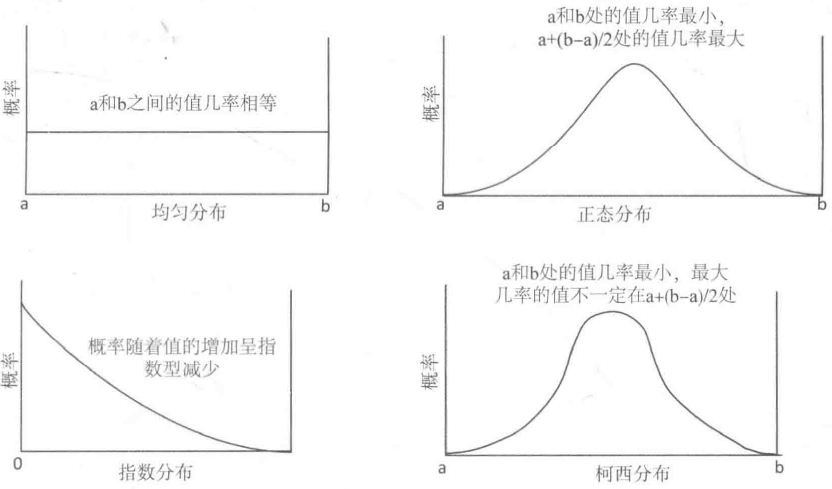
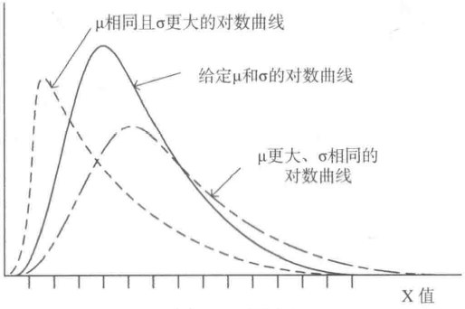

# 第八章 生成随机数

[TOC]


## 8.1 什么是随机数

随机性意味着无法预测，真正的随机性只存在于自然世界，计算机产生的是伪随机数。


## 8.2 概率，分布以及熵

### 8.2.1 什么是概率

概率的值再0和1之间，它可以衡量事件发生的可能性。0说明事件永远不会发生，1豁免事件肯定会发生。

事件发生的概率是它发生的次数除以它可能发生的次数。

### 8.2.2 什么是分布

分布描述的是假设变量为序列中某个特定值的可能性，它可以是离散/连续的。

- `离散分布` 描述的是假设变量是一组固定值中任意一个值的概率。
- `连续分布` 表示的是假设连续变量是序列中某个特定值的概率。



*分布示例*

### 8.2.3 什么是熵

熵是对混乱程度的度量。熵可以度量表示信息的效率，也可以度量数据的混乱程度。


## 8.3 用STL生成随机数

STL随机数生成的特征：

- 随机数生成引擎是一个定义了生成随机位序列的无符号整数序列机制的类模板。STL定义了3个代表随机数引擎的类模板。
- 随机数生成器是随机数引擎类模板的一个预定义的实例。每一个生成器都会将一套具体的模板参数应用到随机数引擎的类模板上 - 因为他是一个类型别名。
- 随机数引擎适配器是一个类模板，它通过修改另一个随机数引擎生成的序列来生成随机数序列。
- 分布表示的是随机序列中的数出现在序列中的概率。

### 8.3.1 生成随机数的种子

### 8.3.2 获取随机种子

```c++
// Ex8_01.cpp
#include <random>
#incldue <iostream>

int main()
{
    std::random_device rd;
    for (size_t n{}; n < 8; ++n)
        std::cout << rd() << " ";
    std::cout << std::endl;
}
```

### 8.3.3 种子序列

seed_seq类是用来帮助设置随机数生成器的初始状态的。

seed_seq的生成方式：

```c++
std::seed_seq seeds1;

std::seed_seq seeds2{2, 3, 4, 5};

std::vector<unsigned int> data{25, 36, 47, 58};
std::seed_seq seeds3{std::begin(data), std::end(data)};

std::random_device rd{};
std::seed_seq seeds4{rd(), rd()};
```

```c++
// 将指定范围的迭代器传给seed_seq对象的成员函数generate,将从seed_seq对象得到的给定个数的值保存到容器中
// Ex8_02
#include <random>
#include <iostream>
#include <iterator>
#include <string>
using std::string;

void gen_and_list(const std::seed_seq& ss, const string title = "Values:", size_t count = 8)
{
    std::vector<unsigned int> values(count);
    ss.generate(std::begin(values), std::end(values));
    std::cout << title << std::endl;
    std::copy(std:begin(values), std::end(values), 
              std::ostream_iterator<unsigned int>{std::cout, " "});
    std::cout << std::endl;
}

int main()
{
    std::random_device rd{};
    std::seed_seq seeds1;
    std::seed_seq seeds2{3, 4, 5};
    std::seed_seq seeds3{rd(), rd()};
    
    std::vector<unsigned int> data{25, 36, 47, 58};
    std::seed_seq seeds4(std::begin(data), std::end(data));
    gen_and_list(seeds1, "seeds1");
    gen_and_list(seeds1, "seeds1 again");
    gen_and_list(seeds1, "seeds1 again", 12);
    gen_and_list(seeds1, "seeds2");
    gen_and_list(seeds1, "seeds3");
    gen_and_list(seeds1, "seeds3 again");
    gen_and_list(seeds1, "seeds4");
    gen_and_list(seeds1, "seeds4 again");
    gen_and_list(seeds1, "seeds4 yet again", 12);
    gen_and_list(seeds1, "seeds4 for the last time", 6);
}
```

```c++
// 使用param保存原始种子的值
std::seed_seq seeds{3, 4, 5};
std::vector<unsigned int> data(seeds.size());
seeds.param(std::begin(data));
seeds.param(std::back_inserter(data));
seeds.param(std::ostream_iterator<unsigned int>{std::cout, ""});
```


## 8.4 分布类

- 应该总是使用分布对象来获取随机数。
- 要充分理解随机数生成器的区别，需要具备它们实现的算法的数学知识。

### 8.4.1 默认随机数生成器

```c++
std::default_random_engine rng1;

// 使用自己提供的种子
std::default_random_engine rng2{10};

// 使用非确定性的种子
std::random_device rd;
std::default_random_engine rng3{rd()};

// 提供seed_seq对象
std::seed_seq sd_seq{2, 4, 6, 8};
std::default_random_engine rng4{sd_seq};
std::random_device rd;
std::default_random_engine rng5{std::seed_seq{rd(), rd(), rd()}};
```

### 8.4.2 创建分布对象

所有的分布对象都有下面这些公共成员：

- result_type 是在类中为生成值的类型定义的类型别名。
- min() 是一个返回分布对象可生成的最小值的成员函数。
- max() 是一个返回分布对象可生成的最大值的成员函数。
- reset() 是一个可以将分布对象重置为它的原始状态的成员函数，这样下次返回的值就不会依赖前一个值。这是否会发生取决于我们的实现。分布返回的值是独立的，reset()不会做任何事情。
- param_type 是定义在类中的一个结构体的类型别名。不同的分布需要不同的参数值，可能还需要是不同的类型，这些值会被保存到一个用来指定分布的param_type类型结构体中。
- param() 是一个接受一个param_type类型的参数的成员函数，它会将分布对象的参数重置为新的值。
- param() 的无参重载版本，它会返回分布对象所包含的param_type对象。
- 默认构造函数对于定义分布的参数有默认值。
- 一个构造函数，接受param_type类型的参数来定义分布。

### 8.4.3 均匀分布


*均匀分布*

**1. 离散均匀分布**

```c++
// 返回均匀分布在闭合范围[a,b]内的随机整数。
std::uniform_int_distribution<> d;
std::cout << "Range from 0 to "
          << std::numeric_limits<std::uniform_int_distribution<> :: result-type>::max()
          << std::endl;

// 返回范围的上边界和下边界
std::cout << "Range from " << d.a() << " to " << d.b() << std::endl;
```

```c++
// 分布的整数范围大于等于给定值
std::uniform_int_distribution<> d{500};
std::cout << "Range from " << d.a() << " to " << d.b() << std::endl;
```

```c++
// 指定范围边界
std::uniform_int_distribution<long> dist{-5L, 5L};
std::random_device rd;
std::default_random_engine rng{rd()};
for (size_t i{}; i < 8; ++i)
    std::cout << std::setw(2) << dist(rng) << " "; // -3 0 5 1 -2 -4 0 4
```

```c++
// 改变产生的值的范围
std::uniform_int_distribution<> dist{0, 6};
std::random_device rd;
std::default_random_engine rng{rd()};
for (size_t i{}; i < 8; ++i)
    std::cout << std::setw(3) << dist(rng) << " ";
std::cout << std::endl;

// Save old range and set new range
auto old_range = dist.param();
dist.param(std::uniform_int_distribution<>::param_type{-10, 20});
for (size_t i{}; i < 8; ++i)
    std::cout << std::setw(3) << dist(rng) << " ";
std::cout << std::endl;

// Restore old range...
dist.param(old_range);
for (size_t i{}; i < 8; ++i)
    std::cout << std::setw(3) << dist(rng) << " ";
std::cout << std::endl;
```

```c++
// Ex8_03.cpp
#include <iostream>
#include <ostream>
#include <iomanip>
#include <iterator>
#include <random>
#include <utility>
#include <vector>
#include <list>
#include <array>
#include <string>
#include <type_traits>

using std::string;
enum class Suit : size_t{Clubs, Diamonds, Hearts, Spades};
enum class Face : size_t{Two, Three, Four, Five, Six, Seven,
                         Eight, Nine, Ten, Jack, Queen, King, Ace};
using Card = std::pair<Suit, Face>;
using Hand = std::list<Card>;
using Deck = std::list<Card>;
using Hands = std::vector<Hand>;
using Range = std::uniform_int_distribution<size_t>::param_type;

int main()
{
    Deck deck;
    init_deck(deck);
    
    Hands hands(4);
    deal(hands, deck);
    
    sort_hands(hands);
    show_hands(hands);
}
```

**2. 连续均匀分布**

```c++
// 生成一个返回值在范围[0, 10)内的连续均匀分布
std::uniform_real_distribution<> value{0.0, 10.0};
std::random_device rd;
std::default_random_engine rng{rd()};
for (size_t i{}; i < 8; ++i)
    std::cout << std::fixed << std::setprecision(2) << values(rng) << " ";
```


*地板上的木棍*


*通过从木棍穿过地板边缘的概率来确定$\pi$值*

```c++
// Ex8_04.cpp
#include <iostream>
#include <random>
#include <cmath>

int main()
{
    const double pi = 3.14159262;
    double stick_length{};
    double board_with{};
    std::cout << "Enter the with of a floorboard: ";
    std::cin >> board_width;
    std::cout << "Enter the length of the stick (must be less than " 
              << board_with << "):";
    std::cin >> stick_length;
    if (board_width < stick_lenght)
        stick_length = 0.9 * board_width;
    
    std::uniform_real_distribution<> angle{0.0, pi};
    
    std::uniform_real_distribution<> position{0.0, board_width};
    
    std::random_device rd;
    std::default_random_engine rng{rd()};
    const size_t throw{5'000'000};
    size_t hits{};
    
    for (size_t i{}; i < throws; ++i)
    {
        double y{position(rng)};
        double theta{angle(rng)};
        if (((y + stick_length * sin(theta) / 2) >= board_width) ||
             ((y - stick_length * sin(theta) / 2) <= 0))
            ++hits;
    }
    std::cout << "Probability of the stick crossing the edge of a board is: "
              << (static_cast<double>(hits) / throws) << std::endl;
    std::cout << "Pi is:" << (2 * stick_length * throw) / (board_width * hits) << std::endl;
}
```

**3. 创建标准均匀分布**

```c++
// 生成范围在[0, 1)内的连续分布
std::vector<double> data(8);
std::random_device rd;
std::default_random_engine rng{rd()};

std::generate(std::begin(data), std::end(data), 
              [&rng]{ return std::generate_canonical<double, 12>(rng); });

std::copy(std::begin(data), std::end(data), std::ostream_iterator<double>{std::cout, " "});
```

### 8.4.4 正态分布


*正态分布*

期望和标准差分别是用希腊字母$\mu$和$\sigma$来表示的，变量$x$有$n$个样本，这些是由下面的公式定义的：

$\mu = \frac{\sum_{0}^{n} x_i}{n}$ 

$\sigma = \sqrt{\frac{\sum_{0}^{n}(x_i - \mu) ^ 2}{n-1}}$

```c++
// 正态分布使用示例
using Params = std::normal_distribution<>::param_type;
double mu{50.0}, sigma{10.0};
std::nromal_distribution<> norm{mu, sigma};
auto params = norm.param();
norm.param(Params{params.mean(), params.stddev() + 5.0});
std::cout << "mu: " << norm.mean() << " sigma: " << norm.stddev()
          << std::endl;
```

### 8.4.5 对数分布



*对数分布*

```c++
// 定义期望为0.5，标准差为0.5的对数分布对象
double mu{5.0}, sigma{0.5};
std::lognormal_distribution<> norm{mu, sigma};
```

```c++
#include <random>
#include <algorithm>
#include <numeric>
#include <iterator>
#include <vector>
#include <map>
#include <cmath>
#include <iostream>
#include <iomanip>
#include <string>
using std::string;
using Params = std::lognormal_distribution<>::param_type;

int main()
{
    std::random_device rd;
    std::default_random_engine rng{rd()};
    std::longnormal_distribution<> log_norm;
    double mu{}, sigma{};
    const size_t sample_count{20000};
    std:;vector<double> values(sample_count);
    std::vector<double> log_values;
    while(true)
    {
        std::cout << "\nEnter values for the mean and standard deviation, or Ctrl+Z to end:";
        if ((std::cin >> mu).eof()) break;
        std::cin >> sigma;
        log_norm.param(Params{mu, sigma});
        std::generate(std::begin(values),s td::end(values), [&log_norm, &rng]{ return log_norm(rng); });
        
        // Create data to plot lognormal curve
        dist_plot(std::begin(values), std::end(values));
        
        // Create logarithms of values
        std::vector<double> log_values;
        std::transform(std::begin(values), std::end(values), 
                       std::back_inserter(log_values),
                       [](double v){ return log(v); });
        
        // Create data to plot curve for logarithms of values
        std::cout << "\nThe distribution for logarithms of the values:\n";
        dist_plog(std::begin(log_values), std::end(log_values));
        // Get the mean and standard deviation - for the logarithms of the values
        double mean{std::accumulate(std::begin(log_values), 
                                    std::end(log_values), 0.0) 
            / log_values.size()};
        std::transform(std::begin(log_values), std::end(log_values), 
                       std::begin(log_values), 
                       [&mean](double value){ return std::pow(value - mean, 2); });
        double s_dev{std::sqrt(std::accumulate(std::begin(log_values),
                                               std::end(log_values),
                                               0.0) / (log_values.size() - 1))};
        std::cout << "For generated values, mean = " << mean
                  << " standard deviation = " << s_dev << std::endl;
    }
}
```

### 8.4.6 其他和正态分布相关的分布

- `chi_squared_distribution` 模板为自由度的浮点参数定义的对象定义分布类型；自由度默认是1.0。
- `cauchy_distribution` 模板定义了和正态分布相似的分布类型，但中位数两边的尾巴更加沉重。
- `fisher_f_distribution` 模板定义了用来确定两个方差什么时候相等的分布类型，它是双卡方分布的比率。
- `student_t_distribution` 定义了用于少量样本或者当标准差未知时的分布类型的模板，只需用于指定自由度的单个参数值就可以生成实例；默认的自由度值是1.0。

### 8.4.7 抽样分布

**1. 离散分布**

```c++
// 模拟投掷一个面值从1到6的骰子
std::discrete_distribution<size_t> d{1, 1, 1, 1, 1, 3};
std::random_device rd;
std::default_random_engine rng{rd()};
std::map<size_t, size_t> results;
for (size_t go{}; go < 5000; ++go)
    ++results[d(rng)];
for (const auto& pr : results)
    std::cout << "A " << (pr.first + 1) << " was thrown " << pr.second << " times\n";
```

```c++
// 通过probabilities来获取概率
auto probs = dist.probabilities();
std::copy(std::begin(probs), std::end(probs), 
          std::ostream_iterator<double>{
              std::cout << std::fixed << std::setprecision(2), " "
          });
std::cout << std::endl;
```

```c++
// 通过param为不同权重值的discrete_distribution对象设置新的概率
dist.param({2, 2, 2, 3, 3});
auto parm = dist.param().probabilities();
std::copy(std::begin(parm), std::end(parm),
          std::ostream_iterator<double>{
              std::cout << std::fixed << std::setprecision(2), " "
          });
std::cout << std::endl;
```

```c++
// Die.h
#ifndef DIE_H
#define DIE_H
#include <random>
#include <vector>
#include <algorithm>
#include <iterator>

using Params = std::discrete_distribution<size_t>::param_type;

std::default_random_engine& rng();

class Die
{
public:
    Die() { values.push_back(0); };
    
    Die(std::initializer_list<size_t> init)
    {
        std::vector<size_t> faces{init};
        auto iter = std::begin(faces);
        auto end_iter = std::end(faces);
        std::vector<size_t> wts;
        while (iter != end_iter)
        {
            values.push_back(*iter);
            wts.push_back(std::count(iter, end_iter, *iter));
            end_iter = std::remove(iter, end_iter, *iter++);
        }
        dist.param(Params{std::begin(wts), std::end(wts)});
    }
    size_t throw_it(){ return values[dist(rng())]; }
private:
    std::discrete_distribution<size_t> dist;
    std::vector<size_t> values;
};
#endif
```

```c++
// Ex8_07.cpp
#include <random>
#include <array>
#include <utility>
#include <algorithm>
#include <iostream>
#include <iomanip>
#include "Die.h"

std::default_random_engine& rng()
{
    static std::default_random_engine engine{std::random_device()()}；
    return engine;
}

int main()
{
    size_t n_games{};
    const size_t n_dice{4};
    std::array<Die, n_dice> dice
    {
        Die{3, 3, 3, 3, 3, 3},
        Die{0, 0, 4, 4, 4, 4},
        Die{1, 1, 1, 5, 5, 5},
        Die{2, 2, 2, 2, 6, 6}
    };
    std::cout << "For each game, select a die from the following by entering 1, 2, 3, or 4 (or Ctrl+Z to end):\n"
              << "die 1: 3 3 3 3 3 3\n"
              << "die 2: 0 0 4 4 4 4\n"
              << "die 3: 1 1 1 5 5 5\n"
              << "die 4: 2 2 2 2 6 6\n";
    
    size_t you{}, me{};
    
    while(true)
    {
        std::cout << "\nChoose a die: ";
        if ((std::cin >> you).eof()) break;
        
        if (you == 0 || you > n_dice)
        {
            std::cout << "Selection must be from 1 to 4, try again.\n";
            continue;
        }
        
        // Choose my die as next in sequence
        me = you-- % n_dice;
        std::cout << "I'll choose: " << (me+1) << std::endl;
        
        // Throw the dice
        const size_t n_throws{15};
        std::array<std::pair<size_t, size_t>, n_throws> goes;
        std::generate(std::begin(goes), std::end(goes),
                      [&dice, me, you]{ return std::make_pair(dice[me].throw_it(), dice[you].throw_it()); });
        
        // Output results of my throws...
        std::cout << "Me : ";
        std::for_each(std::begin(goes), std::end(goes), 
                      [](const std::pair<size_t, size_t>& pr){
                          std::cout << std::setw(3) << pr.first;
                      });
        auto my_wins = std::count_if(std::begin(goes), std::end(goes), 
                                     [](const std::pair<size_t, size_t>& pr){ return pr.first > pr.second; });
        std::cout << " My wins: " << std::setw(2) << std::right << my_wins 
                  << " I " << ((my_wins > n_throws / 2) ? "win!!" : "lose {:-(")
                  << std::endl;
        
        std::cout << "You: ";
        std::for_each(std::begin(goes), std::end(goes), 
                      [](const std::pair<size_t, size_t>& pr){
                          std::cout << std::setw(3) << pr.second;
                      })
        std::cout << "Your wins: " << std::setw(2) << std::right << n_throws - my_wins 
                  << " You " << ((my_wins <= n_throws / 2) ? "win!!" : "lose!!!")
                  << std::endl;
    }
}
```

**2.分段常数分布**


*分段常数分布*

```c++
// Ex8_08.cpp
#include <random>
#include <vector>
#include <map>
#include <utility>
#include <algorithm>
#include <iostream>
#include <iterator>
#include <iomanip>
#include <string>

int main()
{
    std::vector<double> b{10, 20, 35, 55};
    std::vector<double> w{4, 10, 6};
    std::piecewise_constant_distribution<> d{std::begin(b), std::end(b), std::begin(w)};
    // Output the interval boundaries and the interval probabilities
    auto intvls = d.intervals();
    std::cout << "intervals: ";
    std::copy(std::begin(intvls), std::end(intvls), std::ostream_iterator<double>{std::cout, " "});
    std::cout << " probabilities: ";
    auto probs = d.densities();
    std::copy(std::begin(probs), std::end(probs), std::ostream_iterator<double>{std::cout, " "});
    std::cout << '\n' << std::endl;
    
    std::random_device rds;
    std::default_random_engine rng{rd()};
    std::map<int, size_t> results;
    // Generate a lot of random values...
    for (size_t i{}, i < 20000; ++i)
        ++results[static_cast<int>(std::round(d(rng)))];
    
    // Plot the integer values
    auto max_count = std::max_element(std::begin(results), std::end(results),
                                      [](const std::pair<int, size_t>& pr1, const std::pair<int, size_t>& pr2){
                                          return pr1.second < pr2.second;
                                      }) -> second;
    std::for_each(std::begin(results), std::end(results), 
                  [max_count](const std::pair<int, size_t>& pr){
                      if (!(pr.first % 10))
                          std::cout << std::setw(3) << pr.first << "-|";
                      else
                          std::cout << " |";
                      std::cout << std::string(pr.second * 80 / max_count, '*') << '\n';
                  });
}
```

**3. 分段线性分布**


*分段线性分布*

计算定义区间的权重值的平均数乘以区间的长度之和的公式：

$s = \sum_{0}^{n-1}(V_{i+1} - V_i)\frac{(W_{i+1} + W_i)}{2}$

- $v_i$ 样本值
- $W_i$ 对应的权重

计算两个样本值之间的区间内任意值$x$的概率公式：

$p = \frac{w_i(v_{i+1} - x) + w_{i+1}(x - v_i)}{s(v_{i+1} - v_i)}$

```c++
// Ex8_09.cpp
#include <random>
#include <vector>
#include <map>
#include <utility>
#include <algorithm>
#include <iostream>
#include <iterator>
#include <iomanip>
#include <string>
using std::string;

int main()
{
    std::vector<double> v{10, 30, 40, 55, 60};
    std::vector<double> w{6, 12, 9, 6, 0};
    std::piecewise_linear_distribution<> d{std::begin(v), std::end(v), std::begin(w)};
    
    // Output the interval boundaries and the interval probabilities
    auto values = d.intervals();
    std::cout << "Sample values: ";
    std::copy(std::begin(values), std::end(values),
              std::ostream_iterator<double>{ std::cout, " " });
    std::cout << " probability densities: ";
    auto probs = d.densities();
    std::copy(std::begin(probs), std::end(probs), 
              std::ostream_iterator<double>{std::cout, " "});
    std::cout << '\n' << std::endl;
    
    std::random_device rd;
    std::default_random_engine rng{rd()};
    std::map<int, size_t> results;
    
    // Generate a lot of random values...
    for (size_t i{}; i < 20000; ++i)
        ++results[static_cast<int>(std::round(d(rng)))];
    
    // Plot the integer values
    auto max_count = std::max_element(std::begin(results), std::end(results),
                                      [](const std::pair<int, size_t>& pr1, 
                                         const std::pair<int, size_t>& pr2){ 
                                          return pr1.second < pr2.second; })->second;
    std::for_each(std::begin(results), std::end(results), 
                  [max_count](const std::pair<int, size_t>& pr)
                  {
                      if (!(pr.first % 10))
                          std::cout << std::setw(3) << pr.first << "-|";
                      else
                          std::cout << " |";
                      std::cout << std::string(pr.second * 80 / max_count, '*') << '\n';
                  });
}
```

### 8.4.8 其他分布

1. 泊松分布

   ```c++
   double mean{5.5};
   std::poisson_distribution<> poisson_d{mean};
   ```

2. 几何分布

   ```c++
   double p_success{0.4};
   std::geometric_distribution<> geometric_d{p_success};
   ```

3. 指数分布

   ```c++
   double lambda{0.75};
   std::exponential_distribution<> exp_d{lambda};
   ```

4. 伽马分布

   ```c++
   double alpha{5.0}, beta{1.5};
   std::gamma_distribution<> gamma_d{alpha, beta};
   ```

5. 威布尔分布

   ```c++
   double a{2.5};
   double b{7.0};
   std::weibull_distribution<> weibull_d{a, b};
   ```

6. 二项式分布

   ```c++
   int t{20};
   double p{0.75};
   std::binomial_distribution<> binomial_d{t, p};
   ```

   ```c++
   // 伯努利分布（试验次数为1的二项式分布）
   std::random_device rd;
   std::default_random_engine rng{rd()};
   double p{0.75};
   std::bernoulli_distribution bernoulli_d{p};
   std::cout << std::boolalpha;
   for (size_t i{}; i < 15; ++i)
       std::cout << bernoulli_d(rng) << ' ';
   std::cout << std::endl;
   ```

7. 负二项式分布

   ```c++
   int k{5};
   double p{0.4};
   std::negative_binomial_distribution<> neg_bi_d{k, p};
   ```

8. 极值分布

   ```c++
   double a{1.5};
   double b{4.0};
   std::extreme_value_distribution<> extreme_value_d{a, b};
   ```


## 8.5 随机数生成引擎和生成器

STL中3个随机数引擎适配模板：

- independent_bits_engine 适配器模板会将引擎生成的值修改为指定的比特个数。
- discard 适配器模板会将引擎生成的值修改为丢弃给定长度的值序列中的一些元素。
- shuffle_order_engine 适配器模板会将引擎生成的值返回到不同的序列中。通过保存从引擎得到的给定长度的值序列来做到这些，然后在随机序列中返回他们。


*随机数生成器和随机数引擎的关系*

### 8.5.1 线性同余引擎

```c++
std::random_device rd;
std::minstd_rand rng{rd()};
std::uniform_int_distribution<long> dist{-5L, 5L};
for (size_t i{}; i < 8; ++i)
    std::cout << std::setw(2) << dist(rng) << " ";
```

### 8.5.2 马特塞特旋转演算法引擎

```c++
std::random_device rd;
std::mt19937_64 rng{rd()};
std::uniform_real_distribution<long double> dist{-5.0L, 5.0L};
for (size_t i{}; i < 8; ++i)
    std::cout << std::setw(5) << dist(rng) << " ";
```

### 8.5.3 带进位减法引擎

`subtract_with_carry_engine`模板定义了实现带进位减法的随机数引擎，这是对线性同余算法的改进。想线性同余算法一样，带进位减法算法采用递归关系定义序列中的连续值，但是每个值$x_i$都是从序列的前两个值$x_{i-r}$和$x_{i-s}$计算出的，并不是只由前一个值计算得出。$r$和$s$分别被称作长脚和短脚，并且都必须是正数，$r$必须大于$s$。生成这个序列的等式如下：

$\Delta_i = (X_{i-r} - x_{i-s} - C_{i-1}) mod\ m$, $m$是$2n$，$n$是一个单词的比特个数。

$x_i = \Delta_i$和$c_n = 0$，假设$\Delta_i 0$

$x_i = m + \Delta_i$和$c_n = 1$，假设$\Delta_i < 0$

$c$是一个可能是0或1的“进位”，这取决于先前的状态。这个算法要求种子值$r$和进位$c$的初始值。和线性同余算法一样，带进位减法算法也对参数值的选择非常敏感。

```c++
// 使用ranlux24示例
std::random_device rd;
std::ranlux24 rng{rd()};
std::uniform_real_distribution<long double> d{-5.0L, 5.0L};
for (size_t i{}, i < 8; ++i)
    std::cout << std::setw(5) << d(rng) << " ";
```


## 8.6 重组元素序列

```c++
// 使用shuffle将序列中的元素重新排列成随机排列
std::random_device rd;
std::mt19937 rng{rd()};
std::vector<string> words{"one", "two", "three", "four", "five", "six", "seven", "eight"};
for (size_t i{}; i < 4; ++i)
{
    std::shuffle(std::begin(words), std::end(words), rng);
    std::for_each(std::begin(words), std::end(words), 
                  [](const string& word){std::cout << std::setw(8) << std::left << word;});
    std::cout << std::endl;
}
```


## 8.7 本章小结

* 随机数引擎可以生成随机比特序列。有如下3个定义了随机数引擎的类模板:
  - `mersenne_twister_engine` 能够生成最高质量的随机序列，但它是这2个类模板中最慢的。
  - `linear_congruential_engine` 最简单且最快，但序列的质量比其他两个引擎差。
  - `subtract_with_carry_engine` 可以比linear_congruential_engine生成更好质量的序列，但他的状态会占用太多的内存，而且还有一点慢。

* 自定义引擎模板的随机数生成器实现了一个可以生成一个非负整数的均匀随机分布的特定算法。除了default_random_engine是由定义实现的之外，还有9个定义了不同生成器的类:
  - mt19937和mt19937_64是从mersenne_twister_engine模板得到的。
  - minstd_rand0,minstd_rand,knuth_b是从linear_congruential_engine模板得到的。
  - ranlux24_base,ranlux48_base,ranlux24,ranlux48是从subtract_with_carry_engine模板得到的。

* 使用随机数生成器生成的序列的分布函数对象会用给定的概率分布生成整数或浮点值的序列，有21个定义了分布的模板，但只有一个是类模板
  + 均匀分布：uniform_int_distribution, uniform_real_distribution和generate_canonical函数模板。
  + 正态分布：normal_distribution, lognormal_distribution, chi_squared_distribution, cauchy_distribution, fisher_f_distribution和student_t_distribution。
  + 抽样分布：discrete_distribution, piecewise_constant_distribution, piecewise_linear_distribution。
  + 伯努利分布：bernoulli_distribution, geometric_distribution, binomial_distribution, negative_binomial_distribution。
  + 泊松分布：poisson_distribution, gamma_distribution, weibull_distribution, extreme_value_distribution和exponential_distribution。

一些类型的随机数生成器会用随机数引擎适配器来修改从引擎得到的序列。引擎适配器有3个类模板：
* 用来定义knuth_b的shuffle_order_engine。

* 用来定义ranlux24和ranlux48的discard_block_engine。

* 未在STL中应用的independent_bits_engine。

随机数生成器需要一个或多个种子值来初始化他的状态。random_device类定义了可以返回非负整数的均匀分布序列的函数对象，非法整数的均匀分布的大多数实现都是非确定性的。为了能够确定是否得到高质量的序列，不能直接使用随机数引擎，应该总是使用随机数生成器。