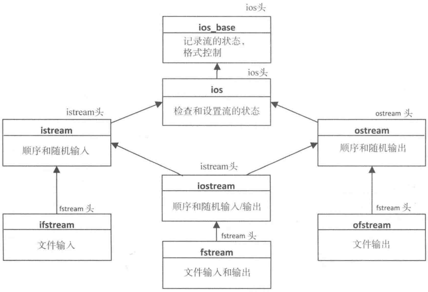

# 第九章 流操作

[TOC]


## 9.1 流迭代器

### 9.1.1 输入流迭代器

```c++
// 生成输入流迭代器示例
std::istream_iterator<string> in{std::cin};
std::istream_iterator<string> end_in;
```

```c++
// 定义输入流迭代器来读取一个包含wchar_t字符的流
std::basic_ifstream<wchar_t> file_in{"no_such_file.txt"};
std::istream_iterator<std::wstring, wchar_t> in{file_in};
std::istream_iterator<std::wstring, wchar_t> end_in;
```

`istream_iterator`对象有下面这些成员函数:

* `operator*()`会返回一个流中当前对象的引用，可以运用这个运算符多次以重读相同的值。
* `operator->()`会返回流中当前对象的地址。
* `operator++()`会从底层输入六中读取一个值，并将它保存到一个迭代器对象中，返回一个迭代器对象的引用。因此，表达式`*++in`的值为最新的被保存的值。这不是一般的用法，因为它可能会跳过流中的第一个值。
* `operator++(int)`会从底层输入流读取一个值，并将它保存到一个迭代器对象中，为使用`operator*()`或`operator->()`访问做准备。在流中的新值被保存之前，这个函数会返回迭代器对象的一个代理。这意味着在读和保存底层输入流中的最新值之前，表达式`*in++`的值是保存在迭代器中的对象。

1. 迭代器和流迭代器

2. 用输入流的成员的函数读取数据

   ```c++
   // 用成员函数读取字符串的代码
   std::cout << "Enter one or more words. Enter ! to end:\n";
   std::istream_iterator<string> in{std::cin};
   std::vector<string> words;
   while(true)
   {
       string word = *in;
       if (word == "!") break;
       words.push_back(word);
       ++in;
   }
   std::cout << "You entered " << words.size() << " words." << std::endl;
   ```

```c++
// Ex9_01.cpp
#include <iostream>
#include <iterator>

int main()
{
    std::cout << "Enter some integers - enter Ctrl+Z to end.\n";
    std::istream_iterator<int> iter{std::cin};
    
    std::istream_iterator<int> copy_iter{iter};
    std::istream_iterator<int> end_iter;
    
    // Read some integers to sum
    int sum{};
    while (iter != end_iter)
    {
        sum += *iter++;
    }
    std::cout << "Total is " << sum << std::endl;
    
    std::cin.clear();
    std::cin.ignore();
    
    // Read integers using the copy of the iterator
    std::cout << "Enter some more integers - enter Ctrl+Z to end.\n";
    int product{1};
    while (true)
    {
        if (copy_iter == end_iter) break;
        product *= *copy_iter++;
    }
    std::cout << "product is " << product << std::endl;
}
```

### 9.1.2 输出流迭代器

输出流迭代器是由ostream_iterator模板定义的，这个模板的第一个模板参数是被写值得类型，第二个模板参数是流中字符的类型；

`ostream_iterator`类型定义了下面这些成员函数：

* `构造函数` 第一个构造函数会用作为第一个参数的ostream对象的输出流生成一个开始迭代器，第二个参数是分隔符字符串。
* `operator=(const T& obj)` 会将obj写到流中，然后写分隔字符串，前提是在构造函数中指定了一个。
* `operator*()` 不做任何事，除了返回迭代器对象。
* `operator++()`和`operator++(int)`都被定义了但不做任何事，除了返回迭代器对象。

```c++
// Ex9_02.cpp
#include <iostream>
#include <iterator>
#include <vector>
#include <algorithm>
#include <string>
using std::string;

int main()
{
    std::vector<string> words{"The", "quick", "brown", "fox", "jumped", "over", "the", "lazy", "dog"};
    
    // Write the words container using conventional iterator notation
    std::ostream_iterator<string> out_iter1{std::cout};
    
    for (const auto& word : words)
    {
        *out_iter1++ = word;
        *out_iter1++ = " ";
    }
    *out_iter1++ = "\n";
    
    for (const auto& word : words)
    {
        (out_iter1 = word) = " ";
    }
    out_iter1 = "\n";
    
    // Write the words container using copy()
    std::ostream_iterator<string> out_iter2{std::cout, " "};
    std::copy(std::begin(words), std::end(words), out_iter2);
    out_iter2 = "\n";
}
```


## 9.2 重载插入和提取运算符

必须为任何想和输入流迭代器一起使用的类类型重载插入和提取运算符。

```c++
class Name
{
private:
    std::string first_name{};
    std::string second_name{};
public:
    Name() = default;
    Name(const std::string& first, const std::string& second) : 
        first_name{first}, second_name{second} {}
    friend std::istream& operator>>(std::istream& in, Name& name);
    friend std::ostream& operator<<(std::ostream& out, const Name& name);
};

inline std::istream& operator>>(std::istream& in, Name& name)
{ return in >> name.first_name >> name.second_name; }

inline std::ostream& operator<<(std::ostream& out, const Name& name)
{ return out << name.first_name << ' ' << name.second_name; }

// 用流迭代器来读和写name对象
std::cout << "Enter names as first-name second-name. Enter Ctrl+Z on a separate line to end:\n";
std::vector<Name> names{std::istream_iterator<Name>{std:cin},
                        std::istream_iterator<Name>{}};
std::copy(std::begin(names), std::end(names), std::ostream_iterator<Name>{std::cout, " "});

// 通过检查ostream对象的实际类型，在标准输出流的输出中包含一些额外信息
inline std::ostream& operator<<(std::ostream& out, const Name& name)
{
    if (typeid(out) != typeid(std::ostream))
        return out << name.first_name << " " << name.second_name;
    else
        return out << "Name: " << name.first_name << ' ' << name.second_name;
}
```


## 9.3 对文件使用流迭代器

### 9.3.1 文件流

文件流封装了一个实际的文件；在文本模式下，数据是字符的序列；在二进制模式下，内存和流之间是以字节的形式传送数据的，不需要转换。

### 9.3.2 文件流类的模板

文件流打开状态：

* binary：会将文件设置成二进制模式。如果没有设置二进制模式，默认的模式是文本模式。
* app：在每个写操作(append operation)之前会移动到文件的末尾。
* ate：会在打开文件之后(at the end),移到文件的末尾。
* in：打开文件来读。对于ifstream和fstream来说，这是默认的。
* out：打开文件来写。对于ostream和fstream来说，这是默认的。
* trune：将当前存在的文件长度截断为0。



*表示文件流的类模板的继承层次结构*

### 9.3.3 用流迭代器进行文件输入

```c++
// Ex9_03.cpp
#include <iostream>
#include <fstream>
#include <iterator>
#include <string>
#include <set>
#include <vector>
#include <algorithm>
using std::string;

int main()
{
    // Read words from the file into a set container
    string file_in{"007.txt"};
    std::ifstream in{file_in};
    if (!in)
    {
        std::cerr << file_in << " not open." << std::endl;
        exit(1);
    }
    std::set<string> dictionary{ std::istream_iterator<string>(in),
                                 std::istream_iterator<string>() };
    std::cout << dictionary.size() << " words in dictionary." << std::endl;
    
    std::vector<string> words;
    string word;
    while (true)
    {
        std::cout << "\nEnter a word, or Ctrl+Z to end: ";
        if ((std::cin >> word).eof()) break;
        string word_copy{word};
        do
        {
            if (dictionary.count(word))
                words.push_back(word);
            std::next_permutation(std::begin(word), std::end(word));
        } while(word != word_copy);
        
        std::copy(std::begin(words), std::end(words), std::ostream_iterator<string>{std::cout, " "});
        std::cout << std::endl;
        words.clear();
    }
    in.close();
}
```

### 9.3.4 用流迭代器来反复读文件

```c++
// Ex9_04.cpp

int main()
{
    string file_in{"007.txt"};
    std::ifstream in{file_in};
    if (!in)
    {
        std::cerr << file_in << " not open." << std::endl;
        exit(1);
    }
    auto end_iter = std::istream_iterator<string>{};
    
    std::vector<string> words;
    string word;
    
    while(true)
    {
        std::cout << "\nEnter a word, or Ctrl+Z to end: ";
        if ((std::cin >> word).eof()) break;
        string word_copy{word};
        do
        {
            in.seekg(0);
            
            if (std::find(std::istream_iterator<string>(in), end_iter, word) != end_iter)
                words.push_back(word);
            else
                in.clear();
            
            std::next_permutation(std::begin(word), std::end(word));
        } while(word != word_copy);
        
        std::copy(std::begin(words), std::end(words), std::ostream_iterator<string>{ std::cout, " " });
        std::cout << std::endl;
        words.clear();
    }
    in.close();
}
```

### 9.3.5 用流迭代器输出文件

```c++
// Ex9_05.cpp
#include <iostream>
#include <fstream>
#include <iterator>
#include <string>

int main()
{
    string file_in{"007.txt"};
    std::ifstream in{file_in};
    if (!in)
    {
        std::cerr << file_in << " not open." << std::endl;
        exit(1);
    }
    string file_out{"007.txt"};
    std::ofstream out{file_out, std::ios_base::out | std::ios_base::trunc};
    std::copy(std::istream_iterator<string>{in}, std::istream_iterator<string>{},
              std::ostream_iterator<string>{out, " "});
    in.clear();
    std::cout << "Original file length: " << in.tellg() << std::endl;
    std::cout << "File copy length: " << out.tellp() << std::endl;
    in.close();
    out.close();
}
```


## 9.4 流迭代器和算法

```c++
// Ex9_06.cpp
#include <iostream>
#include <iterator>
#include <iomanip>
#include <fstream>
#include <algorithm>
#include <string>
using std::string;

int main()
{
    string file_in{"007.txt"};
    std::ifstream in{file_in};
    if (!in)
    {
        std::cerr << file_in << " not open." << std::endl;
        exit(1);
    }
    string letters{"abcdefghijklmnopqrstuvwxyz"};
    const size_t perline{9};
    for (auto ch : lctters)
    {
        std::cout << ch << ": " << std::setw(5) << std::count_if(
                std::istream_iterator<string>{in}, 
                std::istream_iterator<string>{},
                [&ch](const string& s){ return s[0] == ch; })
            << (((ch - 'a' + 1) % perl;ine) ? " " : "\n");
        in.clear();
        in.seekg(0);
    }
    std::cout << std::endl;
}
```

```c++
// Ex9_07.cpp
#include <iostream>
#include <iterator>
#include <iomanip>
#include <fstream>
#include <algorithm>
#include <string>
using std::string;

int main()
{
    string file_name{"007.txt"};
    std::fstream_fibonacci{file_name, 
        std::ios_base::in | std::ios_base::out | std::ios_base::trunc};
    if (!fibonacci)
    {
        std::cerr << file_name << " not open." << std::endl;
        exit(1);
    }
    unsigned long long first{0ULL}, second{1ULL};
    auto iter = std::ostream_iterator<unsigned long long>{ fibonacci, " " };
    (iter = first) = second;
    const size_t n{50};
    std::generate_n(iter, n, [&first, &second]{
        auto result = first + second;
        first = second;
        second = result;
    });
    fibonacci.seekg(0);
    std::for_each(std::istream_iterator<unsigned long long>{fibonacci},
                  std::istream_iterator<unsigned long long>{},
                  [](unsigned long long k){
                      const size_t perline{6};
                      static size_t count{};
                      std::cout << std::setw(12) << k < ((++count % perline) ? " " : "\n");
                  });
    std::cout << std::endl;
    fibonacci.close();
}
```

```c++
// Ex9_08.cpp
#include <iostream>
#include <iterator>
#include <iomanip>
#include <fstream>
#include <algorithm>
#include <random>
#include <string>
using std::string;

int main()
{
    string file_name{"007.txt"};
    std::ofstream temp_out{file_name, std::ios_base::out | std::ios_base::trunc};
    const size_t n{50};
    
    std::random_device rd;
    std::mt19937 rng{rd()};
    double mu{50.0}, sigma{15.0};
    std::normal_distribution<> normal{mu, sigma};
    
    // Write random temperatures to the file
    std::generate_n(std::ostream_iterator<double>{temps_out, " "}, n,
                    [&rng, &normal]{ return normal(rng); });
    temps_out.close();
    
    std::ifstream temps_in{file_name};
    for_each(std::istream_iterator<double>{temps_in}, std::istream_iterator<double>{},
             [](double t){
                 const size_t perline{10};
                 static size_t count{};
                 std::cout << std::fixed << std::setprecision(2) << std::setw(5) << t
                           << ((++count % perl;ine) ? " " : "\n");
             });
    std::cout << std::endl;
    temps_in.close();
}
```


## 9.5 流缓冲区迭代器

### 9.5.1 输入流缓冲区迭代器

```c++
// 将一个流对象传给构造函数
std::istreambuf_iterator<char> in{std::cin};
```

输入流缓冲区迭代器有下面这些成员函数：

- `operator*()` 返回的是流中当前字符的副本。流的位置不会被提前，因此可以反复的获取当前字符。
- `opertor->()` 可以访问当前字符的成员 - 如果它有成员的话。
- `operator++()`和`operator++(int)`都 TODO