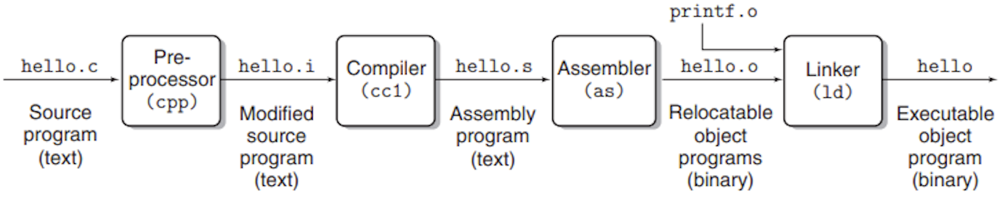
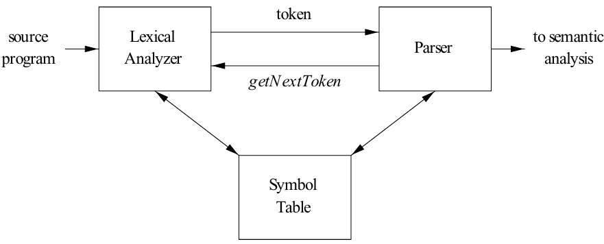
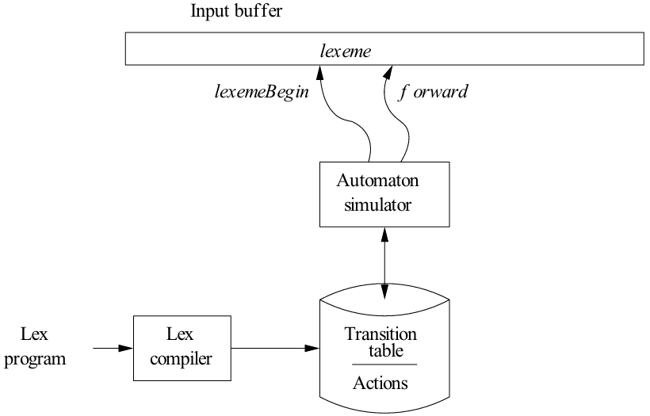
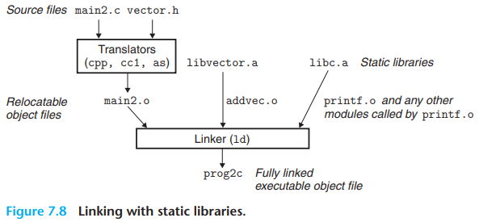
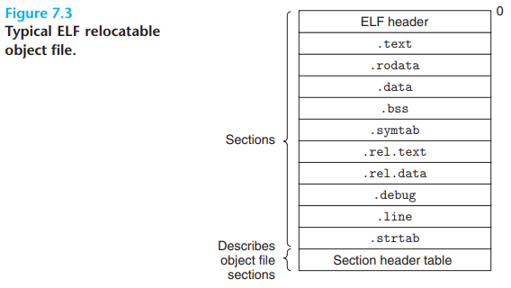
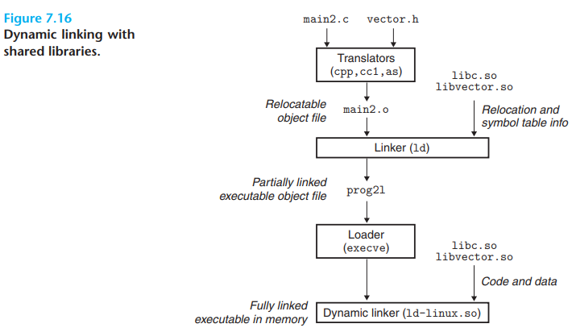

# Compile & Link — concise guide

[TOC]

This file condenses the key compile-and-link concepts (lexing, parsing, automata, object formats, and linking) into a practical reference. Diagrams in `res/` illustrate the pipeline and object layouts.

## Overview of the compilation system

The compilation pipeline transforms source code into an executable image. Typical stages include preprocessing, lexical analysis, parsing, semantic checks, IR generation and optimization, code generation, assembly, and linking.

## Compilation

### Lexical Analysis

The main task of the lexical analyzer is to read the input characters of the source program, group them into lexemes, and produce as output a sequence of tokens for each lexeme in the source program.

*Interactions between the lexical analyzer and the parser*

Since the lexical analyzer is the part of the compiler that reads the source text, it may perform certain other tasks besides the identification of lexemes:

- tripping out comments and `whitespace`.
- correlating error messages generated by the compiler with the source program.

Sometimes, lexical analyzers are divided into a cascade of two processes:

1. `Scanning` consists of simple processes that do not require tokenization of the input, such as deletion of comments and compaction of consecutive whitespace characters into one.
2. `Lexical analysis` proper is the more complex portion, which produces tokens from the output of the scanner.

When discussing lexical analysis, we use three related but distinct terms:

- A `token` is a pair consisting of a token name and an optional attribute value.
- A `pattern` is a description of the form that the lexemes of a token may take.
- A `lexeme` is a sequence of characters in the source program that matches the pattern for a token and is identified by the lexical analyzer as an instance of that token.

### Operations on Languages

Definitions of operations on languages:

| OPERATION                    | DEFINITION AND NOTATION                                      |
| ---------------------------- | ------------------------------------------------------------ |
| Union of $L$ and $M$         | $L \cup M = \{s|s \text{ is in } L \text{ or } s \text{ is in } M\}$ |
| Concatenation of $L$ and $M$ | $LM = \{st|s \text{ is in } L \text{ and } t \text{ is in } M\}$ |
| Kleene closure of $L$        | $L^{*} = \cup_{i = 0}^{\infty} L^{i}$                        |
| Positive closure of $L$      | $L^{+} = \cup_{i = 1}^{\infty} L^{i}$                        |

### Regular Expressions

BASIS: There are two rules that form the basis:

1. $\epsilon$ is a regular expression, and $L(\epsilon)$ is $\{\epsilon\}$, that is, the language whose sole member is the empty string.
2. If $a$ is a symbol in $\sum$, then $a$ is a regular expression, and $L(a) = \{a\}$, that is, the language with one string, of length one, with $a$ in its one position.

INDUCTION: There are four parts to the induction whereby larger regular expressions are built from smaller ones. Suppose $r$ and $s$ are regular expressions denoting languages $L(r)$ and $L(s)$, respectively:

1. $(r)|(s)$ is a regular expression denoting the language $L(r) \cup L(s)$.
2. $(r)(s)$ is a regular expression denoting the language $L(r)L(s)$.
3. $(r)^{*}$ is a regular expression denoting $(L(r))^{*}$.
4. $(r)$ is a regular expression denoting $L(r)$.

As defined, regular expressions often contain unnecessary pairs of parentheses. We may drop certain pairs of parentheses if we adopt the conventions that:

1. The unary operator $*$ has the highest precedence and is left associative.
2. Concatenation has the second-highest precedence and is left associative.
3. $|$ has the lowest precedence and is left associative.

Algebraic laws for regular expressions:

| LAW                                 | DESCRIPTION                                     |
| ----------------------------------- | ----------------------------------------------- |
| $r|s = s|r$                         | $|$ is commutative                              |
| $r|(s|t) = (r|s)|t$                 | $|$ is associative                              |
| $r(st) = (rs)t$                     | Concatenation is associative                    |
| $r(s|t) = rs|rt; (s|t)r = sr|tr$    | Concatenation distributes over $|$              |
| $\varepsilon r = r \varepsilon = r$ | $\varepsilon$ is the identity for concatenation |
| $r^{*} = (r|\varepsilon)^{*}$       | $\varepsilon$ is guaranteed in a closure        |
| $r^{**} = r^{*}$                    | $*$ is idempotent                               |

If $\sum$ is an alphabet of basic symbols, then a `regular definition` is a sequence of definitions of the form:
$$
d_1 \rightarrow r_1 \\
d_2 \rightarrow r_2 \\
\cdots \\
d_n \rightarrow r_n
$$

, where:

- Each $d_i$ is a new symbol, not in $\sum$ and not the same as any other of the $d$'s, and
- Each $r_i$ is a regular expression over the alphabet $\sum \cup \{d_1, d_2, \cdots, d_{i-1}\}$.

### Nondeterministic Finite Automata

A `nondeterministic finite automaton(NFA)` consists of:

1. A finite set of states $S$.
2. A set of input symbols $\sum$, the `input alphabet`. We assume that $\epsilon$, which stands for the empty string, is never a member of $\sum$.
3. A `transition function` that gives, for each state, and for each symbol in $\sum \cup \{\epsilon\}$ a set of `next states`.
4. A state $s_0$ from $S$ that is distinguished as the `start state`(or `initial state`).
5. A set of states $F$, a subset of $S$, that is distinguished as the `accepting states`(or `final states`).

### Deterministic Finite Automata

A `deterministic finite automaton(DFA)` is a special case of an NFA where:

1. There are no moves on input $\epsilon$, and 
2. For each state $s$ and input symbol $a$, there is exactly one edge out of $s$ labeled $a$.

**Algorithm 3.18:** Simulating a DFA.

INPUT: An input string $x$ terminated by an end-of-file character **eof**. A DFA $D$ with start state $s_0$, accepting states $F$, and transition function `move`.

OUTPUT: Answer "yes" if $D$ accepts $x$; "no" otherwise.

METHOD: Apply the algorithm in Fig. 3.27 to the input string $x$. The function $move(s, c)$ gives the state to which there is an edge from state $s$ on input $c$. The function $nextChar$ returns the next character of the input string $x$.

### Conversion of an NFA to a DFA

The general idea behind the subset constructions is that each state of the constructed DFA corresponds to a set of NFA states.

**Algorithm 3.20:** The `subset construction` of a DFA from an NFA.

INPUT: An NFA $N$.

OUTPUT: A DFA $D$ accepting the same language as $N$.

METHOD: Our algorithm constructs a transition table `Dtran` for $D$. Each state of $D$ is a set of NFA states, and we construct Dtran so $D$ will simulate "in parallel" all possible moves $N$ can make on a given input string.

Operations on NFA states:

| OPERATION                | DESCRIPTION                                                  |
| ------------------------ | ------------------------------------------------------------ |
| $\varepsilon-closure(s)$ | Set of NFA states reachable from NFA state $s$ on $\varepsilon$-transitions alone. |
| $\varepsilon-closure(T)$ | Set of NFA states reachable from some NFA state $s$ in set $T$ on $\varepsilon$-transitions alone; $= \cup_{s \text{ in } T} \varepsilon-colsure(s)$. |
| $move(T, a)$             | Set of NFA states to which there is a transition on input symbol $a$ from some state $s$ in $T$. |

**Algorithm 3.22:** Simulating an NFA.

INPUT: An input string $x$ terminated by an end-of-file character **eof**. An NFA $N$ with start state $s_0$, accepting states $F$, and transition function $move$.

OUTPUT: Answer "yes" if $N$ accepts $x$; "no" otherwise.

METHOD: The algorithm keeps a set of current states $S$, those that are reached from $s_0$​ following a path labeled by the inputs read so far.

### Converting a Regular Expression Directly to a DFA

**Algorithm 3.36:** Construction of a DFA from a regular expression $r$.

INPUT: A regular expression $r$.

OUTPUT: A DFA $D$ that recognizes $L(r)$.

METHOD: 

1. Construct a syntax tree $T$ from the augmented regular expression `(r)#`.

2. Compute `nullable, firstpos, lastpos, and followpos` for $T$, using the methods of Sections 3.9.3 and 3.9.4.

3. Construct `Dstates`, the set of states of DFA $D$, and `Dtran`, the transition function for $D$, by the procedure of Fig.3.6.2

### Design of a Lexical-Analyzer  Generator

*A Lex program is turned into a transition table and actions, which are used by a finite-automaton simulator*

These components are:

1. A transition table for the automaton.
2. Those functions that are passed directly through $Lex$ to the output.
3. The actions from the input program, which appear as fragments of code to be invoked at the appropriate time by the automaton simulator.

## Linking

Linking is the process of collecting and combining various pieces of code and data into a single file that can be `loaded` (copied) into memory and executed.

Given this notion of strong and weak symbols, Linux linkers use the following rules for dealing with duplicate symbol names:

- Rule 1. Multiple strong symbols with the same name are not allowed.
- Rule 2. Given a strong symbol and multiple weak symbols with the same name, choose the strong symbol.
- Rule 3. Given multiple weak symbols with the same name, choose any of the weak symbols.

### ELF

Compilers and assemblers generate relocatable object files (including shared object files). Linkers generate executable object files. Technically, an `object module` is a sequence of bytes, and an `object file` is an object module stored on disk in a file.

- `ELF header` The ELF header begins with a 16-byte sequence that describes the word size and byte ordering of the system that generated the file. 
- `.text` The machine code of the compiled program.
- `.rodata` Read-only data such as the format strings in printf statements, and jump tables for switch statements.
- `.data` Initialized global and static C variables. Local C variables are maintained at run time on the stack and do not appear in either the `.data` or `.bss` sections.
- `.bss` Uninitialized global and static C variables, along with any global or static variables that are initialized to zero. 
- `.symtab` A symbol table with information about functions and global variables that are defined and referenced in the program. 
- `.rel.text` A list of locations in the `.text` section that will need to be modified when the linker combines this object file with others. 
- `.rel.data` Relocation information for any global variables that are referenced or defined by the module. 
- `.debug` A debugging symbol table with entries for local variables and typedefs defined in the program, global variables defined and referenced in the program, and the original C source file. It is only present if the compiler driver is invoked with the `-g` option.
- `.line` A mapping between line numbers in the original C source program and machine code instructions in the `.text` section. It is only present if the compiler driver is invoked with the `-g` option.
- `.strtab` A string table for the symbol tables in the `.symtab` and `.debug` sections and for the section names in the section headers. 

### Static Linking

Static linkers are invoked by compiler drivers such as GCC. They combine multiple relocatable object files into a single executable object file. Multiple object files can define the same symbol, and the rules that linkers use for silently resolving these multiple definitions can introduce subtle bugs in user programs.

### Dynamic Linking

Shared libraries are modern innovations that address the disadvantages of static libraries. A shared library is an object module that, at either run time or load time, can be loaded at an arbitrary memory address and linked with a program in memory. This process is known as `dynamic linking` and is performed by a program called a `dynamic linker`.

The dynamic linker then finishes the linking task by performing the following relocations:

- Relocating the text and data of `libc.so` into some memory segment.
- Relocating the text and data of `libvector.so` into another memory segment.
- Relocating any references in `prog21` to symbols defined by `libc.so` and `libvector.so`.

## Reference

[1] Randal E. Bryant, David R. O'Hallaron . COMPUTER SYSTEMS: A PROGRAMMER'S PERSPECTIVE . 3ED