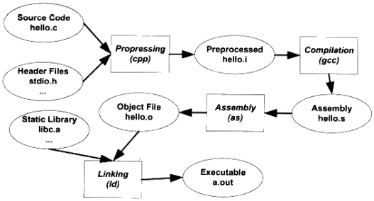
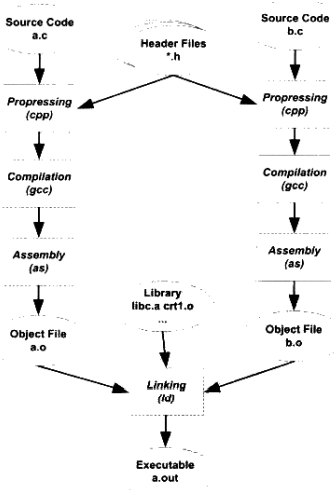
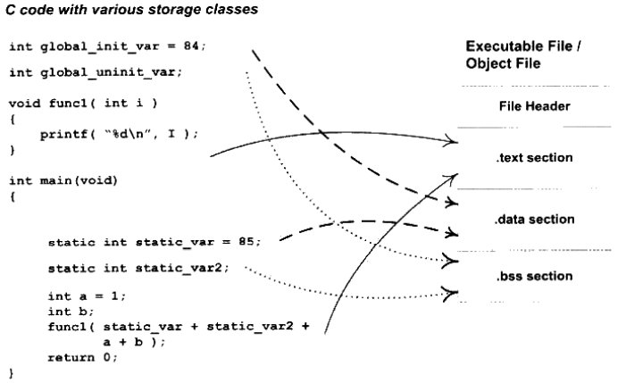

# 编译与链接

[TOC]


## 编译流程



*GCC编译程序的步骤*

1. `预处理（Prepressing）`

   预编译过程主要处理源代码文件中的以`#`开始的预编译指令，主要处理规则如下：

   - 将所有的`#define`删除，并且展开所有的宏定义。
   - 处理所有条件预编译指令，比如`#if`, `#ifdef`, `#elif`, `#else`, `#endif`。
   - 处理`#include`预编译指令，将被包含的文件插入到该预编译指令的位置（递归进行）。
   - 删除所有的注释（`//`，`/* */`）。
   - 添加行号和文件名标识，以便于编译时编译器产生调试用的行号信息及用于编译时产生编译错误或警告时能够显示行号。
   - 保留所有的`#pragma`

   GCC的预处理命令（`-E`表示只进行预编译）：

   ```sh
   gcc -E hello.c -o hello.i
   ```

2. `编译（Compilation）`

   编译过程就是把预处理完的文件进行一系列词法分析，语法分析，语义分析及优化后生成相应的汇编代码文件。

   GCC的编译命令（`-S`标识只进行编译）：

   ```sh
   gcc -S hello.i -o hello.s
   ```

3. `汇编（Assembly）`

   汇编器是将汇编代码转变为机器指令，每一条汇编语句对应一条机器指令。

   GCC的汇编指令：

   ```sh
   gcc -c hello.s -o hello.o
   ```

4. `链接（Linking）`

   链接方式分为以下几种：

   - 静态链接
   - 动态链接

   链接过程主要包括以下步骤：

   

   - `地址和空间分配（Address and Storage Allocation）`
   - `符号决议（Symbol Resolution）`
   - `重定位（Relocation）`

   GCC的链接指令：

   ```sh
   ld -static crt1.o crti.o crtbeginT.o hello.o -start -group -lgcc -lgcc_eh -lc -end-group crtend.o crtn.o
   ```


## 静态链接

TODO


## 动态链接

TODO


## 运行库

TODO


## 目标文件

### 分类

|                              | Windows                 | Linux                           |
| ---------------------------- | ----------------------- | ------------------------------- |
| 可执行文件格式（Executable） | PE(Portable Executable) | ELF(Executable Linkable Format) |

*可执行文件格式分类，都属于COFF（Common File Format）格式的变种*

| ELF文件类型                            | 说明                                                         | 实例                                                |
| -------------------------------------- | ------------------------------------------------------------ | --------------------------------------------------- |
| 可重定位文件<br>（Relocatable File）   | 这类文件包含了代码和数据，可以被用来链接成可执行文件或共享目标文件，静态链接库也可为这一类 | Linux的`.o`<br>Windows的`.obj`                      |
| 可执行文件<br>（Executable File）      | 这类文件包含了可以直接执行的程序，它的代表就是ELF可执行文件，它们一般都没有扩展名 | 比如`/bin/bash`文件<br>Windows的`.exe`              |
| 共享目标文件<br>（Shared Object File） | 这种文案金包含了代码和数据，可以在以下两种情况下使用：<br>1. 连接器可以使用这种文件跟其它的可重定位文件和共享目标文件链接，产生新的目标文件。<br>2. 动态链接器可以将几个这种共享目标文件与克制性文件结合，作为进程映像的一部分来运行。 | Linux的`.so`，如`/lib/glibc-2.5.so`<br>Windows的DLL |
| 核心转储文件<br>（Core Dump File）     | 当进程意外终止时，系统可以将该进程的地址空间的内容及终止时的一些其它信息转储到核心转储文件。 | Linux下的core dump                                  |

*ELF文件分类*

### 文件结构



*目标文件（.obj）结构*

| 1    | ELF Header                            |
| ---- | ------------------------------------- |
| 2    | .text                                 |
| 3    | .data                                 |
| 4    | .bss                                  |
| 5    | ...<br>other sections                 |
| 6    | Section header table                  |
| 7    | String Tables<br>Symbol Tables<br>... |

*ELF结构*

| 成员        | 含义                                                         |
| ----------- | ------------------------------------------------------------ |
| e_ident     |                                                              |
| e_type      | ELF文件类型：<br>  `ET_REL` = 1，可重定位文件，一般为`.o`文件。<br>  `ET_EXEC` = 2，可执行文件。<br>  `ET_DYN` = 3，共享目标文件，一般为`.so`文件。 |
| e_machine   | ELF文件的CPU平台属性（相关常量以`EM_`开头）：<br>  `EM_M32` = 1，AT&T WE 32100。<br>  `EM_SPARC` = 2，SPARC。<br>  `EM_386` = 3，Intel x86。<br>  `EM_68K` = 4，Motorola 68000。<br>  `EM_88K` = 5， Motorola 88000。<br>  `EM_860` = 6， Intel 80860。 |
| e_version   | ELF版本号（一般为1）。                                       |
| e_entry     | 入口地址，规定ELF程序的入口虚拟地址，操作系统在加载完该程序后从这个地址开始执行进程的指令。可重定位文案金一般没有入口地址，则这个值为0。 |
| e_phoff     |                                                              |
| e_shoff     | 段表在文件中的偏移。                                         |
| e_word      | ELF标志位，用来标识一些ELF文件平台相关的属性。相关常量的格式一般为`EF_machine_flag`，machine为平台，flag为标志。 |
| e_ehsize    | 即ELF文件头本身的大小。                                      |
| e_phentsize |                                                              |
| e_phnum     |                                                              |
| e_shentsize | 段表描述符的大小（一般等于`sizeof(Elf32_Shdr)`）。           |
| e_shnum     | 段表描述符数量（这个值等于ELF文件中拥有的段的数量）。        |
| e_shstrndx  | 段表字符串表所在的段在段表中的下标。                         |

*ELF文件头结构成员含义*

| 常用的段名         | 说明                                                         |
| ------------------ | ------------------------------------------------------------ |
| `.text`            | 代码段，存放代码。                                           |
| `.data`            | 数据段，存放**已初始化**的全局静态变量和局部静态变量。       |
| `.bss`             | BSS段，存放**未初始化**的全局变量和局部静态变量。            |
| `.rodata`          | Read only Data，这种段里存放的是只读数据，比如字符串常量，全局const变量。跟`.rodata`一样。 |
| `.comment`         | 存放的是编译器版本信息，比如字符串：“GCC:(GNU)4.2.0”。       |
| `.debug`           | 调试信息。                                                   |
| `.dynamic`         | 动态链接信息。                                               |
| `.hash`            | 符号哈希表。                                                 |
| `.line`            | 调试时的行号表，即源代码行号与编译后指令的对应表。           |
| `.note`            | 额外的编译器信息，比如程序的公司名，发布版本号等。           |
| `.strtab`          | String Table字符串表，用于存储ELF文件中用到的各种字符串。    |
| `.symtab`          | Symbol Table符号表。                                         |
| `.shstrtab`        | Section String Table段名表。                                 |
| `.plt`<br>`.got`   | 动态连接的跳转表和全局入口表。                               |
| `.init`<br>`.fini` | 程序初始化与终结代码段。                                     |

### 命令

1. 查看目标文件的结构和内容命令：

   ```sh
   objdump -h hello.o
   ```

2. 查看ELF文件的代码段(`.text`)，数据段(`.data`)和BSS段(`.bss`)的长度：

   ```sh
   size hello.o
   ```

3. 查看ELF文件：

   ```sh
   readelf -h hello.o
   ```


## 参考

[1] 俞甲子，石凡，潘爱民 . 程序员的自我修养 - 链接，装在与库 . 1ED
