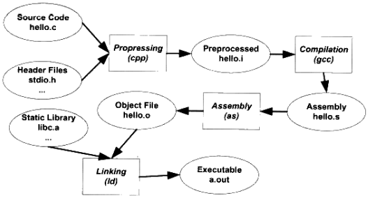
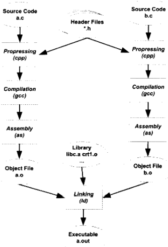
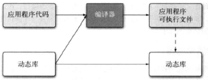
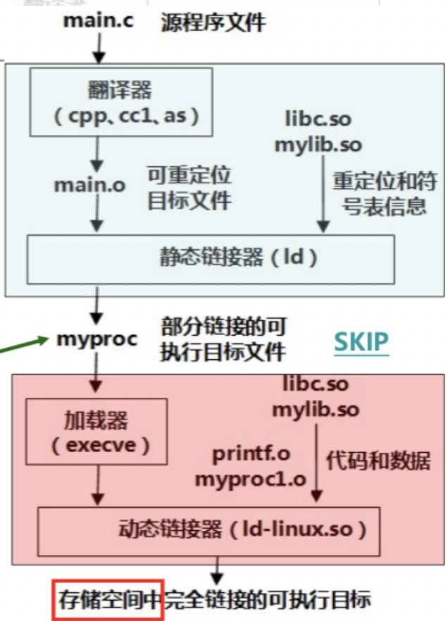
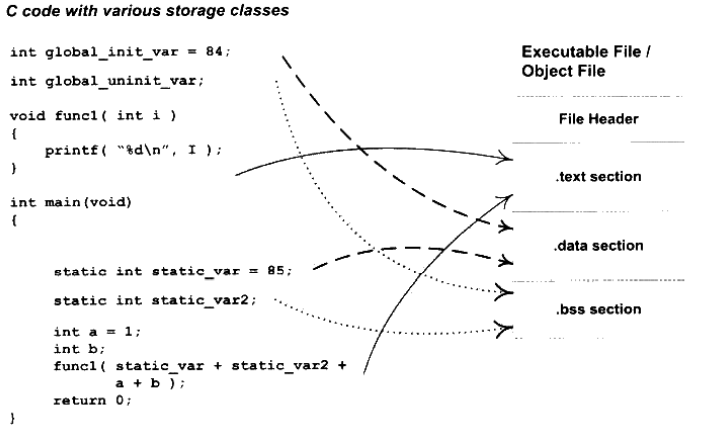

[English](compile_and_link.md) | 中文版

# 编译与链接

[TOC]


## 编译流程



*GCC编译程序的步骤*

1. `预处理（Prepressing）`

   预编译过程主要处理源代码文件中的以`#`开始的预编译指令，主要处理规则如下：

   - 将所有的`#define`删除，并且展开所有的宏定义。
   - 处理所有条件预编译指令，比如`#if`, `#ifdef`, `#elif`, `#else`, `#endif`。
   - 处理`#include`预编译指令，将被包含的文件插入到该预编译指令的位置（递归进行）。
   - 删除所有的注释（`//`，`/* */`）。
   - 添加行号和文件名标识，以便于编译时编译器产生调试用的行号信息及用于编译时产生编译错误或警告时能够显示行号。
   - 保留所有的`#pragma`

   GCC的预处理命令（`-E`表示只进行预编译）：

   ```sh
   gcc -E hello.c -o hello.i
   ```

2. `编译（Compilation）`

   编译过程就是把预处理完的文件进行一系列词法分析，语法分析，语义分析及优化后生成相应的汇编代码文件。

   GCC的编译命令（`-S`标识只进行编译）：

   ```sh
   gcc -S hello.i -o hello.s
   ```

3. `汇编（Assembly）`

   汇编器是将汇编代码转变为机器指令，每一条汇编语句对应一条机器指令。

   GCC的汇编指令：

   ```sh
   gcc -c hello.s -o hello.o
   ```

4. `链接（Linking）`

   链接方式分为以下几种：

   - 静态链接
   - 动态链接

   链接过程主要包括以下步骤：

   

   - `地址和空间分配（Address and Storage Allocation）`
   - `符号决议（Symbol Resolution）`
   - `重定位（Relocation）`

   GCC的链接指令：

   ```sh
   ld -static crt1.o crti.o crtbeginT.o hello.o -start -group -lgcc -lgcc_eh -lc -end-group crtend.o crtn.o
   ```


## 静态链接

### 静态库

静态库也称为存档文件，文件中中包含目标代码，这些目标代码会被链接到最终用户的应用程序，并成为其中的一部分。

在`*nix`系统上，静态库以`.a`为文件扩展名；在windows系统上，静态库以`.lib`为文件扩展名。


### 优缺点

| 优点                                   | 缺点                                                         |
| -------------------------------------- | ------------------------------------------------------------ |
| + 运行时不需要额外的运行时依赖项。<br> | - 有多个可执行程序时，每一个都需要包含静态库的副本，包体较大。<br>- 对于热更新时，需要替换整个可执行程序。 |


## 动态链接

动态链接库（Dynamic Link Library，DLL），是一个目标文件，包含代码和数据，它可以在程序运行时动态的加载并链接。



### 优缺点

| 优点                                               | 缺点                                                         |
| -------------------------------------------------- | ------------------------------------------------------------ |
| + 多个应用程序可以共享同一份依赖，从而减少包体积。 | - 发布程序时必须带上所有依赖的库，否则无法运行。<br>- 动态库只需要加载一次（不去卸载），静态库每次运行时都需要加载。<br>- 热更新方便 |

### 动态链接器

#### LINUX/UNIX

动态链接器主要用来加载动态链接库文件，可执行文件的程序头表中包含`.interp段`，其中包含了动态链接器路径。

程序的结构头如下图所示：



1. 加载器加载动态链接器

2. 动态链接器完成相应的重定位工作

3. 将控制权交给可执行文件

动态链接器有以下分类：

- `ld.so` 针对a.out格式的二进制可执行文件
- `ld-linux.so` 针对ELF格式的二进制可执行文件

### 生成

在编译时要加入以下选项：

- `-ldl` 指定dl库
- `-rdynamic` 通知链接器将所有符号添加到动态符号表中，使能够通过dlopen来实现向后跟踪

例：

```sh
gcc -rdynamic -o test.c test -ldl
```

### 加载

#### LINUX/UNIX

搜索动态链接库文件的顺序：

1. 搜索`DT_RPATH`标记**(仅限ELF)**

   如果调用程序的可执行文件包含`DT_RPATH`标记，并且不包含`DT_RUNPATH`标记，则会搜索`DT_RPATH`标记中列出的目录。

2. 搜索环境变量：

   - `LD_AOUT_LIBRARY_PATH` a.out格式

   - `LD_LIBRARY_PATH` ELF格式

   **在linux中`LD_PRELOAD`指定的目录具有最高优先权。**

3. 搜索`DT_RUNPATH`标记**(仅限ELF)**

   如果调用程序的可执行文件包含`DT_RUNPATH`标记，则搜索该标记中列出的目录。

4. 搜索缓存文件`/etc/ld.so.cache`

5. 搜索默认目录

   先在`/lib`中寻找，再到`/usr/lib`中寻找。

### API

类unix系统提供`dlopen`，`dlmopen`，`dlsym`，`dlclose`等函数来操作动态共享库文件，这些函数都位于头文件`<dlfcn.h>`中

#### dlopen

```c
void *dlopen(const char *filename, int flags)
```

- `filename` 动态共享库文件路径（绝对路径/相对路径）+文件名

- `flags` 标记

  必选：

  - `RTLD_LAZY` 延迟绑定，仅在执行引用他们的代码时解析符号。
  - `RTLD_NOW` 立即绑定，解析所有未定义符号；如果设置了环境变量**LD_BIND_NOW**也可以起到同样的效果。

  可选：

  - `RTLD_GLOBAL` 此共享对象的符号将可用于后续加载的共享对象的符号解析。
  - `RTLD_LOCAL` 与RTLD_GLOBAL相反，如果位置定任何标志，则为默认值；此共享对象中定义的符号不可用于解析后续加载的共享对象中的引用。
  - `RTLD_NODELETE` 在dlclose()期间不要写在共享对象，如果稍后使用dlopen()重新加载对象，则不会重新初始化对象的静态变量。
  - `RTLD_NOLOAD` 不要加载共享对象。
  - `RTLD_DEEPBIND` 将符号的查找范围放在此共享对象的全局范围之前。这意味着自包含对象将优先使用自己的符号，而不是全局符号，这些符号包含在已加载的对象中。

- 返回值

  - 成功：动态链接库句柄
  - 失败：NULL

加载动态共享库文件，其[文件搜索流程在此](#加载)；如果`filename`为NULL，则返回的句柄用于主程序。如果`filename`指定的对象依赖于其它共享对象，动态链接器也会自动加载这些对象。

用例：

```c++
dlopen("./libsd.so", RTLD_LAZY);
```

#### dlmopen

TODO

#### dlsym

```c
void *dlsym(void *handle, const char *symbol)
```

- `handle` 动态链接库句柄
- `symbol` 要求获取的函数或全局变量的名称
- 返回值
  - 成功：指向函数/变量的地址
  - 失败：NULL

解析动态链接库符号，返回符号对应的地址；

用例：

```c++
void(*pMyFun)();
auto handle = dlopen("./my.so", RTLD_LAZY);
pMyFun = (vodi(*))dlsym(handle, "MyFun");
pMyFun();
```

#### dlclose

```c
int dlclose(void *handle)
```

- `handle` 动态链接库句柄
- 返回值
  - 成功：0
  - 失败：非0

关闭指定句柄的动态链接库；**注意：只有当此动态链接库的使用计数为0时，才会真正被系统卸载。**

用例：

```c++
auto handle = dlopen("./my.so", RTLD_LAZY);
dlclose(handle);
```

### 工程经验

#### 导出接口类

定义一个抽象类（都是纯虚函数），调用者跟dll共用一个抽象类的头文件，dll中实现此抽象类的派生类，dll最少只需要提供一个用于获取抽象类对象指针的接口。


## 运行库

TODO


## 目标文件

### 分类

|                              | Windows                 | Linux                           |
| ---------------------------- | ----------------------- | ------------------------------- |
| 可执行文件格式（Executable） | PE(Portable Executable) | ELF(Executable Linkable Format) |

*可执行文件格式分类，都属于COFF（Common File Format）格式的变种*

| ELF文件类型                            | 说明                                                         | 实例                                                |
| -------------------------------------- | ------------------------------------------------------------ | --------------------------------------------------- |
| 可重定位文件<br>（Relocatable File）   | 这类文件包含了代码和数据，可以被用来链接成可执行文件或共享目标文件，静态链接库也可为这一类 | Linux的`.o`<br>Windows的`.obj`                      |
| 可执行文件<br>（Executable File）      | 这类文件包含了可以直接执行的程序，它的代表就是ELF可执行文件，它们一般都没有扩展名 | 比如`/bin/bash`文件<br>Windows的`.exe`              |
| 共享目标文件<br>（Shared Object File） | 这种文案金包含了代码和数据，可以在以下两种情况下使用：<br>1. 连接器可以使用这种文件跟其它的可重定位文件和共享目标文件链接，产生新的目标文件。<br>2. 动态链接器可以将几个这种共享目标文件与克制性文件结合，作为进程映像的一部分来运行。 | Linux的`.so`，如`/lib/glibc-2.5.so`<br>Windows的DLL |
| 核心转储文件<br>（Core Dump File）     | 当进程意外终止时，系统可以将该进程的地址空间的内容及终止时的一些其它信息转储到核心转储文件。 | Linux下的core dump                                  |

*ELF文件分类*

### 文件结构



*目标文件（.obj）结构*

| 1    | ELF Header                            |
| ---- | ------------------------------------- |
| 2    | .text                                 |
| 3    | .data                                 |
| 4    | .bss                                  |
| 5    | ...<br>other sections                 |
| 6    | Section header table                  |
| 7    | String Tables<br>Symbol Tables<br>... |

*ELF结构*

| 成员        | 含义                                                         |
| ----------- | ------------------------------------------------------------ |
| e_ident     |                                                              |
| e_type      | ELF文件类型：<br>  `ET_REL` = 1，可重定位文件，一般为`.o`文件。<br>  `ET_EXEC` = 2，可执行文件。<br>  `ET_DYN` = 3，共享目标文件，一般为`.so`文件。 |
| e_machine   | ELF文件的CPU平台属性（相关常量以`EM_`开头）：<br>  `EM_M32` = 1，AT&T WE 32100。<br>  `EM_SPARC` = 2，SPARC。<br>  `EM_386` = 3，Intel x86。<br>  `EM_68K` = 4，Motorola 68000。<br>  `EM_88K` = 5， Motorola 88000。<br>  `EM_860` = 6， Intel 80860。 |
| e_version   | ELF版本号（一般为1）。                                       |
| e_entry     | 入口地址，规定ELF程序的入口虚拟地址，操作系统在加载完该程序后从这个地址开始执行进程的指令。可重定位文案金一般没有入口地址，则这个值为0。 |
| e_phoff     |                                                              |
| e_shoff     | 段表在文件中的偏移。                                         |
| e_word      | ELF标志位，用来标识一些ELF文件平台相关的属性。相关常量的格式一般为`EF_machine_flag`，machine为平台，flag为标志。 |
| e_ehsize    | 即ELF文件头本身的大小。                                      |
| e_phentsize |                                                              |
| e_phnum     |                                                              |
| e_shentsize | 段表描述符的大小（一般等于`sizeof(Elf32_Shdr)`）。           |
| e_shnum     | 段表描述符数量（这个值等于ELF文件中拥有的段的数量）。        |
| e_shstrndx  | 段表字符串表所在的段在段表中的下标。                         |

*ELF文件头结构成员含义*

| 常用的段名         | 说明                                                         |
| ------------------ | ------------------------------------------------------------ |
| `.text`            | 代码段，存放代码。                                           |
| `.data`            | 数据段，存放**已初始化**的全局静态变量和局部静态变量。       |
| `.bss`             | BSS段，存放**未初始化**的全局变量和局部静态变量。            |
| `.rodata`          | Read only Data，这种段里存放的是只读数据，比如字符串常量，全局const变量。跟`.rodata`一样。 |
| `.comment`         | 存放的是编译器版本信息，比如字符串：“GCC:(GNU)4.2.0”。       |
| `.debug`           | 调试信息。                                                   |
| `.dynamic`         | 动态链接信息。                                               |
| `.hash`            | 符号哈希表。                                                 |
| `.line`            | 调试时的行号表，即源代码行号与编译后指令的对应表。           |
| `.note`            | 额外的编译器信息，比如程序的公司名，发布版本号等。           |
| `.strtab`          | String Table字符串表，用于存储ELF文件中用到的各种字符串。    |
| `.symtab`          | Symbol Table符号表。                                         |
| `.shstrtab`        | Section String Table段名表。                                 |
| `.plt`<br>`.got`   | 动态连接的跳转表和全局入口表。                               |
| `.init`<br>`.fini` | 程序初始化与终结代码段。                                     |

### 命令

1. 查看目标文件的结构和内容命令：

   ```sh
   objdump -h hello.o
   ```

2. 查看ELF文件的代码段(`.text`)，数据段(`.data`)和BSS段(`.bss`)的长度：

   ```sh
   size hello.o
   ```

3. 查看ELF文件：

   ```sh
   readelf -h hello.o
   ```


## 参考

[1] 俞甲子，石凡，潘爱民 . 程序员的自我修养 - 链接，装在与库 . 1ED
