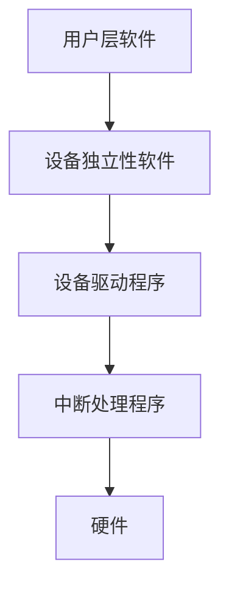

# 设备管理

[TOC]

## 设备分类

## 缓冲

## I/O层次

## 三大表

### 控制器控制表`<COCT>`;

### 通道控制表`<CHCT>`;

### 系统设备表`<SDT>`;

## 磁盘调度方法

### 先来先服务(FCFS)

### 最短寻道时间优先(SSTF)

### 电梯调度算法(SCAN)

### 循环扫描算法(CSCAN)

### NSTEPSCAN

### FSCAN

## 廉价磁盘冗余阵列(RAID)

即把一个文件分割成多份，分别将每一份存入不同的磁盘，使用时多个磁盘同时工作，同时存取； 

### 分级

RAID可分为：0， 1， 3， 5， 6， 7 共六级