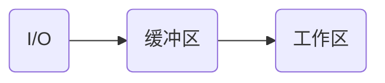
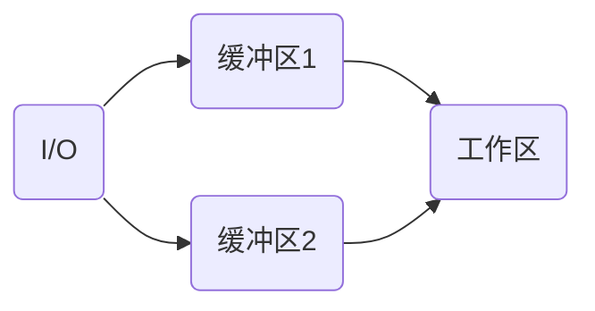
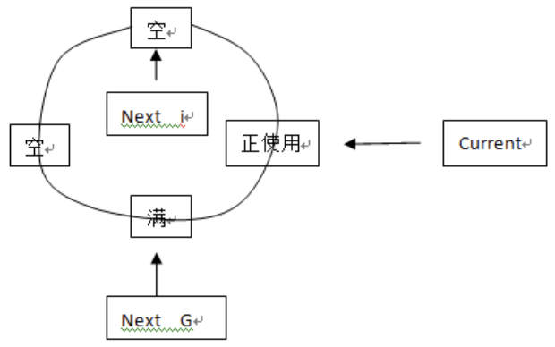

# 设备管理

[TOC]

## 设备分类

按使用特征分

1. 存储设备
2. 输入/输出设备

按传输速率分

1. 低速
2. 中速
3. 高速

按信息交换的单位分

1. 块设备
2. 字符设备

按共享属性分

1. 独占设备
2. 共享设备
3. 虚拟设备

## I/O控制

## 缓冲

### 单缓冲

### 双缓冲

### 循环缓冲

### 缓冲池

## I/O层次

## 7.逻辑设备表`<LUT>`

逻辑设备名 + 物理设备名 + 驱动程序入口

## 三大表

### 控制器控制表`<COCT>`;

### 通道控制表`<CHCT>`;

### 系统设备表`<SDT>`;

## 磁盘调度方法

### 先来先服务(FCFS)

### 最短寻道时间优先(SSTF)

### 电梯调度算法(SCAN)

### 循环扫描算法(CSCAN)

### NSTEPSCAN

### FSCAN

## 廉价磁盘冗余阵列(RAID)

即把一个文件分割成多份，分别将每一份存入不同的磁盘，使用时多个磁盘同时工作，同时存取； 

### 分级

RAID可分为：0， 1， 3， 5， 6， 7 共六级；