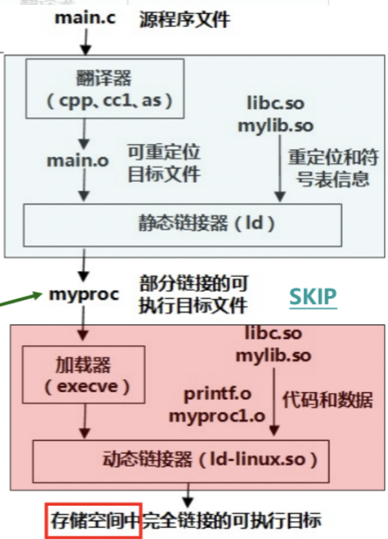

[TOC]

# 动态链接库

动态链接库（Dynamic Link Library，DLL），是一个目标文件，包含代码和数据，它可以在程序运行时动态的加载并链接。


## 动态链接器

### LINUX/UNIX

动态链接器主要用来加载动态链接库文件，可执行文件的程序头表中包含`.interp段`，其中包含了动态链接器路径。

程序的结构头如下图所示：



1. 加载器加载动态链接器

2. 动态链接器完成相应的重定位工作

3. 将控制权交给可执行文件

动态链接器有以下分类：

- `ld.so` 针对a.out格式的二进制可执行文件
- `ld-linux.so` 针对ELF格式的二进制可执行文件


## 生成

在编译时要加入以下选项：

- `-ldl` 指定dl库
- `-rdynamic` 通知链接器将所有符号添加到动态符号表中，使能够通过dlopen来实现向后跟踪

例：

```sh
gcc -rdynamic -o test.c test -ldl
```


## 加载

### LINUX/UNIX

搜索动态链接库文件的顺序：

1. 搜索`DT_RPATH`标记**(仅限ELF)**

   如果调用程序的可执行文件包含`DT_RPATH`标记，并且不包含`DT_RUNPATH`标记，则会搜索`DT_RPATH`标记中列出的目录。

2. 搜索环境变量：

   - `LD_AOUT_LIBRARY_PATH` a.out格式

   - `LD_LIBRARY_PATH` ELF格式

   **在linux中`LD_PRELOAD`指定的目录具有最高优先权。**

3. 搜索`DT_RUNPATH`标记**(仅限ELF)**

   如果调用程序的可执行文件包含`DT_RUNPATH`标记，则搜索该标记中列出的目录。

4. 搜索缓存文件`/etc/ld.so.cache`

5. 搜索默认目录

   先在`/lib`中寻找，再到`/usr/lib`中寻找。


## API

类unix系统提供`dlopen`，`dlmopen`，`dlsym`，`dlclose`等函数来操作动态共享库文件，这些函数都位于头文件`<dlfcn.h>`中

### dlopen

```c
void *dlopen(const char *filename, int flags)
```

- `filename` 动态共享库文件路径（绝对路径/相对路径）+文件名

- `flags` 标记

  必选：

  - `RTLD_LAZY` 延迟绑定，仅在执行引用他们的代码时解析符号。
  - `RTLD_NOW` 立即绑定，解析所有未定义符号；如果设置了环境变量**LD_BIND_NOW**也可以起到同样的效果。

  可选：

  - `RTLD_GLOBAL` 此共享对象的符号将可用于后续加载的共享对象的符号解析。
  - `RTLD_LOCAL` 与RTLD_GLOBAL相反，如果位置定任何标志，则为默认值；此共享对象中定义的符号不可用于解析后续加载的共享对象中的引用。
  - `RTLD_NODELETE` 在dlclose()期间不要写在共享对象，如果稍后使用dlopen()重新加载对象，则不会重新初始化对象的静态变量。
  - `RTLD_NOLOAD` 不要加载共享对象。
  - `RTLD_DEEPBIND` 将符号的查找范围放在此共享对象的全局范围之前。这意味着自包含对象将优先使用自己的符号，而不是全局符号，这些符号包含在已加载的对象中。

- 返回值

  - 成功：动态链接库句柄
  - 失败：NULL

加载动态共享库文件，其[文件搜索流程在此](#加载)；如果`filename`为NULL，则返回的句柄用于主程序。如果`filename`指定的对象依赖于其它共享对象，动态链接器也会自动加载这些对象。

用例：

```c++
dlopen("./libsd.so", RTLD_LAZY);
```

### dlmopen

TODO

### dlsym

```c
void *dlsym(void *handle, const char *symbol)
```

- `handle` 动态链接库句柄
- `symbol` 要求获取的函数或全局变量的名称
- 返回值
  - 成功：指向函数/变量的地址
  - 失败：NULL

解析动态链接库符号，返回符号对应的地址；

用例：

```c++
void(*pMyFun)();
auto handle = dlopen("./my.so", RTLD_LAZY);
pMyFun = (vodi(*))dlsym(handle, "MyFun");
pMyFun();
```

### dlclose

```c
int dlclose(void *handle)
```

- `handle` 动态链接库句柄
- 返回值
  - 成功：0
  - 失败：非0

关闭指定句柄的动态链接库；**注意：只有当此动态链接库的使用计数为0时，才会真正被系统卸载。**

用例：

```c++
auto handle = dlopen("./my.so", RTLD_LAZY);
dlclose(handle);
```


## 参考

- [维基百科-动态链接库](https://zh.wikipedia.org/wiki/%E5%8A%A8%E6%80%81%E9%93%BE%E6%8E%A5%E5%BA%93)
- [维基百科-动态链接器](https://zh.wikipedia.org/wiki/%E5%8A%A8%E6%80%81%E8%BF%9E%E6%8E%A5%E5%99%A8)
- [加载动态链接库——dlopen dlsym dlclose](https://www.cnblogs.com/ZhaoxiCheung/p/9424930.html)
- [百度百科-dlopen](https://baike.baidu.com/item/dlopen/1967576)
- [百度百科-dlsym](https://baike.baidu.com/item/dlsym)
- [Linux动态链接库的使用](https://www.cnblogs.com/Anker/p/3527677.html)
- [Linux 链接详解----动态链接库](https://blog.csdn.net/zdy0_2004/article/details/78747382)
- [采用dlopen、dlsym、dlclose加载动态链接库](https://www.jianshu.com/p/72cc08405a5a)

