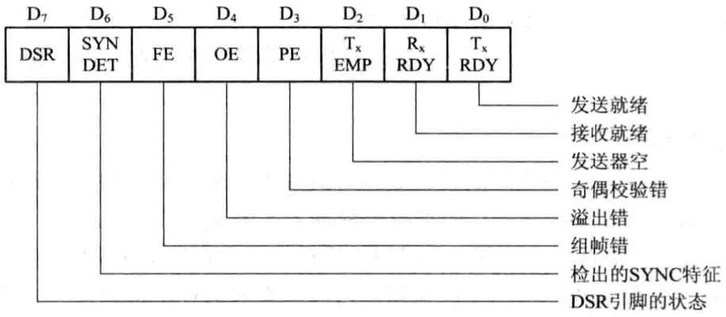
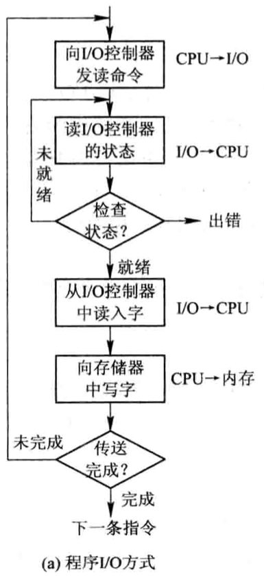
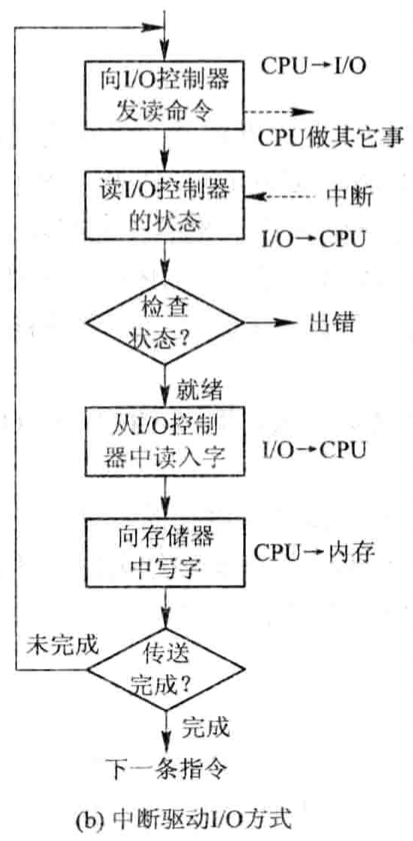
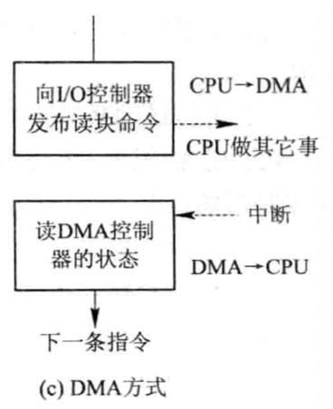
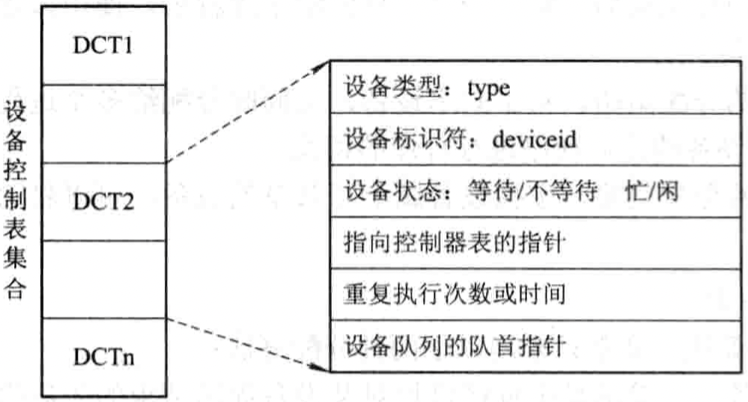
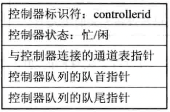
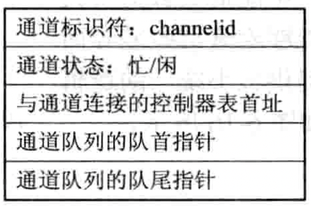
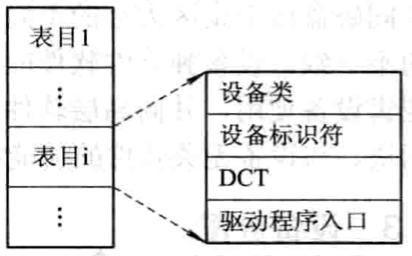
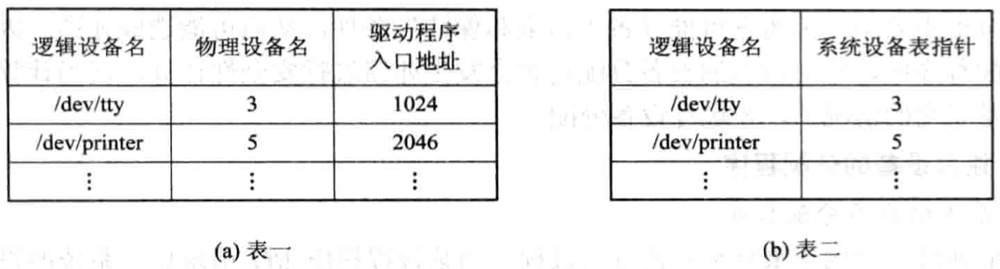

English | [中文版](drive_zh.md)

# Driver

[TOC]

## Functions

- Receives commands and parameters from device-independent software and translates the abstract requirements in the commands into device-specific low-level operation sequences.
- Checks the validity of I/O requests, understands the working status of I/O devices, passes parameters related to I/O device operations, and sets the device's working mode.
- Issues I/O commands: if the device is idle, it immediately starts the I/O device to complete the specified I/O operation; if the device is busy, it queues the request block for the requester on the device queue to wait.
- Responds promptly to interrupt requests from the device controller and, according to the interrupt type, calls the corresponding interrupt handler for processing.

## Processing Procedure

1. Convert abstract requirements into specific requirements;
2. Validate service requests;
3. Check device status
	
	*Format of the status register*
4. Transfer necessary parameters;
5. Start the I/O device.

### I/O Device Control

1. Programmed I/O using polling
	
2. Programmed I/O using interrupts
	
3. Direct Memory Access (DMA)
	
4. I/O Channel Control
	The I/O channel method is an evolution of the DMA method. It further reduces CPU intervention, changing the intervention from per data block (read or write) to per group of data blocks and related control and management. At the same time, it enables parallel operation of the CPU, channel, and I/O devices, thus improving overall system resource utilization.

	Channel instructions contain the following information:
	1. `Opcode`: Specifies the operation performed by the instruction, such as read, write, control, etc.
	2. `Memory address`: Indicates where to send characters in memory (for read) or the starting address for write operations.
	3. `Count`: Number of bytes to read (or write) for this instruction.
	4. `Channel program end bit P`: Indicates whether the channel program ends. $P=1$ means this is the last instruction of the channel program.
	5. `Record end flag R`: $R=0$ means this channel instruction and the next process data belonging to the same record; $R=1$ means this is the last instruction for a record.

## Device Allocation

### Device Control Table (DCT)

### Controller Control Table (COCT)

### Channel Control Table (CHCT)

### System Device Table (SDT)

## Mapping Logical Device Names to Physical Device Names

### Logical Unit Table (LUT)

The logical device table can be set in the system in the following ways:

- Set only one LUT for the entire system
  Since the device allocation for all processes is recorded in the same LUT, duplicate logical device names are not allowed in the LUT. This requires all users not to use the same logical device name, mainly used in single-user systems.
- Set one LUT for each user
  Whenever a user logs in, the system creates a process for the user and also creates an LUT for the user, placing the table in the process's PCB.
