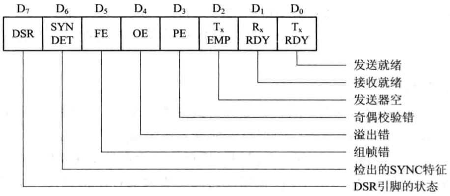
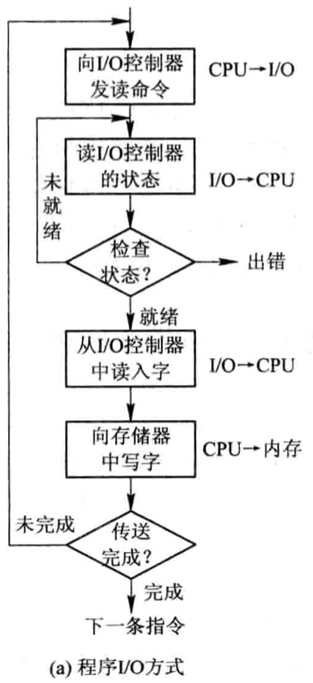
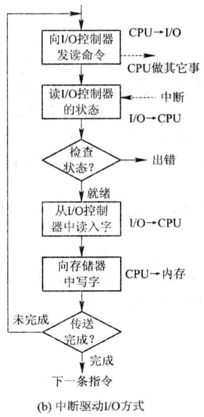
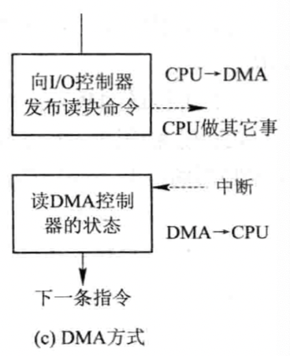
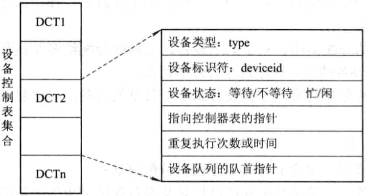
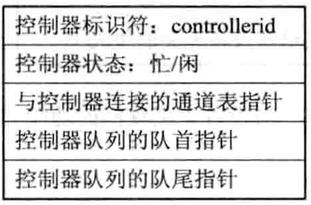
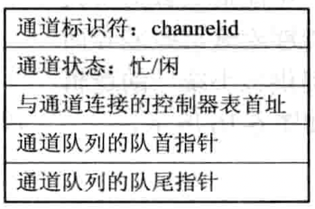
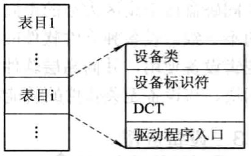
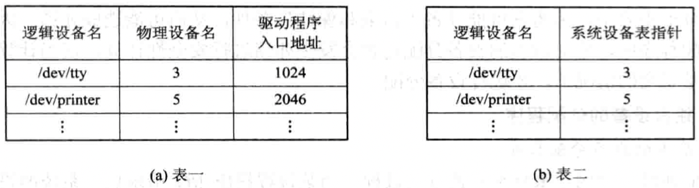

# 驱动

[TOC]

## 功能

- 接收由与设备无关的软件发来的命令和参数，并将命令中的抽象要求转换为与设备相关的底层操作序列。
- 检查用于I/O请求的合法性，了解I/O设备的工作状态，传递与I/O设备操作有关的参数，设置设备的工作方式。
- 发出I/O命令，如果设备空闲，便立即启动I/O设备，完成指定的I/O操作；如果设备忙碌，则将请求者的请求块挂在设备队列上等待。
- 及时响应由设备控制器发来的中断请求，并根据其中断类型，调用相应的中断处理程序进行处理。

## 处理过程

1. 将抽象要求转换为具体要求；

2. 对服务请求进行校验；

3. 检查设备的状态

   

   *状态寄存器中的格式*

4. 传送必要的参数；

5. 启动I/O设备。

### I/O设备控制

1. 使用轮询的可编程I/O方式

   

2. 使用中断的可编程I/O方式

   

3. 直接存储器访问方式

   

4. I/O通道控制方式

   I/O通道方式是DMA方式的发展，它可进一步减少CPU的干预，即把对一个数据块的读（或写）为单位的干预，减少为对一组数据块的读（或写）及有关的控制和管理为单位的干预。同时，又可实现CPU，通道和I/O设备三者的并行操作，从而更有效地提高整个系统的资源利用率。

   通道指令包含如下信息：

   1. `操作码` 它规定了指令所执行的操作，如读，写，控制等操作。
   2. `内存地址` 标明字符送入内存（读操作）和从内存取出（写操作时的内存首址）。
   3. `计数` 表示本条指令所要读（或写）数据的字节数。
   4. `通道程序结束位P` 用于表示通道程序是否结束。$P=1$表示本条指令是通道程序的最后一条指令。
   5. `记录结束标志R` $R=0$表示本通道指令与吓一跳指令所处理的数据是同属于一个记录；$R=1$表示这是处理某记录的最后一跳指令。

## 设备分配

### 设备控制表(DCT)

### 控制器控制表(COCT)

### 通道控制表(CHCT)

### 系统设备表(SDT)

## 逻辑设备名到物理设备名映射

### 逻辑设备表(Logicl Unit Table, LUT)

在系统中可采用以下方式设置逻辑设备表：

- 在整个系统中只设置一张LUT

  由于系统中所有进程的设备分配情况都记录在同一张LUT中，因而不允许在LUT中具有相同的逻辑设备名，这就要求所有用户都不使用相同的逻辑设备名，主要用于单用户系统中。

- 为每个用户设置一张LUT

  每当用户登录时，系统便为该用户建立一个进程，同时也为之建立一张LUT，并将该表放入进程的PCB中。
