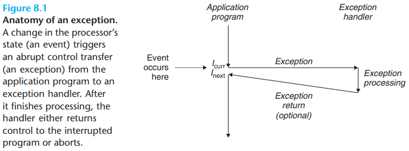
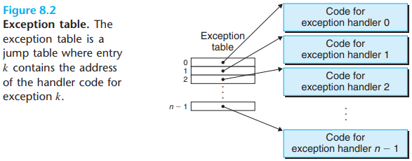
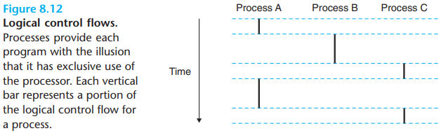

# Exceptional control flow — concise guide

[TOC]

This note explains exceptional control flow (ECF): interrupts, traps, and faults — how the processor and OS detect events, transfer control to handlers, and (sometimes) resume interrupted execution. The focus is practical: what happens to registers and stacks, kernel vs user-mode semantics, and common examples (page faults, divide-by-zero, timer interrupts).

## 1. Definitions and categories

- Exception (general): an abrupt change in a program's control flow due to some event detected by the processor or runtime.
- Interrupt (asynchronous): an externally triggered event (e.g., I/O device, timer) that may occur at almost any time.
- Trap (synchronous): a synchronous event raised by the currently executing instruction (e.g., breakpoint, system call). Traps typically transfer control to the OS after the instruction completes.
- Fault (synchronous, recoverable): a synchronous event that occurs before the instruction completes and that may be handled so the instruction can be retried (e.g., page fault where the page is loaded and the instruction restarted).

These terms overlap in practice; the OS and hardware classify events according to how they should be handled.

## 2. Anatomy of an exception

When the processor detects an event that requires attention, it performs a controlled transfer to an exception handler:

1. Save state: the processor saves some machine state (program counter, status registers, and sometimes minimal context) needed to resume or report the fault.
2. Change privilege: the CPU switches to kernel (supervisor) mode and switches to the kernel stack.
3. Dispatch: the CPU jumps to a handler chosen via an exception vector or exception table. The handler is responsible for completing the required work.
4. Return: depending on the event, the handler either restarts the interrupted instruction, resumes at the next instruction, or terminates the process.

Key points:
- The saved return address may be either the faulting instruction or the logically next instruction — hardware defines which.
- Additional registers or processor state may be pushed to the kernel stack so the handler can examine and restore execution context.
- Handlers execute in kernel mode with privileged access to system resources.

## 3. Exception table / vector table

Hardware provides an exception/interrupt vector table: a small, fixed table used to select the appropriate entry point for an event type. The firmware or OS initializes this table at boot.

The vector table maps event numbers (interrupt numbers, trap numbers) to handler entry addresses. On entry, handlers run with a minimal context; complex handling code typically saves/restores more registers and uses standard kernel prologue/epilogue sequences.

## 4. Stack and context during exceptions

- Kernel vs user stack: when control transfers from user code to the kernel, the CPU switches to the kernel stack (per-CPU or per-thread) before running handler prologue.
- Saved context: the CPU will either push part of the context automatically or provide a mechanism for the handler to store the rest. The OS typically saves registers, faulting instruction pointer, and processor status words.
- Restoring execution: the handler must restore the saved state correctly to resume execution or perform a safe exit.

Practical advice:
- Handlers should minimize time spent in high-privilege mode and defer work (e.g., for interrupts) to lower-priority kernel threads when possible.

## 5. Synchronous vs asynchronous events

- Synchronous events (traps/faults) are caused by the executing instruction and are reproducible (same instruction and state → same exception).
- Asynchronous events (interrupts) are caused by external devices or timers and are not tied to a particular instruction.

This distinction affects how handlers behave: synchronous faults may allow the OS to restart or emulate the instruction; asynchronous interrupts normally cannot be associated with a single instruction and are handled by service routines.

## 6. Examples (common events)

- Page fault (fault): memory access to a page not present or with insufficient permissions. The OS can load the page and restart the instruction, or kill the process for illegal access.
- Divide-by-zero (trap/fault): arithmetic exception raised by the CPU; usually delivered to the process as a signal (e.g., SIGFPE) or handled by the OS.
- System call (trap): user code invokes a software trap (e.g., via `int 0x80` or `syscall`) to switch to the kernel and request services.
- Timer interrupt (interrupt): periodic tick from the timer to drive scheduling or preemption.

## 7. Exception handling design notes

- Minimal hardware support and clear ABI: hardware should provide a minimal, well-documented context (saved PC, status) so the OS can handle events portably.
- Privilege boundary handling: transfer to kernel mode must carefully sanitize pointers and avoid trusting user-provided data.
- Restartability: for recoverable faults, design handlers to resume the interrupted instruction transparently to user code when safe.

## 8. Logical control flow and concurrency

An execution flow whose duration overlaps another is a concurrent flow. Exceptional control transfers can interrupt logical flows and create interleavings that affect shared state; handlers must use synchronization primitives when accessing shared kernel structures.

## 9. Debugging and diagnostics

- Use kernel logs and diagnostic registers to capture faulting addresses, register snapshots, and stack traces.
- Reproduce synchronous faults with minimal testcases to distinguish between bugs in user code and kernel/firmware issues.

## Summary

Exceptional control flow is the mechanism that lets hardware and OS respond to synchronous and asynchronous events. Correct handling requires careful saving/restoration of state, privilege transitions, and clear conventions for dispatch and return.

## Reference

[1] Randal E. Bryant, David R. O'Hallaron. Computer Systems: A Programmer's Perspective. 3rd ed.
