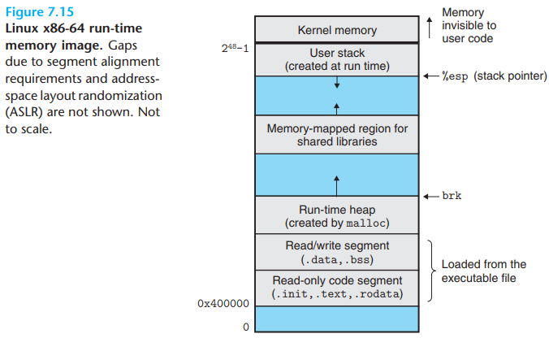

# Executor

[TOC]

## Run-time memory

## Performance

A number of basic strategies for optimizing program performance:

- `High-level design`. Choose appropriate algorithms and data structures for the problem at hand. Be especially vigilant to avoid algorithms or coding techniques that yield asymptotically poor performance.
- `Basic coding principles`. Avoid optimization blockers so that a compiler can generate efficient code.
  1. Eliminate excessive function calls. Move computations out of loops when possible. Consider selective compromises of program modularity to gai greater efficiency.
  2. Eliminate unnecessary memory references. Introduce temporary variables to hold intermediate results. Store a result in an array or global variable only when the final value has been computed.
- `Low-level optimizations`. Structure code to take advantage of the hardware capabilities.
  1. Unroll loops to reduce overhead and to enable further optimizations.
  2. Find ways to increase instruction-level parallelism by techniques such as multiple accumulators and reassociation.
  3. Rewrite conditional operations in a functional style to enable compilation via conditional data transfers.

## Reference

[1] Randal E. Bryant, David R. O'Hallaron . COMPUTER SYSTEMS: A PROGRAMMER'S PERSPECTIVE . 3ED
