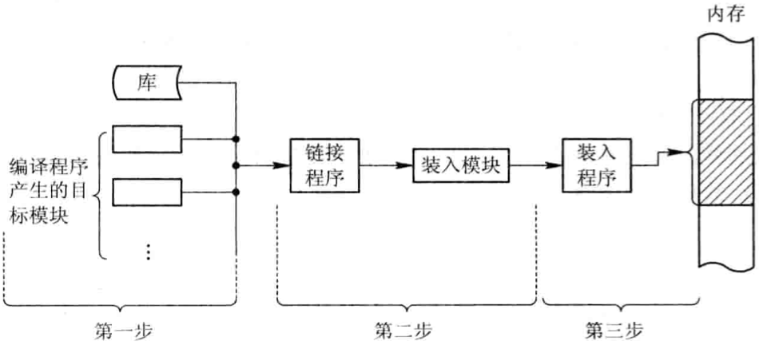

# 可执行程序

<!-- vim-markdown-toc GFM -->

* [可执行文件结构](#可执行文件结构)
* [进程结构](#进程结构)
* [程序的装载和链接](#程序的装载和链接)
    - [程序的装载](#程序的装载)
    - [程序的链接](#程序的链接)
* [参考](#参考)

<!-- vim-markdown-toc -->

## 可执行文件结构

- `正文段` CPU执行的机器指令部分，只读+可共享；编译结束后，大小就确定了，运行过程中不会被改变，可以包含常量数据。

- `初始化数据段` 包含程序中需明确地赋初值的变量。

- `未初始化数据区(bss)` 

  - **全局未初始化变量**
  - **未初始化静态变量**
  
- `栈` 自动变量以及每次函数调用时所需保存的信息都存放在此段中；

  每次函数调用时，其返回地址以及调用者的环境信息都放在栈中；递归函数每次调用自身时，就用一个新的栈帧，因此一次函数调用实例中的变量集不会影响另一次函数调用实例中的变量。

- `堆` 用于动态存储分配。

## 进程结构

地址由高到低：

- 栈区

  向下增长，由编译器自动分配/释放，存放函数的参数值，返回值，局部变量等。

- 堆区

  向上增长，用于手动内存分配/释放，如果没有手动释放，则在程序结束时由OS回收。

- 未初始化数据区(BSS)

  包含以下数据：

  - **全局未初始化变量**
  - **未初始化静态变量**

- 数据区(data)

- 代码段(text)

  可执行文件代码段

## 程序的装载和链接

程序装入内存步骤：

1. `编译` 由编译程序(Compiler)对用户源程序进行编译，形成若干个目标模块(Object Module)；
2. `链接` 由链接程序(Linker)将编译后形成的一组目标模块以及它们所需要的库函数链接在一起，形成一个完整的装入模块(Load Module);
3. `装入` 由装入程序(Loader)将装入模块装入内存。

*对用户程序的处理步骤*

### 程序的装载

1. 绝对装入方式(Absolute Loading Mode, ALM)

   将目标模块装入到内存中事先指定的绝对位置。

2. 可重定位装入方式(Relocation Loading Mode, RLM)

   根据内存的具体情况将装入模块装入到内存的适当位置（程序运行时不允许移动内存中的位置）。

   

   *作业装入内存时的情况*

3. 动态运行时的装入方式(Dynamic Run-time Loading)

   动态运行时的装入程序在把装入模块装入内存后，并不立即把装入模块中的逻辑地址转换为物理地址，而是把这种地址转换推迟到程序真正要执行时才进行。因此，装入内存后的所有地址都仍时逻辑地址。

### 程序的链接

1. `静态链接(Static Linking, SL)`在程序运行前，先将各目标模块及它们所需的库函数链接成一个完整的装配模块，以后不再拆开。
2. `装入时动态链接(Load-time Dynamic Linking, LDL)`编译后得到一组目标模块，在装入内存的过程中去链接所需要的模块。
3. `运行时动态链接(Run-time Dynamic Linking, RDL)`对某些模块的链接推迟到程序执行时才进行，即在运行过程中查找和装入。

链接方式对比：

|      | 静态链接 | 装入时动态链接                             | 运行时动态链接 |
| ---- | -------- | ------------------------------------------ | -------------- |
|      |          | 便于修改和更新 便于实现对目标模块的共享 |                |

## 参考

[1] 汤小丹, 梁红兵, 哲凤屏, 汤子瀛 . 计算机操作系统 . 3th Edition . P120 - P172
