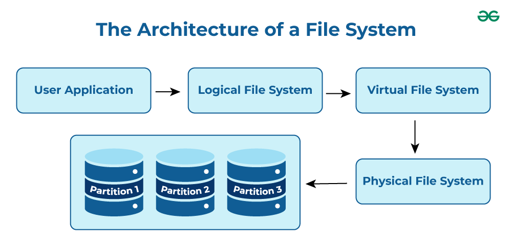
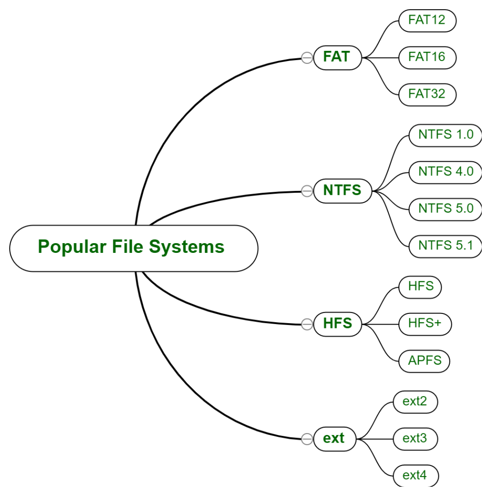
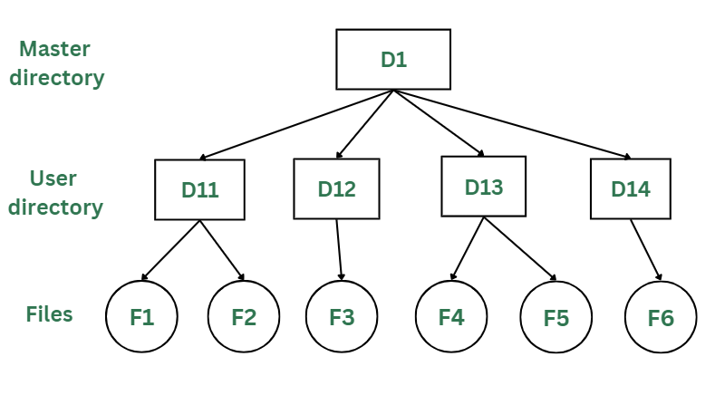
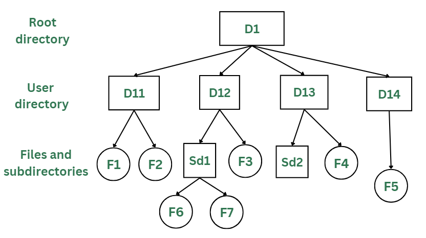
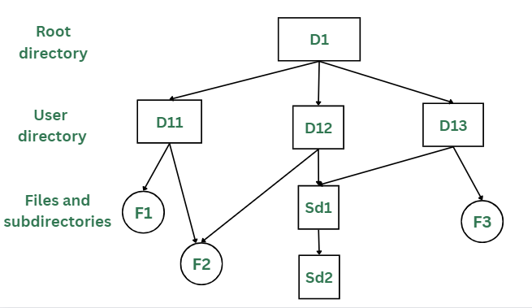
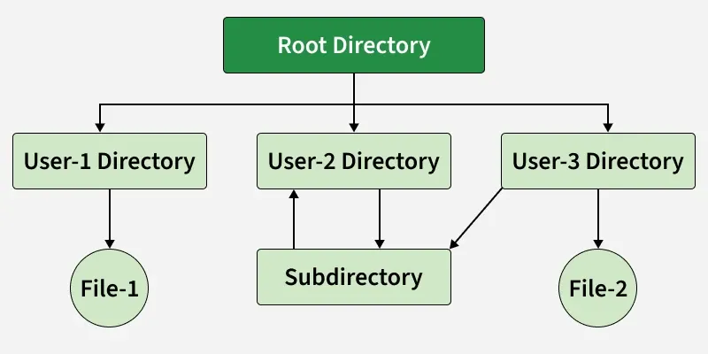
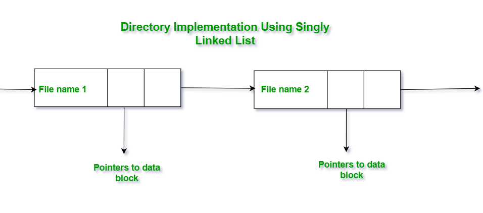
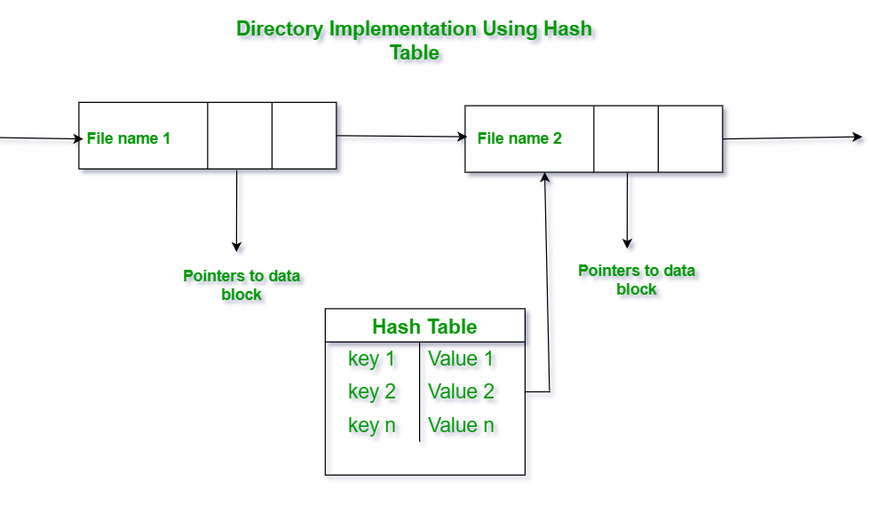
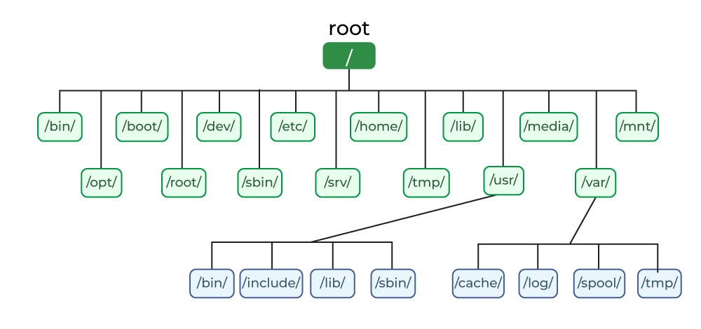
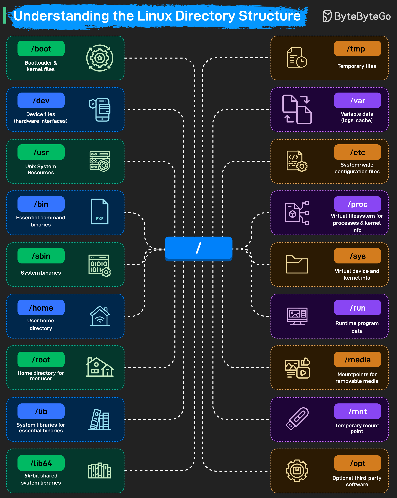

# File System

[TOC]

File systems are a crucial part of any operating system, providing a structured way to store, organize, and manage data on storage devices such as hard drives, SSDs, and USB drives.

## Popular File Systems

---

## Path

When files are organized as a directory tree, there must be a way to uniquely identify and access them. This is done through path names.

### Absolute Path Name

An absolute path name (also known as a full path) specifies the complete path from the root directory ("/") to the target file or directory.

### Relative Path Name

A relative path name specifies the file or directory in relation to the current working directory (also known as the present working directory). It does not start from the root and is shorter and more flexible than an absolute path.

---

## Directory

### Single-Level Directory

In the single-level directory, all files are contained in the same directory, which makes it easy to support and understand.

Disadvantages:

- Slow search speed. For a single-level directory with $N$ directory entries, searching for one entry requires $N/2$ comparisons on average.
- Duplicate names are not allowed.
- Inconvenient for file sharing. A single-level directory requires all users to access the same file using the same name, so it is only suitable for single-user environments.

### Two-Level Directory

In a two-level directory structure, each user has a separate User File Directory (UFD) containing only their files. A Master File Directory (MFD) stores entries for all users and points to their respective UFDs, preventing filename conflicts between users.

Advantages:

- Improves directory lookup speed. If there are $n$ subdirectories in the master directory and each user directory has at most $m$ entries, then finding a specified entry requires searching at most $n + m$ entries.
- The same file name can be used in different user directories;
- Different users can use different names to access the same shared file in the system.

### Tree Structure/Hierarchical Structure

The tree directory structure resembles an upside-down tree, with the root directory at the top containing all user directories. Each user can create files and subdirectories within their own directory but cannot access or modify the root or other users' directories.

### Acyclic Graph Structure

The acyclic graph directory structure allows a file or subdirectory to be shared across multiple directories using links. Changes made by one user are visible to all users sharing that file.

### General-Graph Directory Structure

The general-graph directory avoids loops; the general-graph directory can have cycles, meaning a directory can contain paths that loop back to the starting point. This can make navigating and managing files more complex.

### Directory Implementation

#### Implementation using Singly Linked List

The implementation of directories using a singly linked list is easy to program, but is time-consuming to execute. Here, we implement a directory by using a linear list of filenames with pointers to the data blocks.

Advantages

- Simple Implementation: Easy to implement with low memory overhead.
- Dynamic Structure: Grows or shrinks as needed without fixed size constraints.
- Efficient for Small Directories: Works well when the number of files is small and manageable.
- Low Complexity: No need for collision handling or resizing, making it simpler.

Disadvantages

- Lookup Time: File lookup requires a linear search, which can be time-consuming.
- Impact of Frequent Access: Directory information is accessed frequently, leading to slow access times with larger directories.
- Solution: Caching: Operating systems maintain a cache of recently accessed entries to enable quicker access without full traversal.

#### Implementation using Hash Table

An alternative data structure that can be used for directory implementation is a hash table. It overcomes the major drawbacks of directory implementation using a linked list. In this method, we use a hash table along with a linked list. Here, the linked list stores the directory entries, but a hash data structure is used in combination with the linked list. 

The following steps are taken for the implementation of the directory using the hash table :

1. Combine a hash table with a linked list to implement the directory structure.
2. Generate a key-value pair for each file using a hash function on the file name.
3. Insert the file into the linked list and store the key-pointer pair in the hash table.
4. To search, compute the key using the file name and look it up in the hash table.
5. Fetch the file directly using the pointer from the hash table, avoiding full list traversal.
6. This hybrid method significantly reduces search time and improves efficiency.

Advantages:

- Fast File Lookup: Provides average O(1) time complexity for quick search and retrieval.
- Efficient for Large Directories: Handles large directories with many files without significant performance loss.
- Scalable: Easily accommodates an increasing number of files without degrading access speed.
- Reduced Search Time: Eliminates the need for full traversal, making directory operations faster.

Disadvantage:

- Fixed Size: Limited scalability due to a fixed size, affecting performance as data grows.
- Size Dependent Performance: Performance degrades as the table becomes full (high load factor).
- Collision Handling Complexity: Collisions add complexity and can slow down performance.
- Performance Trade-off: Despite drawbacks, hash tables are faster than linked lists for lookups.

---

## File Protection

### Types of Access

TODO

### Access Control

TODO

---

## Unix File System

Unix (UNiplexed Information Computing System) File System is a logical method of organizing and storing large amounts of information in a way that makes it easy to manage.

### Types

### Soft Link

A soft link (also known as a Symbolic link) acts as a pointer or a reference to the file name. It does not access the data available in the original file. If the earlier file is deleted, the soft link will be pointing to a file that does not exist anymore.

Advantages:

- Versatility in linking files across different localities and document systems.
- Can link directories.

Disadvantages:

- Slightly slower access than hard links.
- Deleting or moving the original file will cause soft links to fail.

### Hard Link

A Hard link acts as a copy (mirrored) of the selected file. It accesses the data available in the original file. If the earlier selected file is deleted, the hard link to the file will still contain the data of that file.

Advantages:

- It makes efficient use of disc space by avoiding the unnecessary creation of record blocks.
- There is no risk of link breaking as a result of the removal of the actual file(as long as one hard hyperlink survives, the data will persist).
- The speed of Hard Links is fast.

Disadvantages:

- Cannot span several file systems.
- Directories cannot be hyperlinked.

### Linux Directory Structure

---

## Summary

### Absolute vs Relative Path

| Criteria   | Absolute Path                                                | Relative Path                                   |
| ---------- | ------------------------------------------------------------ | ----------------------------------------------- |
| Definition | Full path from root directory                                | Path relative to current working directory      |
| Dependency | Independent of working directory                             | Depends on working directory                    |
| Uniqueness | Always unique                                                | May vary depending on the current directory     |
| Usage      | Used in scripts or programs requiring fixed file references. | Used in user-level commands or local navigation |

### Hard Link vs Soft Link

| Comparison Parameters    | Hard link                                                    | Soft link                                                    |
| :----------------------- | :----------------------------------------------------------- | :----------------------------------------------------------- |
| Inode number*            | Files that are hard-linked take the same inode number.       | Files that are soft-linked take a different inode number.    |
| Directories              | Hard links are not allowed for directories. (Only a superuser* can do it) | Soft links can be used for linking directories.              |
| File system              | It cannot be used across file systems.                       | It can be used across file systems.                          |
| Data                     | Data present in the original file will still be available in the hard links. | Soft links only point to the file name, it does not retain the data of the file. |
| Original file's deletion | If the original file is removed, the link will still work as it accesses the data the original was having access to. | If the original file is removed, the link will not work as it doesn't access the original file's data. |
| Speed                    | Hard links are comparatively faster.                         | Soft links are comparatively slower.                         |

## Reference

[1] [File Systems in Operating System](https://www.geeksforgeeks.org/operating-systems/file-systems-in-operating-system/)

[2] [Difference between Hard Link and Soft Link](https://www.geeksforgeeks.org/operating-systems/difference-between-hard-link-and-soft-link/)

[3] [Soft and Hard links in Unix/Linux](https://www.geeksforgeeks.org/linux-unix/soft-hard-links-unixlinux/)

[4] [Directory Implementation in Operating System](https://www.geeksforgeeks.org/operating-systems/directory-implementation-in-operating-system/)

[5] [Protection in File System](https://www.geeksforgeeks.org/operating-systems/protection-in-file-system/)

[6] [EP199: Behind the Scenes: What Happens When You Enter Google.com](https://blog.bytebytego.com/p/ep199-behind-the-scenes-what-happens)
