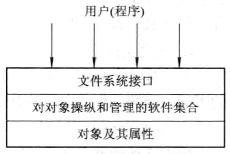
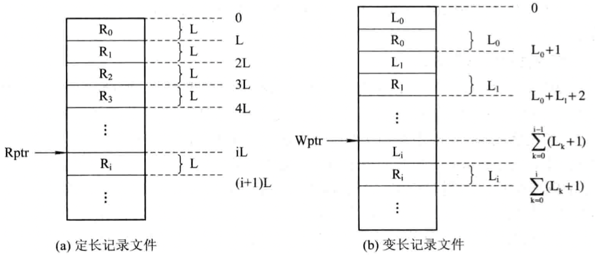
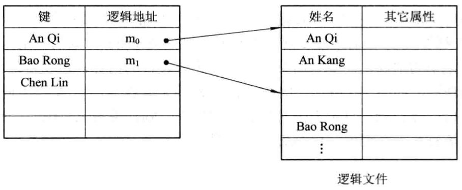
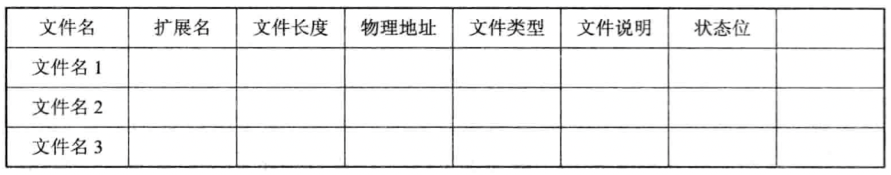
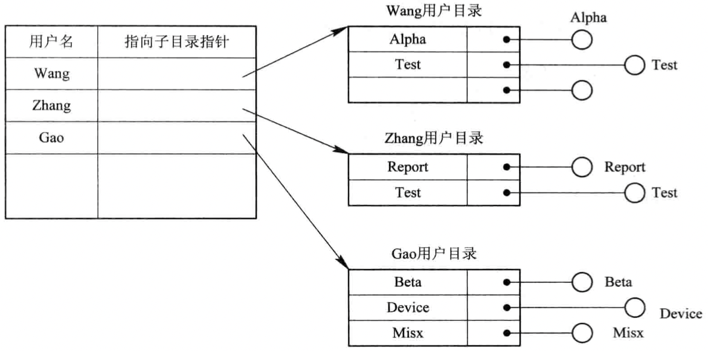
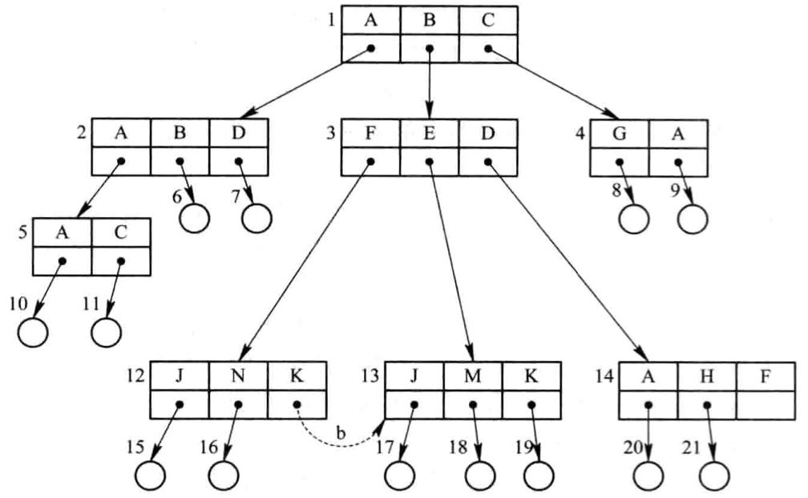
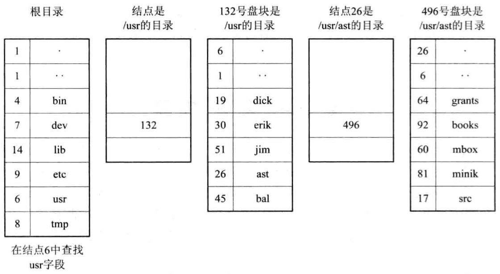
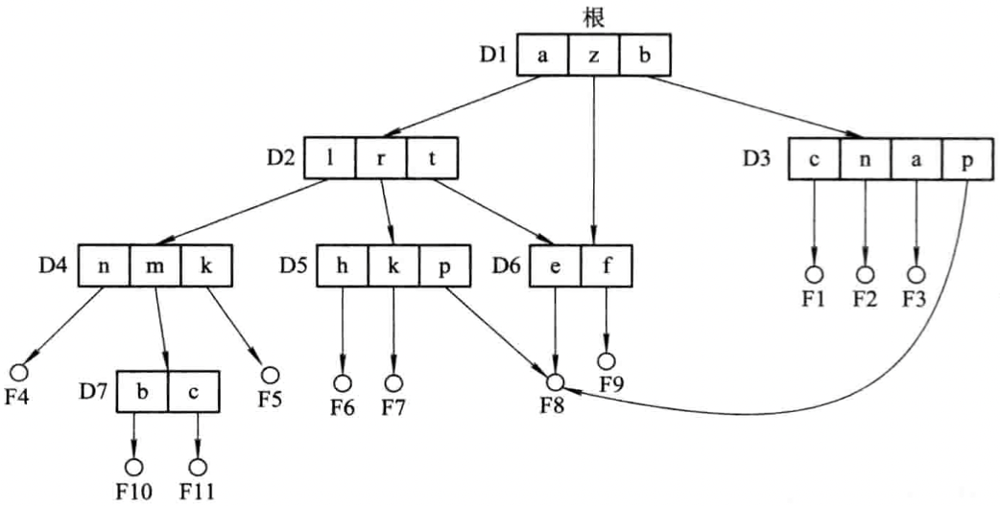
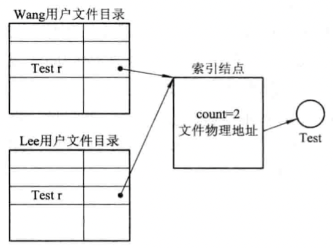
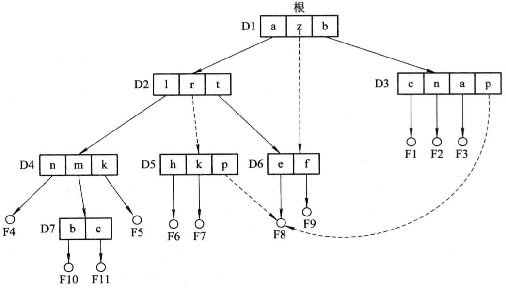

# 文件系统

[TOC]

## 层次结构

## 逻辑结构

- `文件的逻辑结构（File Logical Structure）`
- `文件的物理结构`

### 文件逻辑结构的类型

按文件是否有结构分类：

- 有结构文件
  - 定长记录
  - 变长记录
- 无结构文件

按文件的组织方式分类：

- 顺序文件
- 索引文件
- 索引顺序文件

## 顺序文件(Sequential File)

1. 顺序文件的排列方式

   - 串结构
   - 顺序结构

2. 顺序文件的优缺点

   | 优点                     | 缺点                                                        |
   | ------------------------ | ----------------------------------------------------------- |
   | - 适用于批量存取的场景； | - 对于单个文件的访问效率很低； - 增加/删除文件比较困难； |

## 记录寻址

1. 隐式寻址方式

   

2. 显式寻址方式

   用于定长记录的文件实现直接或随机访问：

   - 通过文件中记录的位置

     对于定长记录文件，根据公式：$A_i = i \times L$获得第$i$个记录相对于第一个记录首址的地址；

     对于可变长记录，根据公式：$A_i = \sum_{i=0}^{i-1} L_i + 1$计算出第$i$个记录的首址。

   - 利用关键字

     指定一个字段作为关键字，通过指定的关键字来查找该记录。

### 索引文件(Index File)

1. 按关键字建立索引

   

2. 具有多个索引表的索引文件

   索引文件的主要优点是：它将一个需要顺序查找的文件改造成一个可随机查找的文件，极大地提高了对文件的查找速度。同时，利用索引文件插入和删除记录也非常方便。

### 索引顺序文件(Index Sequential File)

1. 索引顺序文件的特征

   索引顺序文件是对顺序文件的一种改进，基本上克服了变长记录的顺序文件不能随机访问，以及不便于记录的删除和插入的缺点；同时新增了以下特性：

   - 引入了文件索引表，用来对索引顺序文件的随机访问；
   - 增加了溢出（overflow）文件，用来记录新增加的，删除的和修改的记录。

2. 一级索引顺序文件

   

3. 二级索引顺序文件

   TODO

## 文件目录

### 单级文件目录

最简单的文件目录，在整个文件系统中只建立一张目录表，每个文件占一个目录项。

缺点：

- 查找速度慢；对于一个具有$N$个目录项的单级目录，为检索出一个目录项，平均需要查找$N/2$个目录项。
- 不允许重名；
- 不便于实现文件共享；单级目录要求所有用户只能用同一个名字访问同一个文件，只适用于单用户环境。

### 两级文件目录

优点：

- 提高了检索目录的速度；如果在主目录中有$n$个子目录，每个用户目录最多为$m$个目录项，为查找一指定的目录项，最多只需检索$n + m$个目录项。
- 在不同的用户目录中，可以使用相同的文件名；
- 不同用户还可以使用不同的文件名访问系统中的同一个共享文件。

### 树形结构目录(Tree-Structured Directory)

*多级目录结构（方框代表目录文件，源泉代表数据文件）*

### 目录查询技术

1. 线性检索法

   

   *查找/usr/ast/mbox的步骤*

2. Hash方法

   建立一张Hash索引文件目录，利用Hash方法进行查询。

   在进行文件名转换时，有可能把$n$个不同的文件名转换为相同的Hash值，此时出现冲突，处理冲突的规则是：

   - 在利用Hash法索引查找目录时，如果目录表中相应的目录项是空的，则表示系统中并无指定文件。
   - 如果目录项中的文件名与指定文件名相匹配，则表示该目录项是所要寻找的文件所对应的目录项，故而可从中找到该文件所在的物理地址。
   - 如果在目录表的相应目录项中的文件名与指定文件名不匹配，则表示发生了冲突，此时须将其Hash再加上一个常数（该常数与目录长度互质），形成新的索引值，再返回第一步重新开始查重。

## 文件共享

### 基于有向无循环图实现文件共享

1. 有向无循环图DAG（Directed Acyclic Graph）

   

   *有向无循环图目录层次*

2. 利用索引结点

   

### 利用符号链接实现文件共享

## 文件保护

TODO

## 实现

### Linux/Unix

linux/unix内核使用3种数据结构表示打开文件，他们之间的关系决定了在文件共享方面一个进程对另一个进程可能产生的影响：

1. 每个进程在进程表中都有一个记录项，记录项中包含一张打开文件描述符表，可将其视为一个矢量，每个描述符占用一项。与每个文件描述符相关联的是：
   - 文件描述符标志(close_on_exec)
   - 指向一个文件表项的指针
2. 内核为所有打开文件维持一张文件表，每张文件表包含：
   - 文件状态标志（读，写，添写，同步和非阻塞等）
   - 当前文件偏移量
   - 指向该文件v节点表项的指针
3. 每个打开文件（或设备）都有一个v节点（v-node）结构。v节点包含了文件类型和对此文件进行各种操作函数的指针。对于大多数文件，v节点还包含了该文件的i节点（i-node，索引节点）。这些信息是在打开文件时从磁盘上读入内存的，所以，文件的所有相关信息都是随时可用的。

**注意：Linux没有使用v节点，而是使用了通用i节点结构。虽然两种实现有所不同，但在概念上，v节点与i节点是一样的。两者都指向文件系统特有的i节点结构。**

例，打开文件的内核数据结构：

例，两个独立进程各自打开同一个文件：

#### POSIX文件类型定义

| 宏         | 文件类型                               |
| ---------- | -------------------------------------- |
| S_IRREG()  | 普通文件（regular file）               |
| S_ISDIR()  | 目录文件（directory file）             |
| S_ISCHR()  | 字符特殊文件（character special file） |
| S_ISBLK()  | 块特殊文件（block special file）       |
| S_ISFIFO() | 管道或FIFO                             |
| S_ISLNK()  | 符号链接（symbolic link）              |
| S_ISSOCK() | 套接字（socket）                       |

#### 不同操作对文件数据结构的影响

- 在完成每个`write`后，在文件表项中的当前文件偏移量即增加所写入的字节数。如果这导致当前文件偏移量超出当前文件长度，则将i节点表项中的当前文件长度设置为当前文件偏移量（也就是该文件加长了）。
- 如果用`O_APPEND`标志打开一个文件，则相应标志也被设置到文件表项的文件状态标志中。每次对这种具有追加写标志的文件执行写操作时，文件表项中的当前文件偏移量首先会被设置为i节点表项中的文件长度。这就使得每次写入的数据都追加到文件的当前尾端处。
- 若一个文件用`lseek`定位到文件当前的尾端，则文件表项中的当前文件偏移量被设置为i节点表项中的当前文件长度（与用O_APPEND标志打开文件有所区别）。
- lseek函数只修改文件表项中的当前文件偏移量，不进行任何I/O操作。

#### 文件访问权限

| st_mode屏蔽 | 含义     |
| ----------- | -------- |
| S_IRUSR     | 用户读   |
| S_IWUSR     | 用户写   |
| S_IXUSR     | 用户执行 |
| S_IRGRP     | 组读     |
| S_IWGRP     | 组写     |
| S_IXGRP     | 组执行   |
| S_IROTH     | 其它读   |
| S_IWOTH     | 其它写   |
| S_IXOTH     | 其它执行 |

权限访问规则：

1. 我们用名字打开任一类型的文件时，对该名字中包含的每一个目录，包括它可能隐含的当前工作目录都应具有执行权限。
2. 对于一个文件的读权限决定了我们是否能够打开现有文件进行读操作。这与open函数的O_RDONLY和O_RDWR标志有关。
3. 对于一个文件的写权限决定了我们是否能够打开现有文件进行写操作。这与open函数的O_WRONLY和O_RDWR标志有关。
4. 为了在open函数中对一个文件指定O_TRUNC标志，必须对该文件具有写权限。
5. 为了在一个目录中创建一个新文件，必须对该目录具有写权限和执行权限。
6. 为了删除一个现有文件，必须对包含该文件的目录具有写权限和执行权限。对该文件本身则不需要有读，写权限。
7. 如果用7个exec函数中的人任何一个执行某个文件，都必须对该文件具有执行权限。该文件还必须是一个普通文件。
