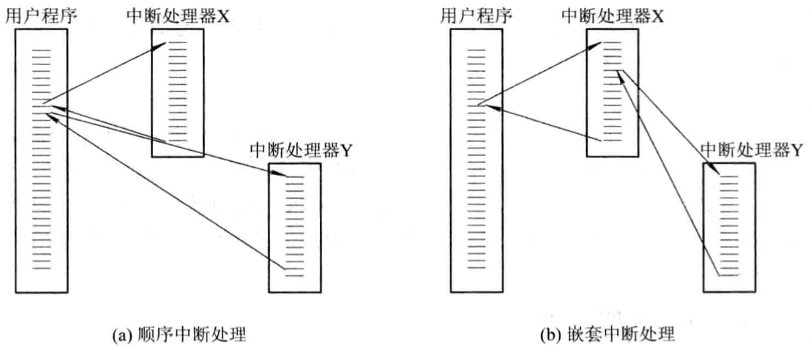
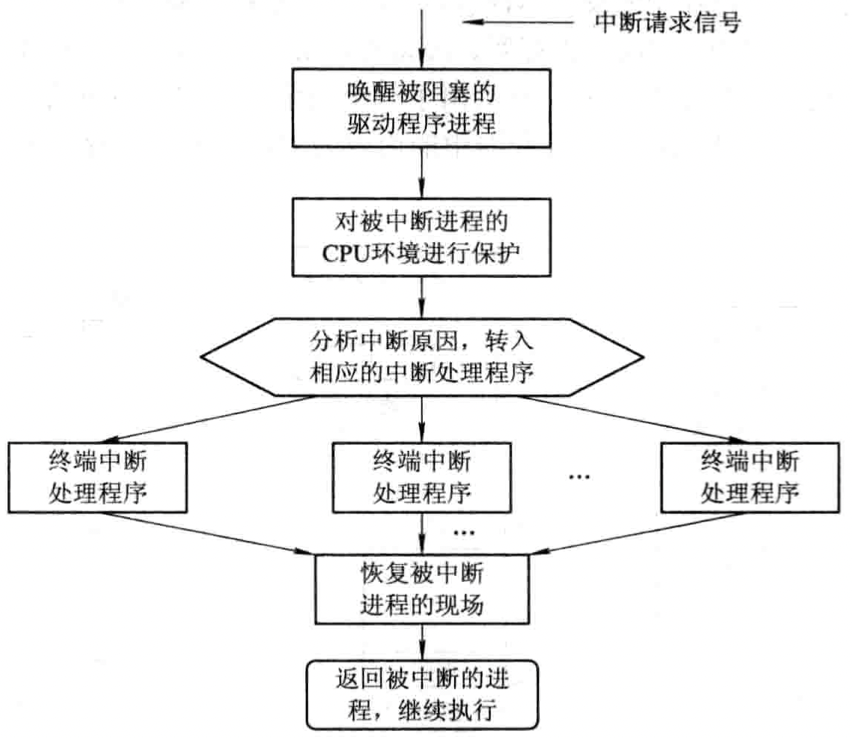
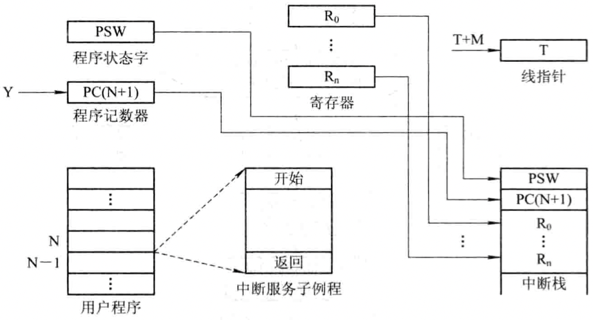

English | [中文版](interrupt_zh.md)

# Interrupts

[TOC]

## Classification

`External interrupt`: The CPU's response to interrupt signals from I/O devices. The CPU suspends the currently executing program, saves the CPU context, and automatically executes the interrupt handler for that I/O device. After completion, it returns to the breakpoint and continues executing the original program.

`Internal interrupt`: Interrupts caused by internal CPU events. If the system detects a trap event, the CPU suspends the current program and executes the handler for that trap event.

## Interrupt Vector Table

Each device is assigned a corresponding interrupt handler, and the entry address of that handler is placed in an entry of the interrupt vector table. When an I/O device sends an interrupt request signal, the interrupt controller determines the interrupt number, and the system looks up the interrupt vector table using this number to obtain the entry address of the device's interrupt handler, thus transferring control to the handler.

## Interrupt Priority

For multiple interrupt sources, the system assigns different priorities to each.

## Interrupt Handling

- `Mask (disable) interrupts`: When the processor is handling an interrupt, all other interrupts are masked (not suitable for real-time scenarios).
- `Nested interrupts`: In systems with interrupt priorities, the following rules are usually applied:
	1. When multiple interrupt requests of different priorities occur simultaneously, the CPU responds to the highest priority interrupt first;
	2. A higher-priority interrupt can preempt the processor from a lower-priority interrupt handler.

	

### Interrupt Handling Procedure

1. Determine if there are any unacknowledged interrupt signals;
2. Save the CPU context of the interrupted process
	 
3. Transfer control to the appropriate device handler;
4. Handle the interrupt;
5. Restore the CPU context and exit the interrupt.
