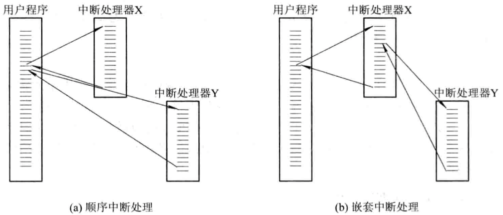
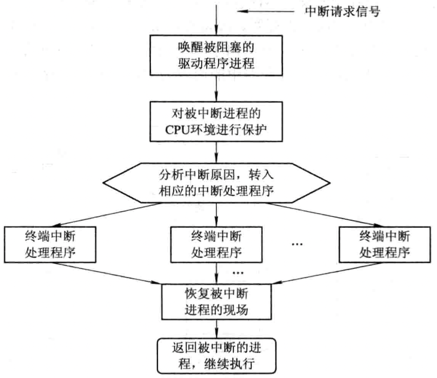
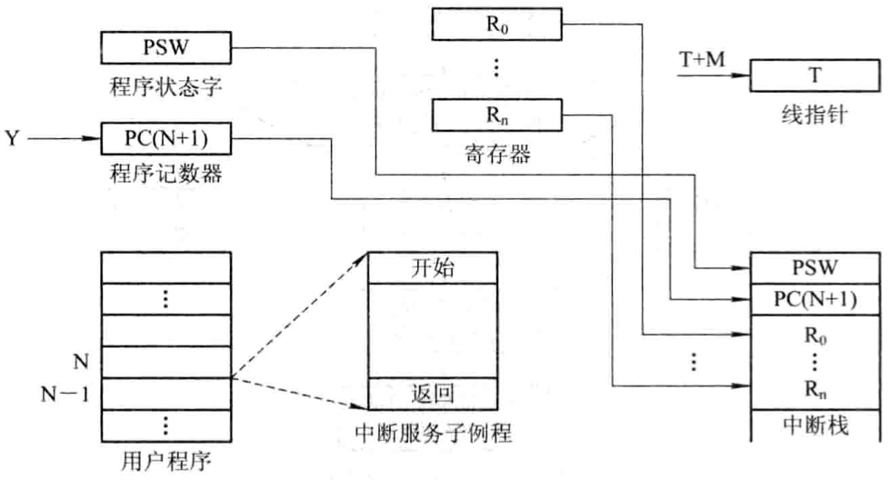

# 中断

[TOC]

## 分类

`外中断`CPU对I/O设备发来的中断信号的一种响应。CPU暂停正在执行的程序，保留CPU环境后，自动地转去执行该I/O设备的中断处理程序；执行完后，再回到断点，继续执行原来的程序。

`内中断` 由CPU内部事件引起的中断；若系统发现了有陷入事件，CPU将暂停正在执行的程序，转去执行该陷入事件的处理程序。

## 中断向量表

为每种设备配以相应的中断处理程序，并把该程序的入口地址放在中断向量表的一个表项中。当I/O设备发来中断请求信号时，由中断控制器确定该请求的中断号，根据该设备的中断号去查找中断向量表，从中取得该设备中断处理程序的入口地址，这样便可以转入中断处理程序执行。

## 中断优先级

对于多个中断信号源，系统为他们分别规定不同的优先级。

## 中断处理

- `屏蔽（禁止）中断` 当处理机正在处理一个中断时，将屏蔽掉所有的中断（不适用于实时性要求高的场景）。

- `嵌套中断` 在设置了中断优先级的系统中，通常按这样的规则来进行优先级控制：

  1. 当同时有多个不同优先级的中断请求时，CPU优先响应最高优先级的中断请求；
  2. 高优先级的中断请求可以抢占正在运行的低优先级中断的处理机。

  

### 中断处理过程

1. 测定是否有未响应的中断信号；

2. 保护被中断进程的CPU环境

   

3. 转入相应的设备处理程序；

4. 中断处理；

5. 恢复CPU的现场并退出中断。
