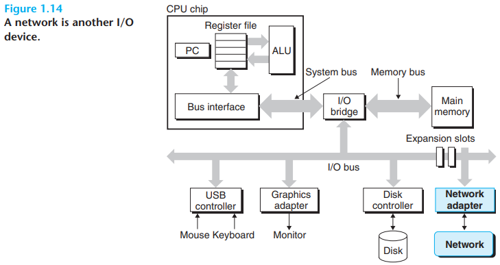

# I/O

[TOC]

Every I/O device, including disks, keyboards, displays, and even networks, is modeled as a file. All input and output in the system is performed by reading and writing files, using a small set of system calls known as `Unix I/O`.

*I/O Bus*

## Reference

[1] Randal E. Bryant, David R. O'Hallaron . COMPUTER SYSTEMS: A PROGRAMMER'S PERSPECTIVE . 3ED
