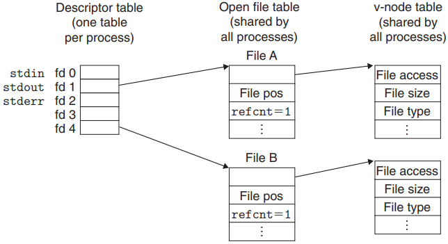
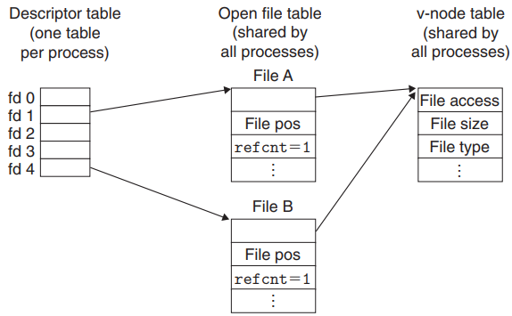

# I/O

[TOC]

## IO Bus

Every I/O device, including disks, keyboards, displays, and even networks, is modeled as a file. All input and output in the system is performed by reading and writing files, using a small set of system calls known as `Unix I/O`.

*I/O Bus*

A `multiplexor`(commonly referred to as a "MUX") selects a value from among a set of different data signals, depending on the value of a control input signal. 

## System I/O

*Typical kernel data structures for open files.*

*File sharing. This example shows two descriptors sharing the same disk file through two open file table entries.*

## I/O Multiplexing

Pros and Cons of I/O Multiplexing

- One advantage is that event-driven designs give programmers more control over the behavior of their programs than process-based designs.
- Another advantage is that an event-driven server based on I/O multiplexing runs in the context of a single process, and thus every logical flow has access to the entire address space of the process. This makes it easy to share data between flows.
- Finally, event-driven designs are often significantly more efficient than process-based designs because they do not require a process context switch to schedule a new flow.
- A significant disadvantage of event-driven designs is coding complexity.
- Another significant disadvantage of event-based designs is that they cannot fully utilize multi-core processors.

## Reference

[1] Randal E. Bryant, David R. O'Hallaron . COMPUTER SYSTEMS: A PROGRAMMER'S PERSPECTIVE . 3ED
