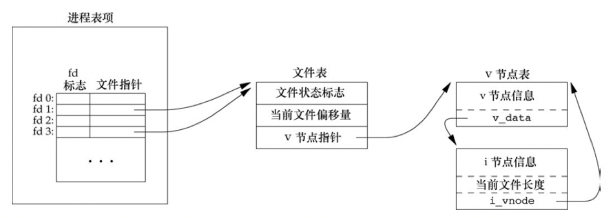

# I/O

[TOC]


## I/O系统层次

### I/O系统模块层次


### 设备与控制器之间的接口


### 设备控制器


### 内存映像I/O


*采用特定的指令形式*

### I/O通道

在CPU与I/O设备之间存在`I/O通道（I/O Channel）`，其主要目的是为了建立独立的I/O操作，不仅使数据的传送能独立于CPU，而且也希望有关对I/O操作的组织，管理及其结束处理尽量独立，以保证CPU有更多的时间去进行数据处理。

#### 字节多路通道(Byte Multiplexor Channel)


**只要字节多路通道扫描每个子通道的速率足够快，而连接到子通道上的设备的速率又不是太高（不适用于高速设备），便不致丢失信息。**

#### 数组选择通道(Block Selector Channel)

TODO

#### 数组多路通道(Block Multiplexor Channel)

TODO


## fcntl，ioctl和路由套接字操作小结

| 操作                           | fcntl               | ioctl                | 路由套接字 | POSIX      |
| ------------------------------ | ------------------- | -------------------- | ---------- | ---------- |
| 设置套接字为非阻塞式`I/O`型    | F_SETFL, O_NONBLOCK | FIONBIO              |            | fcntl      |
| 设置套接字为信号驱动式`I/O`型  | F_SETFL, O_ASYNC    | FIOASYNC             |            | fcntl      |
| 设置套接字属主                 | F_SETOWN            | SIOCSPGRP或FIOSETOWN |            | fcntl      |
| 获取套接字属主                 | F_GETOWN            | SIOCGPGRP或FIOGETOWN |            | fcntl      |
| 获取套接字接收缓冲区中的字节数 |                     | FIONREAD             |            |            |
| 测试套接字是否处于带外标志     |                     | SIOCATMARK           |            | sockatmark |
| 获取接口列表                   |                     | SIOCGIFCONF          | sysctl     |            |
| 接口操作                       |                     | `SIOC[GS]IFxxx`      |            |            |
| ARP告诉缓存操作                |                     | SIOCxARP             | RTM_xxx    |            |
| 路由表操作                     |                     | SIOCxxxRT            | RTM_xxx    |            |

fcntl函数提供了与网络编程相关的如下特性：

- 非阻塞式`I/O`：通过使用F_SETFL命令设置O_NONBLOCK文件状态标志，我们可以把一个套接字设置为非阻塞型
- 信号驱动式`I/O`：通过使用F_SETFL命令设置O_ASYNC文件状态标志，我们可以把一个套接字设置成一旦其状态发生变化，内核就产生了一个SIGIO信号。
- F_SETOWN：命令允许我们指定用于接收SIGIO和SIGURG信号的套接字属主。其中SIGIO信号是套接字被设置为信号驱动式I/O型后产生的，SIGURG信号是在新的带外数据到达套接字时产生的。F_GETOWN命令返回套接字的当前属主。


## I/O效率

### 预读

大多数文件系统为改善性能都采用某种预读（read ahead）技术，当检测到正进行顺序读取时，系统就试图读入比应用所要求的更多数据，并假想应用很快就会读这些数据。

### 延迟写

delayed write，传统的UNIX系统实现在内核中设有缓冲区高速缓存或页高速缓存，大多数磁盘I/O都通过缓冲区进行。当我们向文件写入数据时，内核通常先将数据复制到缓冲区中，然后排入队列，晚些时候再写入磁盘


## 常见I/O错误

### TOCTTOU错误

`time-of-check-to-time-of-use`，如果有两个基于文件的函数调用，其中第二个调用依赖于第一个调用的结果，那么程序是脆弱的；因为两个调用并不是原子操作，在两个函数调用之间文件可能改变了，这样也就造成了第一个调用的结果就不在有效，使得程序最终的结果是错误的。


## 相关API

### access/faccessat

```c++
#include <unistd.h>
int access(const char *pathname, int mode);
int faccessat(int fd, const char *pathname, int mode, int flag);
```

- `fd` 文件描述符

- `pathname` 绝对/相对路径

- `mode` 模式

  | mode | 说明         |
  | ---- | ------------ |
  | R_OK | 测试读权限   |
  | W_OK | 测试写权限   |
  | X_OK | 测试执行权限 |

- `flags` 标志

- `返回值`

  - 成功：0
  - 失败：-1

*进行访问权限测试。*

### fcntl

```c
#include<fcntl.h>
int fcntl(int fd, int cmd, ...);
```

- `fd` 文件描述符
- `cmd` 命令
  - `F_DUPFD` 复制文件描述符，新文件描述符作为函数值返回。
  - `F_DUPFD_CLOEXEC` 复制文件描述符，设置与新描述符关联的FD_CLOEXEC文件描述符标志的值，返回新文件描述符。
  - `F_GETFD` 对应于fd的文件描述符标志作为函数值返回。
  - `F_SETFD` 对于fd设置文件描述符标志。
  - `F_GETFL` 对应于fd的文件状态标志作为函数值返回。
  - `F_SETFL` 将文件状态标志设置为第3个参数的值（取为整型值），此参数可以为：O_APPEND,O_NONBLOCK,O_SYNC,O_DSYNC,O_RSYNC,O_FSYNC,O_ASYNC。
  - `F_GETOWN` 获取当前接受SIGIO和SIGURG信号的进程ID或进程组ID。
  - `F_SETOWN` 设置接收SIGIO和SIGURG信号的进程ID或进程组ID。
- 返回值
  - 成功：取决于cmd的值
  - 失败：-1

fcntl有5种功能：

1. 复制一个已有的描述符（cmd=F_DUPFD或F_DUPFD_CLOEXEC）
2. 获取/设置文件描述符标志（cmd=F_GETFD或F_SETFD）
3. 获取/设置文件状态标志（cmd=F_DETFL或F_SETFL）
4. 获取/设置异步I/O所有权（cmd=F_GETOWN或F_SETOWN）
5. 获取/设置记录锁（cmd=F_GETLK，F_SETLK或F_SETLKW）

对于fcntl的文件状态标志：

| 文件状态标志 | 说明                              |
| ------------ | --------------------------------- |
| O_RDONLY     | 只读打开                          |
| O_WRONLY     | 只写打开                          |
| O_RDWR       | 读，写打开                        |
| O_EXEC       | 只执行打开                        |
| O_SEARCH     | 只搜索打开目录                    |
| O_APPEND     | 追加写                            |
| O_NONBLOCK   | 非阻塞模式                        |
| O_SYNC       | 等待写完成（数据和属性）          |
| O_DSYNC      | 等待写完成（仅数据）              |
| O_RSYNC      | 同步读和写                        |
| O_FSYNC      | 等待写完成（仅FreeBSD和Mac OS X） |
| O_ASYNC      | 异步I/O（仅FreeBSD和Mac OS X）    |

### open/openat

```c
#include <fcntl>
int open(const char* path, int oflag, ...);
int openat(int fd, const char* path, int oflag, ...);
```

- `fd` 文件描述符

  1. 如果path是绝对路径名，fd被忽略，open=openat
  2. 如果path是相对路径名，fd参数指出了相对路径在文件系统中的开始地址
  3. 如果path是相对路径名且fd参数具有特殊值AT_FDCWD，路径名在当前工作目录中获取

- `path` 要打开或创建文件的名字

- `oflag` 选项

  必选一个的操作选项：

  - `O_RDONLY` 只读打开
  - `O_WRONLY` 只写打开
  - `O_RDWR` 读写打开
  - `O_EXEC` 只执行打开
  - `O_SEARCH` 只搜索打开（应用于目录，在目录打开时验证它的搜索权限）

  可选的操作选项：

  - `O_APPEND` 每次写时都追加到文件的尾端
  - `O_CLOEXEC` 把FD_CLOEXEC常量设置为文件描述符标志
  - `O_CREAT` 若此文件不存在则创建它
  - `O_DIRECTORY` 如果path引用的不是目录，则出错
  - `O_EXCL` 如果同时指定了O_CREAT，而文件已存在，则出错
  - `O_NOCTTY ` 如果path引用的是终端设备，则不将该设备分配作为此进程的控制终端
  - `O_NOFOLLOW` 如果path引用的是一个符号链接，则出错
  - `O_NONBLOCK` 如果path引用的是一个FIFO，一个块特殊文件或一个字符特殊文件，则此选项为文件的本次打开操作和后续I/O操作设置非阻塞方式
  - `O_SYNC` 使每次write等待物理I/O操作完成，包括由该write操作引起的文件属性更新所需的I/O

- 返回值

  - 成功：文件描述符
  - 失败：-1

打开文件/目录。

### creat

```c
#include <fcntl.h>
int create(const char* path, mode_t mode);
```

- `path` 路径
- `mode` 创建模式
- 返回值
  - 成功：只写文件描述符
  - 失败：-1

创建一个新文件，等效于：

```c
open(path, O_RDWR|O_CREAT|O_TRUNC, mode);
```

### close

```c
#include <unistd.h>
int close(int fd);
```

- `fd` 文件描述符
- 返回值
  - 成功：0
  - 失败：-1

关闭文件

### lseek

```c
#include <unistd.h>
off_t lseek(int fd, off_t offset, int whence);
```

- `fd` 文件描述符
- `offset` 偏移量
- `whence` 位置
  - `SEEK_SET` 将文件的偏移量设置为距文件开始处offset个字节
  - `SEEK_CUR` 将文件偏移量设置为其当前值加offset，offset可正可负
  - `SEEK_END` 将文件的偏移量设置为文件长度加offset，offset可正可负
- 返回值
  - 成功：新的文件偏移量
  - 失败：-1

为一个打开的文件设置偏移量

### read

```c
#include <unistd.h>
ssize_t read(int fd, void *buf, size_t nbytes);
```

- `fd` 文件描述符
- `buf` 缓冲区
- `nbytes` 要求读的长度
- 返回值
  - 成功：读到的字节数
  - 已到文件尾：0
  - 失败：-1

从文件中读数据

以下这些情况会导致实际读到的字节数少于要求读的字节数：

- 读普通文件时，在读到要求字节数之前已到达了文件尾
- 从终端设备读时，网络中的缓冲机制可能造成返回值小于所要求读的字节数
- 从管道或FIFO读时，如若管道包含的字节少于所需的数量，那么read将只返回实际可用的字节数
- 当从某些面向记录的设备（如磁带）读时，一次最多返回一个记录
- 当一信号造成中断，而已经读了部分数据量时

### write

```c
#include <unistd.h>
ssize_t write(int fd, const void* buf, size_t nbytes);
```

- `fd` 文件描述符
- `buf` 缓冲区
- `nbytes` 要写入的字节数
- 返回值
  - 成功：已写的字节数（==要写入的字节数）
  - 失败：-1或已写的字节数（<要写入的字节数）

写数据到文件

### dup/dup2

```c
#include <unistd.h>
int dup(int fd);
int dup2(int fd, int fd2);
```

- `fd` 待复制的文件描述符
- `fd2` 用来指定返回的文件描述符的值
  - 如果`fd2`已经打开，先关闭它
  - 如果`fd`等于`fd2`，则`dup2`返回`fd2`而不关闭它
  - 其它情况，`fd2`的`FD_CLOEXEC`文件描述符标志被清除，`fd2`在进程调用exec时是打开状态
- 返回值
  - 成功：新的文件描述符
  - 失败：-1

复制一个现有的文件描述符

例，返回的新描述符与参数fd共性同一个文件表项时的结构：



### sync

```c
#include <unistd.h>
void sync(void);
```

`sync`只是将所有修改过的块缓冲区排入写队列，然后就返回，**它并不等实际写磁盘操作结束。**

### fsync

```c
#include <unistd.h>
int fsync(int fd);
```

- `fd` 文件描述符
- 返回值
  - 成功：0
  - 失败：-1

`fsync`只对由文件描述符fd指定的一个文件起作用，并且等待写磁盘操作结束才返回。

### fdatasync

```c
#include <unistd.h>
int fdatasync(int fd);
```

- `fd` 文件描述符
- 返回值
  - 成功：0
  - 失败：-1

`fdatasync`类似于`fsync`，但它只影响文件的数据部分。而除数据外，fsync还会同步更新文件的属性。

### ioctl

```c
#include <unistd.h>
#include <sys/ioctl.h>
int ioctl(int fd, int request, ...);
```

- `fd` 文件描述符
- `request` 
- 返回值
  - 成功：其它值
  - 失败：-1

UNIX系统实现用它进行很多杂项设备操作，有些实现甚至将它扩展到用于普通文件。

FreeBSD中通用的ioctl操作：

| 类别      | 常量名  | 头文件              | ioctl数 |
| --------- | ------- | ------------------- | ------- |
| 盘标号    | DIOxxx  | `<sys/disklable.h>` | 4       |
| 文件I/O   | FIOxxx  | `<sys/filio.h>`     | 14      |
| 磁带I/O   | MTIOxxx | `<sys/mtio.h>`      | 11      |
| 套接字I/O | SIOxxx  | `<sys/sockio.h>`    | 73      |
| 终端I/O   | TIOxxx  | `<sys/ttycom.h>`    | 43      |


## 参考

[1] UNIX环境高级编程.第3版.第三章 文件I/O
