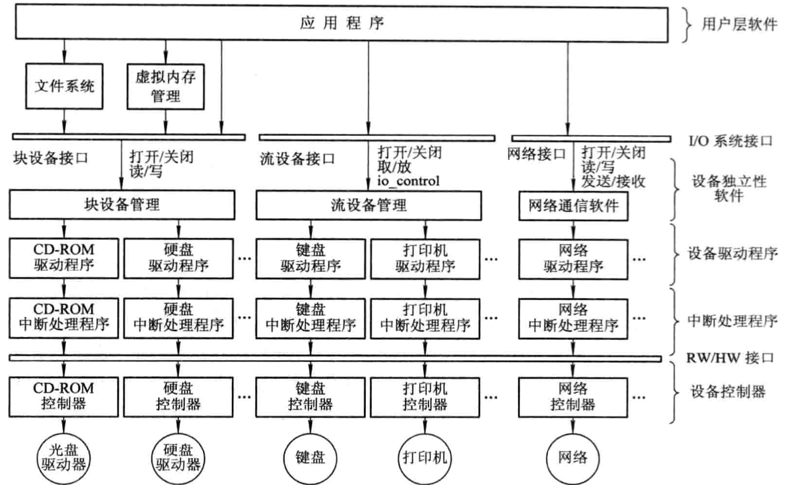
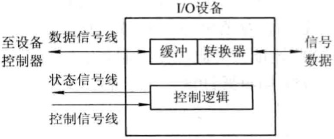
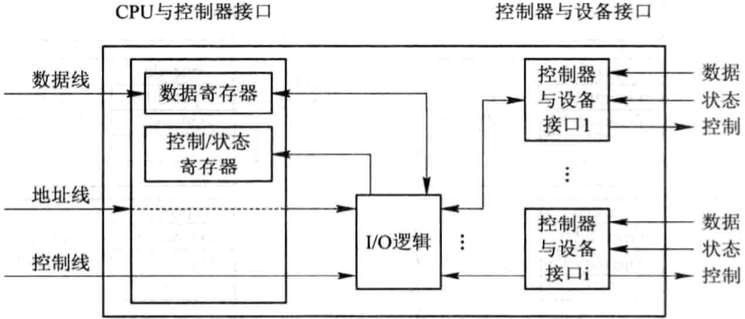
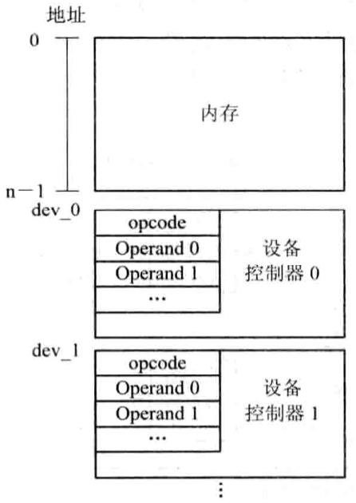
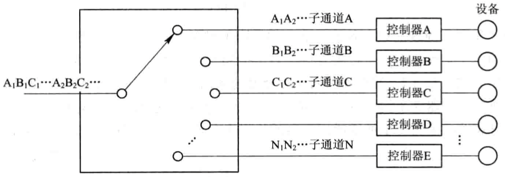
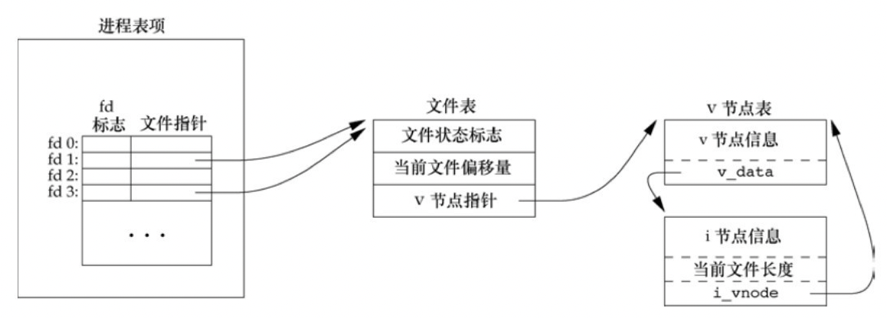

English | [中文版](io_zh.md)

# I/O

[TOC]


## I/O System Hierarchy

### I/O System Module Hierarchy



### Interface Between Device and Controller



### Device Controller



### Memory-Mapped I/O



*Uses specific instruction forms*

### I/O Channel

There is an `I/O Channel` between the CPU and I/O devices. Its main purpose is to establish independent I/O operations, so that data transfer can be independent of the CPU, and also to make the organization, management, and completion handling of I/O operations as independent as possible, ensuring the CPU has more time for data processing.

#### Byte Multiplexor Channel



**As long as the byte multiplexor channel scans each subchannel fast enough, and the devices connected to the subchannels are not too fast (not suitable for high-speed devices), information will not be lost.**

#### Block Selector Channel

TODO

#### Block Multiplexor Channel

TODO


## Summary of fcntl, ioctl, and Routing Socket Operations

| Operation                        | fcntl               | ioctl                | Routing Socket | POSIX      |
| --------------------------------- | ------------------- | -------------------- | ------------- | ---------- |
| Set socket to non-blocking I/O    | F_SETFL, O_NONBLOCK | FIONBIO              |               | fcntl      |
| Set socket to signal-driven I/O   | F_SETFL, O_ASYNC    | FIOASYNC             |               | fcntl      |
| Set socket owner                  | F_SETOWN            | SIOCSPGRP or FIOSETOWN |             | fcntl      |
| Get socket owner                  | F_GETOWN            | SIOCGPGRP or FIOGETOWN |             | fcntl      |
| Get bytes in receive buffer       |                     | FIONREAD             |               |            |
| Test if socket is at out-of-band  |                     | SIOCATMARK           |               | sockatmark |
| Get interface list                |                     | SIOCGIFCONF          | sysctl        |            |
| Interface operations              |                     | `SIOC[GS]IFxxx`      |               |            |
| ARP cache operations              |                     | SIOCxARP             | RTM_xxx       |            |
| Routing table operations          |                     | SIOCxxxRT            | RTM_xxx       |            |

The fcntl function provides the following features related to network programming:

- Non-blocking I/O: Use F_SETFL with O_NONBLOCK to set a socket to non-blocking mode.
- Signal-driven I/O: Use F_SETFL with O_ASYNC to set a socket so that the kernel generates a SIGIO signal when its state changes.
- F_SETOWN: Allows specifying the owner of the socket to receive SIGIO and SIGURG signals. SIGIO is generated when the socket is set to signal-driven I/O, and SIGURG is generated when new out-of-band data arrives. F_GETOWN returns the current owner.


## I/O Efficiency

### Read Ahead

Most file systems use some form of read ahead to improve performance. When sequential reading is detected, the system tries to read more data than requested, assuming the application will soon read it.

### Delayed Write

In traditional UNIX systems, the kernel has buffer or page caches, and most disk I/O goes through these buffers. When writing to a file, the kernel usually copies data to the buffer first, queues it, and writes to disk later.


## Common I/O Errors

### TOCTTOU Error

`time-of-check-to-time-of-use`: If there are two file-based function calls, and the second depends on the result of the first, the program is fragile; the file may change between the two calls, making the first result invalid and leading to errors.


## Posix API

### access/faccessat

```c++
#include <unistd.h>
int access(const char *pathname, int mode);
int faccessat(int fd, const char *pathname, int mode, int flag);
```

- `fd`: File descriptor
- `pathname`: Absolute/relative path
- `mode`: Mode

	| mode | Description    |
	| ---- | -------------- |
	| R_OK | Test read      |
	| W_OK | Test write     |
	| X_OK | Test execute   |

- `flags`: Flags
- Return value:
	- Success: 0
	- Failure: -1

*Test access permissions.*

### fcntl

```c
#include<fcntl.h>
int fcntl(int fd, int cmd, ...);
```

- `fd`: File descriptor
- `cmd`: Command
	- `F_DUPFD`: Duplicate file descriptor, returns new fd.
	- `F_DUPFD_CLOEXEC`: Duplicate fd, set FD_CLOEXEC, return new fd.
	- `F_GETFD`: Get fd flags.
	- `F_SETFD`: Set fd flags.
	- `F_GETFL`: Get file status flags.
	- `F_SETFL`: Set file status flags (O_APPEND, O_NONBLOCK, O_SYNC, O_DSYNC, O_RSYNC, O_FSYNC, O_ASYNC).
	- `F_GETOWN`: Get process/group ID for SIGIO/SIGURG.
	- `F_SETOWN`: Set process/group ID for SIGIO/SIGURG.
- Return value:
	- Success: depends on cmd
	- Failure: -1

fcntl has 5 functions:

1. Duplicate an existing descriptor (F_DUPFD or F_DUPFD_CLOEXEC)
2. Get/set fd flags (F_GETFD or F_SETFD)
3. Get/set file status flags (F_GETFL or F_SETFL)
4. Get/set async I/O ownership (F_GETOWN or F_SETOWN)
5. Get/set record locks (F_GETLK, F_SETLK, F_SETLKW)

File status flags for fcntl:

| Flag       | Description                                 |
| ---------- | ------------------------------------------- |
| O_RDONLY   | Open for read only                          |
| O_WRONLY   | Open for write only                         |
| O_RDWR     | Open for read and write                     |
| O_EXEC     | Open for execute only                       |
| O_SEARCH   | Open directory for search only               |
| O_APPEND   | Append on each write                        |
| O_NONBLOCK | Non-blocking mode                           |
| O_SYNC     | Wait for write complete (data and attr)     |
| O_DSYNC    | Wait for write complete (data only)         |
| O_RSYNC    | Synchronized read and write                 |
| O_FSYNC    | Wait for write complete (FreeBSD/Mac OS X)  |
| O_ASYNC    | Async I/O (FreeBSD/Mac OS X only)           |

### open/openat

```c
#include <fcntl>
int open(const char* path, int oflag, ...);
int openat(int fd, const char* path, int oflag, ...);
```

- `fd`: File descriptor
	1. If path is absolute, fd is ignored, open=openat
	2. If path is relative, fd is the base dir
	3. If path is relative and fd is AT_FDCWD, path is relative to cwd
- `path`: File/dir name to open/create
- `oflag`: Options
	Required:
	- `O_RDONLY` Open for read only
	- `O_WRONLY` Open for write only
	- `O_RDWR` Open for read/write
	- `O_EXEC` Open for execute only
	- `O_SEARCH` Open dir for search only
	Optional:
	- `O_APPEND` Append on each write
	- `O_CLOEXEC` Set FD_CLOEXEC
	- `O_CREAT` Create if not exist
	- `O_DIRECTORY` Error if not dir
	- `O_EXCL` Error if exists and O_CREAT
	- `O_NOCTTY` Do not assign controlling terminal
	- `O_NOFOLLOW` Error if symlink
	- `O_NONBLOCK` Non-blocking for FIFO/block/char
	- `O_SYNC` Wait for write complete (incl. attr)
- Return value:
	- Success: file descriptor
	- Failure: -1

Open file/dir.

### creat

```c
#include <fcntl.h>
int create(const char* path, mode_t mode);
```

- `path`: Path
- `mode`: Creation mode
- Return value:
	- Success: write-only fd
	- Failure: -1

Create new file, equivalent to `open(path, O_RDWR|O_CREAT|O_TRUNC, mode);`

### close

```c
#include <unistd.h>
int close(int fd);
```

- `fd`: File descriptor
- Return value:
	- Success: 0
	- Failure: -1

Close file

### lseek

```c
#include <unistd.h>
off_t lseek(int fd, off_t offset, int whence);
```

- `fd`: File descriptor
- `offset`: Offset
- `whence`: Position
	- `SEEK_SET` Set offset from start
	- `SEEK_CUR` Set offset from current
	- `SEEK_END` Set offset from end
- Return value:
	- Success: new offset
	- Failure: -1

Set offset for open file

### read

```c
#include <unistd.h>
ssize_t read(int fd, void *buf, size_t nbytes);
```

- `fd`: File descriptor
- `buf`: Buffer
- `nbytes`: Number of bytes to read
- Return value:
	- Success: bytes read
	- EOF: 0
	- Failure: -1

Read data from file

Cases where fewer bytes than requested are read:

- End of file before requested bytes
- Terminal device buffering
- Pipe/FIFO with fewer bytes than requested
- Record-oriented device (e.g., tape): at most one record
- Interrupted by signal after partial read

### write

```c
#include <unistd.h>
ssize_t write(int fd, const void* buf, size_t nbytes);
```

- `fd`: File descriptor
- `buf`: Buffer
- `nbytes`: Number of bytes to write
- Return value:
	- Success: bytes written (== requested)
	- Failure: -1 or bytes written (< requested)

Write data to file

### dup/dup2

```c
#include <unistd.h>
int dup(int fd);
int dup2(int fd, int fd2);
```

- `fd`: File descriptor to duplicate
- `fd2`: Desired value for new fd
	- If `fd2` is open, close it first
	- If `fd` == `fd2`, return `fd2` without closing
	- Otherwise, `fd2`'s FD_CLOEXEC is cleared, and it remains open after exec
- Return value:
	- Success: new fd
	- Failure: -1

Duplicate an existing file descriptor

Example: structure when new fd shares file table entry with fd:



### sync

```c
#include <unistd.h>
void sync(void);
```

`sync` queues all modified buffer blocks for writing and returns immediately; **it does not wait for actual disk write to finish.**

### fsync

```c
#include <unistd.h>
int fsync(int fd);
```

- `fd`: File descriptor
- Return value:
	- Success: 0
	- Failure: -1

`fsync` only affects the file specified by fd and waits for disk write to finish before returning.

### fdatasync

```c
#include <unistd.h>
int fdatasync(int fd);
```

- `fd`: File descriptor
- Return value:
	- Success: 0
	- Failure: -1

`fdatasync` is similar to `fsync`, but only affects file data, not attributes.

### ioctl

```c
#include <unistd.h>
#include <sys/ioctl.h>
int ioctl(int fd, int request, ...);
```

- `fd`: File descriptor
- `request`: Request
- Return value:
	- Success: other value
	- Failure: -1

UNIX systems use ioctl for many miscellaneous device operations, and some implementations extend it to regular files.

Common ioctl operations in FreeBSD:

| Category   | Constant | Header                | Count |
| ---------- | -------- | --------------------- | ----- |
| Disk label | DIOxxx   | `<sys/disklable.h>`   | 4     |
| File I/O   | FIOxxx   | `<sys/filio.h>`       | 14    |
| Tape I/O   | MTIOxxx  | `<sys/mtio.h>`        | 11    |
| Socket I/O | SIOxxx   | `<sys/sockio.h>`      | 73    |
| Terminal   | TIOxxx   | `<sys/ttycom.h>`      | 43    |


## Reference

[1] Advanced Programming in the UNIX Environment, 3rd Edition, Chapter 3: File I/O
