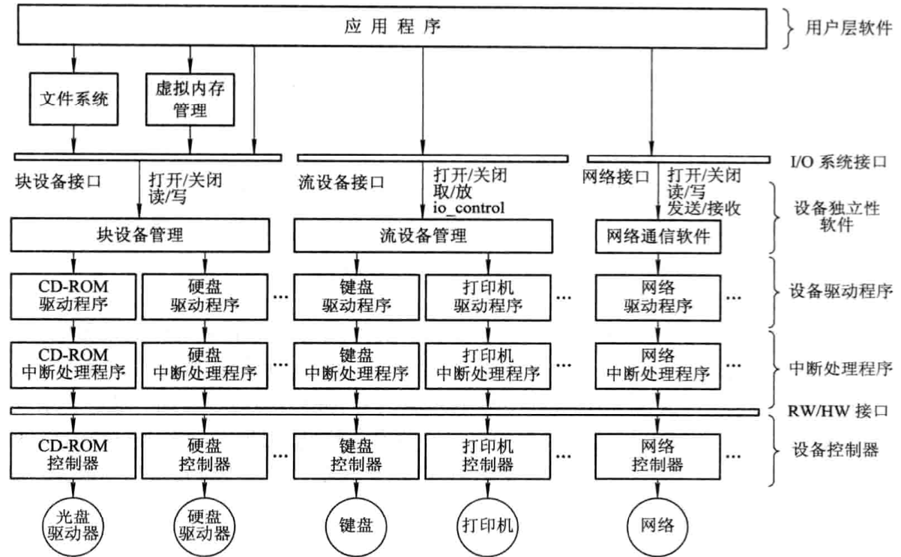
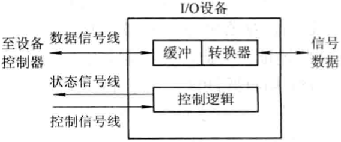
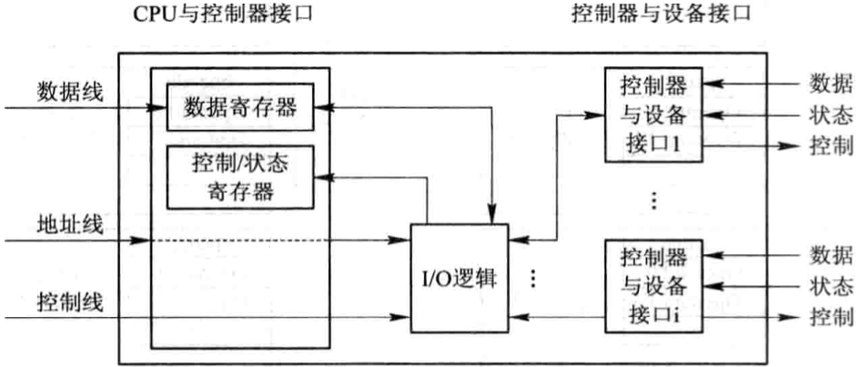
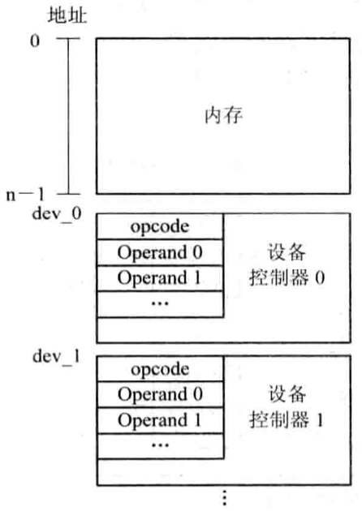
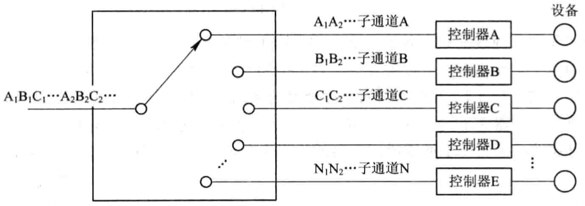
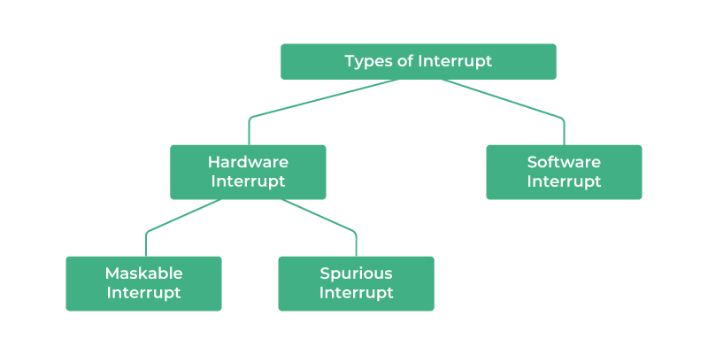
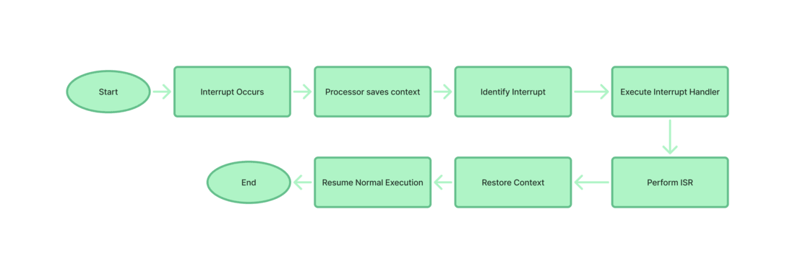
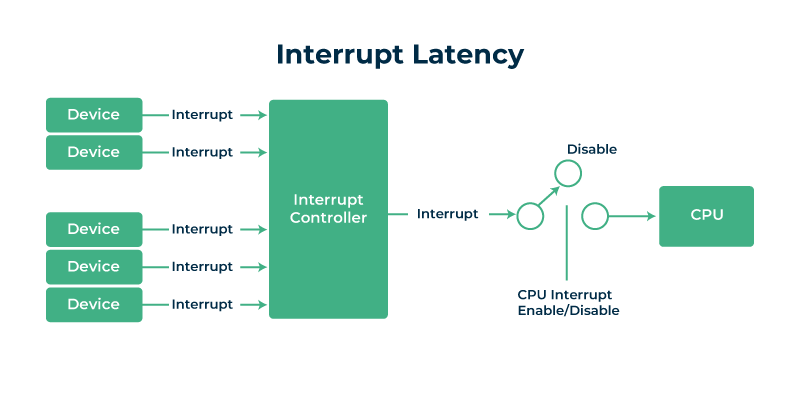

English | [中文版](io_zh.md)

# I/O

[TOC]

## I/O System Hierarchy

### I/O System Module Hierarchy

### Interface Between Device and Controller

### Device Controller

### Memory-Mapped I/O

*Uses specific instruction forms*

### I/O Channel

There is an `I/O Channel` between the CPU and I/O devices. Its main purpose is to establish independent I/O operations, so that data transfer can be independent of the CPU, and also to make the organization, management, and completion handling of I/O operations as independent as possible, ensuring the CPU has more time for data processing.

#### Byte Multiplexor Channel

**As long as the byte multiplexor channel scans each subchannel fast enough, and the devices connected to the subchannels are not too fast (not suitable for high-speed devices), information will not be lost.**

#### Block Selector Channel

TODO

#### Block Multiplexor Channel

TODO

## I/O Efficiency

### Read Ahead

Most file systems use some form of read-ahead to improve performance. When sequential reading is detected, the system tries to read more data than requested, assuming the application will soon read it.

### Delayed Write

In traditional UNIX systems, the kernel has buffer or page caches, and most disk I/O goes through these buffers. When writing to a file, the kernel usually copies data to the buffer first, queues it, and writes to disk later.

## Common I/O Errors

### TOCTTOU Error

`time-of-check-to-time-of-use`: If there are two file-based function calls, and the second depends on the result of the first, the program is fragile; the file may change between the two calls, making the first result invalid and leading to errors.

## Interrupt

An interrupt is a signal generated by hardware or software when an event needs immediate attention from the processor. It causes the CPU to temporarily stop the current execution and respond to a high-priority request.

### Types

- Software Interrupts

  Interrupts that are generated by a program (software) rather than hardware. They are also known as traps or exceptions. These interrupts are used to request services from the operating system or to handle error conditions during program execution.

- Hardware Interrupts

  1. Maskable interrupt
  2. Spurious Interrupt

### Flowchart Of Interrupt Handling Mechanism

1. Step 1: Any time that an interrupt is raised, it may either be an I/O interrupt or a system interrupt.
2. Step 2: The current state, comprising registers and the program counter, is then stored in order to conserve the state of the process.
3. Step 3: The current interrupt and its handler are identified through the interrupt vector table in the processor.
4. Step 4: This control now shifts to the interrupt handler, which is a function located in the kernel space.
5. Step 5: Specific tasks are performed by the Interrupt Service Routine (ISR), which are essential to manage interrupts.
6. Step 6: The status from the previous session is retrieved so as to build on the process from that point.
7. Step 7: The control is then shifted back to the other process that was pending, and the normal process continues.

### Interrupt Latency

The amount of time between the generation of an interrupt and its handling. The number of created interrupts, the number of enabled interruptions, the number of interrupts that may be handled, and the time required to handle each interrupt all affect interrupt latency.

## Reference

[1] Advanced Programming in the UNIX Environment, 3rd Edition

[2] [Interrupt In Operating System](https://www.geeksforgeeks.org/operating-systems/interrupts/)
