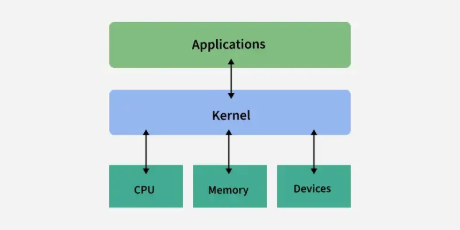

English | [中文版](kernel_zh.md)

# OS Kernel

[TOC]

A kernel is the core part of an operating system. It acts as a bridge between software applications and the hardware of a computer.

## Types

- Monolithic
- Microkernel
- Hybrid kernel
- Nanokernel
- Exokernel

## Functions

The kernel is responsible for various critical functions that ensure the smooth operation of the computer system. These functions include:

- Process Management
- Memory Management
- Device Management
- File System Management
- Resource Management
- Security And Access Control
- Inter-Process Communication

## UNIX Kernel Structure

### Process State Transitions

### Process Priority

#### Calculation Formula

$Priority = (recent CPU time \div 2) + base user priority$

### Device Switch Table and Interface Between System Calls and Drivers

## Reference

[1] [Kernel in Operating System](https://www.geeksforgeeks.org/operating-systems/kernel-in-operating-system/)