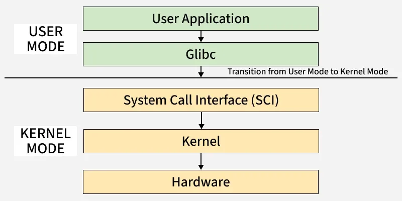
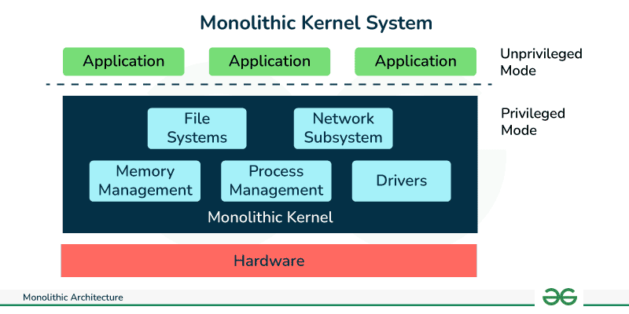
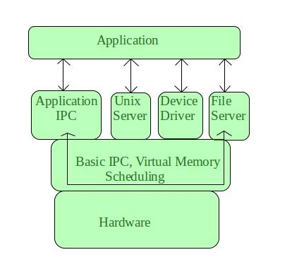
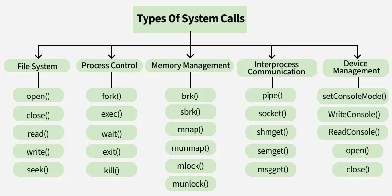
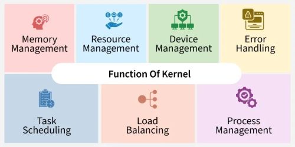
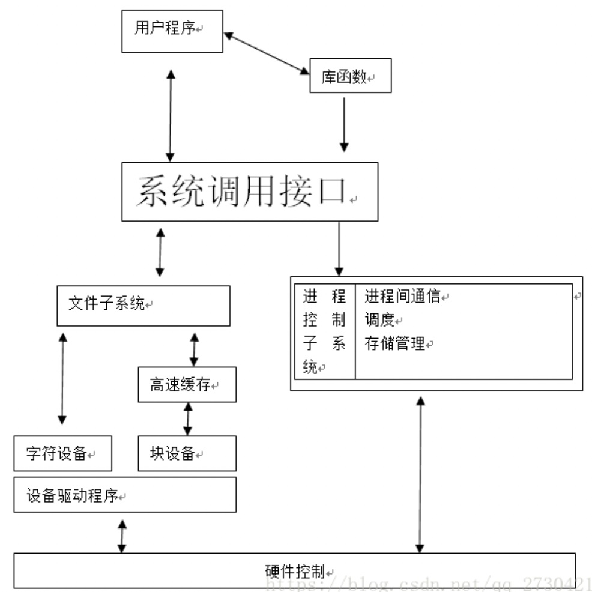
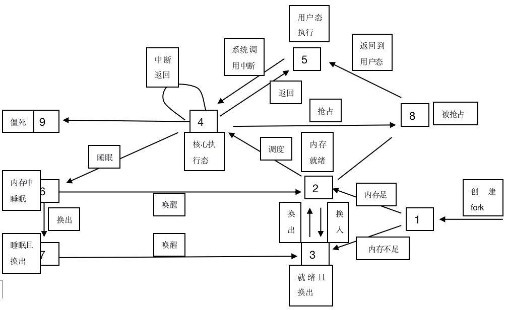
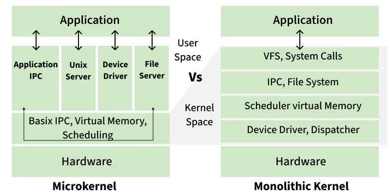

English | [中文版](kernel_zh.md)

# OS Kernel

[TOC]

A kernel is the core part of an operating system. It acts as a bridge between software applications and the hardware of a computer.

## Mode

### User Mode

User Mode is a restricted environment where application programs run. When a program starts, the OS creates a separate process and assigns it its own memory space.
Programs in user mode can’t access hardware or kernel memory directly. They must request access through system calls to the kernel.

### kernel Mode

Kernel Mode is the `privileged mode` where the core part of the operating system, the `kernel`, executes. It has `unrestricted access` to all machine resources, including CPU, memory, storage, and connected devices.

When a program running in user mode makes a request that requires hardware access, the system switches the CPU into `kernel mode` to perform the task. After execution, control returns to user mode.

## Boot Manager

A Boot Manager is a software program that is responsible for the management of the booting process of the computer. It is primarily responsible for selecting the Operating System to be loaded from multiple available options. Further, it also loads the Bootloader to perform the actual loading of the Operating System.

### Bootloader

Boot Loader is a software program that is responsible for "actually loading" the operating system once the Boot Manager has finished its work. And by loading the operating system, we mean "loading the kernel of the Operating System". The Boot Loader is typically a part of the Operating System itself. Till the point Boot Loader starts loading the OS, there is nothing in the Main Memory of the machine.

## Kernel Types

### Monolithic Kernel

A monolithic kernel design places all operating system components—both user services and kernel-level services—into the same address space, running entirely in kernel mode. This arrangement allows different parts of the system to interact quickly and efficiently without additional communication overhead.

### Micro-Kernel

A microkernel organizes the operating system by keeping only the most essential functions inside the kernel. These include basic process management, communication between system components, and minimal hardware control. All other services are placed outside the kernel in separate user-space programs.

### Hybrid Kernel

TODO

### Name Kernel

TODO

### Exo Kernel

TODO

## System Call

The operating system provides system calls — controlled interfaces that allow user programs to request services from the kernel. These calls act as a gateway between user mode and kernel mode.

### Types Of System Call

### Workflow

A system call is a controlled entry point that allows a user program to request a service from the operating system. Here's how it works:

1. The user program executes a system call instruction (e.g., using syscall or int 0x80).
2. The CPU switches from user mode → kernel mode for safe execution.
3. The kernel identifies the system call number and performs the requested operation (file access, process creation, memory allocation, etc.).
4. After completing the task, the kernel switches back to user mode.
5. The result (success/failure/data) is returned to the program.
6. Without system calls, every program would need its own way to access hardware, leading to inconsistent and insecure systems.

## Functions

The kernel is responsible for various critical functions that ensure the smooth operation of the computer system. These functions include:

- Process Management
- Memory Management
- Device Management
- File System Management
- Resource Management
- Security And Access Control
- Inter-Process Communication

## UNIX Kernel Structure

### Process State Transitions

### Process Priority Calculation Formula

$Priority = (\text{recent CPU time} \div 2) + \text{base user priority}$

## Summary

### Micro Kernel vs Monolithic Kernel

|                         Microkernel                          |                      Monolithic kernel                       |
| :----------------------------------------------------------: | :----------------------------------------------------------: |
| User services and kernel services are placed in separate address spaces. |    User and kernel services share the same address space.    |
|                   More complex to design.                    |               Easier to design and implement.                |
|                       Smaller in size.                       |               Larger compared to microkernel.                |
|        New functionalities can be added more easily.         |        Adding new functionalities is more difficult.         |
|                Requires more code to design.                 |            Requires less code than a microkernel.            |
| Failure of one component does not affect the entire system.  | Failure of one component can cause the whole system to fail. |
|                   Slower execution speed.                    |                   Faster execution speed.                    |
|                      Easier to extend.                       |                     Not easy to extend.                      |
|                  IPC uses messaging queues.                  |                IPC uses signals and sockets.                 |
|                       Easier to debug.                       |                   More difficult to debug.                   |
|                     Simple to maintain.                      |      Requires extra time and resources for maintenance.      |
|      Requires message forwarding and context switching.      | Does not require message passing or context switching during normal operations. |
|  Kernel provides only IPC and low-level device management.   |            Kernel includes all major OS services.            |

### Kernel Mode vs User Mode

|                         Kernel Mode                          |                          User Mode                           |
| :----------------------------------------------------------: | :----------------------------------------------------------: |
| The program has direct and unrestricted access to system resources. | The application program do not have direct access to system resources. In order to access the resources, a system call must be made. |
| The whole operating system might go down if any faults or errors occurs. |        A single process fails if an interrupt occurs.        |
| Kernel mode is also known as the master mode, privileged mode or system mode. | User mode is also known as the unprivileged mode, restricted mode. |
|     All processes share a single virtual address space.      |      All processes get separate virtual address space.       |
| The applications have more privileges as compared to user mode. |  While in user mode the applications have fewer privileges.  |
| As kernel mode can access both the user programs as well as the kernel programs there are no restrictions. | While user mode needs to access kernel programs as it cannot directly access them. |
|              The mode bit of kernel-mode is 0.               |            While the mode bit of user-mode is 1.             |
|       It is capable of referencing both memory areas.        | It can only make references to memory allocated for user mode. |
| A system crash in kernel mode is severe and makes things more complicated. | A system crash can be recovered by simply resuming the session. |
| Only essential functionality is permitted to operate in this mode. | User programs can access and execute in this mode for a given system. |
| The kernel mode can refer to any memory block in the system and can also direct the CPU for the execution of an instruction, making it a very potent and significant mode. | The user mode is a standard and typical viewing mode, which implies that information cannot be executed on its own or reference any memory block; it needs an Application Protocol Interface (API) to achieve these things. |

## Reference

[1] [Kernel in Operating System](https://www.geeksforgeeks.org/operating-systems/kernel-in-operating-system/)

[2] [BootManager and BootLoader in Operating Systems](https://www.geeksforgeeks.org/operating-systems/bootmanager-and-bootloader-in-operating-systems/)

[3] [System Call](https://www.geeksforgeeks.org/operating-systems/introduction-of-system-call/)

[4] [Introduction to UNIX System](https://www.geeksforgeeks.org/linux-unix/introduction-to-unix-system/)

[5] [Microkernel vs. Monolithic Kernel](https://www.geeksforgeeks.org/operating-systems/difference-between-microkernel-and-monolithic-kernel/)

[6] [User Mode and Kernel Mode](https://www.geeksforgeeks.org/operating-systems/difference-between-user-mode-and-kernel-mode/)