# Memory Manage

[TOC]

## Memory Hierarchy

In practice, a `memory system` is a hierarchy of storage device with different capacities, costs, and access times.

`Random access memory (RAM)` comes in two varieties -- static and dynamic. Static RAM (SRAM) is faster and significantly more expensive than dynamic RAM (DRAM).

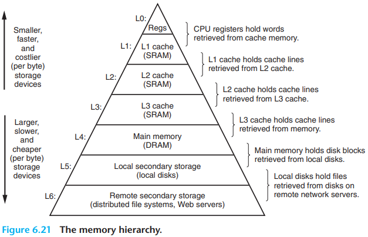

### Disk

The maximum number of bits that can be recorded by a disk is known as its `maximum capacity`. or simply `capacity`. Disk capacity is determined by the following technology factors:

- `Recording density` $(bits/in)$. The number of bits that can be squeezed into a 1-inch segment of a track.
- `Track density` $(tracks/in)$. The number of tracks that can be squeezed into a 1-inch segment of the radius extending from the center of the platter.
- `Areal density` $(bits/in^2)$. The product of the recording density and the track density.

The capacity of a disk is given by the following formula:
$$
Capacity = \frac{\#bytes}{sector} \times \frac{average \# sectors}{track} \times \frac{\#tracks}{surface} \times \frac{\#surfaces}{platter} \times \frac{\#platters}{disk}
$$
Disks read and write data in sector-size blocks. The `access time` for a sector has three main components: 

- `Seek time`. To read the contents of some target sector, the arm first positions the head over the track that contains the target sector. The time required to move the arm is called the `seek time`. 
- `Rotational latency`. Once the head is in position over the track, the drive waits for the first bit of the target sector to pass under the head. 
- `Transfer time`. When the first bit of the target sector is under the head, the drive can begin to read or write the contents of the sector.

### Cache

different kinds of cache misses:

- `compulsory misses` or `cold misses
- `conflict miss`

Cache performance is evaluated with a number of metrics:

- `Miss rate`. The fraction of memory references during the execution of a program, or a part of a program, that miss. It is computed as $\#misses / \#references$.
- `Hit rate`. The fraction of memory references that hit. It is computed as $1-miss$ rate.
- `Hit time`. The time to deliver a word in the cache to the CPU, including the time for set selection, line identification, and word selection. Hit time is on the order of several clock cycles for L1 caches.
- `Miss penalty`. Any additional time required because of a miss. The penalty for L1 misses served from L2 is on the order of 10 cycles; from L3, 50 cycles; and from main memory, 200 cycles.

### Performance

The rate that a program reads data from the memory system is called the `read throughput`, or sometimes the `read bandwidth`. If a program reads $n$ bytes over a period of $s$ seconds, then the read throughput over that period is $n/s$, typically expressed in units of megabytes per second (MB/s).

## Virtual Memory

`Virtual memory` is an abstraction that provides each process with the illusion that it has exclusive use of the main memory. Each process has the same uniform view of memory, which is known as its `virtual address space`.

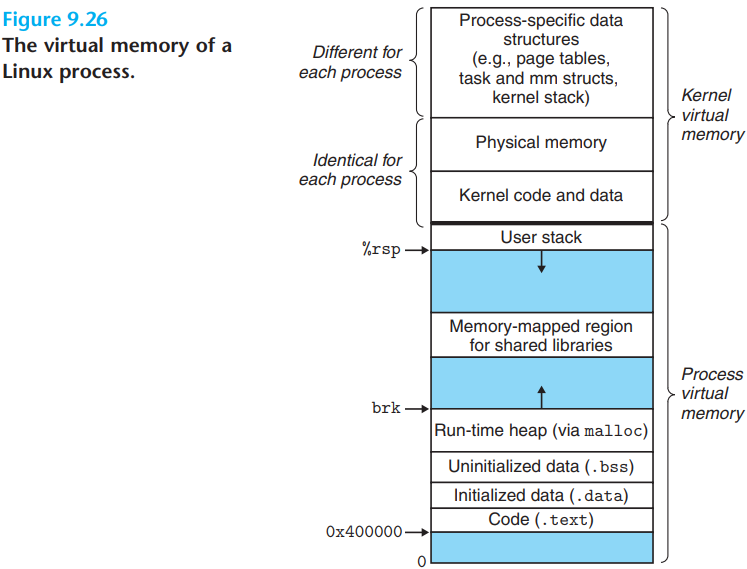

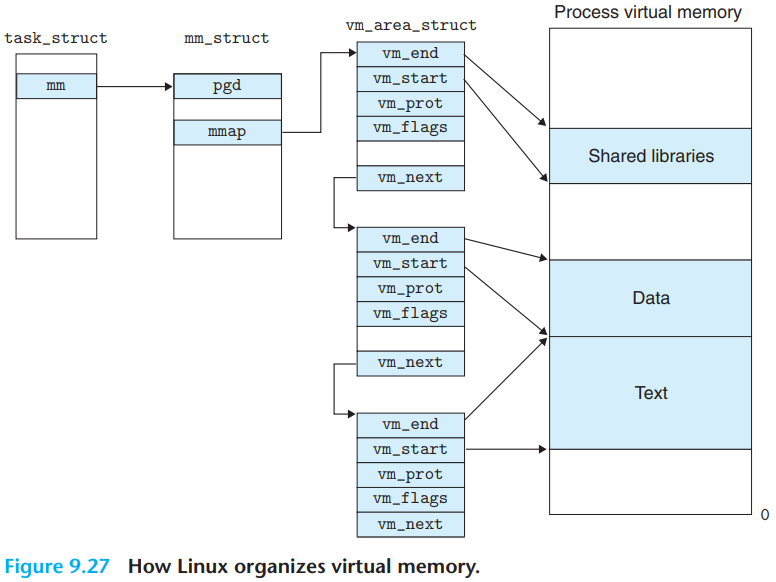

### Advantage

With one clean mechanism, virtual memory provides three important capabilities: 

1. It uses main memory efficiently by treating it as a cache for an address space stored on disk, keeping only the active areas in main memory and transferring data back and forth between disk and memory as needed.
2. It simplifies memory management by providing each process with a uniform address space.
3. It protects the address space of each process fro corruption by other processes.

### Virtual Addres

Modern processors use a form of addressing known as `virtual addressing`. With virtual addressing, the CPU accesses main memory by generating a `virtual address`(VA), which is converted to the appropriate physical address before being sent to main memory. The task of converting a virtual address to a physical one is known as `address translation`. Like exception handling, address translation requires close cooperation between the CPU harware and the operating system. Dedicated hardware on the CPU chip called the `memory management unit`(MMU) translates virtual addresses on the fly, using a lookup table stored in main memory whose contents are managed by the operating system.

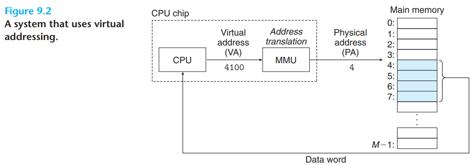

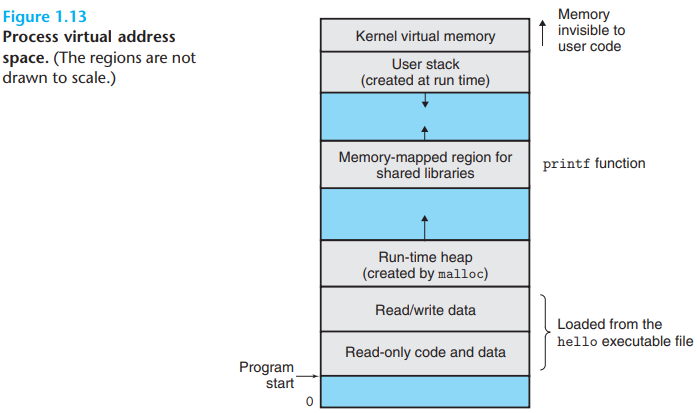

- `Program code and data`. Code begins at the same fixed address for all processes, followed by data locations that correspond to global C variables.
- `Heap`. Unlike the code and data areas, which are fixed in size once the process begins running, the heap expands and contracts dynamically at run time as a result of calls to C standard library routines such as `malloc` and `free`.
- `Shared libraries`. It is an area that holds the code and data for `shared libraries` such as the C standard library and the math library.
- `Stack`. At the top of the user's virtual address space is the `user stack` that the compiler uses to implement function calls.
- `Kernel virtual memory`. It is reserved for the kernel. Application programs are not allowed to read or write the contents of this area or to directly call functions defined in the kernel code. Instead, they must invoke the kernel to perform these operations.

### VM Page

A page table is an array of `page table entries`(PTEs). Each page in the virtual address space has a PTE at a fixed offset in the page table. For our purposes, we will assume that each PTE consists of a `valid` bit and an $n$-bit address field. The valid bit indicates whether the virtual page is currently cached in DRAM. If the valid bit is set, the address field indicates the start of the corresponding physical page in DRAM where the virtual page is cached. If the valid bit is not set, then a null address indicates that the virtual page has not yet been allocated. Otherwise, the address points to the start of the virtual page on disk.

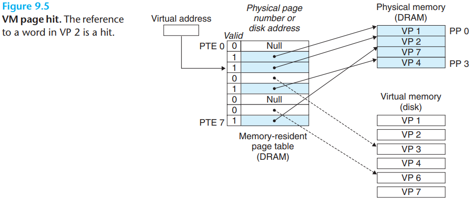

In virtual memory parlance, a DRAM cache miss is known as a page fault.

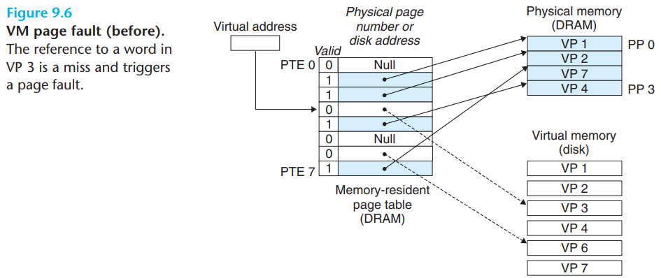

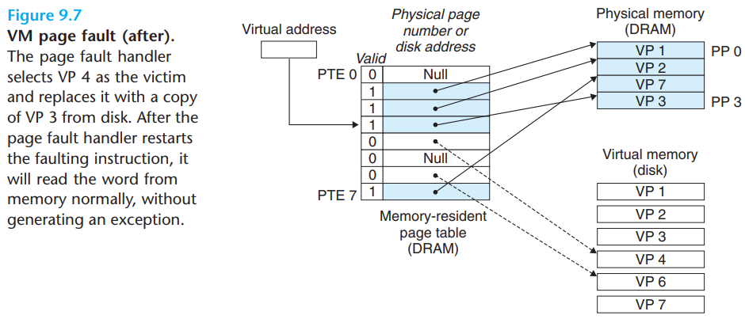

Any modern computer system must provide the means for the operating system to control access to the memory system. A user process should not be allowed to modify its read-only code section. Nor should it be allowed to read or modify any of the code and data structures in the kernel. It should not be allowed to read or write the private memory of other processes, and it should not be allowed to modify any virtual pages that are shared with other processes, unless all parties explicitly allow it (via calls to explicit interprocess communication system calls).

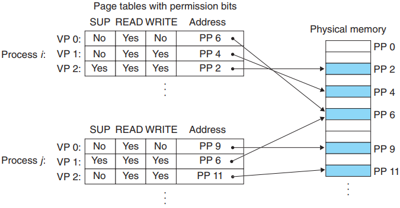

*Using VM to provide page-level memory protection.*

### Address Translation

Formally, address translation is a mapping between the elements of an $N$-element virtual address space (VAS) and an $M$-element physical address space (PAS),
$$
MAP: VAS \rightarrow PAS \cup \phi
$$
where
$$
MAP(A) = 
\begin{cases}
\cfrac A', &if\ data\ at\ virtual\ addr. A\ are\ present\ at\ physical\ addr. A'\ in\ PAS\\
\phi, &if\ data\ at\ virtual\ addr. A\ are\ not present\ in\ physical\ memory
\end{cases}
$$
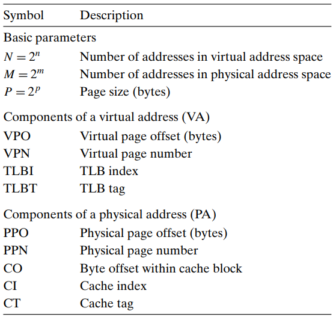

*Summary of address tranlation symbols*

How the MMU uses the page table to perform this mapping. A control register in the CPU, the `page table base register`(PTBR) points to the current page table. The $n$-bit virtual address has two components: a $p$-bit `virtual page offset`(VPO) and an $(n - p)$-bit `virtual page number`(VPN). The MMU uses the VPN to select the appropriate PTE.

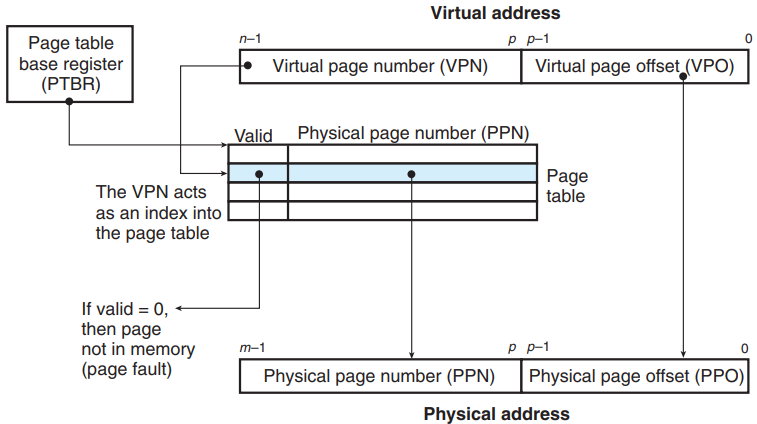

*Address translation with a page table*

## Shared Object Mapping

An object can be mapped into an area of virtual memory as either a `shared object` or a `private object`. If a process maps a shared obejct into an area of its virtual address space, then any writes that the process makes to that area are visible to any other processes that have also mapped the shared object into their virtual memory. Further, the changes are also reflected in the original object on disk.

Changes made to an area mapped to a private object, on the other hand, are not visible to other processes, and any writes that the process makes to the area are not reflected back to the object on disk. A virtual memory area into which a shared object is mapped is often called a `shared area`. Similarly for a `private area`.

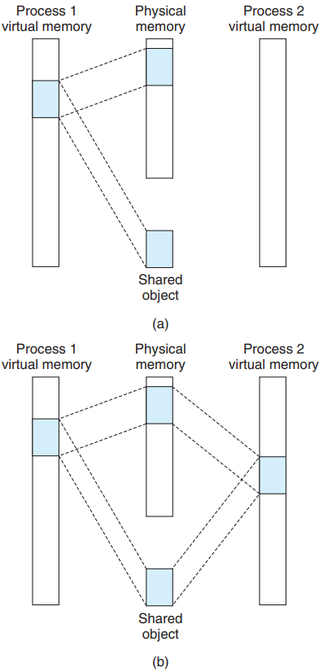

*A shared object. (a) After process 1 maps the shared object. (b) After process 2 maps the same shared object. (Note that the physical pages are not necessarily contiguous.)*

Private objects are mapped into virtual memory using a clever technique known as copy-on-write. A private object begins life in exactly the same way as a shared object, with only one copy of the private object stored in physical memory.

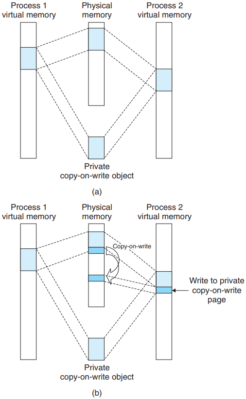

*A private copy-on-write object. (a) After both processes have mapped the private copy-on-write object. (b) After process 2 writes to a page in the private area.*

## Summary

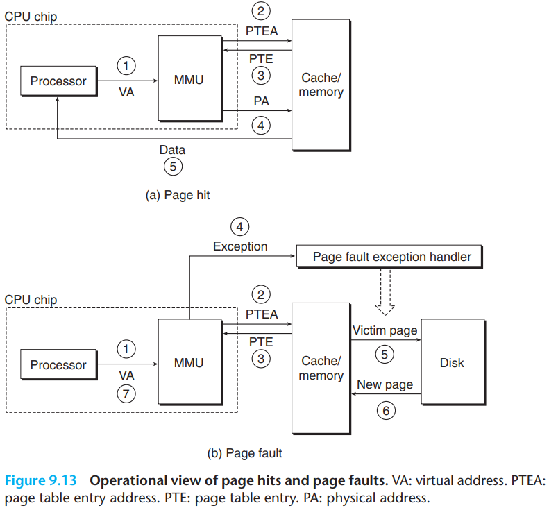

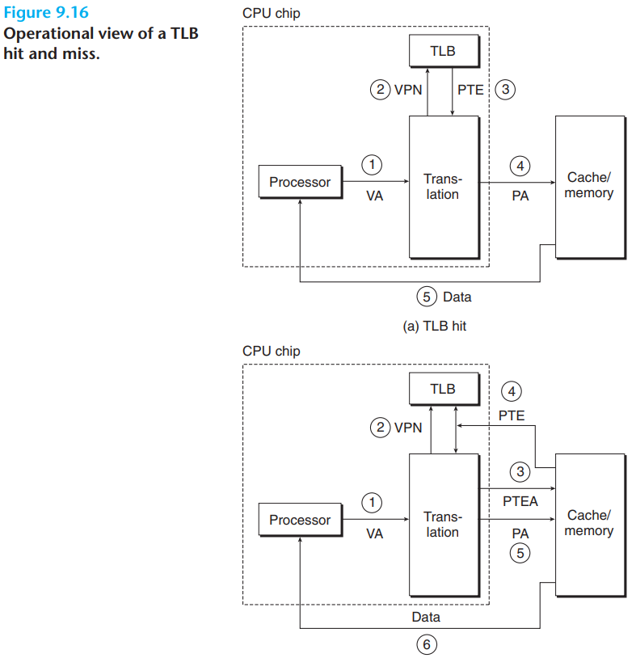

## Reference

[1] Randal E. Bryant, David R. O'Hallaron . COMPUTER SYSTEMS: A PROGRAMMER'S PERSPECTIVE . 3ED
