English | [中文版](mem_mgr_zh.md)

# Memory Management

[TOC]

Memory is an essential component of a computer system, responsible for storing data and instructions needed for processing. It enables the CPU to execute programs efficiently and ensures smooth system operation.

## Classification of Memory

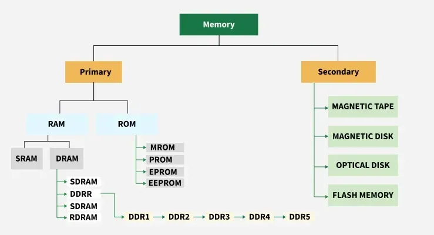

### RAM (Random Access Memory)

RAM is the computer's main memory used for temporary storage of active programs and data. Data is lost when power is off. It provides fast CPU access, improving multitasking and performance.

Types of RAM:

- SRAM (Static RAM)
- DRAM (Dynamic RAM)

### ROM (Read-Only Memory)

ROM is non-volatile memory that stores essential instructions permanently. It holds system firmware and boot instructions.

Types of ROM:

- MROM: Pre-programmed at manufacture.
- PROM: User-programmable once
- EPROM: UV-erasable
- EEPROM: Electrically erasable
- Flash Memory: Fast, used in SSDs and USB drives

---

## Memory Hierarchy

Real systems arrange storage as a hierarchy with different capacities, latencies, and costs. Typical levels are:

- Registers and CPU-local storage (fastest, smallest)
- L1/L2/L3 caches (on-chip/off-chip caches)
- Main memory (DRAM)
- Persistent storage (SSD/HDD)

SRAM is usually used for caches (fast, expensive). DRAM is used for main memory (slower, cheaper).

### Disk Capacity

Disk capacity depends on recording density, track density, and platter count. Disks transfer data in sector-sized blocks. Access time for a sector includes:

- Seek time: moving the head to the right track
- Rotational latency: waiting for the sector under the head
- Transfer time: serial transfer of the sector contents

These overheads mean large sequential transfers are far more efficient than many small random accesses.

### Cache metrics

Important cache metrics:

- `Miss rate`. The fraction of memory references during the execution of a program, or a part of a program, that miss. It is computed as $\#misses / \#references$.
- `Hit rate`. The fraction of memory references that hit. It is computed as $1-miss$ rate.
- `Hit time`. The time to deliver a word in the cache to the CPU, including the time for set selection, line identification, and word selection. Hit time is on the order of several clock cycles for L1 caches.
- `Miss penalty`. Any additional time required because of a miss. The penalty for L1 misses served from L2 is on the order of 10 cycles; from L3, 50 cycles; and from main memory, 200 cycles.

Common miss types:

- Compulsory (cold) misses: first reference to a block
- Capacity misses: working set larger than the cache
- Conflict misses: multiple blocks map to the same cache set (for set-associative caches)

Performance: throughput (bytes/sec) and latency are both important; many workloads are latency-sensitive.

---

## Memory Management

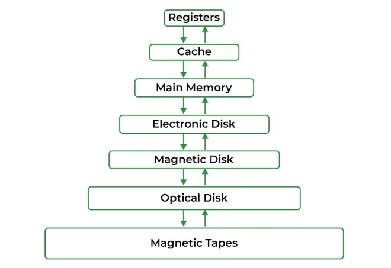

Memory management is the process of controlling and organising a computer's memory by allocating portions, called blocks, to different executing programmes to improve the overall system performance.

### Memory Allocation

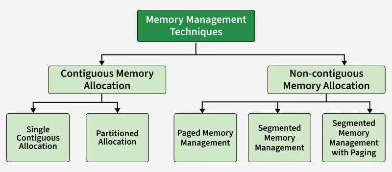

#### Single Contiguous Memory Allocation

Simplest form of memory management. In this technique, the main memory is divided into two parts:

- One part is reserved for the Operating System
- The remaining part is allocated to a single user process

#### Partitioned Memory Allocation

Main memory is divided into multiple contiguous partitions, and each partition can hold one process. This technique supports multiprogramming.

#### Paged Memory Management

TODO

#### Segmented Memory Management

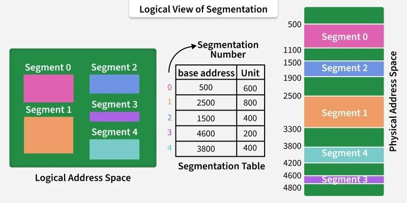

Segmentation is a memory management technique where a process is divided into variable-sized chunks called segments.

#### Segmented Memory Management With Paging

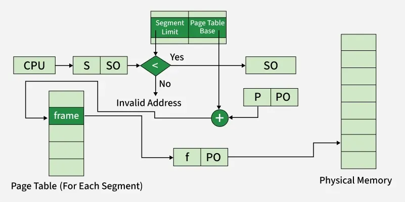

Segmentation with Paging is a hybrid memory management technique that combines the advantages of both segmentation and paging.

### Fragmentation

#### Internal Fragmentation

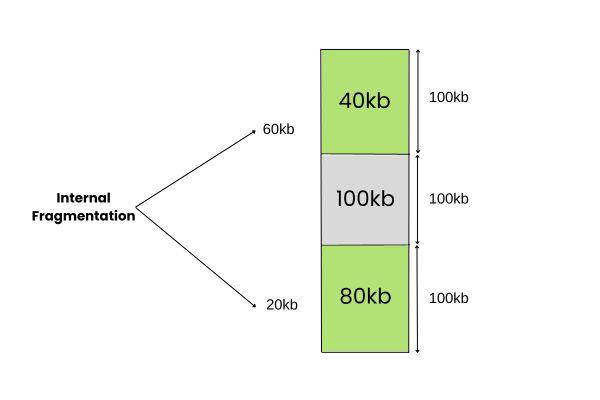

Internal Fragmentation is the wastage of memory that occurs when fixed-sized memory blocks are allocated to processes, but the process does not use the entire allocated block.

#### External Fragmentation

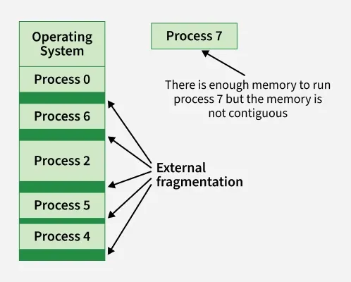

External fragmentation is a problem in memory management where free memory is divided into small, non-contiguous blocks. Even though there may be enough total free memory to run a new program, the memory is scattered in tiny pieces, so it's impossible to find a single, large block for the program to use.

Solution of External Fragmentation:

1. Memory Compaction
2. Paging

### Next Fit Algorithm

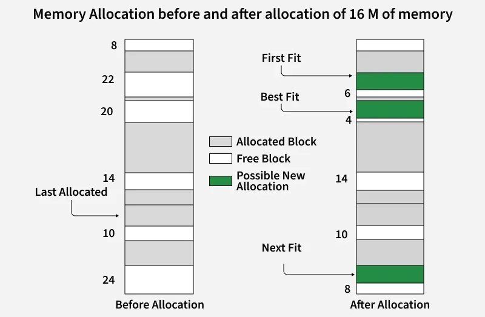

The Next Fit algorithm is a modified version of the First Fit memory allocation technique. While the First Fit algorithm always starts searching from the beginning of the memory block list for each new process, the Next Fit algorithm optimizes this behavior by continuing the search from where it last left off.

Time and Space Complexity:

- Time Complexity: $O(N \times M)$
- Auxiliary Space: $O(N)$

The Next Fit algorithm helps in reducing external fragmentation by:

- Avoiding repeated use of initial memory blocks.
- Spreading allocations more evenly across memory.
- Leaving larger free gaps between allocated partitions that can accommodate future large processes.

### Buddy System Algorithm

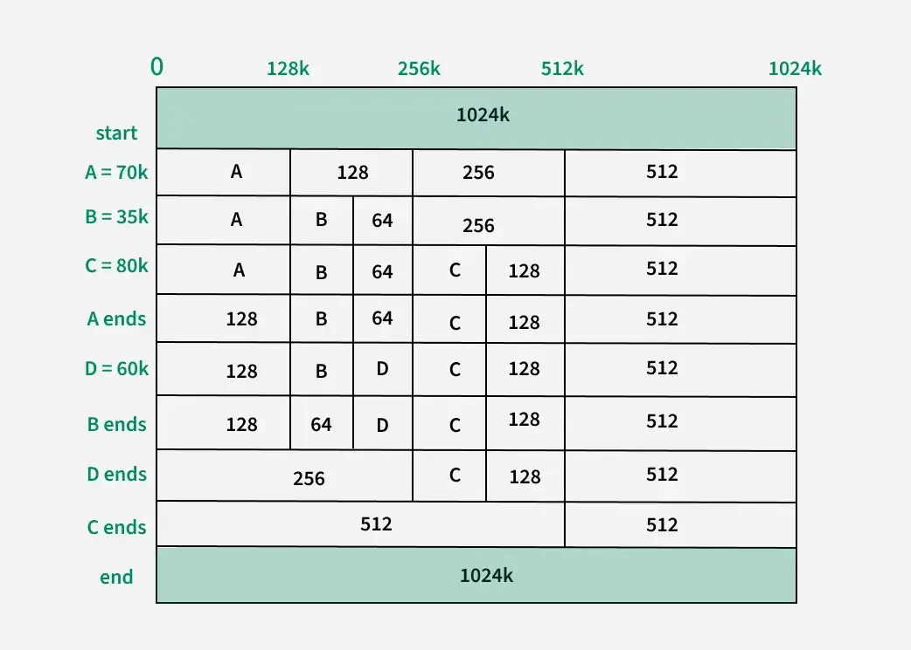

The Buddy Allocation System is a memory management technique that divides a large memroy block into smaller power-of-two blocks called buddies.

---

## Virtual memory

Virtual memory (VM) gives each process the illusion of a large, private, contiguous address space. Key benefits:

- Efficient use of physical memory by keeping only active pages in RAM (DRAM acts as a cache for the address space).
- Simpler programming model: each process has a uniform virtual address space.
- Protection: isolate processes from each other and from the kernel.

### Virtual address space layout

Typical regions in a user process virtual address space:

- Program text (code)
- Initialized and uninitialized data (globals)
- Heap (grows up via malloc/brk/munmap)
- Shared libraries (mapped regions)
- Stack (grows down)
- Kernel space (in a separate, protected region)

### Types

There are two main types of virtual memory:

1. Paging
2. Sementation

## Swap Space

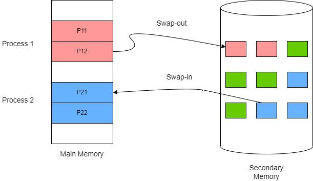

Modern operating systems use both physical memory (RAM) and virtual memory to manage processes efficiently. Swap space (also called paging space or swap file) plays a key role in this memory management strategy. It is a dedicated area on the hard disk used by the operating system as an extension of physical RAM.

## Pages, Page Tables, and the MMU

Virtual memory is organized in pages (commonly 4 KiB, though large pages exist). The page table maps virtual page numbers (VPNs) to physical page frames. Each page table entry (PTE) typically contains:

- A valid/present bit
- The physical frame number (PFN) or a pointer to disk location when not present
- Access bits (read/write/execute), dirty bit, and other control flags

### MMU

The CPU's MMU uses the current page table (pointed to by a register like CR3 on x86) to translate virtual addresses to physical addresses on every memory reference.

### Multi-level page tables and page-table sizes

To avoid huge contiguous page tables, architectures use multi-level page tables (two-level, three-level, or more). Each level uses part of the VPN to index a smaller table. This reduces memory usage for sparse address spaces.

### Translation Lookaside Buffer (TLB)

Because walking page tables is expensive, CPUs use a TLB — a small, fast cache of recent virtual-to-physical translations. TLB hits are critical to performance; TLB misses force a page-table walk (software or hardware-assisted) and can be expensive.

### Page hit and page faults

### Demand paging and page faults

A page fault occurs when a program attempts to access data or code that is in its address space but is not currently located in the system RAM. This triggers a sequence of events where the operating system must manage the fault by loading the required data from secondary storage into RAM.

Types of page faults:

- Minor Page Fault.
- Major Page Fault.
- Invalid Page Fault.

Causes of page faults:

- Demand Paging
- Invalid Memory Access
- Process Violation

Most systems use demand paging: pages are loaded into physical memory only when first accessed. If a referenced page is not present, the hardware raises a page-fault exception. The kernel's page-fault handler:

1. Determines the faulting virtual address and reason (access violation vs not-present)
2. Locates or allocates a physical page (possibly reading it from swap or the mapped file)
3. Updates the page table and PTE flags
4. Restarts the faulting instruction

Image sequence for page fault handling is illustrated in `res/vm_page_fault_before` and `res/vm_page_fault_after`.

### Page replacement policies

When physical memory is full, the OS chooses victim pages to evict. Common strategies:

- Least Recently Used (LRU) or approximations (CLOCK) — favors evicting pages not recently referenced
- FIFO — simple but poor in practice
- Working-set algorithms — try to maintain the active working set

Replacement policy interacts with workload behavior; swapping introduces large latency spikes.

### Large pages and NUMA

Large pages (huge pages) reduce TLB pressure and can improve throughput for big-memory workloads. On NUMA machines, memory access latency depends on the memory's proximity to the CPU — NUMA-aware allocation and thread placement are important for performance.

### Page Replacement & Thrashing

In an operating system that uses paging, a page replacement algorithm is needed when a page fault occurs and no free page frame is available. In this case, one of the existing pages in memory must be replaced with the new page.

Common Page Replacement Techniques:

- First In First Out(FIFO)
- Optimal Page Replacement
- Least Recently Used (LRU)
- Most Recently Used (MRU)

Thrashing:

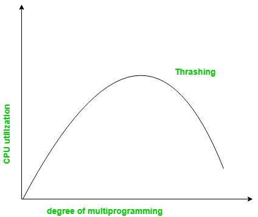

## Copy-on-write and shared mappings

Shared mappings (e.g., shared libraries or explicit mmap with MAP_SHARED) cause writes to be visible to all processes mapping the same region. Private mappings (MAP_PRIVATE) use copy-on-write (COW): the kernel maps the same physical page read-only into multiple processes; on a write, the kernel makes a private copy and updates the PTE.

Copy-on-write is heavily used at fork() to avoid copying the entire address space.

## Summary

### Differences Among RAM, ROM and Secondary Memory

| RAM                 | ROM                    | Secondary Memory   |
| ------------------- | ---------------------- | ------------------ |
| Volatile            | Non-volatile           | Non-volatile       |
| Temporary workspace | Permanent instructions | Long-term storagte |
| Fast                | Moderate               | Slow               |
| Read/Write          | Mostly Read-only       | Read/Write         |
| DRAM, SRAM          | PROM, EPROM, EEPROM    | HDD, SSD, USB      |

### Swap Space vs Virtual Memory

| Feature        | Swap Space                                          | Virtual Memory                                            |
| -------------- | --------------------------------------------------- | --------------------------------------------------------- |
| Definition     | Physical disk space used for swapping memory pages. | Abstract combination of physical RAM and swap space.      |
| Role           | Storage area for inactive pages.                    | Provides an abstraction of larger memory to applications. |
| Performance    | Slow access (due to disk I/O)                       | Appears seamless to applications                          |
| Implementation | Typically a swap partition or swap file             | Managed by OS using page tables.                          |

## References

[1] Randal E. Bryant and David R. O'Hallaron, Computer Systems: A Programmer's Perspective (CS:APP), 3rd ed.

[2] [Virtual Memory in Operating System](https://www.geeksforgeeks.org/operating-systems/virtual-memory-in-operating-system/)

[3] [Page Fault Handling in Operating System](https://www.geeksforgeeks.org/operating-systems/page-fault-handling-in-operating-system/)

[4] [Introduction to memory and memory units](https://www.geeksforgeeks.org/computer-organization-architecture/introduction-to-memory-and-memory-units/)

[5] [Memory Management in Operating System](https://www.geeksforgeeks.org/operating-systems/memory-management-in-operating-system/)

[6] [Segmentation in Operating System](https://www.geeksforgeeks.org/operating-systems/segmentation-in-operating-system/)

[7] [Segmentation with Paging](https://www.geeksforgeeks.org/operating-systems/segmentation-with-paging/)

[8] [Internal Fragmentation in OS](https://www.geeksforgeeks.org/operating-systems/internal-fragmentation-in-os/)

[9] [External Fragmentation in OS](https://www.geeksforgeeks.org/operating-systems/external-fragmentation-in-os/)

[10] [Program for Next Fit algorithm in Memory Management](https://www.geeksforgeeks.org/dsa/program-for-next-fit-algorithm-in-memory-management/)

[11] [Buddy System - Memory Allocation Technique](https://www.geeksforgeeks.org/operating-systems/buddy-system-memory-allocation-technique/)

[12] [Page Replacement Algorithms in Operating Systems](https://www.geeksforgeeks.org/operating-systems/page-replacement-algorithms-in-operating-systems/)

[13] [Belady's Anomaly in Page Replacement Algorithms](https://www.geeksforgeeks.org/operating-systems/beladys-anomaly-in-page-replacement-algorithms/)

[14] [Thrashing](https://www.geeksforgeeks.org/operating-systems/techniques-to-handle-thrashing/)

[15] [Second Chance (or Clock) Page Replacement Policy](https://www.geeksforgeeks.org/operating-systems/second-chance-or-clock-page-replacement-policy/)

[16] [Belady's Anomaly in Page Replacement Algorithms]()
