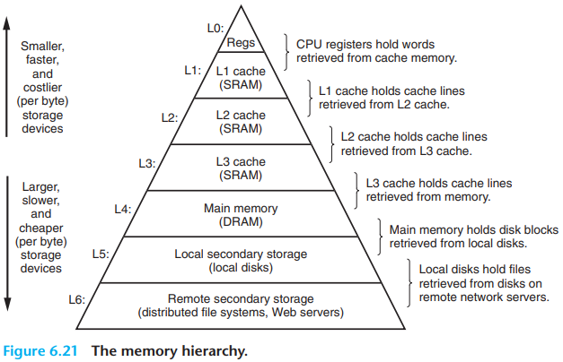
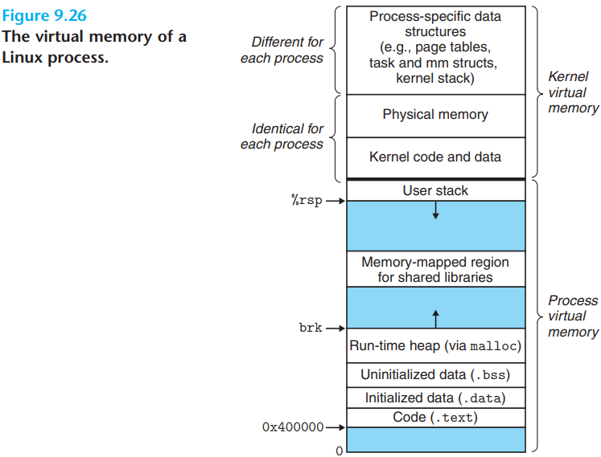
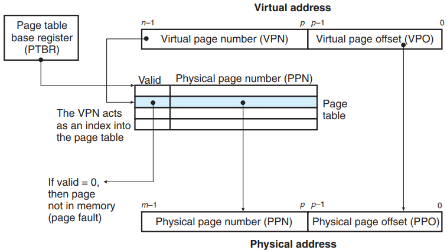
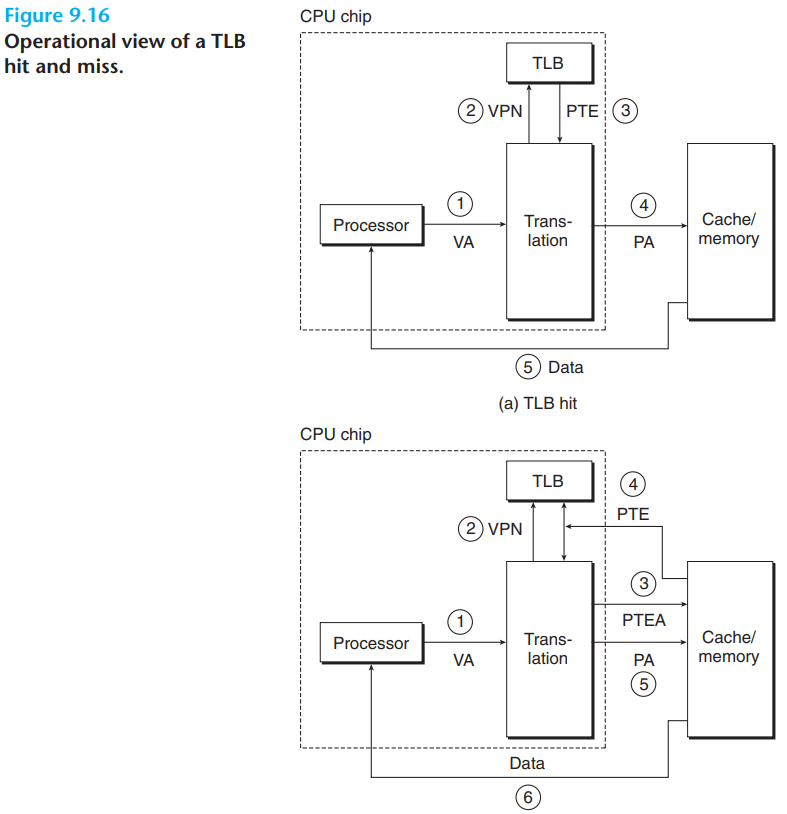
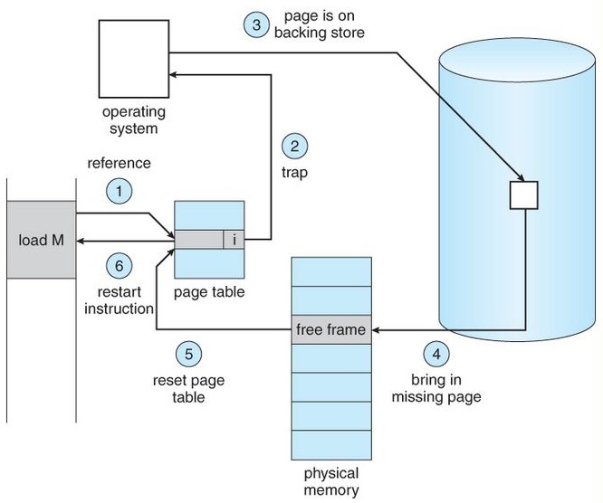
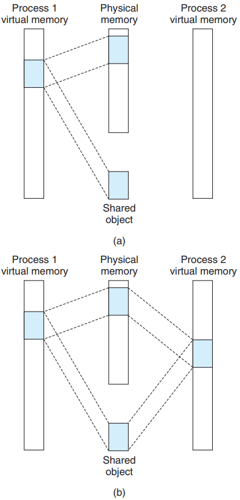
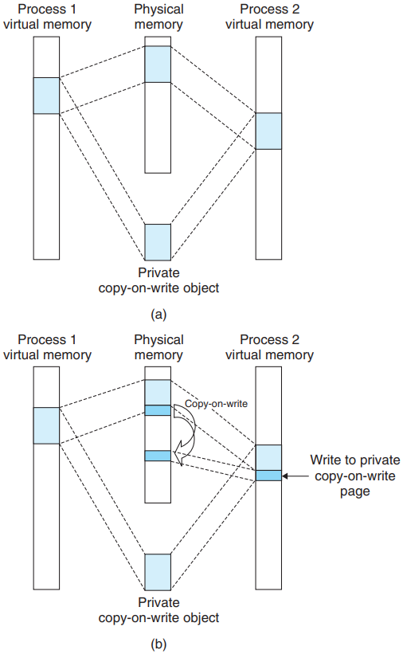
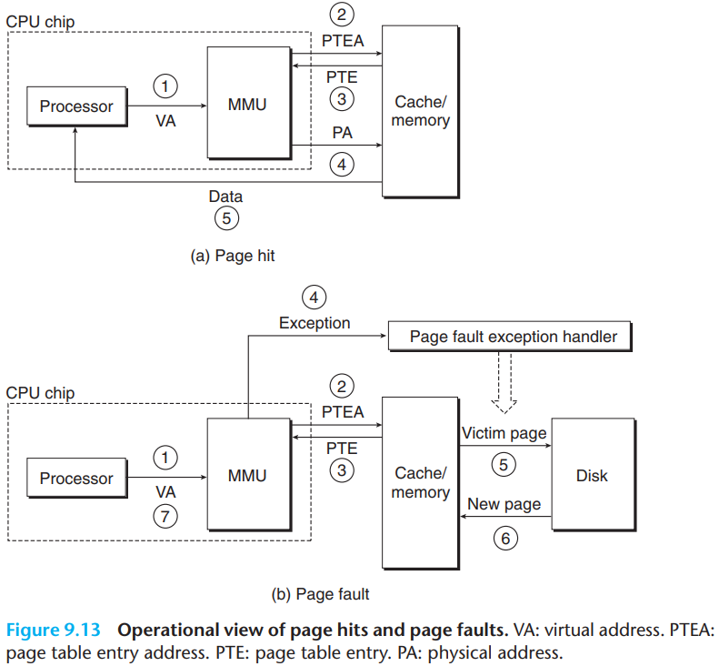

English | [中文版](mem_mgr_zh.md)

# Memory Management

[TOC]

## Memory hierarchy

Real systems arrange storage as a hierarchy with different capacities, latencies, and costs. Typical levels are:

- Registers and CPU-local storage (fastest, smallest)
- L1/L2/L3 caches (on-chip/off-chip caches)
- Main memory (DRAM)
- Persistent storage (SSD/HDD)

### Disk Capacity

SRAM is usually used for caches (fast, expensive). DRAM is used for main memory (slower, cheaper).

Disk capacity and timings

Disk capacity depends on recording density, track density, and platter count. Disks transfer data in sector-sized blocks. Access time for a sector includes:

- Seek time: moving the head to the right track
- Rotational latency: waiting for the sector under the head
- Transfer time: serial transfer of the sector contents

These overheads mean large sequential transfers are far more efficient than many small random accesses.

### Cache metrics

Important cache metrics:

- `Miss rate`. The fraction of memory references during the execution of a program, or a part of a program, that miss. It is computed as $\#misses / \#references$.
- `Hit rate`. The fraction of memory references that hit. It is computed as $1-miss$ rate.
- `Hit time`. The time to deliver a word in the cache to the CPU, including the time for set selection, line identification, and word selection. Hit time is on the order of several clock cycles for L1 caches.
- `Miss penalty`. Any additional time required because of a miss. The penalty for L1 misses served from L2 is on the order of 10 cycles; from L3, 50 cycles; and from main memory, 200 cycles.

Common miss types:

- Compulsory (cold) misses: first reference to a block
- Capacity misses: working set larger than the cache
- Conflict misses: multiple blocks map to same cache set (for set-associative caches)

Performance: throughput (bytes/sec) and latency are both important; many workloads are latency-sensitive.

## Virtual memory

Virtual memory (VM) gives each process the illusion of a large, private, contiguous address space. Key benefits:

- Efficient use of physical memory by keeping only active pages in RAM (DRAM acts as a cache for the address space).
- Simpler programming model: each process has a uniform virtual address space.
- Protection: isolate processes from each other and from the kernel.

### Virtual address space layout

Typical regions in a user process virtual address space:

- Program text (code)
- Initialized and uninitialized data (globals)
- Heap (grows up via malloc/brk/munmap)
- Shared libraries (mapped regions)
- Stack (grows down)
- Kernel space (in a separate, protected region)

### Types

There are two main types of virtual memory:

1. Paging
2. Sementation

## Pages, Page Tables, and the MMU

Virtual memory is organized in pages (commonly 4 KiB, though large pages exist). The page table maps virtual page numbers (VPNs) to physical page frames. Each page table entry (PTE) typically contains:

- A valid/present bit
- The physical frame number (PFN) or a pointer to disk location when not present
- Access bits (read/write/execute), dirty bit, and other control flags

The CPU's MMU uses the current page table (pointed to by a register like CR3 on x86) to translate virtual addresses to physical addresses on every memory reference.

### Multi-level page tables and page-table sizes

To avoid huge contiguous page tables, architectures use multi-level page tables (two-level, three-level, or more). Each level uses part of the VPN to index a smaller table. This reduces memory usage for sparse address spaces.

### Translation Lookaside Buffer (TLB)

Because walking page tables is expensive, CPUs use a TLB — a small, fast cache of recent virtual-to-physical translations. TLB hits are critical to performance; TLB misses force a page-table walk (software or hardware-assisted) and can be expensive.

### Demand paging and page faults

A page fault occurs when a program attempts to access data or code that is in its address space but is not currently located in the system RAM. This triggers a sequence of events where the operating system must manage the fault by loading the required data from secondary storage into RAM.

Types of page faults:

- Minor Page Fault.
- Major Page Fault.
- Invalid Page Fault.

Causes of page faults:

- Demand Paging
- Invalid Memory Access
- Process Violation

Most systems use demand paging: pages are loaded into physical memory only when first accessed. If a referenced page is not present, the hardware raises a page-fault exception. The kernel's page-fault handler:

1. Determines the faulting virtual address and reason (access violation vs not-present)
2. Locates or allocates a physical page (possibly reading it from swap or the mapped file)
3. Updates the page table and PTE flags
4. Restarts the faulting instruction

Image sequence for page fault handling is illustrated in `res/vm_page_fault_before` and `res/vm_page_fault_after`.

### Page replacement policies

When physical memory is full, the OS chooses victim pages to evict. Common strategies:

- Least Recently Used (LRU) or approximations (CLOCK) — favors evicting pages not recently referenced
- FIFO — simple but poor in practice
- Working-set algorithms — try to maintain the active working set

Replacement policy interacts with workload behavior; swapping introduces large latency spikes.

### Large pages and NUMA

Large pages (huge pages) reduce TLB pressure and can improve throughput for big-memory workloads. On NUMA machines, memory access latency depends on the memory's proximity to the CPU — NUMA-aware allocation and thread placement are important for performance.

## Copy-on-write and shared mappings

Shared mappings (e.g., shared libraries or explicit mmap with MAP_SHARED) cause writes to be visible to all processes mapping the same region. Private mappings (MAP_PRIVATE) use copy-on-write (COW): the kernel maps the same physical page read-only into multiple processes; on a write, the kernel makes a private copy and updates the PTE.

Copy-on-write is heavily used at fork() to avoid copying the entire address space.

## Fragmentation

- Internal fragmentation: allocated region contains unused space (e.g., fixed-size blocks with wasted slack)
- External fragmentation: free memory is split into small pieces making large contiguous allocations difficult

Virtual memory (paging) largely eliminates external fragmentation for user allocations, but internal fragmentation and allocator-level fragmentation remain concerns.

## Memory allocators and kernel interfaces

At user level, allocators (malloc, free, jemalloc, tcmalloc) manage heap memory and implement strategies to reduce fragmentation and contention. They typically obtain memory from the kernel via brk/sbrk or mmap/munmap.

Kernel interfaces for memory management include:

- brk/sbrk: grow/shrink the heap (simple, less flexible)
- mmap/munmap: map files or anonymous memory, used for large allocations and shared mappings

Choosing the right interface and allocator matters for latency and scalability.

## Security features

- Address Space Layout Randomization (ASLR) randomizes base addresses of segments to make exploitation harder
- NX/DEP (non-executable pages) mark data pages non-executable
- Page protection bits prevent unauthorized access

## Summary

- Measure first: use perf, vmstat, iostat, and custom benchmarks to locate memory bottlenecks.
- Use appropriate page sizes: default 4 KiB for general use; huge pages for TLB-sensitive workloads.
- Avoid unnecessary page faults: touch large allocations (if appropriate) or use madvise to influence kernel behavior.
- Use mmap for large or shared allocations; use tuned allocators for concurrent workloads.
- Use O_DIRECT, fsync, and tuned flushing when building storage systems that need strict durability or predictable latency.

## References

[1] Randal E. Bryant and David R. O'Hallaron, Computer Systems: A Programmer's Perspective (CS:APP), 3rd ed.

[2] [Virtual Memory in Operating System](https://www.geeksforgeeks.org/operating-systems/virtual-memory-in-operating-system/)

[3] [Page Fault Handling in Operating System](https://www.geeksforgeeks.org/operating-systems/page-fault-handling-in-operating-system/)
