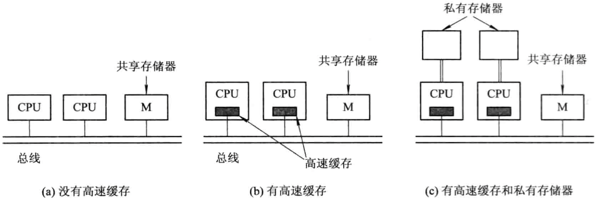
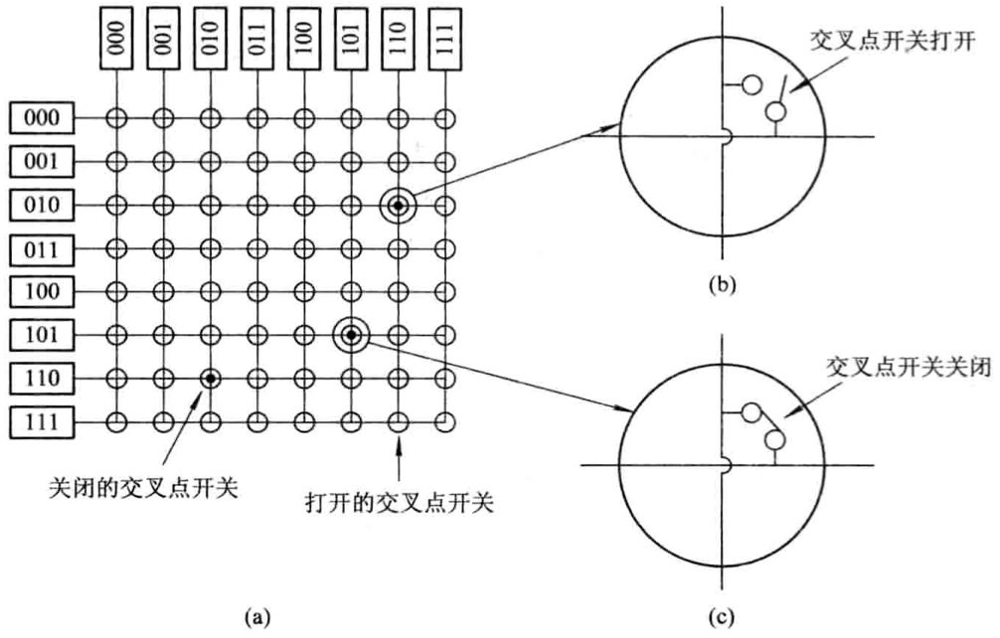
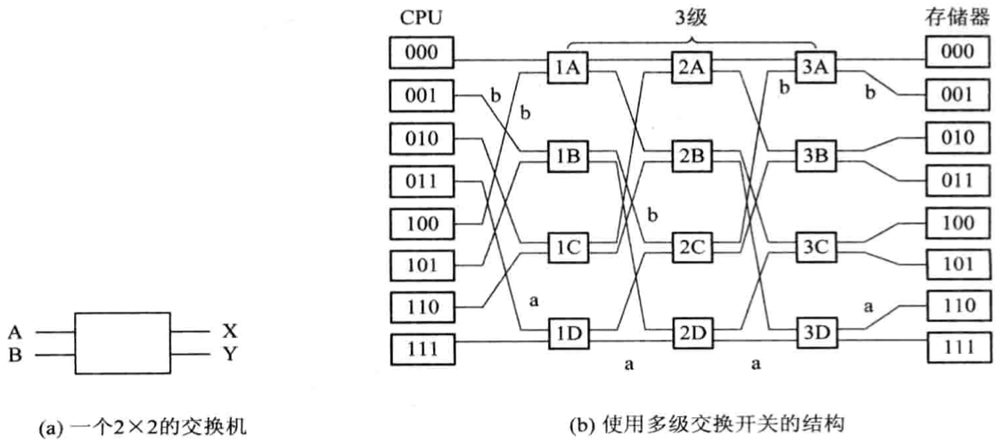
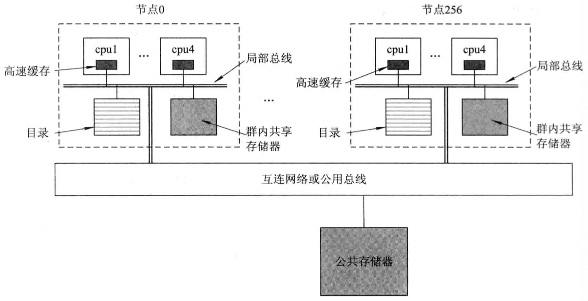
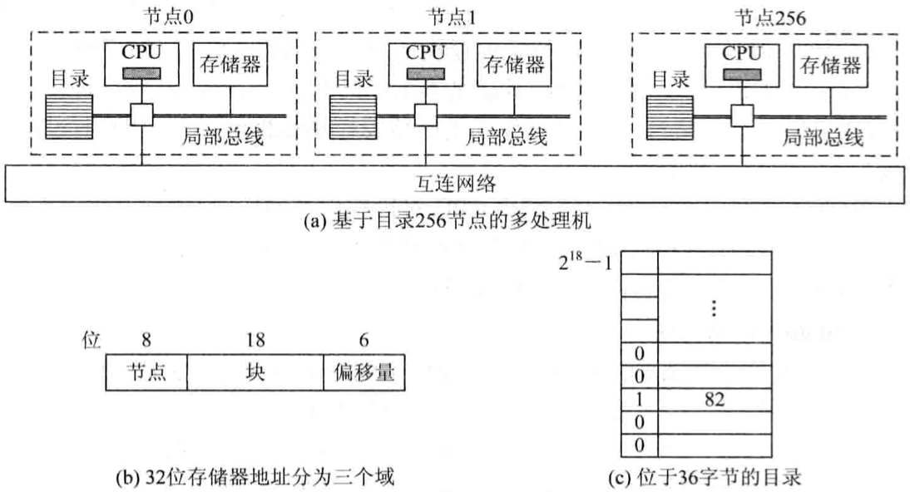

English | [中文版](multi_processor.md)

# Multiprocessor Systems

[TOC]


## Types of Multiprocessor Systems

By coupling degree:

- Tightly Coupled MPS implementations:
  1. Multiple processors share main memory and I/O devices.
  2. Each processor is connected to its own memory, or main memory is divided into independently accessible modules, each processor corresponding to a memory or memory module.

- Loosely Coupled MPS implementations:
  Interconnection of multiple computers via channels or communication lines.

By processor similarity:

- Symmetric Multiprocessor System (SMPS)
- Asymmetric Multiprocessor System (ASMPS)


## Structure of Multiprocessor Systems

### UMA Multiprocessor System Structure

1. Single-bus SMP structure

	

	Disadvantages:
	- Limited scalability
	- All CPUs access memory via the bus, leading to bus contention when multiple CPUs need access simultaneously.

2. Multi-bus SMP structure

3. Single-stage crossbar switch system structure

	

	Features of UMA multiprocessor systems with crossbar switches:
	1. Node connections: The crossbar is usually an $N \times N$ array, but only one crosspoint in each row and column can be "on" at a time, so only $N$ node pairs can be connected simultaneously.
	2. CPU-to-memory connections: Each memory module allows only one CPU node to access it at a time (one crosspoint per column), but each row can have multiple crosspoints on to support parallel memory access.
	3. Crossbar cost is $N^2$ (N = number of ports), limiting its use in large-scale systems.

4. Multistage exchange grid system structure

	

### NUMA Multiprocessor System Structure

- NUMA (Nonuniform Memory Access)
  All shared memory is physically distributed but logically contiguous, forming a global address space. Each CPU can access all system memory, but uses different instructions for local vs remote access.

  

- CC-NUMA
  Each CPU maintains a directory of its cache blocks, recording and maintaining the location and state of each block. Each CPU's memory access may hit a cache block and operate accordingly.

  

  **Note: Remote memory access latency is much higher than local memory, so as CPU count increases, system performance does not scale linearly.**


## Types of Multiprocessor Operating Systems

1. Master-slave
	Slaves submit task requests to the master, which are queued and processed by the master, which then assigns suitable tasks to requesting slaves.

	| Advantages      | Disadvantages                        |
	| -------------- | ------------------------------------ |
	| - Easy to implement | - Low resource utilization<br>- Poor security |

2. Separate Supervisor System
	Each processor has its own management program and dedicated resources, with an OS similar to a single-machine OS, serving its own needs and managing its own resources and task assignment.

	| Advantages                | Disadvantages                                      |
	| -------------------------| -------------------------------------------------- |
	| - High autonomy<br>- High reliability | - Complex implementation<br>- Large memory overhead<br>- Unbalanced load |

3. Floating Supervisor Control Mode
	All processors form a pool, each can control any I/O device or access any memory module. The OS manages all processors, and at any time, any processor(s) can be designated as the "master" to run the OS and manage the system. The master role can switch as needed.

	| Advantages                                 | Disadvantages |
	| ------------------------------------------ | ------------- |
	| - High flexibility<br>- High reliability<br>- Load balancing | - Complex implementation |


## Process Synchronization

### Centralized and Distributed Synchronization

1. Central synchronizing entity
	A synchronizing entity is central if:
	- It has a unique name known to all processes that must synchronize.
	- Any of these processes can access it at any time.

2. Centralized synchronization mechanism
	All mechanisms based on a central synchronizing entity are centralized.

3. Centralized vs distributed synchronization algorithms
	- Centralized: A central node makes decisions for all processes needing shared resource access or communication; all info is centralized.
	  Disadvantages: Poor reliability, bottleneck risk.
	- Distributed: All nodes have the same info, make decisions based on local info, share responsibility and workload, and a single node failure does not crash the system.

4. Central process method
	A coordinator process is set up; other processes must request entry/exit to/from the critical section from the coordinator.

### Spin Lock

A spin lock is set on the bus, held by at most one kernel process. When a process needs the bus to access memory, it requests the spin lock. If occupied, it spins (loops) until available. If free, it acquires the lock, performs the operation, then releases it.

### Read-Copy-Update Lock and Exponential Backoff

1. Read-Copy-Update (RCU) lock introduction
	When a writer wants to write to a file, it first copies the file to a replica, modifies the replica, and later writes back the changes.

2. RCU lock
	RCU solves the reader-writer problem: both readers and writers access the shared file (data structure) as readers. Readers need no lock; writers copy, modify, and register a callback with a garbage collector, which later updates the pointer to the new data and frees/releases the old data.

3. Write-back timing
	Ideally, after all readers have finished.

4. RCU lock advantages
	- Readers are never blocked
	- No need for explicit synchronization for shared data

### Exponential Backoff and Waiting Queue Mechanism

1. Exponential backoff
	Each CPU's TSL (test-and-set lock) instruction is delayed by an exponentially increasing time after each test, reducing bus traffic by spreading out lock requests and reducing test frequency when the lock is busy. Downside: lock release may not be detected immediately, causing waste.

2. Waiting queue mechanism
	Each CPU has a private lock variable and a waiting list in its private cache. When multiple CPUs need a shared structure, the first waiting CPU gets a lock variable and is appended to the holder's waiting list; subsequent CPUs are appended to the previous waiter's list, etc.

### Ordering Mechanisms

1. Timestamp ordering
	- All special events (resource requests, communication, etc.) are timestamped.
	- Each event type uses a unique timestamp.
	- All events are totally ordered by timestamp.

2. Event count synchronization
	Operations:
	- `await(E, V)`: Before entering the critical section, if $E < V$, block and enqueue; else continue.
	  ```c
	  await(E, V) {
			if (E < V) {
				 i = EP;
				 stop();
				 i->status = "block";
				 i->sdata = EQ;
				 insert(EQ, i);
				 scheduler();
			}
			else continue;
	  }
	  ```
	- `advance(E)`: On exit, increment E; if EQ not empty, check head's V, if $E = V$, wake up.
	  ```c
	  advance(eventcount E) {
			E = E + 1;
			if (EQ <> NIL) {
				 V = inspect(EQ, 1);
				 if (E == V) wakeup(EQ, 1);
			}
	  }
	  ```
	  Sequence for a process:
	  ```c
	  await(E, V);
	  Access the critical resources;
	  advance(E);
	  ```
	- `read(E)`: Returns E's current value for reference. If designed well, await, read, and advance can be concurrent on the same event, but must be mutually exclusive on the sequencer.

### Bakery Algorithm

Events are sorted for critical resource access using FCFS. Assumptions:
- System has $N$ nodes, each with one process controlling a critical resource and handling simultaneous requests.
- Each process keeps a queue of recent and self-generated messages.
- Messages: request, reply, and release; request messages are sorted by event order, queue starts empty.
- $P_i$ sends $request(T_i, i)$, where $T_i = C_i$ is the logical clock value, $i$ is the content.

Algorithm:
1. $P_i$ requests resource: queues $request(T_i, i)$ and sends to others.
2. $P_j$ receives $request(T_i, i)$: replies with $reply(T_j, j)$, queues $request(T_i, i)$; if $P_j$ already requested, its timestamp is less than $(T_i, i)$.
3. $P_i$ can access resource if:
	- Its request is at the head of its queue
	- It has replies from all others with later timestamps
4. To release, $P_i$ removes its request and sends a timestamped release to others.
5. $P_j$ on receiving release from $P_i$ removes $P_i$'s request from its queue.

### Token Ring Algorithm

All processes form a logical ring. A single token circulates; only the process holding the token can enter the critical section and access shared resources. Since there is only one token, mutual exclusion is guaranteed.


## Process Scheduling in Multiprocessor Systems

### Scheduling Performance Metrics

- Task flow time: Time required to complete a task.
- Scheduling flow time: In multiprocessor systems, tasks are assigned to multiple processors; scheduling flow time is the sum of all processors' task flow times.
- Average flow: Scheduling flow time divided by number of tasks. Lower average flow means higher resource utilization and throughput, and lower cost per task.
- Processor utilization: Sum of task flows on a processor divided by max effective time unit.
- Speedup: Sum of busy times of all processors divided by parallel work time. More processors increase speedup and throughput, but fewer processors reduce cost and may improve overall system performance by freeing processors for other tasks.
- Throughput: Number of tasks completed per unit time, measured by the minimum completion time of task flows; depends on scheduling algorithm efficiency.

### Process Allocation Methods

1. In symmetric multiprocessor systems:
	- Static assignment: A process is fixed to a processor from start to finish.
	- Dynamic assignment: All ready processes are in a common queue; any processor can pick up any process.

	|          | Advantages                                              | Disadvantages                        |
	| -------- | ------------------------------------------------------ | ------------------------------------ |
	| Static   | - Low overhead                                         | - May cause processor imbalance      |
	| Dynamic  | - Avoids imbalance<br>- No extra overhead for tightly coupled systems | - Increases overhead for loosely coupled systems |

2. In asymmetric MPS:
	The OS core resides on a master; slaves only run user programs, and scheduling is done by the master.

	| Advantages         | Disadvantages                                  |
	| ----------------- | ---------------------------------------------- |
	| - Simple system   | - Low reliability<br>- Bottleneck at master    |

### Process (Thread) Scheduling Methods

1. Self-scheduling: All processors share a common ready queue; idle processors pick up processes/threads to run.

	| Advantages                                              | Disadvantages                        |
	| ------------------------------------------------------ | ------------------------------------ |
	| - Easy to port single-machine scheduling<br>- Avoids imbalance, improves utilization | - Bottleneck<br>- Inefficiency<br>- Frequent thread switches |

2. Gang scheduling: A group of threads from a process are assigned to a group of processors. Processor time can be allocated:
	- Evenly among all applications
	- Evenly among all threads

	| Advantages                                              | Disadvantages |
	| ------------------------------------------------------ | ------------- |
	| - Reduces context switches, improves efficiency<br>- Reduces scheduling frequency and overhead |               |

3. Dedicated processor assignment: During an application's execution, a set of processors is dedicated to it, one per thread, until completion.

4. Dynamic scheduling: Allows processes to change thread count during execution. The OS mainly allocates processors, following:
	- Allocate if idle
	- New jobs have absolute priority
	- Keep waiting
	- Allocate on release

