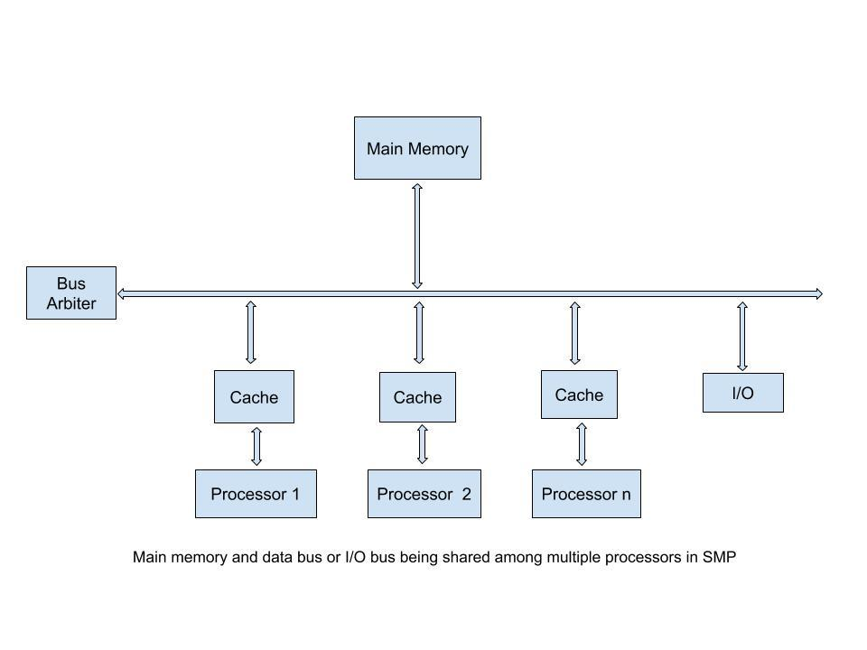
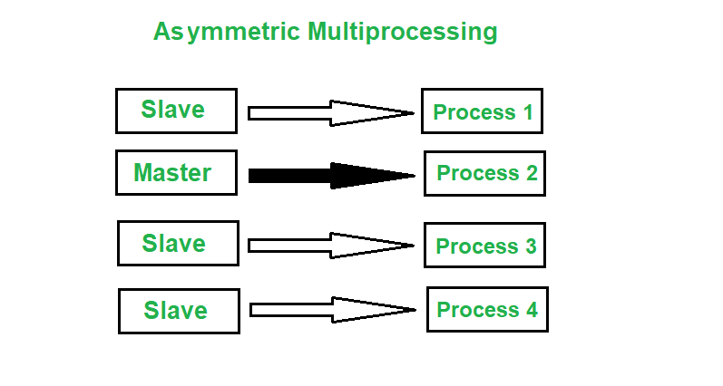
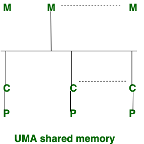
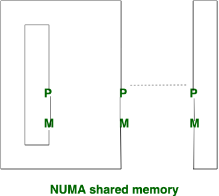
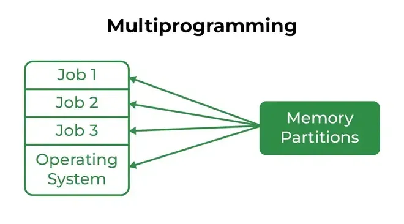
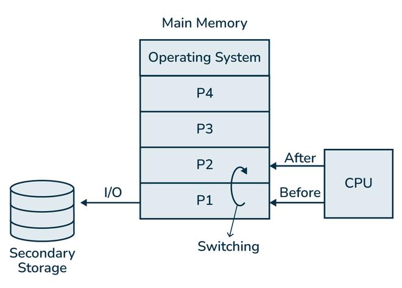
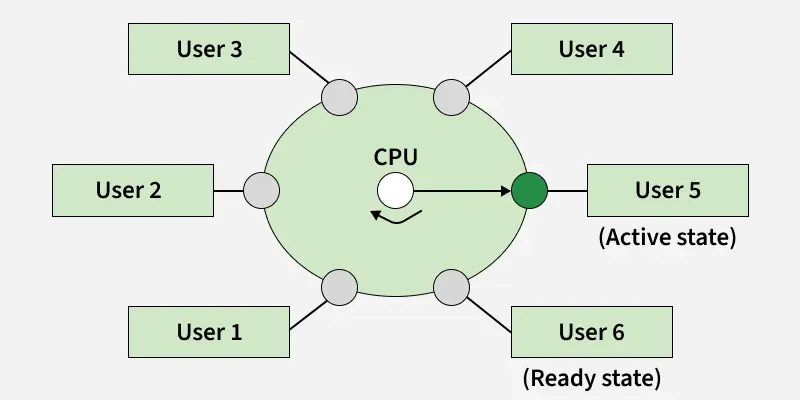
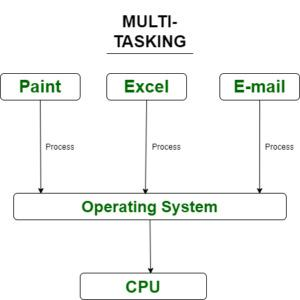

English | [中文版](multi_processor.md)

# Multiprocessor Systems

[TOC]

## Types

### Symmetric Multiprocessing (SMP)

Symmetric multiprocessing(SMP) is a multiprocessor system where multiple processors are installed and have equal access to the system and memory resources of the system. Every processor works individually, while doing its work and communicating with the operating system.

Advantages

- The failure of one processor does not affect the functioning of the other processors.
- It divides all the workload equally among the available processors.
- Makes use of available resources efficiently.

Disadvantages

- Symmetrical multiprocessing OS are more complex.
- They are more costly.
- Synchronization between multiple processors is difficult.

### Asymmetric Multiprocessing (AMP)

Asymmetric Multiprocessing (AMP) is a multiprocessing structure wherein one processor, called the master processor, controls the other subordinate processors, also known as the slave processors. In this configuration, all OS activities and task scheduling are done by the master processor of the system.

Advantages

- Asymmetrical multiprocessing operating systems are cost-effective.
- They are easy to design and manage.
- They are more scalable.

Disadvantages

- There can be an uneven distribution of workload among the processors.
- The processors do not share the same memory.
- The entire system goes down if one process fails.

## Architecture

### Uniform Memory Access (UMA)

Computer architecture where all processors share the same memory and access it at the same speed. It uses a single memory controller to manage memory operations. In this system, multiple processors use the same memory, so the available bandwidth is limited. UMA typically uses interconnection methods like single bus, multiple bus, or crossbar, and is commonly used in general-purpose and time-sharing systems.

Advantages

- Easy to Implement: all processors or cores have equal access to the memory pool.
- Low Latency: Since all memory locations have equal access times, UMA provides low latency, which ensures that processors or cores can access memory quickly and efficiently.
- Low Cost: UMA architecture is relatively inexpensive to implement, as it requires only a single shared memory bus to connect all processors or cores to the memory pool.

Disadvantages

- Limited Scalability: UMA architecture is not scalable beyond a certain point, as adding more processors or cores to the system can cause contention for the memory bus.
- Limited Bandwidth: UMA architecture provides limited bandwidth, as all processors or cores share a single memory bus.
- Limited Memory Capacity: UMA architecture provides limited memory capacity, as all processors or cores share a single memory pool.

### Non-uniform Memory Access (NUMA)

In NUMA, where a different memory controller is used. Non-uniform Memory Access is faster than uniform Memory Access. Non-uniform Memory Access is applicable for real-time applications and time-critical applications. 

Advantages

- Improved performance: By providing each processor with its own local memory, NUMA can reduce memory access times and improve overall system performance.
- Scalability: NUMA systems are highly scalable and can handle large workloads by adding additional processors and memory nodes.
- Reduced memory contention: NUMA can help reduce memory contention by allowing each processor to access its own local memory, reducing the need for multiple processors to access the same memory location.

Disadvantages

- Complexity: NUMA systems can be complex to design and implement, as they require specialized hardware and software to manage memory access.
- Higher cost: NUMA systems can be more expensive than UMA systems due to the additional hardware and software required.
- Performance variability: In some cases, the performance of a NUMA system may be lower than that of a UMA system, especially if the workload requires frequent access to shared memory. 

## Multi Programming

Multiprogramming means more than one program can be active at the same time. Before the operating system concept, only one program was to be loaded at a time and run. These systems were not efficient as the CPU was not used efficiently.

### Workflow

In a multiprogramming system, multiple programs are to be stored in memory, and each program has to be given a specific portion of memory, which is known as a process. The operating system handles all these process and their states.

### Time-Sharing System

**A time-shared operating system** uses CPU scheduling and multi-programming to provide each user with a small portion of a shared computer at once. Each user has at least one separate program in memory. A program is loaded into memory and executes, it performs a short period of time either before completion or to complete I/O. This short period of time during which the user gets the attention of the CPU  is known as **time slice, time slot, or quantum**.

### Multitasking System

Multitasking in operating systems allows multiple tasks to run in an concurrent (or interleaved) manner, enhancing system performance.

## Instruction Pipeline Model

### Performance Metrics

Three types of factors affecting pipeline operation:

- `Structural hazard`: Occurs when different instructions compete for the same functional unit during overlapping execution, causing resource conflicts.
- `Data hazard`: Due to overlapping operations in the pipeline, instructions may change the order of reading and writing operands, leading to data hazards.
- `Control hazard`: Mainly caused by branch instructions. When a branch occurs, it disrupts the continuous flow of the pipeline.
  
  *Effect of conditional branches on pipeline operations*

#### Throughput Rate

`Throughput rate` is the number of instructions or results completed by the pipeline per unit time. There are maximum throughput and actual throughput.

`Maximum throughput` is the throughput rate achieved after the pipeline reaches a steady state (all stages are working).

`Actual throughput` is the throughput rate for completing $n$ instructions.

#### Throughput Calculation Formulas

1. When all pipeline stages have equal execution time:
   
   Actual throughput: $TP = \frac{n}{(k + n - 1)\Delta t}$
   - $n$: number of tasks
   - $k$: number of pipeline stages
   - $\Delta t$: average execution time per stage
     Maximum throughput: $TP_{max} = \lim_{n \to\infty} \frac{n}{(k + n - 1)\Delta t} = \frac{1}{\Delta t}$
   - $n$: number of tasks
   - $k$: number of pipeline stages
   - $\Delta t$: average execution time per stage
     The relationship: $TP = \frac{n}{k + n - 1} TP_{max}$. Actual throughput is less than maximum throughput; it depends on clock cycle, number of stages $m$, and number of tasks $n$. Only when $n \gg m$ do we have $T_p \approx T_{pmax}$.

2. When pipeline stages have unequal execution times:
   Actual throughput: $TP = \frac{n}{\sum^{k}_{i = 1} \Delta t_i + (n - 1)max(\Delta t1, \Delta t2, ..., \Delta tk)}$
   - $n$: number of tasks
   - $k$: number of pipeline stages
   - $\Delta t_i$: execution time of stage $i$
     Maximum throughput: $TP_{max} = \frac{1}{max(\Delta t1, \Delta t2, ..., \Delta tk)}$
   - $\Delta t_i$: execution time of stage $i$

#### Optimization

To speed up the instruction pipeline, the following optimizations can be applied:

1. Subdivide the "bottleneck" pipeline stage:
   
   Here, 21, 22, 23 are subdivisions of the second sub-process.
2. Duplicate the "bottleneck" pipeline stage:
   
   Here, s2-1, s2-2, s2-3 are duplicated pipeline stages.

#### Speedup Ratio

`Speedup ratio` is the ratio of the time required to complete the same batch of tasks without pipelining to the time required with pipelining.

1. When all stages have equal execution time:
   If each stage takes $\Delta t$, completing $n$ instructions on a $k$-stage pipeline takes $T = k \Delta t + (n - 1)\Delta t$; on a non-pipelined system, it takes $nk\Delta t$.
   Speedup $S_p$: $S_p = \frac{nk\Delta t}{k\Delta t + (n - 1)\Delta t} = \frac{nk}{k + n - 1}$
   - $n$: number of tasks
   - $k$: number of pipeline stages
   - $\Delta t$: average execution time per stage
     When $n \gg m$, $S_p$ approaches $m$; i.e., when all stages are equal, the maximum speedup equals the number of pipeline stages.

2. When stages have unequal execution times:
   Completing $n$ instructions on a $k$-stage pipeline takes $\sum_{i=1}^{k}\Delta t_i + (n - 1) \times max(\Delta t1, \Delta t2, ..., \Delta tk)$; on a non-pipelined system, $n \sum_{i = 1}^{k}\Delta t_i$.
   Speedup $S_p$: $S_p = \frac{n \sum_{i = 1}^{k}\Delta t_i}{\sum_{i=1}^{k}\Delta t_i + (n - 1) \times max(\Delta t1, \Delta t2, ..., \Delta tk)}$
   - $n$: number of tasks
   - $k$: number of pipeline stages
   - $\Delta t_i$: execution time of stage $i$

#### Efficiency

`Efficiency` is the utilization rate of each functional stage in the pipeline, usually measured as the ratio of the working time-space area of all stages to the total time-space area. The formula is:

$E = \frac{kn\Delta t}{k(k + n - 1)\Delta t} = \frac{n}{k + n - 1} = \frac{S_p}{k} = TP\Delta t$

- $n$: number of tasks
- $k$: number of pipeline stages
- $\Delta t$: average execution time per stage
- $S_p$: speedup ratio when all stages are equal
- $TP$: actual throughput when all stages are equal

### Pipeline Multiple-Issue Techniques

#### Ordinary Pipeline

`Ordinary pipeline`: One result per clock cycle.

*Ordinary pipeline diagram*

#### Superscalar Pipeline

`Superscalar`: Multiple independent instructions can be executed in parallel in each clock cycle, i.e., two or more instructions are compiled and executed in parallel.

*Superscalar pipeline diagram*

#### Super Pipelining

`Super pipelining`: Inserting additional pipeline registers into the pipeline stages, effectively subdividing the pipeline further.

*Super pipelining diagram. The original clock cycle is divided into three segments, so the super-pipelined processor cycle is shorter than the ordinary pipeline. Thus, in the original clock cycle, the functional unit is used three times, making the pipeline run at three times the original clock frequency.*

#### Very Long Instruction Word (VLIW) Technology

`VLIW (Very Long Instruction Word)`: An architecture where multiple instructions are processed in parallel by multiple functional units in one clock cycle.

*VLIW diagram*

## Summary

### Asymmetric vs Symmetric Multiprocessing

|                  Asymmetric Multiprocessing                  |                  Symmetric Multiprocessing                   |
| :----------------------------------------------------------: | :----------------------------------------------------------: |
| In asymmetric multiprocessing, the processors are not treated equally. | In symmetric multiprocessing, all the processors are treated equally. |
| Tasks of the operating system are done by master processor.  | Tasks of the operating system are done individual processor. |
| No Communication between Processors as they are controlled by the master processor. | All processors communicate with another processor by a shared memory. |
| In asymmetric multiprocessing, process scheduling approach used is master-slave. | In symmetric multiprocessing, the process is taken from the ready queue. |
|       Asymmetric multiprocessing systems are cheaper.        |       Symmetric multiprocessing systems are costlier.        |
|   Asymmetric multiprocessing systems are easier to design.   |   Symmetric multiprocessing systems are complex to design.   |
|      All processors can exhibit different architecture.      |       The architecture of each processor is the same.        |
| It is simple as here the master processor has access to the data, etc. | It is complex as synchronization is required of the processors in order to maintain the load balance. |
| In case a master processor malfunctions then slave processor continues the execution which is turned to master processor. When a slave processor fails then other processors take over the task. | In case of processor failure, there is reduction in the system's computing capacity. |
|    It is suitable for homogeneous or heterogeneous cores.    |            It is suitable for homogeneous cores.             |

### UMA vs NUMA

|         Feature         |        UMA (Uniform Memory Access)         |      NUMA (Non-Uniform Memory Access)      |
| :---------------------: | :----------------------------------------: | :----------------------------------------: |
| **Memory Access Time**  |     Same (uniform) for all processors      |    Varies depending on memory location     |
|  **Memory Controller**  |      Single shared memory controller       | Multiple memory controllers (one per node) |
|     **Performance**     | Slower for large systems due to contention |   Faster and scalable for large systems    |
|      **Bandwidth**      |                  Limited                   |      Higher due to distributed memory      |
|     **Scalability**     |                    Low                     |                    High                    |
| **Architecture Usage**  |  General-purpose and time-sharing systems  |   High-performance and parallel systems    |
|   **Interconnection**   |   Bus-based (Single, Multiple, Crossbar)   |    Hierarchical/Tree-based interconnect    |
| **Memory Organization** |             Centralized memory             |             Distributed memory             |

## Reference

[1] Randal E. Bryan; David R. O'Hallaron. Computer Systems: A Programmer's Perspective (CSAPP). 3rd ed.

[2] [Multiprogramming in Operating System](https://www.geeksforgeeks.org/operating-systems/multiprogramming-in-operating-system/)

[3] [Time Sharing Operating System](https://www.geeksforgeeks.org/operating-systems/time-sharing-operating-system/)

[4] [Computer Organization and Structure](http://staff.ustc.edu.cn/~hdrq/jsjzcyl/text/chapter8/sec3/part1/index1.htm)

[5] [5.2.2 Throughput, Speedup](http://kjwy.5any.com/jsjxtjg/content/cl/jsjxtjg-kcjj-050202.htm)

[6] [What is SMP (Symmetric Multi-Processing)?](https://www.geeksforgeeks.org/operating-systems/what-is-smp-symmetric-multi-processing/)

[7] [Difference between Asymmetric and Symmetric Multiprocessing](https://www.geeksforgeeks.org/computer-organization-architecture/difference-between-asymmetric-and-symmetric-multiprocessing/)

[8] [Multi Processing Operating System](https://www.geeksforgeeks.org/operating-systems/multi-processing-operating-system/)
