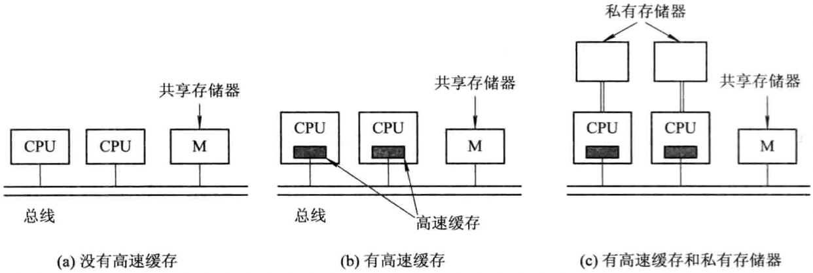
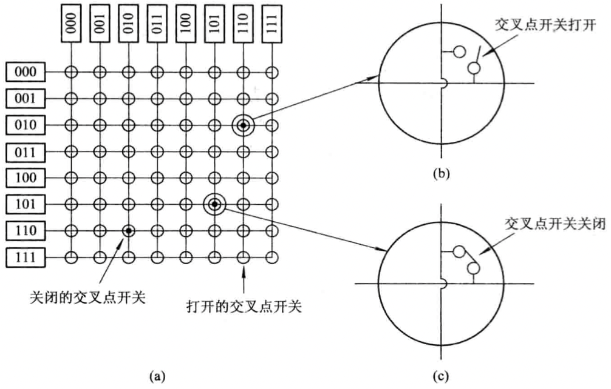
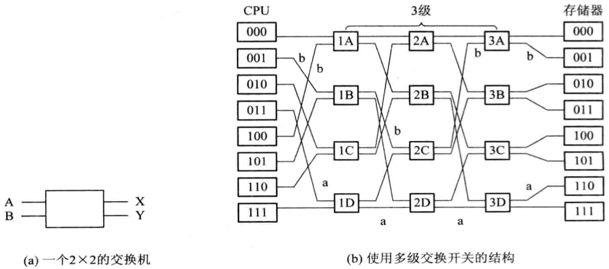
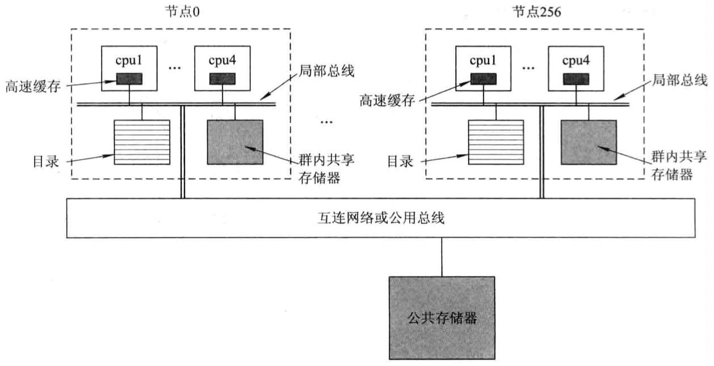
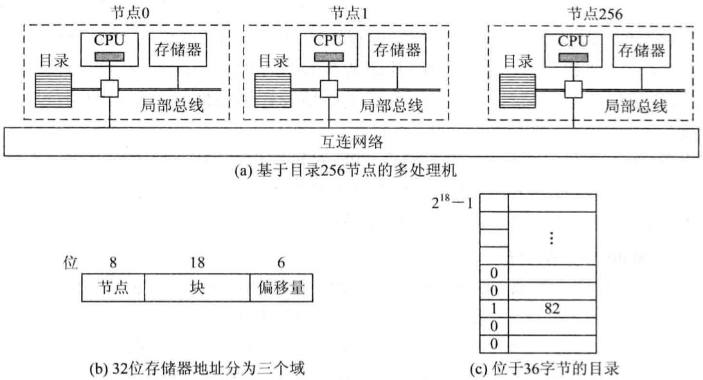

# 多处理机系统

[TOC]


## 多处理机系统的类型

根据耦合度：

- 紧密耦合（Tightly Coupled）MPS的实现方式：

  1. 多处理器共享主存储器系统和I/O设备。
  2. 将多处理器与多个存储器分别相连，或将主存储器划分为若干个能被独立访问的存储器模块，每个处理器对应一个存储器或存储器模块。

- 松散耦合（Loosely Coupled）MPS的实现方式：

  通过通道或通信线路来实现多台计算机之间的互连。

根据系统中所用处理器的相同与否，可将MPS分为如下两类：

- `对称多处理器系统SMPS（Symmetric Multiprocessor System）` 
- `非对称多处理器系统ASMPS（Asymmetric Multiprocessor System）`


## 多处理机系统的结构

### UMA多处理机系统的结构

1. 基于单总线的SMP结构

   

   缺点：

   - 可伸缩性有限；
   - 系统中所有CPU对存储器的访问，都需要通过总线进行，多个CPU可能同时需要对总线进行访问，形成了对总线资源的争夺。

2. 使用多层总线的SMP结构

3. 使用单级交叉开关的系统结构

   

   使用交叉开关的UMA多处理机系统具有如下特征：

   1. 节点之间的连接：交叉开关一般是构成一个$N \times N$的阵列，但在每一行和每一列中，都同时只能有一个交叉点开关处于“开”状态，从而它同时只能接通$N$对结点。
   2. CPU结点与存储器之间的连接：每个存储器模块同时只允许一个CPU结点访问，故每一列只能接通一个交叉点开关，但是为了支持并行存储访问，每一行同时可以接通多个交叉开关。
   3. 交叉开关的成本为$N^2$，$N$为端口数，限制了它在大规模系统中的应用。

4. 使用多级交换网格的系统结构

   

### NUMA多处理机系统结构

- NUMA

  `非统一内存访问（Nonuniform-Memory-Access，NUMA）` 所有共享存储器在物理上是分布式的，在逻辑上是连续的，所有这些存储器的集合就是全局地址空间，系统中的每一个CPU都可以访问整个系统的内存，但访问时所用的指令不同。

  

- CC-NUMA

  对于系统中每个CPU所拥有的若干高速缓存块目录表，对每个高速缓存块的位置和状态进行记录和维护。每个CPU的每条访问存储器单元已存在于某个高速缓存块中，并进行相应操作。

  

  **注意：远程内存访问由于访问远地内存的延时远远超过本地内存，因此当CPU数量增加时，系统性能无法线性增加**


## 多处理机操作系统的类型

1. 主从式（master-slave）

   由从处理机向主处理机提交任务申请，该请求被捕获后送至主处理机，而后等待主处理机发回应答；主处理机收到请求后中断当前任务，对该请求进行识别和判断，并转入执行相应的处理程序，然后将适合的任务分配个发出请求的从处理机。

   | 优点       | 缺点                           |
   | ---------- | ------------------------------ |
   | - 易于实现 | - 资源利用率低<br>- 安全性较差 |

2. 独立监督式（separate supervisor System）

   每个处理机上都有自己的管理程序，并拥有各自的专用资源，所配置的操作系统也具有与单机操作系统类似的功能，以服务自身的需要，及管理自己的资源和为进程分配任务。

   | 优点                     | 缺点                                                 |
   | ------------------------ | ---------------------------------------------------- |
   | - 自主性强<br>- 可靠性高 | - 实现复杂<br>- 存储空间开销大<br>- 处理机负载不平衡 |

3. 浮动监督式（floating supervisor Control Mode）

   所有处理机组成一个处理机池，每台处理机都可对整个系统中的任何一台I/O设备进行控制，以及对任何一个存储模块进行访问，这些处理机由操作系统统一进行管理，在某段时间内可以指定任何一台（或多台）处理机作为系统的控制处理机，即所谓“主”处理机（或组），由它（或它们）运行操作系统程序，负责全面管理功能；根据需要“主”处理机的身份可以从一台处理机切换到另一台处理机。

   | 优点                                   | 缺点       |
   | -------------------------------------- | ---------- |
   | - 高灵活性<br>- 高可靠性<br>- 负载均衡 | - 实现复杂 |


## 进程同步

### 集中式与分布式同步方式

1. 中心同步实体

   满足以下条件的`同步实体（Synchronizing Entity）`称为中心同步实体：

   - 具有唯一名字，并且为彼此必须同步的所有进程所知道；
   - 在任何时刻，这些进程中的任何一个都可以访问该同步实体。

2. 集中式同步机构

   基于中心同步实体所构成的所有同步机构被称为集中式同步机构。

3. 集中式与分布式同步算法

   - 集中式同步算法

     1. 对于多个进程需要同时访问共享资源或进行通信时，仅由中心控制结点做出判断，选择一个进程执行；
     2. 判定所需要的全部信息都集中在中心控制结点。

     缺点：

     - 可靠性差
     - 易形成瓶颈

   - 分布式同步算法

     1. 所有结点具有相同的信息；
     2. 所有结点仅基于本地信息作出判断；
     3. 为了做出最后的判定，所有的结点担负相同的指责；
     4. 为了做出最后的判定，所有的结点要付出同样的工作量；
     5. 通常一个结点发生故障，不会导致整个系统的崩溃。

4. 中心进程方式

   在系统中设置一个协调进程（中心进程），其它进程访问与退出临界区都需要向协调进程申请。

### 自旋锁（spin lock）

在总线上设置一个自旋锁，该锁最多只能被一个内核进程持有。当一个内核进程需要使用总线，对某个存储单元进行读写访问时，先请求自旋锁，以获得对总线的使用权。如果该锁被占用，那么这个进程就会一直进行“旋转”，循环测试锁的状态，直到自旋锁重新可用。如果锁未被占用，请求该锁的内核进程便能立刻得到它，并继续执行，直到完成对指定存储单元的读写操作后，释放该锁。

### 读-拷贝-修改锁和二进制指数补偿算法

1. 读-拷贝-修改锁（RCU）的引入

   当写进程要往某文件中写入数据时，它先读该文件，将文件的内容拷贝到一个副本上，以后只对副本上的内容进行修改；修改完成后，在适当时候再将修改完后的文件全部写回去。

2. RCU（Read-Copy-Update）锁

   RCU锁用来解决读者-写者问题；对于被RCU保护的共享文件（数据结构），无论读者和写者，都是以读的方式对其进行访问的，对于读者而言，不需要获得任何锁就可以访问它，对于写者而言，在访问它时，先制作该文件的一个副本，只对副本上的内容进行修改，然后使用一个回调（callback）机制，即向系统中一个称为垃圾收集器的机构注册一个回调函数。在适当时机，由垃圾收集器调用写者注册的回调函数，把指向原来数据的指针重新指向新的被修改的数据，完成最后的数据释放或修改操作。

3. 写回时机

   最好是在所有读者都已完成自己的读任务后再将修改后的文件写回。

4. RCU锁的优点

   - 读者不会被阻塞
   - 无需为共享文件（数据）设置同步机构

### 二进制指数补偿算法和待锁CPU等待队列机构

1. 二进制指数补偿算法

   为每一个CPU对锁进行测试的TSL指令设置一个指令延迟执行时间，使该指令的下次执行是在该延迟执行时间设定的时间后进行，其延迟时间是按照一个TSL指令执行周期的二进制指数方式增加。

   采用二进制指数补偿算法可以明显降低总线上的数据流量，原因如下：

   - 可以将短时间内各CPU对锁的需求，在时间上进行不同程度的延迟，增加测试的成功率，减少各CPU对锁的测试次数；
   - 在锁不空闲时，也很大程度地减少各CPU对其进行测试的频率。

   缺点：

   - 锁被释放时，不能及时地发现锁的空闲，造成浪费。

2. 待锁CPU等待队列机构

   为每一个CPU配置一个用于测试的私有锁变量和一个记录待锁CPU的待锁清单，存放在其私有的告诉缓存中。当多个CPU需要互斥访问某个共享数据结构时，如果该结构已被占用，则为第一个未获得锁的CPU分配一个锁变量，并且将之附在占用该共享数据结构CPU的待锁清单末尾；再为第二个未获得锁的CPU也分配一个锁变量，并且将之附在待锁清单中第一个待锁CPU的后面；...；

### 定序机构

1. 时间邮戳定序机构（Timestamp Ordering Mechanism）

   - 对所有的特殊事件，如资源请求，通信等，加印上时间邮戳；
   - 对每一种特殊事件，只能使用唯一的时间邮戳；
   - 根据事件上的时间邮戳，定义所有事件的全序。

2. 事件计数（Event Counts）同步机构

   对于事件计数，有下面几种操作：

   - `await(E, V)` 每当进程要进入临界区之前，先执行await操作，如果$E < V$，将执行进程插入到EQ队列，并重新调度，否则进程继续执行；

     ```c
     await(E, V) {
         if (E < V) {
             i = EP;
             stop();
             i->status = "block";
             i->sdata = EQ;
             insert(EQ, i);
             scheduler();
         }
         else continue;
     }
     ```

   - `advance(E)` 每当进程退出临界区时，应执行$advance(E)$操作，使E值增1。如果EQ队列不空，则进一步检查队首进程的V值，若$E = V$，则唤醒该进程。

     ```c
     advance(eventcount E) {
         E = E + 1;
         if (EQ <> NIL) {
             V = inspect(EQ, 1);
             if (E == V) wakeup(EQ, 1);
         }
     }
     ```

     一个进程执行临时区的操作序列为：

     ```c
     await(E, V);
     Access the critical resources;
     advance(E);
     ```

   - `read(E)` 返回E的当前值，提供给进程参考，以决定是否要转去处理其它事件。如果设计得当，允许await, read和advance这三个操作，在同一事件上并发执行，但对定序器必须互斥使用。

### 面包房算法

利用事件排序的方法对要求访问临界资源的全部事件进行排序，按照FCFS次序对事件进行处理。该算法的基本假设如下：

- 系统由$N$个结点组成，每个结点只有一个进程，仅负责控制一种临界资源，并处理那些同时到达的请求。
- 每个进程保持一个队列，用来记录本结点最近收到的消息，以及本结点自己产生的消息。
- 消息分为请求消息，应答消息和撤销消息三种，每个进程队列中的请求消息根据事件时序排序，队列初始为空。
- 进程$P_i$发送的请求消息形如$request(T_i, i)$，其中$T_i = C_i$，是进程$P_i$发送此消息时对应的逻辑时钟值，$i$代表消息内容。

算法描述如下：

1. 当进程$P_i$请求资源时，它把请求消息$request(T_i, i)$排在自己的请求队列中，同时也把该消息发送给系统中的其它进程；
2. 当进程$P_j$接收到外来消息$request(T_i, i)$后，发送回答消息$reply(T_j, j)$，并把$request(T_i, i)$放入自己的请求队列；应当说明，若进程$P_j$在收到$request(T_i, i)$前已提出对同一资源的访问请求，那么其时间戳应比$(T_i, i)$小；
3. 若满足下述条件，则允许进程$P_i$访问该资源（即允许进入临界区）：
   - $P_i$自身请求访问该资源的消息已处于请求队列的最前面；
   - $P_i$已收到从所有其它进程发来的回答消息，这些回答消息的时间戳均晚于$(T_i, i)$。
4. 为了释放该资源，$P_i$从自己的队列中撤销请求消息，并发送一个打上时间戳的释放消息release给其它进程；
5. 当进程$P_j$收到$P_i$的release消息后，它撤销自己队列中的原$P_i$的$request(T_i, i)$消息。

### 令牌环算法

将所有进程组成一个`逻辑环（Logical Ring）`，系统中设置一个象征存取权力的Token，在进程所组成的逻辑环中，不断地循环传递，获得令牌的进程，才有权力进入临界区，访问共享资源。

由于Token只有一个，任何时刻，只有一个进程能够持有令牌，因此能实现对共享资源的互斥访问。


## 多处理机系统的进程调度

### 评价调度性能的因素

- 任务流时间

  把完成任务所需要的时间定义为任务流时间；

- 调度流时间

  多处理机系统中，任务可以被分配到多个处理机上去运行；一个调度流时间时系统中所有处理机上的任务流时间的总和。

- 平均流

  平均流等于调度流时间除以任务数。平均流时间越小，表示任务占用处理机与存储器等资源的时间越短，这不仅反应了系统资源利用率高，而且还可以降低任务的机时费用，有效地提高了系统的吞吐量。

- 处理机利用率

  处理机的利用率等于该处理机上任务流之和除以最大有效时间单位。

- 加速比

  加速比等于各处理机忙时间之和除以并行工作时间。加速比用于度量多处理机系统的加速程度，处理机台数越多，调度流时间越大，与单机相比其完成任务的速度越快，但是较少的处理机可减少成本。对于给定的任务，占用较少的处理机可腾出更多的处理机，用于其它任务，从而使系统的总体性能得到提高。

- 吞吐率

  吞吐率是单位时间内系统完成的任务数，可以用任务流的最小完成时间来度量系统的吞吐率，吞吐率的高低与调度算法的效率有关。

### 进程分配方式

1. 对称多处理机系统中的进程分配方式

   - `静态分配（Static Assigenment）方式` 一个进程从开始执行直至完成，都被固定地分配到一个处理器上执行；
   - `动态分配（Dynamic Assigenment）方式` 在系统中设置一个公共的就绪队列，系统中的所有就绪进程都被放在该队列中；分配进程时，可将继承分配到任何一个处理器上。

   |          | 优点                                                         | 缺点                               |
   | -------- | ------------------------------------------------------------ | ---------------------------------- |
   | 静态分配 | - 开销小                                                     | - 会使各处理器忙闲不均             |
   | 动态分配 | - 避免各处理器忙闲不均<br>- 不会增加**紧密耦合系统**的调度开销 | - 会增加**松散耦合系统**的调度开销 |

2. 非对称MPS中的进程分配方式

   对于非堆成MPS，OS的核心部分驻留在一台主机上（Master），而从机（Slave）上只是用户程序，进程调度只由主机执行。

   | 优点           | 缺点                                       |
   | -------------- | ------------------------------------------ |
   | - 系统处理简单 | - 可靠性低<br>- 系统瓶颈受主机处理能力限制 |
   

### 进程（线程）调度方式

1. 自调度（Self-Scheduling）方式

   在系统中设置有一个公共的进程或线程就绪队列，所有的处理器在空闲时，都可自己到该队列中取得一进程（或线程）来运行。

   | 优点                                                         | 缺点                                     |
   | ------------------------------------------------------------ | ---------------------------------------- |
   | - 容易将单机环境下的调度机制移植到多机环境<br>- 避免忙闲不均，有利于提高处理机的利用率 | - 瓶颈问题<br>- 低效性<br>- 线程切换频繁 |

2. 成组调度（Gang Scheduling）方式

   将一个进程中的一组线程分配到一组处理器上执行；成组调度时为应用程序分配处理器时间的方式：

   - 面向所有应用程序平均分配处理器时间
   - 面向所有线程平均分配处理机时间

   | 优点                                                         | 缺点 |
   | ------------------------------------------------------------ | ---- |
   | - 减少进程（线程）切换，提升效率<br>- 显著减少调度频率，降低调度开销 |      |
   
2. 专用处理机分配（Dedicated Processor Assigement）方式

   在一个应用程序的执行期间，专门为该应用程序分配一组处理机，每个线程一个处理机，直至该应用程序完成。

4. 动态调度

   该调度方式允许进程在执行期间动态地改变其线程的数目，操作系统的调度责任主要限于处理机的分配，并遵循以下原则：

   - 空闲则分配
   - 新作业绝对优先
   - 保持等待
   - 释放即分配
