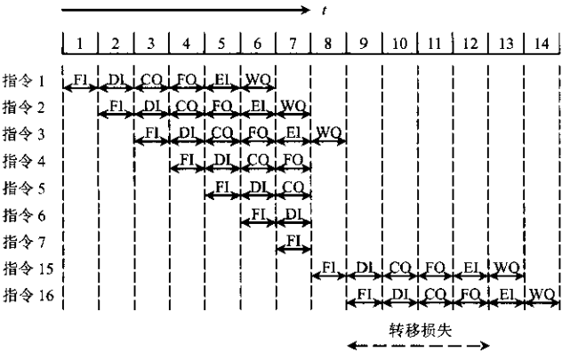
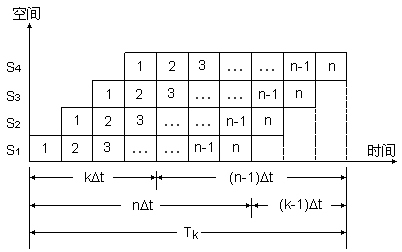
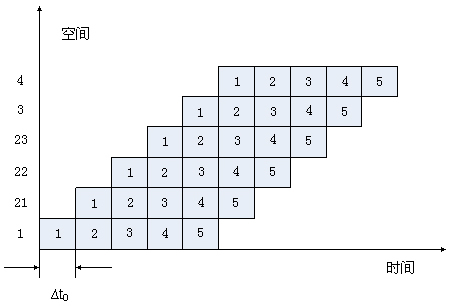
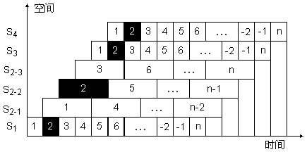
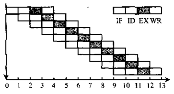
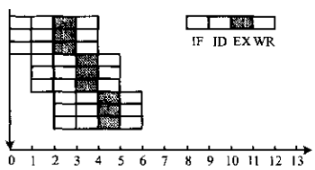
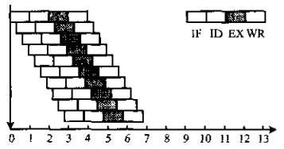
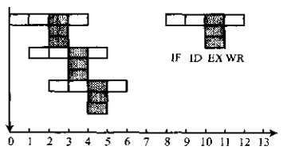

English | [中文版](pipeline_zh.md)

# Instruction Pipeline Model

[TOC]

## Performance Metrics

Three types of factors affecting pipeline operation:

- `Structural hazard`: Occurs when different instructions compete for the same functional unit during overlapping execution, causing resource conflicts.
- `Data hazard`: Due to overlapping operations in the pipeline, instructions may change the order of reading and writing operands, leading to data hazards.
- `Control hazard`: Mainly caused by branch instructions. When a branch occurs, it disrupts the continuous flow of the pipeline.
  
  *Effect of conditional branches on pipeline operations*

### Throughput Rate

`Throughput rate` is the number of instructions or results completed by the pipeline per unit time. There are maximum throughput and actual throughput.

`Maximum throughput` is the throughput rate achieved after the pipeline reaches a steady state (all stages are working).

`Actual throughput` is the throughput rate for completing $n$ instructions.

#### Throughput Calculation Formulas

1. When all pipeline stages have equal execution time:
	
	Actual throughput: $TP = \frac{n}{(k + n - 1)\Delta t}$
	- $n$: number of tasks
	- $k$: number of pipeline stages
	- $\Delta t$: average execution time per stage
	Maximum throughput: $TP_{max} = \lim_{n \to\infty} \frac{n}{(k + n - 1)\Delta t} = \frac{1}{\Delta t}$
	- $n$: number of tasks
	- $k$: number of pipeline stages
	- $\Delta t$: average execution time per stage
	The relationship: $TP = \frac{n}{k + n - 1} TP_{max}$. Actual throughput is less than maximum throughput; it depends on clock cycle, number of stages $m$, and number of tasks $n$. Only when $n \gg m$ do we have $T_p \approx T_{pmax}$.

2. When pipeline stages have unequal execution times:
	Actual throughput: $TP = \frac{n}{\sum^{k}_{i = 1} \Delta t_i + (n - 1)max(\Delta t1, \Delta t2, ..., \Delta tk)}$
	- $n$: number of tasks
	- $k$: number of pipeline stages
	- $\Delta t_i$: execution time of stage $i$
	Maximum throughput: $TP_{max} = \frac{1}{max(\Delta t1, \Delta t2, ..., \Delta tk)}$
	- $\Delta t_i$: execution time of stage $i$

#### Optimization

To speed up the instruction pipeline, the following optimizations can be applied:
1. Subdivide the "bottleneck" pipeline stage:
	
	Here, 21, 22, 23 are subdivisions of the second sub-process.
2. Duplicate the "bottleneck" pipeline stage:
	
	Here, s2-1, s2-2, s2-3 are duplicated pipeline stages.

### Speedup Ratio

`Speedup ratio` is the ratio of the time required to complete the same batch of tasks without pipelining to the time required with pipelining.

1. When all stages have equal execution time:
	If each stage takes $\Delta t$, completing $n$ instructions on a $k$-stage pipeline takes $T = k \Delta t + (n - 1)\Delta t$; on a non-pipelined system, it takes $nk\Delta t$.
	Speedup $S_p$: $S_p = \frac{nk\Delta t}{k\Delta t + (n - 1)\Delta t} = \frac{nk}{k + n - 1}$
	- $n$: number of tasks
	- $k$: number of pipeline stages
	- $\Delta t$: average execution time per stage
	When $n \gg m$, $S_p$ approaches $m$; i.e., when all stages are equal, the maximum speedup equals the number of pipeline stages.

2. When stages have unequal execution times:
	Completing $n$ instructions on a $k$-stage pipeline takes $\sum_{i=1}^{k}\Delta t_i + (n - 1) \times max(\Delta t1, \Delta t2, ..., \Delta tk)$; on a non-pipelined system, $n \sum_{i = 1}^{k}\Delta t_i$.
	Speedup $S_p$: $S_p = \frac{n \sum_{i = 1}^{k}\Delta t_i}{\sum_{i=1}^{k}\Delta t_i + (n - 1) \times max(\Delta t1, \Delta t2, ..., \Delta tk)}$
	- $n$: number of tasks
	- $k$: number of pipeline stages
	- $\Delta t_i$: execution time of stage $i$

### Efficiency

`Efficiency` is the utilization rate of each functional stage in the pipeline, usually measured as the ratio of the working time-space area of all stages to the total time-space area. The formula is:

$E = \frac{kn\Delta t}{k(k + n - 1)\Delta t} = \frac{n}{k + n - 1} = \frac{S_p}{k} = TP\Delta t$

- $n$: number of tasks
- $k$: number of pipeline stages
- $\Delta t$: average execution time per stage
- $S_p$: speedup ratio when all stages are equal
- $TP$: actual throughput when all stages are equal

## Pipeline Multiple-Issue Techniques

### Ordinary Pipeline

`Ordinary pipeline`: One result per clock cycle.

*Ordinary pipeline diagram*

### Superscalar Pipeline

`Superscalar`: Multiple independent instructions can be executed in parallel in each clock cycle, i.e., two or more instructions are compiled and executed in parallel.

*Superscalar pipeline diagram*

### Super Pipelining

`Super pipelining`: Inserting additional pipeline registers into the pipeline stages, effectively subdividing the pipeline further.

*Super pipelining diagram. The original clock cycle is divided into three segments, so the super-pipelined processor cycle is shorter than the ordinary pipeline. Thus, in the original clock cycle, the functional unit is used three times, making the pipeline run at three times the original clock frequency.*

### Very Long Instruction Word (VLIW) Technology

`VLIW (Very Long Instruction Word)`: An architecture where multiple instructions are processed in parallel by multiple functional units in one clock cycle.

*VLIW diagram*

## References

[1] Tang Shuofei. Computer Organization Principles

[2] [Computer Organization and Structure](http://staff.ustc.edu.cn/~hdrq/jsjzcyl/text/chapter8/sec3/part1/index1.htm)

[3] [5.2.2 Throughput, Speedup](http://kjwy.5any.com/jsjxtjg/content/cl/jsjxtjg-kcjj-050202.htm)
