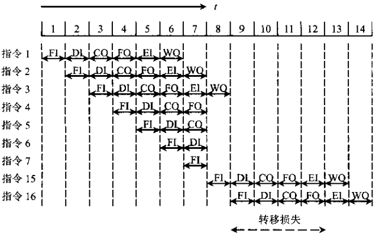
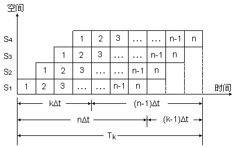
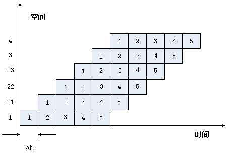
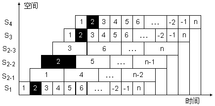
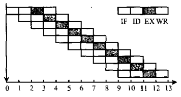
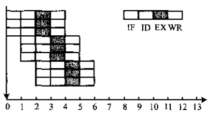
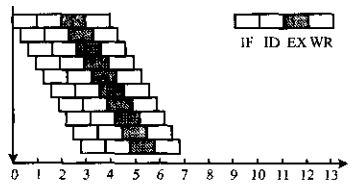
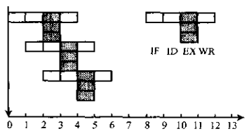

# 指令流水线模型

<!-- vim-markdown-toc GFM -->

* [性能指标](#性能指标)
    - [吞吐率（Through Put Rate）](#吞吐率through-put-rate)
        + [吞吐率计算公式](#吞吐率计算公式)
        + [优化](#优化)
    - [加速比（Speedup Ratio）](#加速比speedup-ratio)
    - [效率（Efficiency）](#效率efficiency)
* [流水线多发技术](#流水线多发技术)
    - [普通流水](#普通流水)
    - [超标量流水](#超标量流水)
    - [超流水线技术](#超流水线技术)
    - [超长指令字技术](#超长指令字技术)
* [参考](#参考)

<!-- vim-markdown-toc -->

## 性能指标

三种对流水线工作的影响：

- `结构相关` 当指令在重叠执行过程中，不同指令争用同一功能部件产生资源冲突时产生。

- `数据相关` 流水线中各条指令因重叠操作，可能改变对操作数的读写访问顺序，从而导致数据相关冲突。

- `控制相关` 主要由转移指令引起，当转移发生时，将使流水线的连续流动收到破坏。

  

  *条件转移对指令流水操作的影响*

### 吞吐率（Through Put Rate）

`吞吐率` 单位时间内流水线所完成指令或输出结果的数量，吞吐率又有最大吞吐率和实际吞吐率之分。

`最大吞吐率` 流水线在连续流动达到稳定状态（流水线中各段都处于工作状态）后所获得的吞吐率。

`实际吞吐率` 流水线完成$n$条指令的实际吞吐率。

#### 吞吐率计算公式

1. 流水线各段执行时间相等时：

   

   实际吞吐率：$TP = \frac{n}{(k + n - 1)\Delta t}$

   - $n$ 任务数量；
   - $k$ 流水段数；
   - $\Delta t$ 流水段平均执行时间；

   最大吞吐率：$TP_{max} = \lim_{n \to\infty} \frac{n}{(k + n - 1)\Delta t} = \frac{1}{\Delta t}$

   - $n$ 任务数量；
   - $k$ 流水段数；
   - $\Delta t$ 流水段平均执行时间；

   最大吞吐率与实际吞吐率的关系是：$TP = \frac{n}{k + n - 1} TP_{max}$。流水线的实际吞吐率要小于最大吞吐率，它除了与时钟周期有关之外，还与流水线的段数$m$，输入到流水线中的任务数$n$有关；仅当$n \gg m$时，才会有$T_p \approx T_{pmax}$。

2. 流水线各段执行时间不相等时：

   实际吞吐率：$TP = \frac{n}{\sum^{k}_{i = 1} \Delta t_i + (n - 1)max(\Delta t1, \Delta t2, ..., \Delta tk)}$

   - $n$ 任务数量；
   - $k$ 流水段数；
   - $\Delta ti$ 流水段执行时间；

   最大吞吐率：$TP_{max} = \frac{1}{max(\Delta t1, \Delta t2, ..., \Delta tk)}$

   - $\Delta ti$ 流水段执行时间；

#### 优化

为了加快指令流水的速度，可对流水线进行以下方式优化处理：

1. 将“瓶颈”流水段细分：

   

   其中的21，22，23为第2个子过程的细分。

2. 将“瓶颈”流水段重复设置：

   

   其中的s2-1，s2-2，s2-3位重复设置的流水段。

### 加速比（Speedup Ratio）

`加速比` 完成同样一批任务，不使用流水线所用的时间与使用流水线所用的时间之比。

1. 各段执行时间相等的情况：

   如果流水线各段时间均为$\Delta t$，完成$n$条指令在$k$段流水线上共需$T = k \Delta t + (n - 1)\Delta t$时间；完成$n$条指令在等效的非流水线上共需$nk\Delta t$时间。

   加速比$S_p$为：$S_p = \frac{nk\Delta t}{k\Delta t + (n - 1)\Delta t} = \frac{nk}{k + n - 1}$。

   - $n$ 任务数量；
   - $k$ 流水段数；
   - $\Delta t$ 流水段平均执行时间；

   可以看出，在$n \gg m$时，$S_p$接近于$m$，即当流水线各段时间相等时，其最大加速比等于流水线段数

2. 各段执行时间不等的情况：

   完成$n$条指令在$k$段流水线上共需$\sum_{i=1}^{k}\Delta ti + (n - 1) \times max(\Delta t1, \Delta t2, ..., \Delta tk)$时间；在等效的非流水线上共需$n \sum_{i = 1}^{k}\Delta ti$。

   加速比$S_p$为：$S_p = \frac{n \sum_{i = 1}^{k}\Delta ti}{\sum_{i=1}^{k}\Delta ti + (n - 1) \times max(\Delta t1, \Delta t2, ..., \Delta tk)}$

   - $n$ 任务数量；
   - $k$ 流水段数；
   - $\Delta ti$ 流水段执行时间；

### 效率（Efficiency）

`效率` 流水线中各功能段的利用率，通常用流水线各段处于工作时间的时空区与流水线中各段总的时空区之比来衡量流水线的效率。用公式表示为：

$E = \frac{kn\Delta t}{k(k + n - 1)\Delta t} = \frac{n}{k + n - 1} = \frac{S_p}{k} = TP\Delta t$

- $n$ 任务数量；
- $k$ 流水段数；
- $\Delta t$ 流水段平均执行时间；
- $S_p$ 各段执行时间相等的情况下的加速比；
- $TP$ 各段执行时间相等的情况下的实际吞吐率；

## 流水线多发技术

### 普通流水

`普通流水` 一个时钟周期出一个结果。

*普通流水示意图*

### 超标量流水

`超标量（Super Scalar）` 每个时钟周期内可同时并发多条独立指令，即以并行操作方式将两条或两条以上指令编译并执行。

*超标量流水示意图*

### 超流水线技术

`超流水线（Super pipe lining）技术` 将一些流水线寄存器插入到流水线段中，好比将流水线再分道。

*超流水线示意图。将原来的一个时钟周期分成三段，使超级流水线的处理器周期比一般流水线的处理器周期短，这样，在原来的时钟周期内，功能部件被使用三次，使流水线以3倍于原来时钟频率的速度运行。*

### 超长指令字技术

`超长指令字（VLIW）技术` 采用多条指令在多个处理部件中并行处理的体系结构，在一个时钟周期内能流出多条指令。

*超长指令字示意图*

## 参考

[1] 唐朔飞.计算机组成原理

[2] [计算机组成与结构](http://staff.ustc.edu.cn/~hdrq/jsjzcyl/text/chapter8/sec3/part1/index1.htm)

[3] [5.2.2 吞吐率、加速比](http://kjwy.5any.com/jsjxtjg/content/cl/jsjxtjg-kcjj-050202.htm)
