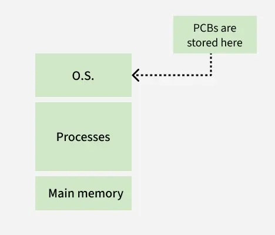
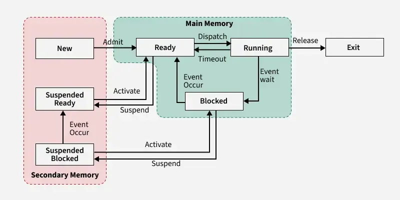
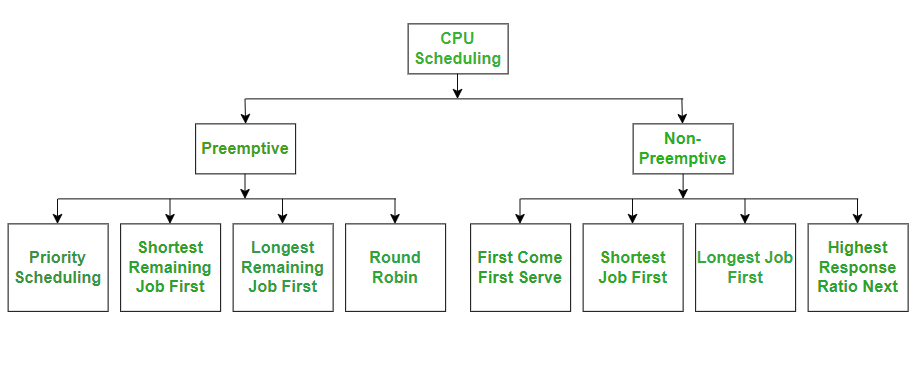
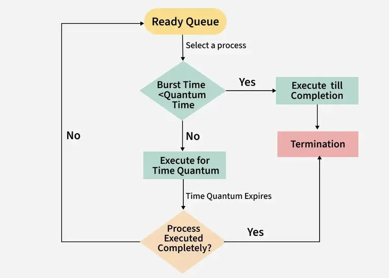
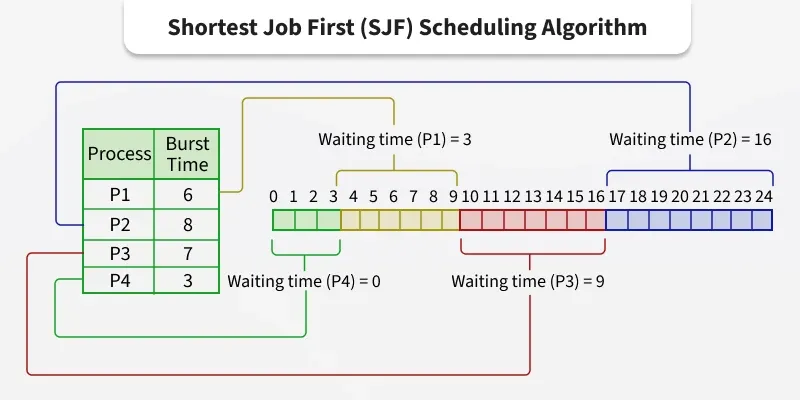
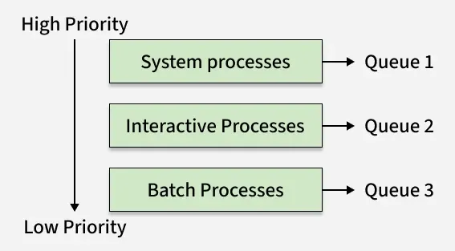
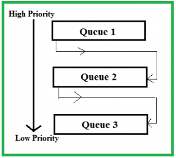
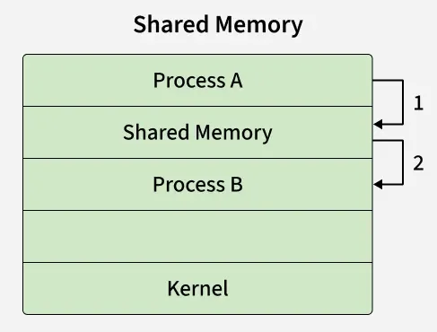
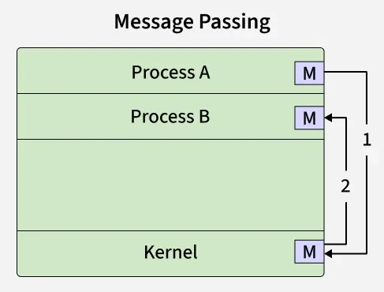
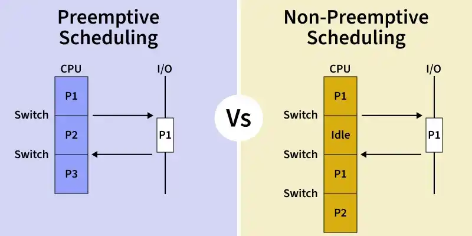

English | [中文版](process_zh.md)

# Process

[TOC]

A process is an independent unit for resource allocation and scheduling in the system. Each process has its own independent memory space, and different processes communicate via inter-process communication. Processes are relatively heavy, context switching overhead is large, but they are more stable than threads.

## Definition

Definition:

- A process is an execution of a program.
- A process is the activity of a program and its data being executed sequentially on a processor.
- A process is a program with independent functionality running on a data set; it is an independent unit for resource allocation and scheduling in the system.

Characteristics:

- Dynamic: The essence of a process is the execution of a process entity, so dynamicity is the most fundamental characteristic.
- Concurrency: Multiple process entities coexist in memory and can run simultaneously within a period.
- Independence: A process entity can run independently, obtain resources independently, and accept investigation independently.
- Asynchrony: Processes run asynchronously, i.e., they progress at their own unpredictable speeds.

## Precedence Graph

A `Precedence Graph` is a directed acyclic graph (DAG) used to describe the execution order between processes.

The precedence relationship between processes (or programs) can be denoted as "$\rightarrow$". If there is a precedence relationship between $P_i$ and $P_j$, it can be written as $(P_i, P_j)\in \rightarrow$ or $P_i \rightarrow P_j$, meaning $P_i$ must complete before $P_j$ starts. $P_i$ is the direct predecessor of $P_j$, and $P_j$ is the direct successor of $P_i$.

## Execution Order

- Sequential Execution

  

  In the above statements, there is the following precedence relationship: $S_1 \rightarrow S_2 \rightarrow S_3$.

- Concurrent Execution

  

  In the above statements, $S_3$ must be executed after both $S_1$ and $S_2$ have finished; $S_4$ must be executed after $S_3$; but $S_1$ and $S_2$ can be executed concurrently because they are independent of each other.

## Process Management

### Data Structures

*General structure of OS control tables*

### Process Control Block (PCB)

Role:

- Marks the basic unit of independent operation
- Enables intermittent operation
- Provides information needed for process management
- Provides information needed for process scheduling
- Enables synchronization and communication with other processes

PCB organization:

- Linear

  

  *Linear representation of PCB*

- Linked

  

  *Linked queue representation of PCB*

- Indexed

  

  *Indexed organization of PCB*

## States

### Two-State Model

### Five-State Model

### Seven-State Model

### State Transitions

A process transitions between different states depending on its progress and the availability of system resources:

- New -> Ready

  A process is created, resources are allocated, and it is loaded into main memory.

- Ready -> Running

  The scheduler selects a ready process and assigns the CPU to it.

- Running -> Blocked(Waiting)

  The process must wait for an event or resource(e.g., I/O, user input, system call).

- Blocked -> Ready

  The event completes, or the needed resource becomes available, so the process is ready to run again.

- Running -> Ready

  The OS preempts the running process--often because a higher-priority process becomes ready.

- Blocked -> Terminated

  The process waiting for an event is aborted or killed by the OS or another process.

- (General Rule)

  A process may move between ready, running, and blocked many times, but new and terminated happen only once in its lifetime.

## Process Scheduling

 - Nonpreemptive

   Once the processor is assigned to a process, it continues to run without being preempted by clock interrupts or any other reason until the process completes.

 - Preemptive

   The scheduler is allowed to suspend a running process according to certain rules and reassign the processor to another process.

### Priority Scheduling

The process with the highest priority is selected for execution first. If there are multiple processes sharing the same priority, they are scheduled in the order they arrived, following a First-Come, First-Served approach. The chosen process is then executed, either until completion or until it is preempted, depending on whether the scheduling is preemptive or non-preemptive.

### Shortest Job First Scheduling(SJF)

The pre-emptive version of Shortest Job First (SJF) scheduling is called Shortest Remaining Time First (SRTF). In SRTF, the process with the least time left to finish is selected to run. The running process continues until it finishes or a new process with a shorter remaining time arrives, ensuring the fastest finishing process always gets priority.

### Round Robin Scheduling

Round Robin Scheduling is a method used by operating systems to manage the execution time of multiple processes that are competing for CPU attention.

### First Come First Serve CPU Scheduling(FCFS)

First Come, First Serve(FCFS) is one of the simplest types of CPU scheduling algorithms. The mechanics of FCFS are straightforward:

1. Arrival: Processes enter the system and are placed in a queue in the order they arrive.
2. Execution: The CPU takes the first process from the front of the queue, executes it until it is complete, and then removes it from the queue.
3. Repeat: The CPU takes the next process in the queue and repeats the execution process.

### Shortest Job First Scheduling(SJF)

Shortest Job First (SJF) or Shortest Job Next (SJN) is a scheduling process that selects the waiting process with the smallest execution time to execute next.

Estimation Formula:
$$
T_{n + 1} = \alpha \cdot t_n + (1 - \alpha) \cdot T_n
$$

- $T_{n + 1}$: Predicted burst time for the next process.
- $T_n$: Previously predicted burst time.
- $t_n$: Actual burst time of the previous process.
- $\alpha$: Smoothing factor ($0 \leq \alpha \leq 1$).

### Highest Response Ratio Next CPU Scheduling(HRRN)

This algorithm is a non-preemptive algorithm in which, HRRN scheduling is done based on an extra parameter, which is called Response Ratio. Given N processes with their Arrival times and Burst times, the task is to find the average waiting time and an average turnaround time using the HRRN scheduling algorithm.

### Multilevel Queue Scheduling(MLQ)

Multilevel Queue(MLQ) CPU Scheduling is a type of scheduling that is applied at the operating system level with the aim of sectioning types of processes and then being able to manage them properly.

### Multilevel Feedback Queue Scheduling(MLFQ)

Multilevel Feedback Queue Scheduling (MLFQ) CPU Scheduling is like Multilevel Queue(MLQ) Scheduling but in this process can move between the queues. And thus, much more efficient than multilevel queue scheduling.

## Inter Process Communication(IPC)

Inter-Process Communication or IPC is a mechanism that allows processes to communicate and share data with each other while they are running.

### Shared Memory

Processes can use shared memory for extracting information as a record from another process as well as for delivering any specific information to other processes.

### Pipe Communication

A pipe connects a reading process and a writing process for communication.

### Message Passing

On process sends a message and the other process receives it, allowing them to share information.

### Classical IPC Problems

1. Dining Philosophers Problem
2. Producer-Consumer Problem
3. Readers-Writers Problem
4. Sleeping Barber Problem

### Role of Synchroniztion in IPC

1. Preventing Race Conditions
2. Mutual Exclusion
3. Process Coordination
4. Deadlock Prevention
5. Safe Communication
6. Fairness

## Summary

### Preemptive vs Non-Preemptive Scheduling

| Preemptive Scheduling                                        | Non-Preemptive Scheduling                                    |
| ------------------------------------------------------------ | ------------------------------------------------------------ |
| In this resources(CPU Cycle) are allocated to a process for a limited time. | Once resources(CPU cycles) are allocated to a process, the process holds it till it completes its burst time or switches to a waiting state. |
| The process can be interrupted in between.                   | Process can not be interrupted until it terminates itself or its time is up. |
| If a process having a high priority frequently arrives in the ready queue, a low-priority process may starve. | If a process with a long burst time is running on the CPU, then a later-coming process with less CPU burst time may starve. |
| It has overheads of scheduling the processes.                | It does not have overheads.                                  |
| Average process response time is less.                       | Average process response time is high.                       |
| Decisions are made by the scheduler and are based on priority and time slice allocation. | Decisions are made by the process itself and the OS just follows the process's instructions. |
| More a a process might be preempted when it was accessing a shared resource. | Less as a process is never preempted.                        |
| Examples of preemptive scheduling are Round Robin and Shortest Remaining Time First. | Examples of non-preemptive scheduling are First Come First Serve and Shortest Job First. |

## References

[1] Tang Xiaodan, Liang Hongbing, Zhe Fengping, Tang Ziying. Computer Operating System. 3rd Edition. P32 - P115

[2] [Wikipedia - Coroutine](https://en.wikipedia.org/wiki/Coroutine)

[3] [Process Control Block in OS](https://www.geeksforgeeks.org/operating-systems/process-control-block-in-os/)

[4] [States of a Process in Operating Systems](https://www.geeksforgeeks.org/operating-systems/states-of-a-process-in-operating-systems/)

[5] [FCFS - First Come First Serve CPU Scheduling](https://www.geeksforgeeks.org/dsa/first-come-first-serve-cpu-scheduling-non-preemptive/)

[6] [Shortest Job First or SJF CPU Scheduling](https://www.geeksforgeeks.org/operating-systems/shortest-job-first-or-sjf-cpu-scheduling/)

[7] [Shortest Remaining Time First (Preemptive SJF) Scheduling Algorithm](https://www.geeksforgeeks.org/dsa/shortest-remaining-time-first-preemptive-sjf-scheduling-algorithm/)

[8] [Round Robin Scheduling in Operating System](https://www.geeksforgeeks.org/operating-systems/round-robin-scheduling-in-operating-system/)

[9] [Priority Scheduling in Operating System](https://www.geeksforgeeks.org/operating-systems/priority-scheduling-in-operating-system/)

[10] [Highest Response Ratio Next (HRRN) CPU Scheduling](https://www.geeksforgeeks.org/operating-systems/highest-response-ratio-next-hrrn-cpu-scheduling/)

[11] [Multilevel Queue (MLQ) CPU Scheduling](https://www.geeksforgeeks.org/operating-systems/multilevel-queue-mlq-cpu-scheduling/)

[12] [Multilevel Feedback Queue Scheduling (MLFQ) CPU Scheduling](https://www.geeksforgeeks.org/operating-systems/multilevel-feedback-queue-scheduling-mlfq-cpu-scheduling/)

[13] [Inter Process Communication (IPC)](https://www.geeksforgeeks.org/operating-systems/inter-process-communication-ipc/)

[14] [Introduction to Process Synchronization](https://www.geeksforgeeks.org/operating-systems/introduction-of-process-synchronization/)