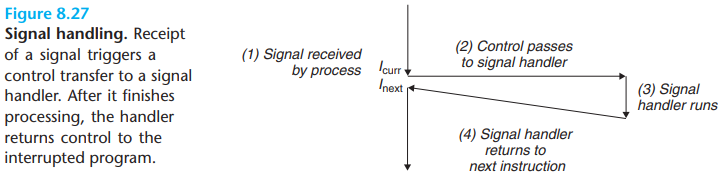
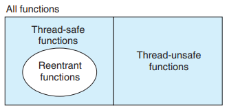
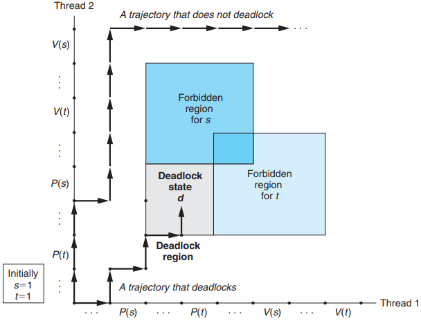

# Process, Thread And Coroutine

[TOC]

Modern operating systems provide three basic approaches for building concurrent programs:

- `Processes`. With this approach, each logical control flow is a process that is scheduled and maintained by the kernel. Since processes have separate virtual address spaces, flows that want to communicate with each other must use some kind of explicit interprocess communication (IPC) mechanism.
- `I/O multiplexing`. This is a form of concurrent programming where applications explicitly schedule their own logical flows in the context of a single process. Logical flows are modeled as state machines that the main program explicitly transitions from state to state as a result of data arriving on file descriptors. Since the program is a single process, all flows share the same address space.
- `Threads`. Threads are logical flows that run in the context of a single process and are scheduled by the kernel. You can think of threads as a hybrid of the other two approaches, scheduled by the kernel-like process flows and sharing the same virtual address space like I/O multiplexing flows.

## Process

A `process` is the operating system's abstraction for a running program. By `concurrently`, we mean that the instructions of one process are interleaved with the instructions of another process.

### Pros And Cons

Pros and Cons of Processes:

- Having separate address spaces for processes is both an advantage and a disadvantage. It is impossible for one process to accidentally overwrite the virtual memory of another process, which eliminates a lot of confusing failures -- an obvious advantage.
- On the other hand, separate address spaces make it more difficult for processes to share state information. To share information, they must use explicit IPC(interprocess communications) mechanisms.
- Another disadvantage of process-based designs is that they tend to be slower because the overhead for process control and IPC is hight.

### Process Context Switch

The operating system kernel implements multitasking using a higher-level form of exceptional control flow known as a `context switch`.

The kernel maintains a `context` for each process. The context is the state that the kernel needs to restart a preempted process. It consists of the values of objects such as the general-purpose registers, the floating-point registers, the program counter, user's stack, status registers, kernel's stack, and various kernel data structures such as a `page table` that characterizes the address space, a `process table` that contains information about the current process, and a `file table` that contains information about the files that the process has opened.

A context switch can occur while the kernel is executing a system call on behalf of the user.

A context switch can also occur as a result of an interrupt.

### Process States

From a programmer's perspective, we can think of a process as being in one of three states:

- `Running`. The process is either executing on the CPU or waiting to be executed and will eventually be scheduled by the kernel.
- `Stopped`. The execution of the process is suspended and will not be scheduled. A process stops as a result of receiving a SIGSTOP, SIGTSTP, SIGTTIN, or SIGTTOU signal, and it remains stopped until it receives a SIGCONT signal, and it remains stopped until it receives a SIGCONT signal, at which point it becomes running again.
- `Terminated`. The process is stopped permanently. A process becomes terminated for one of three reasons: (1) receiving a signal whose default action is to terminate the process, (2) returning from the main routine, or (3) calling the `exit` function.

When a parent process terminates, the kernel arranges for the `init` process to become the adopted parent of any orphaned children. The `init` process, which has a PID of 1, is created by the kernel during system start-up, never terminates, and is the ancestor of every process. If a parent process terminates without reaping its zombie children, then the kernel arranges for the init process to reap them. 

### Signal

A signal is a small message that notifies a process that an event of some type has occurred in the system.

Each signal type corresponds to some kind of system event. Low-level hardware exceptions are processed by the kernel's exception handlers and would not normally be visible to user processes. Signals provide a mechanism for exposing the occurrence of such exceptions to user processes.

The transfer of a signal to a destination process occurs in two distinct steps:

1. `Sending a signal`. The kernel sends (delivers) a signal to a destination process by updating some state in the context of the destination process. The signal is delivered for one of two reasons: (1) The kernel has detected a system event such as a divide-by-zero error or the termination of a child process. (2) A process has invoked the `kill` function (discussed in the next section) to explicitly request the kernel to send a signal to the destination process. A process can send a signal to itself.

2. `Receiving a signal`. A destination process `receives` a signal when it is forced by the kernel to react in some way to the delivery of the signal. The process can either ignore the signal, terminate, or catch the signal by executing a user-level function called a `signal handler`.

A signal that has been sent but not yet received is called a `pending signal`. At any point in time, there can be at most one pending signal of a particular type. If a process has a pending signal of type $k$, then any subsequent signals of type $k$ sent to that process are not queued; they are simply discarded. A process can selectively `block` the receipt of certain signals. When a signal is blocked, it can be delivered, but the resulting pending signal will not be received until the process unblocks the signal.

A pending signal is received at most once. For each process, the kernel maintains the set of pending signals in the pending bit vector, and the set of blocked signals in the blocked bit vector. The kernel sets bit $k$ in pending whenever a signal of type $k$ is delivered and clears bit $k$ in pending whenever a signal of type $k$ is received.

Each signal type has a predefined `default` action, which is one of the following:

- The process terminates.
- The process terminates and dumps core.
- The process stops (suspends) until restarted by a SIGCONT signal.
- The process ignores the signal.

Linux provides implicit and explicit mechanisms for blocking signals:

- `Implicit blocking mechanism`. By default, the kernel blocks any pending signals of the type currently being processed by a handler.
- `Explicit blocking mechanism`. Applications can explicitly block and unblock selected signals using the `sigprocmask` function and its helpers.

---

## Thread

A thread is a logical flow that runs in the context of a process.

Thread execution differs from processes in some important ways:

- a thread context is much smaller than a process context.
- a thread context switch is faster than a process context switch.
- thread unlike processes, are not organized in a rigid parent-child hierarchy.

### Terminate

A thread terminates in one of the following ways:

- The thread terminates `implicitly` when its top-level thread routine returns.
- The thread terminates `explicitly` by calling the `pthread_exit` function.
- Some peer thread calls the Linux `exit` function, which terminates the process and all threads associated with the process.
- Another peer thread terminates the current thread by calling the `pthread_cancel` function with the ID of the current thread.

A joinable thread can be reaped and killed by other threads. Its memory resources (such as the stack) are not freed until it is reaped by another thread. In contrast, a detached thread cannot be reaped or killed by other threads. Its memory resources are freed automatically by the system when it terminates.

### Thread Safe

Thus, registers are never shared, whereas virtual memory is always shared.

A function is said to be `thread-safe` if and only if it will always produce correct results when called repeatedly from multiple concurrent threads. If a function is not thread-safe, then we say it is `thread-unsafe`.

We can identify four (nondisjoint) classes of thread-unsafe functions:

- Class 1: Functions that do not protect shared variables.
- Class 2: Functions that keep state across multiple invocations.
- Class 3: Functions that return a pointer to a static variable.
- Class 4: Functions that call thread-unsafe functions.

If all function arguments are passed by value (i.e., no pointers) and all data references are to local automatic stack variables (i.e., no references to static or global variables), then the function is `explicitly reentrant`, in the sense that we can assert its reentrancy regardless of how it is called.

`reentrant functions`: that are characterized by the property that they do not reference `any` shared data when they are called by multiple threads.

*Relationships between the sets of reentrant, thread-safe, and thread-unsafe functions.*

Races usually occur because programmers assume that threads will take some particular trajectory through the execution state space, forgetting the golden rule that threaded programs must work correctly for any feasible trajectory.

### Semaphore

Semaphores introduce the potential for a nasty kind of run-time error, called `deadlock`, where a collection of threads is blocked, waiting for a condition that will never be true.

*Progress graph for a program that can deadlock.*

A semaphore, $s$ is a global variable with a nonnegative integer value that can only be manipulated by two special operations, called $P$ and $V$:

- $P(s)$: If $s$ is nonzero, then $P$ decrements $s$ and returns immediately. If $s$ is zero, then suspend the thread until $s$ becomes nonzero and the thread is restarted by a $V$ operation. After restarting, the $P$ operation decrements $s$ and returns control to the caller.
- $V(s)$: The $V$ operation increments $s$ by 1. If there are any threads blocked at a $P$ operation waiting for $s$ to become nonzero, then the $V$ operation restarts exactly one of these threads, which then completes its $P$ operation by decrementing $s$​.

A semaphore that is used in this way to protect shared variables is called a `binary semaphore` because its value is always 0 or 1.

Binary semaphores whose purpose is to provide mutual exclusion are often called `mutexes`.

---

## Coroutine

---

## Reference

[1] Randal E. Bryant, David R. O'Hallaron . COMPUTER SYSTEMS: A PROGRAMMER'S PERSPECTIVE . 3ED

