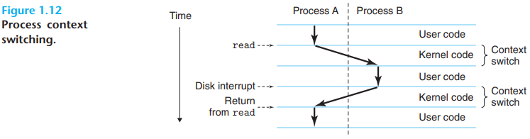

# Process, Thread And Coroutine

[TOC]

## Process

A `process` is the operating system's abstraction for a running program. By `concurrently`, we mean that the instructions of one process are interleaved with the instructions of another process.

## Thread

## Coroutine

## Reference

[1] Randal E. Bryant, David R. O'Hallaron . COMPUTER SYSTEMS: A PROGRAMMER'S PERSPECTIVE . 3ED

