English | [中文版](progress_thread_coroutine_zh.md)

# Process, Thread, and Coroutine

[TOC]


## Process

A process is an independent unit for resource allocation and scheduling in the system. Each process has its own independent memory space, and different processes communicate via inter-process communication. Processes are relatively heavy, context switching overhead is large, but they are more stable than threads.

### Definition and Characteristics

Definition:

- A process is an execution of a program.
- A process is the activity of a program and its data being executed sequentially on a processor.
- A process is a program with independent functionality running on a data set; it is an independent unit for resource allocation and scheduling in the system.

Characteristics:

- Dynamic: The essence of a process is the execution of a process entity, so dynamicity is the most fundamental characteristic.
- Concurrency: Multiple process entities coexist in memory and can run simultaneously within a period.
- Independence: A process entity can run independently, obtain resources independently, and accept investigation independently.
- Asynchrony: Processes run asynchronously, i.e., they progress at their own unpredictable speeds.

### Precedence Graph

A `Precedence Graph` is a directed acyclic graph (DAG) used to describe the execution order between processes.

The precedence relationship between processes (or programs) can be denoted as "$\rightarrow$". If there is a precedence relationship between $P_i$ and $P_j$, it can be written as $(P_i, P_j)\in \rightarrow$ or $P_i \rightarrow P_j$, meaning $P_i$ must complete before $P_j$ starts. $P_i$ is the direct predecessor of $P_j$, and $P_j$ is the direct successor of $P_i$.

### Execution Order

- Sequential Execution

  

  In the above statements, there is the following precedence relationship: $S_1 \rightarrow S_2 \rightarrow S_3$.

- Concurrent Execution

  
  
  In the above statements, $S_3$ must be executed after both $S_1$ and $S_2$ have finished; $S_4$ must be executed after $S_3$; but $S_1$ and $S_2$ can be executed concurrently because they are independent of each other.

### Process Management

#### Data Structures

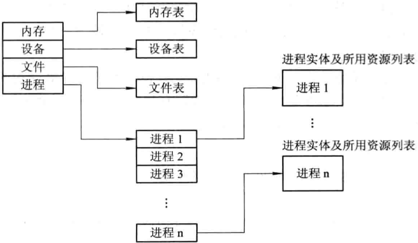

*General structure of OS control tables*

#### Process Control Block (PCB)

Role:

- Marks the basic unit of independent operation
- Enables intermittent operation
- Provides information needed for process management
- Provides information needed for process scheduling
- Enables synchronization and communication with other processes

PCB organization:

- Linear

  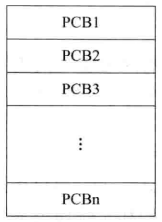

  *Linear representation of PCB*

- Linked

  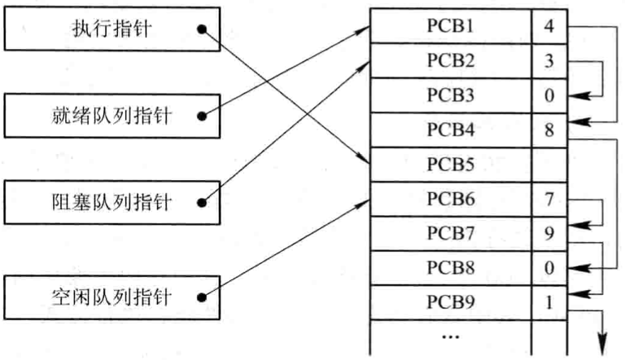

  *Linked queue representation of PCB*

- Indexed

  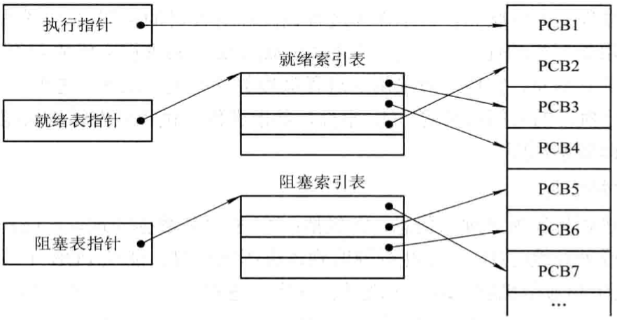
  
  *Indexed organization of PCB*

### State Management

#### Basic States

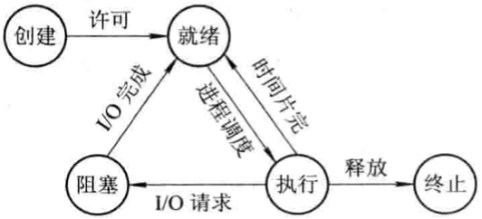

 *Five basic states and transitions of a process*

- `Ready` state
- `Running` state
- `Blocked` state
- `Created` state
- `Terminated` state

#### State Transitions


*Process state diagram with create, terminate, and suspend states*

- Creation

  1. Request a blank PCB, obtain a unique identifier for the new process, and get a blank PCB from the PCB pool.
  2. Allocate the resources needed for the new process to run, including various physical and logical resources such as memory, files, I/O devices, and CPU time.
  3. Initialize the process control block (PCB), including:
     - Initialize identification information
     - Initialize processor state information
     - Initialize processor control information
  4. If the ready queue can accept a new process, insert the new process into the ready queue.

- Termination

  1. According to the identifier of the terminated process, retrieve its PCB from the PCB pool and read its state.
  2. If the terminated process is in the running state, immediately terminate its execution and set the scheduling flag to true, indicating that rescheduling should occur after the process is terminated.
  3. If the process has child or descendant processes, terminate all of them as well to prevent them from becoming uncontrollable processes.
  4. Return all resources owned by the terminated process either to its parent process or to the system.
  5. Remove the terminated process (PCB) from its queue (or list) and wait for other programs to collect information.

- Blocking

  1. Immediately stop execution, change the previous state in the PCB from running to blocked, and insert the PCB into the blocked queue.
  2. If the system has multiple blocked queues for different events, insert the process into the blocked queue corresponding to the same event.
  3. Reschedule, assign the processor to another ready process, and perform a context switch.

- Wakeup

  1. Remove the blocked process from the blocked queue for the event it was waiting for, change its state in the PCB from blocked to ready, and insert the PCB into the ready queue.

- Suspend

  1. If the process is in the active ready state, change it to suspended ready.
  2. For a process in the active blocked state, change it to suspended blocked.
  3. To facilitate inspection by the user or parent process, copy the PCB of the process to a specified memory area.
  4. If the suspended process is running, switch to the scheduler for rescheduling.

- Activate

  1. Load the process from external storage into memory, check its current state, and if it is suspended ready, change it to active ready; if it is suspended blocked, change it to active blocked.
  2. If preemptive scheduling is used, whenever a suspended ready process is activated and inserted into the ready queue, check whether rescheduling is needed.

### Process Scheduling

 - Nonpreemptive Mode

   Once the processor is assigned to a process, it continues to run without being preempted by clock interrupts or any other reason until the process completes.

 - Preemptive Mode

   The scheduler is allowed to suspend a running process according to certain rules and reassign the processor to another process.

#### Round Robin Scheduling Algorithm

All ready processes are arranged in a ready queue according to the FCFS (First-Come, First-Served) policy. An interrupt is set to occur at regular intervals to activate the process scheduler, which assigns the CPU to the process at the head of the queue and lets it execute for a time slice. When it finishes its time slice, the CPU is assigned to the new head of the ready queue, which also executes for a time slice. This ensures that all processes in the ready queue can obtain a time slice of CPU time within a defined period.

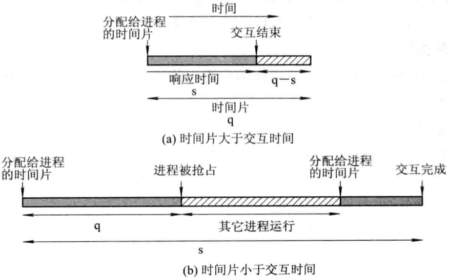

*Effect of time slice size on response time*

#### Priority Scheduling Algorithm

 - Nonpreemptive priority scheduling algorithm

   After the processor is assigned to the highest-priority process in the ready queue, that process continues to execute until it completes.

 - Preemptive priority scheduling algorithm

   The processor is assigned to the highest-priority process in the ready queue. If another process with a higher priority appears, the scheduler will assign the processor to the newly arrived highest-priority process.

#### Multiqueue Scheduling Algorithm

The multiqueue scheduling algorithm splits the system's single ready queue into several queues, with different types or categories of processes fixed in different ready queues. Different ready queues use different scheduling algorithms. Processes in a single ready queue can have different priorities, and the ready queues themselves can also have different priorities.

#### Multilevel Feedback Queue Scheduling Algorithm

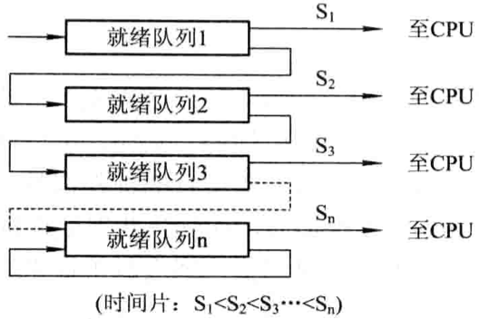

*Multilevel feedback queue scheduling algorithm*

1. Set up multiple ready queues, each with decreasing priority.
2. Each queue uses FCFS.
3. Schedule by queue priority.

#### Fairness-based Scheduling Algorithm

Ensures all users get the same CPU time or the required time proportion.

### Real-time Process Scheduling

1. Nonpreemptive scheduling algorithms
   - Nonpreemptive round robin
   - Nonpreemptive priority
   
2. Preemptive scheduling algorithms
   - Clock-interrupt-based preemptive priority
   
    After a real-time task arrives, if its priority is higher than the current task's priority, the processor is not immediately preempted from the current task. Instead, the scheduler waits until a clock interrupt occurs to preempt the current task and assign the processor to the newly arrived higher-priority task.
   
   - Immediate preemption priority
   
    Once an external interrupt occurs, as long as the current task is not in a critical section, the execution of the current task can be immediately preempted, and the processor is assigned to the urgent task requesting the interrupt.

#### Earliest Deadline First (EDF) Algorithm

- Nonpreemptive for aperiodic real-time tasks

  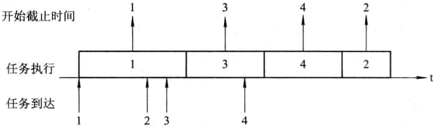

  *EDF algorithm for nonpreemptive scheduling*

- Preemptive for periodic real-time tasks

  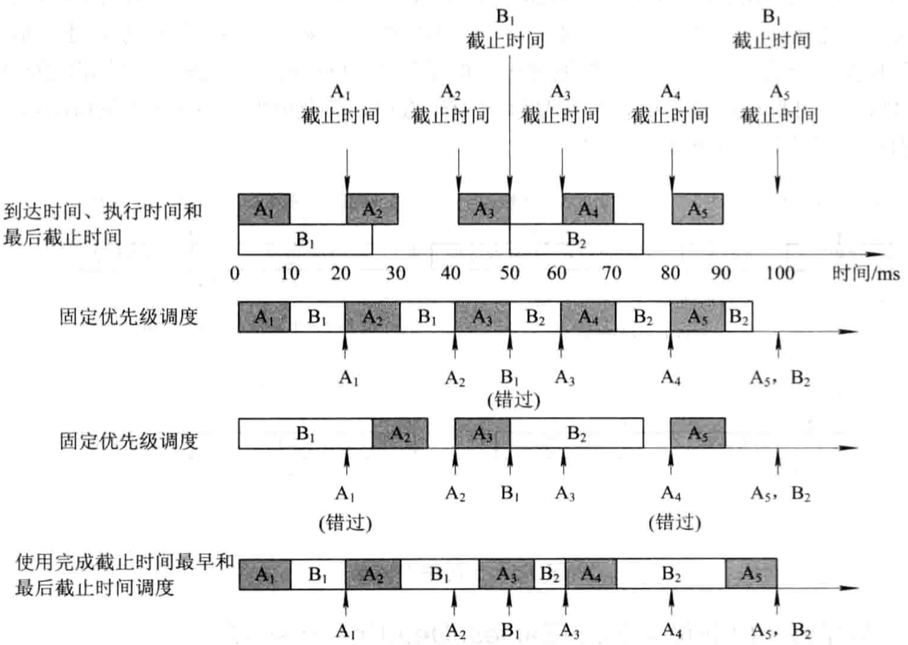
  
  *Example of earliest deadline first algorithm for preemptive scheduling*

#### Least Laxity First (LLF) Algorithm

The priority of a task is determined based on its urgency (or laxity).

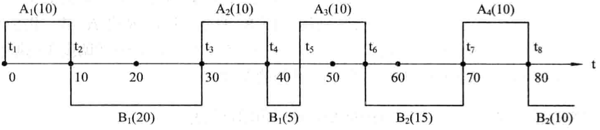

*Scheduling with the ELLF algorithm*

### Process Synchronization

Rules for synchronization mechanisms:

- `Enter when idle`: If no process is in the critical section, a requesting process should be allowed to enter immediately.
- `Wait when busy`: If a process is in the critical section, others must wait to ensure mutual exclusion.
- `Bounded waiting`: Every process should be able to enter its critical section within a bounded time.
- `Yield while waiting`: A process unable to enter its critical section should release the CPU immediately.

#### Hardware Synchronization

Disable interrupts before lock testing, enable after lock acquired.

#### Semaphore Mechanism

- Integer semaphore
- Record semaphore
- AND-type semaphore
- Semaphore set

### Process Communication

#### Shared-Memory System

TODO

#### Pipe Communication System

A pipe connects a reading process and a writing process for communication.

#### Message Passing System

Message passing is a high-level communication method.

#### Client-Server System

TODO


## Thread

A thread, also called a `Light-Weight Process`, is an entity of a process and the basic unit of CPU scheduling and dispatch. It is lighter than a process, does not own system resources, only some necessary runtime resources (like program counter, registers, and stack). It has function entry and return, and can share all resources of the process with other threads in the same process. Thread communication is mainly via shared memory, context switching overhead is small, but stability is lower.

### Execution States

Three thread states:

- `Running`: The thread has the CPU and is running.
- `Ready`: The thread is ready to run as soon as it gets the CPU.
- `Blocked`: The thread is paused due to some event.

### Thread Control Block (TCB)

- `Thread identifier`: Unique for each thread.
- `Set of registers`: Includes PC, status, and general-purpose registers.
- `Thread state`: Describes the current state.
- `Priority`: Execution priority.
- `Thread private storage`: For saving protection info and statistics during context switch.
- `Signal mask`: Masks certain signals.
- `Stack pointer`: For local variables and return address.

### Thread Implementation

- Kernel Supported Threads (KST)

  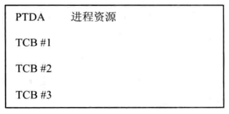

  *Thread data area space*

- User Level Threads (ULT)

  1. Runtime System

     Functions for thread management, creation, synchronization, communication, and scheduling.

  2. Kernel Control Threads

     Also called `Light Weight Process (LWP)`, each process can have multiple LWPs, each with its own TCB, identifier, priority, state, stack, and local storage.

     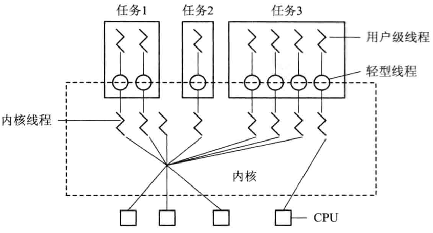

    *Using lightweight processes as an intermediate system*

- Combined Models

  1. Many-to-one: Maps user threads to one kernel thread;
  
     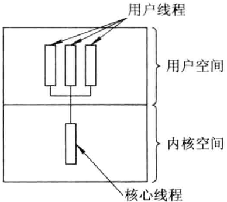

    *Many-to-one model*
  
  2. One-to-one: Maps each user thread to a kernel thread;
  
     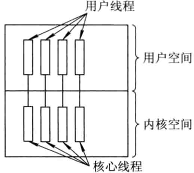
  
    *One-to-one model*
  
  3. Many-to-many: Maps many user threads to the same or fewer kernel threads.
  
     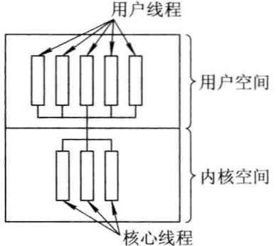
  
    *Many-to-many model*
  

### Thread Creation and Termination

1. Thread creation

   Use a thread creation function (or syscall) with parameters (entry pointer, stack size, priority). Returns a thread ID.

2. Thread termination

   Another thread calls a function to terminate it. Resources are not released until another thread calls a detach function.

### POSIX API

#### pthread_create

```c++
#include <pthread.h>
int pthread_create(pthread_t *tid, const pthread_attr_t *attr, void *(*func)(void *), void *arg);
```

- `tid`: returned thread ID
- `attr`: attributes
- `func`: function to execute
- `arg`: argument to function
- `return value`: 0 on success, error code on failure

Creates a thread.

#### pthread_join

```c++
#include <pthread.h>
int pthread_join(pthread_t *tid, void **status);
```

- `tid`: thread ID
- `status`: thread return value
- `return value`: 0 on success, error code on failure

Waits for thread to terminate.

#### pthread_self

```c++
#include <pthread.h>
int pthread_detach(pthread_t tid);
```

- `tid`: thread ID
- `return value`: 0 on success, error code on failure

Detaches the specified thread.

#### pthread_exit

```c++
#include <pthread.h>
void pthread_exit(void *status);
```

- `status`: thread exit status

Terminates the thread.

#### pthread_once

```c++
#include <pthread.h>
int pthread_once(pthread_once_t *onceptr, void (*init)(void));
```

- `onceptr`: call record pointer
- `init`: initialization function
- `return value`: 0 on success, error code on failure

Ensures init is called only once.

#### pthread_key_create

```c++
#include <pthread.h>
int pthread_key_create(pthread_key_t *keyptr, void (*destructor)(void *value));
```

- `keyptr`: created key
- `destructor`: key destructor
- `return value`: 0 on success, error code on failure

Allocates a key for thread-specific data.

#### pthread_getspecific

```c++
#include <pthread.h>
void *pthread_getspecific(pthread_key_t key);
```

- `key`: key
- `return value`: pointer to thread-specific data (nullable)

Gets value by key.

#### pthread_setspecific

```c++
#include <pthread.h>
int pthread_setspecific(pthread_key_t key, const void *value);
```

- `key`: key
- `value`: value
- `return value`: 0 on success, error code on failure

Sets value by key.

#### pthread_mutex_lock

```c++
#include <pthread.h>
int pthread_mutex_lock(pthread_mutex_t *mptr);
```

- `mptr`: mutex
- `return value`: 0 on success, error code on failure

Locks the mutex.

#### pthread_mutex_unlock

```c++
#include <pthread.h>
int pthread_mutex_unlock(pthread_mutex_t *mptr);
```

- `mptr`: mutex
- `return value`: 0 on success, error code on failure

Unlocks the mutex.

#### pthread_cond_wait

```c++
#include <pthread.h>
int pthread_cond_wait(pthread_cond_t *cptr, pthread_mutex_t *mptr);
```

- `cptr`: condition variable
- `mptr`: mutex
- `return value`: 0 on success, error code on failure

Waits on a condition variable (single thread).

#### pthread_cond_signal

```c++
#include <pthread.h>
int pthread_cond_signal(pthread_cond_t *cptr);
```

- `cptr`: condition variable
- `mptr`: mutex
- `return value`: 0 on success, error code on failure

Wakes up a single thread waiting on the condition variable.

#### pthread_cond_timedwait

```c++
#include <pthread.h>
int pthread_cond_timedwait(pthread_cond_t *cptr, pthread_kmutex_t *mptr, 
                           const struct timespec *abstime);
```

- `cptr`: condition variable
- `mptr`: mutex
- `abstime`: absolute wait time (seconds and nanoseconds since 1970-01-01 UTC)
- `return value`: 0 on success, error code on failure

Timeout wait for all threads on the condition variable.

#### pthread_cond_broadcast

```c++
#include <pthread.h>
int pthread_cond_broadcast(pthread_cond_t *cptr);
```

- `cptr`: condition variable
- `mptr`: mutex
- `abstime`: absolute wait time (seconds and nanoseconds since 1970-01-01 UTC)
- `return value`: 0 on success, error code on failure

Wakes up all threads waiting on the condition variable.


## Coroutine

**A coroutine is a lightweight user-space thread.** Coroutines are at the language level, while threads are at the system level. Coroutine scheduling is fully controlled by the user. Coroutines have their own register context and stack. When switching, the register context and stack are saved elsewhere and restored when switching back. Context switching has almost no overhead.


## Deadlock

### Definition

A set of processes is deadlocked if each process is waiting for an event that only another process in the set can cause.

### Causes of Deadlock

- Competing for non-preemptible resources

  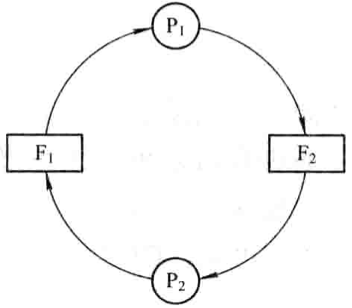

  *Deadlock situation when sharing files*

- Competing for consumable resources

  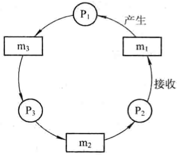

  *Deadlock during inter-process communication*

- Improper process advancement order

  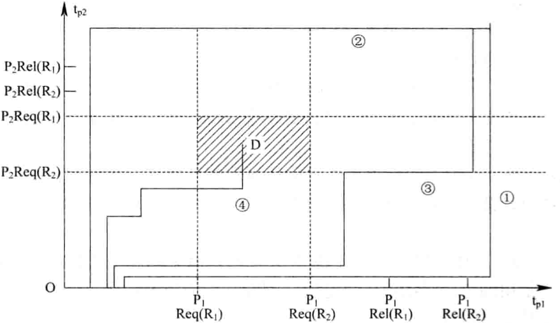
  
    - $D$: Unsafe region
    - $P_1, P_2$: Processes

    When $P_1$ runs to $P_1$:$Request(R_2)$, it will be blocked because $R_2$ is already occupied by $P_2$; when $P_2$ runs to $P_2$:$Request(R_1)$, it will also be blocked because $R_1$ is already occupied by $P_1$, thus a process deadlock occurs.

Necessary conditions for deadlock:

- Mutual exclusion
- Hold and wait
- No preemption
- Circular wait

### Deadlock Handling Methods

#### Deadlock Prevention

Prevent deadlock by breaking one of the four necessary conditions.

- Break "hold and wait":

  1. First protocol

     All processes must request all resources needed for their entire run before starting.

  2. Second protocol

     Processes can request initial resources, run, release used resources, then request new ones.

- Break "no preemption":

  When a process that is already holding some non-preemptible resources makes a new resource request that cannot be satisfied, it must release all the resources it is currently holding and reapply for them when needed later.

- Break "circular wait":

  Each process must request resources in strictly increasing order of their serial numbers. At the beginning, a process can request units of a certain type of resource $R_i$. Later, it can only request units of resource $R_j$ if and only if $F(R_j) > F(R_i)$.

#### Deadlock Avoidance

Dynamically allocate resources to keep the system in a safe state (there exists a sequence $(P_1, P_2, ..., P_n)$ such that each $P_i$ can get its maximum resources and finish).

Using the Banker's algorithm to avoid deadlock

  Let $Request_i$ be the request vector of process $P_i$. If $Request_i[j] = K$, it means process $P_i$ needs $K$ resources of type $R_j$. When $P_i$ makes a resource request, the system checks as follows:

  1. If $Request_i[j] \leqslant Need[i, j]$, go to step 2; otherwise, it is an error because the requested number of resources exceeds the declared maximum.

  2. If $Request_i[j] \leqslant Available[j]$, go to step 3; otherwise, there are not enough resources, and $P_i$ must wait.

  3. The system tentatively allocates the resources to process $P_i$ and updates the following data structures:

    $Available[j] = Available[j] - Request_i[j];$
    
    $Allocation[i, j] = Allocation[i, j] + Request_i[j];$
    
    $Need[i, j] = Need[i, j] - Request_i[j];$

  4. The system runs the safety algorithm to check if the system is in a safe state after this allocation. If it is safe, the resources are officially allocated to $P_i$ to complete this allocation; otherwise, the tentative allocation is canceled, the original resource allocation is restored, and $P_i$ must wait.

#### Deadlock Detection

Allow deadlock to occur, but detect it and take action to recover.

- Resource Allocation Graph

  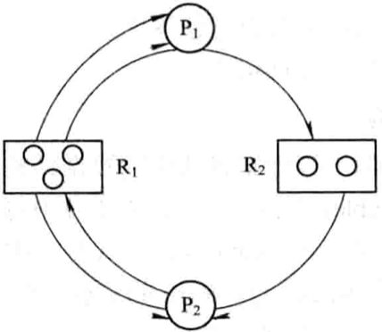

  System deadlock can be described using a resource allocation graph. This graph is a pair $G=(N,E)$ consisting of a set of nodes $N$ and a set of edges $E$, with the following definitions and constraints:

    1. Divide $N$ into two mutually exclusive subsets: a set of process nodes $P={P_1, P_2, ..., P_n}$ and a set of resource nodes $R={R_1, R_2, ..., R_n}$, so $N = P \cup R$.
    2. Each edge $e \in E$ connects a node in $P$ and a node in $R$. $e={P_i, R_j}$ is a resource request edge, from process $P_i$ to resource $R_j$, indicating that $P_i$ requests one unit of resource $R_j$. $E = {R_j, P_i}$ is a resource allocation edge, from resource $R_j$ to process $P_i$, indicating that one unit of resource $R_j$ is allocated to $P_i$.

- Deadlock Theorem

  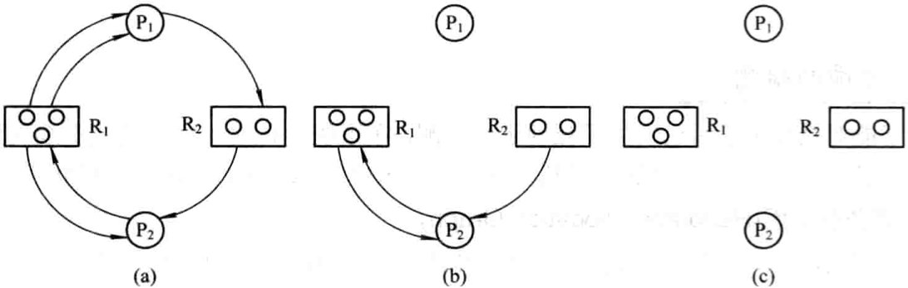

  1. During resource allocation, find a process node $P_i$ that is neither blocked nor isolated. In a smooth scenario, $P_i$ can obtain the required resources and continue running until completion, then release all the resources it holds. This is equivalent to removing $P_i$'s request and allocation edges, making it an isolated node; see Figure b.
  2. After $P_1$ releases resources, $P_2$ can obtain resources and continue running. When $P_2$ finishes and releases all its resources, the situation shown in Figure c is formed, that is, $P_2$'s two request edges and one allocation edge are removed.
  3. After a series of such simplifications, if all edges in the graph can be removed and all process nodes become isolated nodes, the graph is said to be completely reducible; if the graph cannot be completely reduced by any process, it is said to be irreducible.

- Data structures for detection

    - Available resource vector Available, which indicates the number of available resources for each of the $m$ types of resources.
    - Add processes that do not occupy resources (vector Allocation=0) to the L list, i.e., $L_i \cup L$.
    - From the set of processes, find a process such that $Request_i \leqslant Work$, and do the following:
      1. Simplify its resource allocation graph, release its resources, and increase the work vector $Work = Work + Allocation_i$;
      2. Add it to the L list.
    - If not all processes can be added to the L list, it indicates that the resource allocation graph of system state $S$ is not completely reducible. Therefore, a deadlock will occur in this system state.

#### Deadlock Recovery

When deadlock is detected, take measures (e.g., kill processes) to recover.

- Resource preemption
- Terminate (or kill) processes


## Summary

Differences between process, thread, and coroutine:

|      | Process                                                     | Thread                                                     | Coroutine                                                  |
| ---- | ----------------------------------------------------------- | ---------------------------------------------------------- | ---------------------------------------------------------- |
| Scheduling | Runs independently.                                      | Basic unit of scheduling and dispatch; actually runs on CPU.| Fully controlled by user.                                  |
| Resources  | Has independent resources.                              | All threads in a process share resources; more efficient.   | Has its own register context and stack.                    |
| Overhead   | Large overhead for creation/destruction and context switch.| Small overhead.                                            | Can save/restore state; switching has almost no overhead.  |
| Concurrency| Processes run independently.                            | Preemptive multitasking; threads need locks; less robust.   | Cooperative multitasking; no locks needed; more robust.    |


## References

[1] Tang Xiaodan, Liang Hongbing, Zhe Fengping, Tang Ziying. Computer Operating System. 3rd Edition. P32 - P115

[2] [Wikipedia - Coroutine](https://en.wikipedia.org/wiki/Coroutine)
