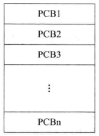
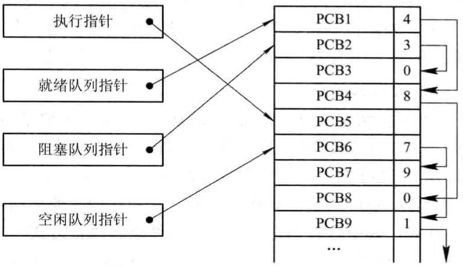
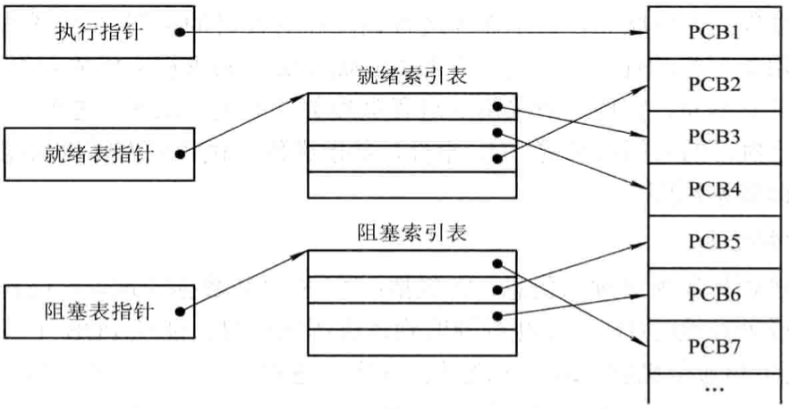
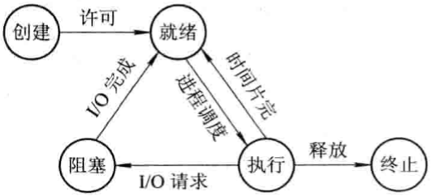

# 进程，线程和协程

[TOC]

## 进程

进程是系统进行资源分配和调度的一个独立单位，每个进程都有自己独立的内存空间，不同进程通过进程间通信来交流。比较heavy，上下文切换开销大，但是比线程稳定。

### 定义与特征

定义：

- 进程是程序的一次执行；
- 进程是一个程序及其数据在处理机上顺序执行时所发生的活动；
- 进程是具有独立功能的程序在一个数据集合上运行的过程，它是系统进行资源分配和调度的一个独立单位。

特征：

- 动态性：进程的实质是进程实体的执行过程，因此，动态性就是进程的最基本的特征。
- 并发性：多个进程实体同存于内存中，且能在一段时间内同时运行。
- 独立性：进程实体是一个能独立运行，独立获得资源和独立接受调查的基本单位。
- 异步性：进程是按异步方式运行的，即按各自独立的，不可预知的速度向前推进。

### 前趋图

`前趋图（Precedence Graph）` 指一个有向无循环图，可记为DAG(Directed Acyclic Graph)，它用于描述进程之间执行的先后顺序。

进程（或程序）之间的前趋关系可用“$\rightarrow$”来表示，如果进程$P_i$和$P_j$存在着前趋关系，可表示为$(P_i, P_j)\in \rightarrow$，也可写成$P_i \rightarrow P_j$，表示在$P_j$开始执行之前$P_i$必须完成。此时称$P_i$是$P_j$的直接前趋，而称$P_j$是$P_i$的直接后继。

### 执行顺序

- 顺序执行

  

  上述语句中，存在着这样的前趋关系：$S_1 \rightarrow S_2 \rightarrow S_3$。

- 并发执行

  

  上述语句中，$S_3$必须在$S_1$和$S_2$被执行后方能执行；$S_4$必须在$S_3$之后执行；但$S_1$和$S_2$则可以并发执行，因为它们彼此互不依赖。

### 进程管理

#### 数据结构

*操作系统控制表的一般结构*

#### 进程控制块(Process Control Block, PCB)

作用：

- 作为独立运行基本单位的标志
- 能实现间断性运行方式
- 提供进程管理所需要的信息
- 提供进程调度所需要的信息
- 实现与其它进程的同步与通信

PCB组织方式：

- 线性方式

  

  *PCB线性表示示意图*

- 链接方式

  

  *PCB链接队列示意图*

- 索引方式

  

  *按索引方式组织PCB*

### 状态

#### 基本状态

- `就绪（Ready）状态`
- `执行（Running）状态`
- `阻塞（Block）状态`
- `创建（Create）状态`
- `终止（Stop）状态`

*进程的五种基本状态及转换*

#### 状态转换

*具有创建，终止和挂起状态的进程状态图*

- 创建

  1. 申请空白PCB，为新进程申请获得唯一的数字标识符，并从PCB集合中索取一个空白PCB。
  2. 为新进程分配其运行所需的资源，包括各种物理和逻辑资源，如内存，文件，I/O设备和CPU时间等。
  3. 初始化进程控制块（PCB）包括：
     - 初始化标识信息
     - 初始化处理机状态信息
     - 初始化处理机控制信息
  4. 如果进程就绪队列能够接纳新进程，便将新进程插入就绪队列。

- 终止

  1. 根据被终止进程的标识符，从PCB集合中检索出该进程的PCB，从中读出该进程的状态；
  2. 若被终止进程处于执行状态，应立即终止该进程的执行，并置调度标志为真，用于指示该进程被终止后应重新进行调度；
  3. 若该进程还有子孙进程，还应将其所有子孙进程也都予以终止，以防他们成为不可控的进程；
  4. 将被终止进程所拥有的全部资源或者归还给其父进程，或者归还给系统；
  5. 将被终止进程（PCB）从所在队列（或链表）中移出，等待其它程序来搜集信息。

- 阻塞

  1. 立即停止执行，把进程控制块中的先行状态由执行“改为阻塞，并将PCB插入阻塞队列；
  2. 如果系统中设置了因不同事件而阻塞的多个阻塞队列，则应将本进程插入到具有相同事件的阻塞队列；
  3. 进行重新调度，将处理机分配给另一就绪进程，并进行切换。

- 唤醒

  1. 把被阻塞的进程从等待该事件的阻塞队列中移出，将其PCB中的现行状态由阻塞改为就绪，并将该PCB插入到就绪队列中。

- 挂起

  1. 若进程处于活动就绪状态，便将其改为静止就绪；
  2. 对于活动阻塞状态的进程，则将之改为静止阻塞；
  3. 为了方便用户或父进程考查该进程的运行情况，而把该进程的PCB复制到某指定的内存区域；
  4. 若被挂起的进程正在执行，则转向调度程序重新调度。

- 激活

  1. 将进程从外存调入内存，检查该进程的现行状态，若是静止就绪，便将之改为活动就绪；若为静止阻塞，便将之改为活动阻塞；
  2. 假如采用的是抢占调度策略，则每当有静止就绪进程被激活而插入就绪队列时，便应检查是否要进行重新调度。

### 进程同步

同步机制应遵循的规则

- `空闲让进` 当无进程处于临界区时，表明临界资源处于空闲状态，应允许一个请求进入临界区的进程立即进入自己的临界区，以有效地利用临界资源。
- `忙则等待` 当已有进程进入临界区时，表明临界资源正在被访问，因而其它试图进入临界区的进程必须等待，以保证对临界资源的互斥访问。
- `有限等待` 对要求访问临界资源的进程，应保证在有限时间内能进入自己的临界区，以免陷入“死等”状态。
- `让权等待` 当进程不能进入自己的临界区时，应立即释放处理机，以免进程陷入“忙等”状态。

#### 硬件同步机制

在进入锁测试之前关闭中断，直到完成锁测试并上锁之后才能打开中断。

#### 信号量(Semaphores)机制

- 整型信号量；
- 记录型信号量；
- AND型信号量；
- 信号量集。

#### 管程机制

`管程` 代表共享资源的数据结构以及由对该共享数据结构实施操作的一组过程所组成的资源管理程序共同构成了一个操作系统的资源管理模块。

管程组成：

- 管程的名称；
- 局部于管程的共享数据结构说明；
- 对该数据结构进行操作的一组过程；
- 对局部于管程的共享数据设置初始值的语句。

管程的特性：

- 模块化：即管程是一个基本程序单位；
- 抽象数据类型：管程中不仅有数据，而且有对数据的操作；
- 信息掩蔽：管程中的数据结构只能被管程中的过程访问，这些过程也是在管程内部定义的，供管程外的进程调用，而管程中的数据结构以及过程（函数）的具体实现外部不可见。

管程和进程的不同点：

- 进程定义的是私有数据结构PCB，管程定义的是公共数据结构（如消息队列等）；
- 进程是由顺序程序执行有关操作，管程主要是进行同步操作和初始化操作；
- 设计进程的目的在于实现系统的并发性，而管程的设置则是解决共享资源的互斥使用问题；
- 进程为主动工作方式，管程为被动工作方式；
- 进程之间能并发执行，管程不能与其调用者并发；
- 进程具有动态性，管程是操作系统中的一个资源管理模块，供进程调用。

*管程示意图*

### 进程通信

#### 共享存储器系统(Shared-Memory System)

TODO

#### 管道(pipe)通信系统

建立一个连接读进程和写进程的管道以实现通信。

#### 消息传递系统(Message passing system)

基于消息传递系统的通信方式属于高级通信方式。

#### 客户机-服务器系统(Client-Server system)

TODO

## 线程

线程又叫做 `轻型进程(Light-Weight Process)`，是进程的一个实体，是cpu调度和分派的基本单位；比进程轻，不拥有系统资源，只拥有一些必要的运行时资源（如程序计数器，寄存器和栈）；拥有函数的入口和返回，可以与同一个进程内的其他线程共享进程的所有资源；线程间通信主要通过共享内存，上下文切换开销小，但是不够稳定。

### 执行状态

线程运行的三个状态

- `执行状态` 表示线程已获得处理机而正在运行；
- `就绪状态` 线程已具备了各种执行条件，只须再获得CPU便可立即执行；
- `阻塞状态` 线程在执行中因某事件受阻而处于暂停状态。

### 线程控制块(TCB)

- `线程标识符` 为每个线程赋予一个唯一的线程标识符；
- `一组寄存器` 包括程序计数器PC，状态寄存器和通用寄存器的内容；
- `线程运行状态` 用于描述线程正处于何种运行状态；
- `优先级` 描述线程执行的优先程度；
- `线程专有存储区` 用于线程切换时存放线程保护信息，和与该县城相关的统计信息等；
- `信号屏蔽` 对某些信号加以屏蔽；
- `堆栈指针` 用于保存局部变量和返回地址。

### 线程的实现

- 内核支持线程KST(Kernel Supported Threads)
- 用户级线程ULT(User Level Threads)
- 组合方式

## 协程

**是一种用户态的轻量级线程**，调度完全由用户控制。拥有自己的寄存器上下文和栈。协程调度切换时，将寄存器上下文和栈保存到其他地方，在切换回来时，恢复前面的寄存器上下文和栈；上下文切换基本没有开销。

## 总结

进程，线程和协程的区别：

|      | 进程                                                         | 线程                                                         | 协程                                                         |
| ---- | ------------------------------------------------------------ | ------------------------------------------------------------ | ------------------------------------------------------------ |
| 调度 | 独立运行                                                     | 作为调度和分配的基本单位，真正在处理机上运行的是线程         | 完全由用户自己控制                                           |
| 资源 | 拥有独立的资源。                                             | 同一个进程中的所有线程智能共享进程资源                       | 拥有自己的寄存器上下文和栈                                   |
| 开销 | 在创建或撤消进程时，由于系统都要为之分配和回收资源，导致进程切换开销大 | 切换开销小                                                   | 协程能保留上一次调用时的状态，每次过程重入都会恢复上一次的状态，协程的开销非常小 |
| 并发 | 进程之间运行互不影响。                                       | 线程共享进程的系统资源；健壮性差；相比进程能更加有效地提高系统资源的利用率和系统的吞吐量。 | 异步机制，在协程中控制共享资源不需要加锁，健壮性好           |

## 参考

[1] 汤小丹, 梁红兵, 哲凤屏, 汤子瀛 . 计算机操作系统 . 3th Edition . P32 - P79
