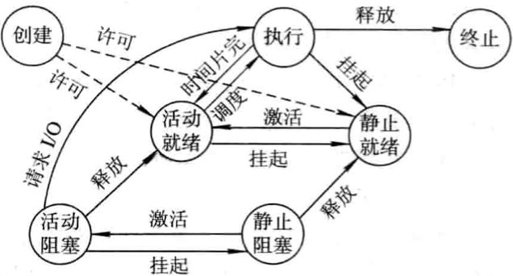
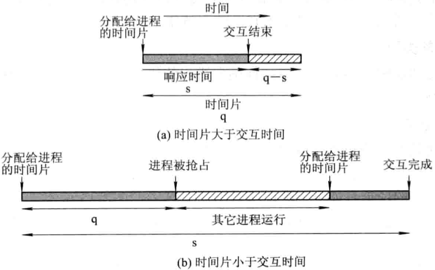
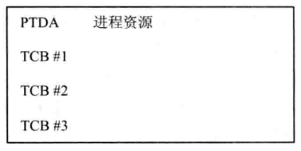
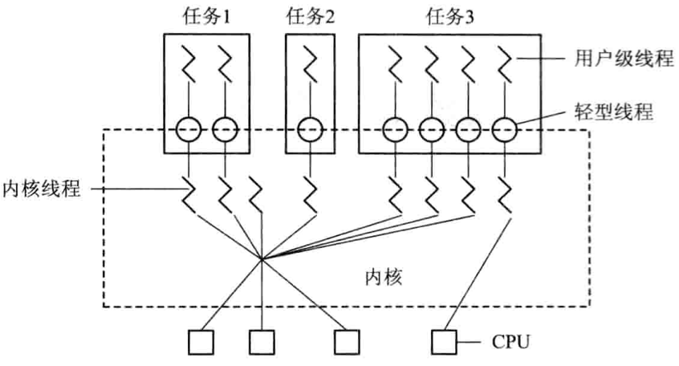
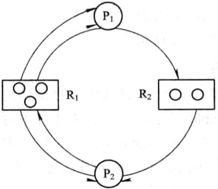

# 进程，线程和协程

<!-- vim-markdown-toc GFM -->

* [进程](#进程)
    - [定义与特征](#定义与特征)
    - [前趋图](#前趋图)
    - [执行顺序](#执行顺序)
    - [进程管理](#进程管理)
        + [数据结构](#数据结构)
        + [进程控制块(Process Control Block, PCB)](#进程控制块process-control-block-pcb)
    - [状态管理](#状态管理)
        + [基本状态](#基本状态)
        + [状态转换](#状态转换)
    - [进程调度](#进程调度)
        + [轮转调度算法](#轮转调度算法)
        + [优先级调度算法](#优先级调度算法)
        + [多队列调度算法](#多队列调度算法)
        + [多级反馈队列(multileved feedback queue)调度算法](#多级反馈队列multileved-feedback-queue调度算法)
        + [基于公平原则的调度算法](#基于公平原则的调度算法)
    - [实时进程调度](#实时进程调度)
        + [最早截止时间优先EDF(Earliest Deadline First)算法](#最早截止时间优先edfearliest-deadline-first算法)
        + [最低松弛度优先LLF(Least Laxity First)算法](#最低松弛度优先llfleast-laxity-first算法)
    - [进程同步](#进程同步)
        + [硬件同步机制](#硬件同步机制)
        + [信号量(Semaphores)机制](#信号量semaphores机制)
    - [进程通信](#进程通信)
        + [共享存储器系统(Shared-Memory System)](#共享存储器系统shared-memory-system)
        + [管道(pipe)通信系统](#管道pipe通信系统)
        + [消息传递系统(Message passing system)](#消息传递系统message-passing-system)
        + [客户机-服务器系统(Client-Server system)](#客户机-服务器系统client-server-system)
* [线程](#线程)
    - [执行状态](#执行状态)
    - [线程控制块(TCB)](#线程控制块tcb)
    - [线程的实现](#线程的实现)
    - [线程的创建与终止](#线程的创建与终止)
    - [POSIX API](#posix-api)
        + [pthread_create](#pthread_create)
        + [pthread_join](#pthread_join)
        + [pthread_self](#pthread_self)
        + [pthread_exit](#pthread_exit)
        + [pthread_once](#pthread_once)
        + [pthread_key_create](#pthread_key_create)
        + [pthread_getspecific](#pthread_getspecific)
        + [pthread_setspecific](#pthread_setspecific)
        + [pthread_mutex_lock](#pthread_mutex_lock)
        + [pthread_mutex_unlock](#pthread_mutex_unlock)
        + [pthread_cond_wait](#pthread_cond_wait)
        + [pthread_cond_signal](#pthread_cond_signal)
        + [pthread_cond_timedwait](#pthread_cond_timedwait)
        + [pthread_cond_broadcast](#pthread_cond_broadcast)
* [协程](#协程)
* [死锁](#死锁)
    - [定义](#定义)
    - [造成死锁的原因](#造成死锁的原因)
    - [死锁处理方法](#死锁处理方法)
        + [预防死锁](#预防死锁)
        + [避免死锁](#避免死锁)
        + [检测死锁](#检测死锁)
        + [解除死锁](#解除死锁)
* [总结](#总结)
* [参考](#参考)

<!-- vim-markdown-toc -->


## 进程

进程是系统进行资源分配和调度的一个独立单位，每个进程都有自己独立的内存空间，不同进程通过进程间通信来交流。比较heavy，上下文切换开销大，但是比线程稳定。

### 定义与特征

定义：

- 进程是程序的一次执行；
- 进程是一个程序及其数据在处理机上顺序执行时所发生的活动；
- 进程是具有独立功能的程序在一个数据集合上运行的过程，它是系统进行资源分配和调度的一个独立单位。

特征：

- 动态性：进程的实质是进程实体的执行过程，因此，动态性就是进程的最基本的特征。
- 并发性：多个进程实体同存于内存中，且能在一段时间内同时运行。
- 独立性：进程实体是一个能独立运行，独立获得资源和独立接受调查的基本单位。
- 异步性：进程是按异步方式运行的，即按各自独立的，不可预知的速度向前推进。

### 前趋图

`前趋图（Precedence Graph）` 指一个有向无循环图，可记为DAG(Directed Acyclic Graph)，它用于描述进程之间执行的先后顺序。

进程（或程序）之间的前趋关系可用“$\rightarrow$”来表示，如果进程$P_i$和$P_j$存在着前趋关系，可表示为$(P_i, P_j)\in \rightarrow$，也可写成$P_i \rightarrow P_j$，表示在$P_j$开始执行之前$P_i$必须完成。此时称$P_i$是$P_j$的直接前趋，而称$P_j$是$P_i$的直接后继。

### 执行顺序

- 顺序执行

  

  上述语句中，存在着这样的前趋关系：$S_1 \rightarrow S_2 \rightarrow S_3$。

- 并发执行

  

  上述语句中，$S_3$必须在$S_1$和$S_2$被执行后方能执行；$S_4$必须在$S_3$之后执行；但$S_1$和$S_2$则可以并发执行，因为它们彼此互不依赖。

### 进程管理

#### 数据结构


*操作系统控制表的一般结构*

#### 进程控制块(Process Control Block, PCB)

作用：

- 作为独立运行基本单位的标志
- 能实现间断性运行方式
- 提供进程管理所需要的信息
- 提供进程调度所需要的信息
- 实现与其它进程的同步与通信

PCB组织方式：

- 线性方式

  

  *PCB线性表示示意图*

- 链接方式

  

  *PCB链接队列示意图*

- 索引方式

  

  *按索引方式组织PCB*

### 状态管理

#### 基本状态

- `就绪（Ready）状态`
- `执行（Running）状态`
- `阻塞（Block）状态`
- `创建（Create）状态`
- `终止（Stop）状态`


*进程的五种基本状态及转换*

#### 状态转换



*具有创建，终止和挂起状态的进程状态图*

- 创建

  1. 申请空白PCB，为新进程申请获得唯一的数字标识符，并从PCB集合中索取一个空白PCB。
  2. 为新进程分配其运行所需的资源，包括各种物理和逻辑资源，如内存，文件，I/O设备和CPU时间等。
  3. 初始化进程控制块（PCB）包括：
     - 初始化标识信息
     - 初始化处理机状态信息
     - 初始化处理机控制信息
  4. 如果进程就绪队列能够接纳新进程，便将新进程插入就绪队列。

- 终止

  1. 根据被终止进程的标识符，从PCB集合中检索出该进程的PCB，从中读出该进程的状态；
  2. 若被终止进程处于执行状态，应立即终止该进程的执行，并置调度标志为真，用于指示该进程被终止后应重新进行调度；
  3. 若该进程还有子孙进程，还应将其所有子孙进程也都予以终止，以防他们成为不可控的进程；
  4. 将被终止进程所拥有的全部资源或者归还给其父进程，或者归还给系统；
  5. 将被终止进程（PCB）从所在队列（或链表）中移出，等待其它程序来搜集信息。

- 阻塞

  1. 立即停止执行，把进程控制块中的先行状态由执行“改为阻塞，并将PCB插入阻塞队列；
  2. 如果系统中设置了因不同事件而阻塞的多个阻塞队列，则应将本进程插入到具有相同事件的阻塞队列；
  3. 进行重新调度，将处理机分配给另一就绪进程，并进行切换。

- 唤醒

  1. 把被阻塞的进程从等待该事件的阻塞队列中移出，将其PCB中的现行状态由阻塞改为就绪，并将该PCB插入到就绪队列中。

- 挂起

  1. 若进程处于活动就绪状态，便将其改为静止就绪；
  2. 对于活动阻塞状态的进程，则将之改为静止阻塞；
  3. 为了方便用户或父进程考查该进程的运行情况，而把该进程的PCB复制到某指定的内存区域；
  4. 若被挂起的进程正在执行，则转向调度程序重新调度。

- 激活

  1. 将进程从外存调入内存，检查该进程的现行状态，若是静止就绪，便将之改为活动就绪；若为静止阻塞，便将之改为活动阻塞；
  2. 假如采用的是抢占调度策略，则每当有静止就绪进程被激活而插入就绪队列时，便应检查是否要进行重新调度。

### 进程调度

- 非抢占方式(Nonpreemptive Mode)

  一旦把处理机分配给某进程后，就一直让它运行下去，不会因为时钟中断或任何其它原因去抢占当前正在运行进程的处理机，直至该进程完成。

- 抢占方式(Preemptive Mode)

  允许调度程序根据某种原则，去暂停某个正在执行的进程，将已分配给该进程的处理机重新分配给另一个进程。

#### 轮转调度算法

将所有的就绪进程按FCFS策略排成一个就绪队列。设置每隔一定时间产生一次中断，去激活进程调度程序进程调度，把CPU分配给队首进程，并令其执行一个时间片。当它运行完毕后，又把处理机分配给就绪队列中新的队首进程，也让它执行一个时间片。保证就绪队列中的所有进程在确定的时间段内，都能获得一个时间片的处理机时间。



*时间片大小对响应时间的影响*

#### 优先级调度算法

- 非抢占式优先级调度算法

  把处理机分配给就绪队列中优先级最高的进程后，该进程一直执行下去直至完成。

- 抢占式优先级调度算法

  把处理机分配给就绪队列中优先级最高的进程，如果出现另一个优先级更高的进程，调度程序就将处理机分配给新到的优先级最高的进程。

#### 多队列调度算法

多队列调度算法将系统中的进程就绪队列从一个拆分为若干个，将不同类型或性质的进程固定在不同的就绪队列，不同的就绪队列采用不同的调度算法，一个就绪队列中的进程可以设置不同的优先级，不同的就绪队列本身也可以设置不同的优先级。

#### 多级反馈队列(multileved feedback queue)调度算法


*多级反馈队列调度算法*

1. 设置多个就绪队列。按照优先级依次降低的顺序给每个队列赋值;
2. 每个队列都采用FCFS算法;
3. 按队列优先级调度。

#### 基于公平原则的调度算法

使所有用户能获得相同的处理机时间，或所要求的时间比例。

### 实时进程调度

1. 非抢占式调度算法

   - 非抢占式轮转调度算法
   - 非抢占式优先调度算法

2. 抢占式调度算法

   - 基于时钟中断的抢占式优先级调度算法

     在实时任务到达后，如果其优先级高于当前任务优先级，不立即抢占当前人物的处理机，而是等时钟中断发生时，调度程序才剥夺当前人物的执行，将处理机分配给新到的高优先级任务。

   - 立即抢占(Immediate Preemption)的优先级调度算法

     一旦出现外部中断，只要当前任务未处于临界区，便能立即剥夺当前任务的执行，把处理机分配给请求中断的紧迫任务。

#### 最早截止时间优先EDF(Earliest Deadline First)算法

- 非抢占式调度方式用于非周期实时任务

  

  *EDF算法用于非抢占调度方式*

- 抢占式调度方式用于周期实时任务

  

  *最早截止时间优先算法用于抢占调度方式之例*

#### 最低松弛度优先LLF(Least Laxity First)算法

根据任务的紧急（或松弛）程度，确定任务的优先级。


*利用ELLF算法进行调度的情况*

### 进程同步

同步机制应遵循的规则

- `空闲让进` 当无进程处于临界区时，表明临界资源处于空闲状态，应允许一个请求进入临界区的进程立即进入自己的临界区，以有效地利用临界资源。
- `忙则等待` 当已有进程进入临界区时，表明临界资源正在被访问，因而其它试图进入临界区的进程必须等待，以保证对临界资源的互斥访问。
- `有限等待` 对要求访问临界资源的进程，应保证在有限时间内能进入自己的临界区，以免陷入“死等”状态。
- `让权等待` 当进程不能进入自己的临界区时，应立即释放处理机，以免进程陷入“忙等”状态。

#### 硬件同步机制

在进入锁测试之前关闭中断，直到完成锁测试并上锁之后才能打开中断。

#### 信号量(Semaphores)机制

- 整型信号量；
- 记录型信号量；
- AND型信号量；
- 信号量集。

### 进程通信

#### 共享存储器系统(Shared-Memory System)

TODO

#### 管道(pipe)通信系统

建立一个连接读进程和写进程的管道以实现通信。

#### 消息传递系统(Message passing system)

基于消息传递系统的通信方式属于高级通信方式。

#### 客户机-服务器系统(Client-Server system)

TODO


## 线程

线程又叫做 `轻型进程(Light-Weight Process)`，是进程的一个实体，是cpu调度和分派的基本单位；比进程轻，不拥有系统资源，只拥有一些必要的运行时资源（如程序计数器，寄存器和栈）；拥有函数的入口和返回，可以与同一个进程内的其他线程共享进程的所有资源；线程间通信主要通过共享内存，上下文切换开销小，但是不够稳定。

### 执行状态

线程运行的三个状态

- `执行状态` 表示线程已获得处理机而正在运行；
- `就绪状态` 线程已具备了各种执行条件，只须再获得CPU便可立即执行；
- `阻塞状态` 线程在执行中因某事件受阻而处于暂停状态。

### 线程控制块(TCB)

- `线程标识符` 为每个线程赋予一个唯一的线程标识符；
- `一组寄存器` 包括程序计数器PC，状态寄存器和通用寄存器的内容；
- `线程运行状态` 用于描述线程正处于何种运行状态；
- `优先级` 描述线程执行的优先程度；
- `线程专有存储区` 用于线程切换时存放线程保护信息，和与该县城相关的统计信息等；
- `信号屏蔽` 对某些信号加以屏蔽；
- `堆栈指针` 用于保存局部变量和返回地址。

### 线程的实现

- 内核支持线程KST(Kernel Supported Threads)

  

  *任务数据区空间*

- 用户级线程ULT(User Level Threads)

  1. 运行时系统(Runtime System)

     用于管理和控制线程的函数（过程）的集合，其中包括用于创建和撤销线程的函数，线程同步和通信的函数，以及实现线程调度的函数等。

  2. 内核控制线程

     又称为`轻型进程LWP(Light Weight Process)`，每一个进程都可拥有多个LWP，同用户级线程一样，每个LWP都有自己的数据结构（如TCB），其中包括线程标识符，优先级，状态，另外还有栈和局部存储区。

     

     *利用轻型进程作为中间系统*

- 组合方式

  1. 多对一模型，将用户线程映射到一个内核控制线程；

     

     *多对一模型*

  2. 一对一模型，将每一个用户级线程映射到一个内核支持线程；

     

     *一对一模型*

  3. 多对多模型，将许多用户线程映射到同样数量或者更少数量的内核线程上。

     

     *多对多模型*

### 线程的创建与终止

1. 线程的创建

   在创建新线程时，需要利用一个线程创建函数（或系统调用），并提供相应的参数（如：入口指针，堆栈大小，调度优先级）。在线程创建函数执行完成后，将返回一个线程标识符供以后使用。

2. 线程的终止

   由其它线程调用函数终止线程，线程被终止后并不立即释放它所占有的资源，只有当进程中的其它线程执行了分离函数后，被终止的线程才于资源分离。

### POSIX API

#### pthread_create

```c++
#include <pthread.h>
int pthread_create(pthread_t *tid, const pthread_attr_t *attr, void *(*func)(void *), void *arg);
```

- `tid`返回的线程ID

- `attr`属性

- `func`执行函数

- `arg`执行函数的参数

- `返回值`

  成功：0

  失败：错误码

创建线程。

#### pthread_join

```c++
#include <pthread.h>
int pthread_join(pthread_t *tid, void **status);
```

- `tid`线程ID

- `status`线程返回值

- `返回值`

  成功：0

  失败：错误码

等待线程终止。

#### pthread_self

```c++
#include <pthread.h>
int pthread_detach(pthread_t tid);
```

- `tid`线程ID

- `返回值`

  成功：0

  失败：错误码

把指定的线程转变为脱离状态。

#### pthread_exit

```c++
#include <pthread.h>
void pthread_exit(void *status);
```

- `status` 线程退出状态

让线程终止。

#### pthread_once

```c++
#include <pthread.h>
int pthread_once(pthread_once_t *onceptr, void (*init)(void));
```

- `onceptr`调用记录指针

- `init`初始化函数

- `返回值`

  成功：0

  失败：错误码

确保init函数只被调用一次。

#### pthread_key_create

```c++
#include <pthread.h>
int pthread_key_create(pthread_key_t *keyptr, void (*destructor)(void *value));
```

- `keyptr`返回创建的键

- `destructor`键析构器

- `返回值`

  成功：0

  失败：错误码

分配用于标识进程中线程特定数据的键。

#### pthread_getspecific

```c++
#include <pthread.h>
void *pthread_getspecific(pthread_key_t key);
```

- `key`键
- `返回值` 指向线程特定数据的指针（可空）

根据键获取值。

#### pthread_setspecific

```c++
#include <pthread.h>
int pthread_setspecific(pthread_key_t key, const void *value);
```

- `key`键

- `value`值

- `返回值`

  成功：0

  失败：错误码

根据键设置值。

#### pthread_mutex_lock

```c++
#include <pthread.h>
int pthread_mutex_lock(pthread_mutex_t *mptr);
```

- `mptr`互斥量

- `返回值`

  成功：0

  失败：错误码

给互斥量加锁。

#### pthread_mutex_unlock

```c++
#include <pthread.h>
int pthread_mutex_unlock(pthread_mutex_t *mptr);
```

- `mptr`互斥量

- `返回值`

  成功：0

  失败：错误码

给互斥量解锁。

#### pthread_cond_wait

```c++
#include <pthread.h>
int pthread_cond_wait(pthread_cond_t *cptr, pthread_mutex_t *mptr);
```

- `cptr`条件变量（信号）

- `mptr`互斥量

- `返回值`

  成功：0

  失败：错误码

等待条件变量上的**单个线程**。

#### pthread_cond_signal

```c++
#include <pthread.h>
int pthread_cond_signal(pthread_cond_t *cptr);
```

- `cptr`条件变量（信号）

- `mptr`互斥量

- `返回值`

  成功：0

  失败：错误码

唤醒条件变量上的**单个线程**。

#### pthread_cond_timedwait

```c++
#include <pthread.h>
int pthread_cond_timedwait(pthread_cond_t *cptr, pthread_kmutex_t *mptr, 
                           const struct timespec *abstime);
```

- `cptr`条件变量

- `mptr`互斥量

- `abstime`等待时间（绝对时间，即1970.01.01UTC事件以来的秒数和纳秒数）

- `返回值`

  成功：0

  失败：错误码

超时等待条件变量上的**所有线程**。

#### pthread_cond_broadcast

```c++
#include <pthread.h>
int pthread_cond_broadcast(pthread_cond_t *cptr);
```

- `cptr`条件变量

- `mptr`互斥量

- `abstime`等待时间（绝对时间，即1970.01.01UTC事件以来的秒数和纳秒数）

- `返回值`

  成功：0

  失败：错误码

唤醒条件变量上的**所有线程**。


## 协程

**是一种用户态的轻量级线程**，协程是语言层级的，而线程是系统层级的；协程调度完全由用户控制。拥有自己的寄存器上下文和栈。协程调度切换时，将寄存器上下文和栈保存到其他地方，在切换回来时，恢复前面的寄存器上下文和栈；上下文切换基本没有开销。


## 死锁

### 定义

如果一组进程中的每一个进程都在等待仅由该组进程中的其它进程才能引发的事件，那么该组进程是死锁的(Deadlock)。

### 造成死锁的原因

- 竞争不可抢占性资源引起死锁

  

  *共享文件时的死锁情况*

- 竞争可消耗资源引起死锁

  

  *进程之间通信时的死锁*

- 进程推进顺序不当引起死锁

  

  - $D$ 不安全区
  - $P_1, P_2$ 进程

  当$P_1$运行到$P_1$:$Request(R_2)$时，将因$R_2$已被$P_2$占用而阻塞；当$P_2$运行到$P_2$:$Request(R_1)$时，也将因$R_1$已被$P_1$占用而阻塞，于是发生了进程死锁。

产生死锁的必要条件

- 互斥条件
- 请求和保持条件
- 不可抢占条件
- 循环等待条件

### 死锁处理方法

#### 预防死锁

通过设置限制条件，去破坏产生思索地4个必要条件来预防产生死锁。

- 破坏“请求和保持”条件

  为了能破坏“请求和保持”条件，系统必须保证做到：当一个进程在请求资源时，它不能持有不可抢占资源，可通过以下协议实现：

  1. 第一种协议

     所有进程在开始运行之前，必须一次性地申请其在整个运行过程中所需的全部资源。

  2. 第二种协议

     允许一个进程只获得运行初期所需的资源后，便开始运行。进程运行过程中逐步释放已分配给自己的且已用毕的全部资源，然后再请求新的所需资源。

- 破坏“不可抢占”条件

  当一个已经保持了某些不可被抢占资源的进程，提出新的资源请求而不能得到满足时，它必须释放已经保持的所有资源，待以后需要时再重新申请。

- 破坏“循环等待”条件

  规定每个进程必须按序号递增的顺序请求资源。一个进程在开始时，可以请求某类资源$R_i$的单元。以后，当且仅当$F(R_j) > F(R_i)$时，进程才可以请求资源$R_j$的单元。

#### 避免死锁

在资源的动态分配过程中，用某种方法使系统进入安全状态（系统能按某种进程推进顺序$(P_1, P_2, ..., P_n)$为每个进程$P_i$分配其所需资源，直至满足每个进程对资源的最大需求），避免发生死锁。

- 利用银行家算法避免死锁

  设$Request_i$是进程$P_i$的请求向量，如果$Request_i[j] = K$，表示进程$P_i$需要$K$个$R_j$类型的资源。当$P_i$发出资源请求后，系统按下述步骤进行检查：

  1. 如果$Request_i[j] \leqslant Need[i, j]$，便转向步骤2；否则认为出错，因为它所需要的资源数已超过它所宣布的最大值。

  2. 如果$Request_i[j] \leqslant Available[j]$，便转向步骤3；否则，表示尚无足够资源，$P_i$须等待。

  3. 系统试探着把资源分配给进程$P_i$，并修改下面数据结构中的数值：

     $Available[j] = Available[j] - Request_i[j];$

     $Allocation[i, j] = Allocation[i, j] + Request_i[j];$

     $Need[i, j] = Need[i, j] - Request_i[j];$

  4. 系统执行安全性算法，检查此次资源分配后系统是否处于安全状态。若安全，才正式将资源分配给进程$P_i$，以完成本次分配；否则，将本次的试探分配作废，恢复原来的资源分配状态，让进程$P_i$等待。

#### 检测死锁

允许进程在运行过程中发生死锁，但可通过检测机构及时地检测出思索地发生，采取适当的错误，把进程从死锁中解脱出来。

- 资源分配图(Resource Allocation Graph)

  

  系统死锁，可利用资源分配图来描述。该图是由一组结点$N$和一组边$E$所组成的一对偶$G=(N,E)$，它具有下述形式的定义和限制：

  1. 把$N$分为两个互斥的子集，即一组进程结点$P={P_1, P_2, ..., P_n}$和一组资源结点$R={R_1, R_2, ..., R_n}, N = P \cup R$。
  2. 凡属于$E$中的一个边$e \in E$，都连接着$P$中的一个结点和$R$中的一个结点，$e={P_i, R_j}$是资源请求边，由进程$P_i$指向资源$R_j$，它标识进程$P_i$请求一个单位的$R_j$资源。$E = {R_j, P_i}$是资源分配边，由资源$R_j$指向进程$P_i$，它表示把一个单位的资源$R_j$分配给进程$P_i$。

- 死锁定理

  

  1. 在资源分配途中，找出一个既不阻塞又非独立地进程节点$P_i$。在顺利的情况下，$P_i$可获得所需资源而继续运行，直至运行完毕，再释放其所占有地全部资源，这相当于消去$P_i$的请求边和分配边，使之成为孤立的节点；如图b。
  2. $P_1$释放资源后，便可使$P_2$获得资源而继续运行，直至$P_2$完成后又释放出它所占有的全部资源，形成图c所示的情况，即将$P_2$的两条请求边和一条分配边消去。
  3. 进行一系列的简化后，若能消去图中所有的边，使所有的进程节点都成为孤立节点，则称该图是可完全简化的；若不能通过任何过程使该图完全简化，则称该图是不可完全简化的。

- 死锁检测中的数据结构

  - 可利用资源向量Available，它表示$m$类资源中每一类资源的可用数目。
  - 把不占用资源的进程（向量Allocation=0）记入L表中，即$L_i \cup L$。
  - 从进程集合中找到一个$Request_i \leqslant Work$的进程，做如下处理：
    1. 将其资源分配图简化，释放出资源，增加工作向量$Work = Work + Allocation_i$；
    2. 将它记入$L$表中。
  - 若不能把所有进程都记入$L$表中，便表明系统状态$S$的资源分配图是不可完全简化的。因此，该系统状态将发生死锁。

#### 解除死锁

当检测到系统中已发生死锁时，采取相应措施（如：撤销进程），将进程从死锁状态中解脱出来。

- 抢占资源
- 终止（或撤销）进程


## 总结

进程，线程和协程的区别：

|      | 进程                                                         | 线程                                                         | 协程                                                         |
| ---- | ------------------------------------------------------------ | ------------------------------------------------------------ | ------------------------------------------------------------ |
| 调度 | 独立运行。                                                   | 作为调度和分配的基本单位，真正在处理机上运行的是线程。       | 完全由用户自己控制。                                         |
| 资源 | 拥有独立的资源。                                             | 同一个进程中的所有线程智能共享进程资源；相比进程能更加有效地提高系统资源的利用率和系统的吞吐量。 | 拥有自己的寄存器上下文和栈。                                 |
| 开销 | 在创建或撤消进程时，由于系统都要为之分配和回收资源，导致进程切换开销大。 | 切换开销小。                                                 | 协程能保留上一次调用时的状态，每次过程重入都会恢复上一次的状态，协程的切换不涉及任何系统调用，开销非常小。 |
| 并发 | 进程之间运行互不影响。                                       | 抢占式多任务；线程共享进程的系统资源时需要加锁；健壮性差。   | 协作式多任务；在协程中控制共享资源时不需要加锁；健壮性好。   |


## 参考

[1] 汤小丹, 梁红兵, 哲凤屏, 汤子瀛 . 计算机操作系统 . 3th Edition . P32 - P115

[2] [维基百科-协程](https://zh.wikipedia.org/wiki/%E5%8D%8F%E7%A8%8B)

