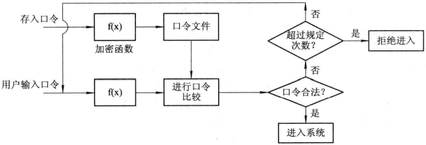
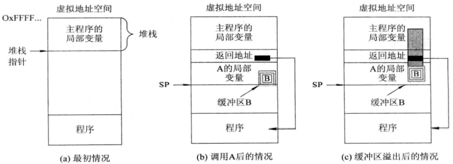
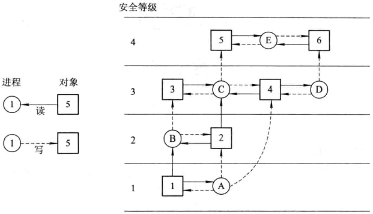
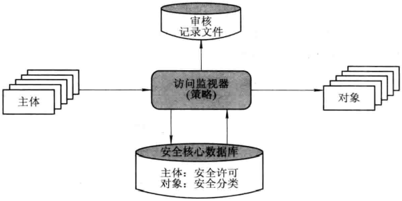

English | [中文版](safe_zh.md)

# System Security

[TOC]


## Classification of Computer Security

- Class $D$: The lowest security category, also known as the security protection deficiency level. This class only includes the lowest security level $D_1$. Any system that does not meet the requirements of the other three classes is classified as Class D.
- Level $C_1$: Combines several security controls. Its Trusted Computing Base (TCB) achieves security by separating users and data.
- Level $C_2$: Known as controlled access control level. Based on $C_1$, it adds layer-by-layer access control and enhances adjustable prudent control.
- Level $B_1$: Security labels are divided into four levels: internal, confidential, secret, and top secret. The system assigns a security label of a certain level to each controllable user and object (such as files).
- Level $B_2$: $B_2$ includes all security attributes of $B_1$. $B_2$ requires the system to use a top-down structured design method, be able to verify the design method, and perform security analysis of possible covert channels.
- Level $B_3$: $B_3$ includes all security attributes of $B_2$. In $B_3$, an access control list (ACL) for users and groups, sufficient security auditing, and disaster recovery capabilities must be included. In addition, the system must include a TCB to control user access to files and prevent unauthorized access.
- Level $A_1$: $A_1$ is the highest security level. Currently, Class A only includes $A_1$. $A_1$ is similar to $B_3$ and does not have special requirements for system structure and policy. $A_1$ systems require mandatory access control and the application of formal model techniques, must prove the correctness of the model, and explain that the implementation method is consistent with the protection model. Formal analysis of covert channels is also required.


## Symmetric and Asymmetric Encryption Algorithms

1. Symmetric Encryption Algorithm

	The most representative symmetric encryption algorithm is the Data Encryption Standard (<u>DES</u>). ISO has adopted DES as the data encryption standard.

	In DES, the key length is 64 bits, consisting of two parts: the actual key (56 bits) and an 8-bit parity check code. DES is a block cipher algorithm that divides plaintext into 64-bit groups and encrypts each group using a 56-bit key, producing 64-bit ciphertext.

2. Asymmetric Encryption Algorithm

	The encryption key $Ke$ and decryption key $Kd$ of an asymmetric encryption algorithm are different, and it is difficult to derive $Kd$ from $Ke$. Therefore, one of the keys can be made public, making it a public key algorithm.

	Features:

	- Let the encryption algorithm be $E$ and the encryption key be $Ke$. They can be used to encrypt plaintext $P$ to obtain ciphertext $E_{Ke}(P)$. Let the decryption algorithm be $D$ and the decryption key be $Kd$. They can be used to recover the plaintext from the ciphertext:

	  $D_{Kd}(E_{Ke}(P)) = P$

	- It must be extremely difficult or practically impossible to derive $Kd$ from $Ke$.

	- It is easy to generate pairs of $Ke$ and $Kd$ on a computer.

	- Encryption and decryption operations can be reversed, i.e., use $D_{Kd}$ to encrypt plaintext to form ciphertext, then use $E_{Ke}$ to decrypt the ciphertext:

	  $E_{Ke}(D_{Kd}(P)) = P$


## Digital Signature and Digital Certificate

TODO


## User Authentication

### Password Authentication



Main threats to password encryption:

1. If an attacker has obtained the decryption key for the password, they can use it to break the password.
2. The encryption program itself can be used to break the password.

Methods to improve password security:

- Passwords should be sufficiently long.
- Use a variety of characters.
- Automatically disconnect after inactivity.
- Secure echo display.
- Logging and reporting.

### Authentication Based on Physical Tokens

1. Magnetic card-based authentication

2. IC card-based authentication

	IC cards are divided into the following types:

	- Memory cards
	- Microprocessor cards
	- Cryptographic cards

### Biometric Authentication Technology

1. Physiological features commonly used for identification
	- Sufficient variability
	- Should remain stable
	- Not easily disguised
2. Components of a biometric system
	1. Requirements for biometric systems
		- Performance requirements
		- User acceptance
		- Reasonable cost
	2. Components of a biometric system
		- Biometric feature collector
		- Registration module
		- Identification module
3. Fingerprint recognition system
	- Fingerprint acquisition sensor
	- Fingerprint recognition system


## Attacks

### Common Early Attack Methods

1. Stealing useful information that has not been cleared.
2. Disrupting the system through illegal system calls.
3. Causing the system to block the password verification program.
4. Attempting many operations not allowed by plaintext rules.
5. Adding trap doors to the OS.
6. Stealing passwords.

### Logic Bombs and Trap Doors

1. Logic bomb.
2. Trap door.

### Trojan Horses and Login Spoofing

1. The basic concept of Trojan horses.
2. Examples of Trojan horses.
3. Login spoofing.

### Buffer Overflow

Due to certain compiler vulnerabilities, array bounds are not checked. Example:

```c++
int i;
char C[1024];
i = 12000;
c[i] = 0; // 10,976 bytes exceed the range defined by array C
```



### Viruses, Worms, and Mobile Code

1. Viruses

	A computer virus is a program that can attach itself to other programs, continuously replicate itself, and infect other programs. It can spread through infected programs in the system.

	Classification:

	- File viruses
	- Memory-resident viruses
	- Boot sector viruses:
	  - Migratory viruses: Copy the real boot sector to a safe area of the disk so that the OS can still boot normally after the operation.
	  - Replacement viruses: Remove the original content of the invaded sector and integrate the necessary program segments and data into the virus program.
	- Macro viruses
	- Email viruses

	Camouflage methods:

	- Camouflage by compression:

	  When a virus attaches to a file, the file length increases. The virus uses compression technology to keep the infected file the same length as the original, achieving camouflage.

	- Camouflage by modifying date or time:

	  The infected file's date and time are changed. The virus program modifies the infected file's date and time to match the original, achieving camouflage.
     

	Hiding methods:

	- Hide in directory and registry space.
	- Hide in program page fragments.
	- Modify data structures used for disk allocation.
	- Modify the bad sector list.

	Polymorphism:

	- Insert redundant instructions.
	- Encrypt the virus program.

2. Worms

	Worms are similar to viruses; they can also replicate themselves and infect other programs, causing harm to the system.

	Differences from viruses:

	- A worm is a complete program that can run as an independent process and does not need to parasitize other programs.
	- Worms are less transmissible than viruses; they must first find OS or software vulnerabilities to spread.

3. Mobile Code

	On a network, if code can be executed on a remote computer, the system is considered to have remote execution capability. If a program can migrate between different machines during execution, it is called mobile code.


## Trusted System

### Access Matrix Model and Information Flow Control Model

1. Security Policy

	A set of rules and corresponding descriptions defined according to the system's security requirements. These rules determine the rules for protecting data in the system and specify each user's permissions.

2. Security Model

	Used to accurately describe the system's security requirements and policies. The security model should be precise, simple, and easy to understand, and should not involve the specific implementation details of security functions.

3. Access Matrix Model

	Also known as the protection matrix; each subject (user) in the system owns a row in the matrix, and each object (program/file/device) owns a column. The intersection indicates the set of access rights the subject has to the object.

4. Information Flow Control Model

	A supplement to the access matrix model, used to supervise the effective paths of information flow in the system and control the flow of information from one entity to another along secure paths.

	

	*Bell-La Padula Model*

	The Bell-La Padula model divides information into four levels: Unclassified (U), Confidential (C), Secret (S), and Top Secret (TS). It also stipulates the following rules for information flow:

	- No read up: A process running at security level k can only read objects at the same or lower security level.
	- No write down: A process running at security level k can only write to objects at the same or higher security level.

### Trusted Computing Base (TCB)

1. Trusted Computing Base

	

2. Security Core Database

	- Access control model: Used to control user access to files, listing each subject's access rights and each object's protection attributes.
	- Information flow control model: Used to control the flow of information from one entity to another along secure paths.

3. Access Monitor

	- Complete mediation
	- Isolation
	- Verifiability

### Principles for Designing Secure Operating Systems

1. Microkernel Principle

	- It not only provides the core functions of the OS, such as process switching and memory mapping, but also forms the basis for the entire OS security mechanism, making the security kernel a trusted computing base.
	- In a typical microkernel, there are multiple entry points, but in a secure system, only a single secure interface is provided between the rest of the system and the security kernel.

2. Separation of Policy and Mechanism Principle

3. Secure Entry Principle

	To ensure the security of the security kernel, only a single secure interface is provided between the security kernel and other parts. Anyone wishing to access the security kernel must undergo strict security checks.

4. Separation Principle

	- Physical separation
	- Temporal separation
	- Cryptographic separation
	- Logical separation

5. Partial Hardware Implementation Principle

	- Improve processing speed
	- Ensure system security

6. Layered Design Principle.
