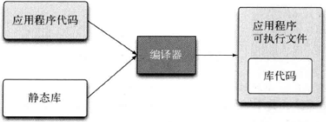

English | [中文版](static_link_zh.md)

# Static Linking

[TOC]

## Static Library

A static library, also known as an archive file, contains object code that is linked into the final user's application and becomes part of it.

On `*nix` systems, static libraries use the `.a` file extension; on Windows systems, they use the `.lib` extension.

### Advantages and Disadvantages

| Advantages                                 | Disadvantages                                                                                   |
| ------------------------------------------ | ---------------------------------------------------------------------------------------------- |
| + No extra runtime dependencies needed.    | - Each executable must include a copy of the static library, resulting in larger binaries. - For hot updates, the entire executable must be replaced. |

## References

[1] Yu Jiazi, Shi Fan, Pan Aimin, The Self-cultivation of a Programmer - Linking, Loading and Libraries, 1st Edition
[2] Martin Reddy, C++ API Design, 1st Edition, P337-P337
